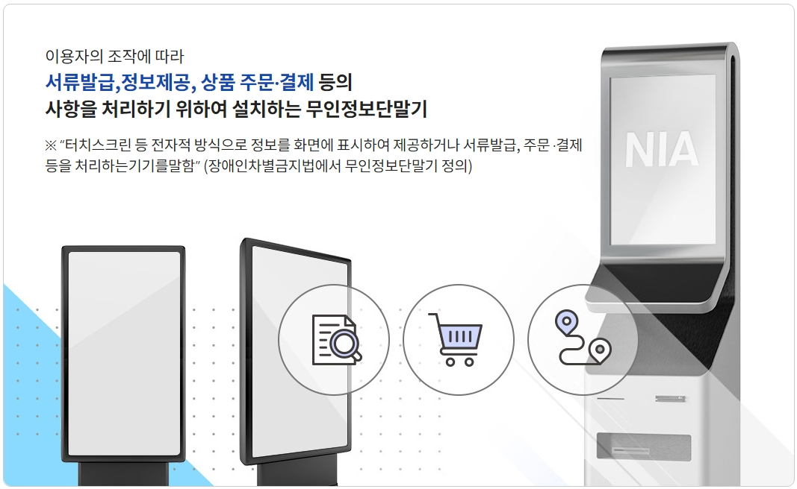

## 4. 접근성 가이드라인

### 4.4 무인정보단말기 접근성
> **무인정보단말기 접근성(accessibility of self-service kiosk)** 란 이용자의 조작에 따라 서류 발급, 정보 제공, 상품 주문 및 결제 등의 사항을 처리하기 위하여 설치하는 단말기를 의미한다.
**무인정보단말기의 접근성**은 다양한 사용자들이 단말기를 쉽고 편리하게 사용할 수 있도록 보장하는 중요한 요소입니다. 이를 위해서는 설계, 환경, 하드웨어, 소프트웨어, 편의 제공, 개인정보 보호, 지원 서비스, 피드백 수집 및 개선, 교육, 법적 준수 등 다양한 측면에서 종합적인 접근이 필요합니다. 이러한 노력을 통해 모든 사용자가 차별 없이 무인정보단말기를 활용할 수 있는 환경을 조성할 수 있습니다.    
세부적인 접근성 요구사항을 철저히 구현함으로써 모든 사용자가 쉽게 접근하고 이용할 수 있는 무인정보 단말기를 설계하는 것이 중요합니다. 다양한 사용자 요구를 충족시키기 위해 지속적인 피드백 수집과 개선 작업이 필요합니다.   
참조 : 무인정보단말기 접근성 지침 KS X 9211:2022

> “터치스크린 등 전자적 방식으로 정보를 화면에 표시하여 제공하거나 서류발급, 주문 ·결제등을 처리하는기기를말함”    
(장애인차별금지법에서 무인정보단말기 정의)

<figure aria-hidden="true" style="text-align:center">
   
   <figcaption>
      이미지 출처 : 무인정보단말기 UI 플랫폼
   </figcaption>
</figure>

#### 무인정보단말기 접근성 설계 원칙
**기본**
1. **보편적 설계(Universal Design):**
모든 사용자들이 제약 없이 사용할 수 있도록 설계되어야 합니다. 이는 물리적 제약, 나이, 능력 등을 고려한 포괄적인 접근성을 의미합니다.

2. **직관적 사용(Intuitive Use):**
단말기의 사용이 직관적이고 이해하기 쉬워야 합니다. 사용자들이 처음 접하더라도 쉽게 기능을 이해하고 사용할 수 있어야 합니다.

3. **정보의 유용성(Perceptible Information):**
모든 정보는 사용자들이 쉽게 인지할 수 있도록 제공되어야 합니다. 시각, 청각, 촉각 등 다양한 방법을 통해 정보를 전달합니다.

4. **유연한 사용(Flexibility in Use):**
다양한 사용자의 요구와 선호도를 수용할 수 있는 유연한 설계를 해야 합니다.

5. **안전한 사용(Safety and Error Tolerance):**
사용자들이 실수로 인한 위험 없이 안전하게 사용할 수 있도록 설계되어야 하며, 오류 발생 시 이를 쉽게 복구할 수 있는 기능을 제공해야 합니다.

**접근성 요구사항**   
1. **시각을 필요로 하지 않는 방법 제공**
   - **음성 안내 시스템 도입**   
   사용자가 특정 작업을 수행할 때 필요한 정보를 음성으로 안내하는 시스템을 제공하여 시각적 도움 없이도 기기를 사용할 수 있도록 합니다.   
   - **점자 키패드 제공**   
   시각 장애인이 터치스크린을 사용하지 않고도 정보를 입력할 수 있도록 점자 키패드를 제공합니다.   
   - **터치스크린 대체 수단 제공 (예: 물리적 버튼)**   
   터치스크린을 사용하기 어려운 사용자를 위해 물리적 버튼이나 기타 입력 장치를 제공합니다.   
   - **음성 인식 기술 향상**   
   사용자가 음성 명령을 통해 모든 기능을 사용할 수 있도록 고급 음성 인식 기술을 도입합니다.   
   - **협력 보조 기기 통합**   
   스마트 워치나 기타 착용형 보조 기기와 통합하여 시각적 도움을 제공하지 않고도 상호작용이 가능하도록 합니다.   
   - **자동 음성 안내**   
   사용자가 특정 상황에 도달하면 자동으로 음성 안내를 제공하여 필요한 정보를 전달합니다.   
   - **터치패드 피드백 제공**   
   터치패드를 통해 촉각 피드백을 제공하여 사용자가 현재 위치와 선택을 인지할 수 있도록 지원합니다.   
2. **시력이 현저히 낮아도 이용할 수 있는 방법 제공**   
   - 고대비 모드 제공: 화면의 색상 대비를 높여 시력이 낮은 사용자가 쉽게 읽을 수 있도록 합니다.
   - 확대 기능 제공: 화면의 특정 부분을 크게 확대하여 볼 수 있는 기능을 제공합니다.
   - 화면 읽기 기능 제공: 화면의 텍스트를 음성으로 읽어주는 기능을 제공합니다.
   - 음성 지원 확대: 모든 기능과 메뉴에 대한 음성 안내를 제공합니다.
   - 스크린 리더와의 호환성: 보조 장치와의 원활한 통합을 위한 기술을 지원합니다.
   - 실시간 대화형 안내: 음성 안내와 상호작용을 통해 실시간으로 도움을 제공하는 기능을 추가합니다.
   - 환경에 따른 자동 조정: 조명 및 주변 환경에 따라 화면 밝기 및 대비를 자동으로 조정합니다.
   - 다중 언어 음성 지원: 다양한 언어로 음성 안내를 제공하여 비전문 사용자도 쉽게 이용할 수 있도록 합니다.
   - 확대경 모드: 화면의 특정 부분을 크게 확대하여 볼 수 있는 기능을 제공합니다.
3. **색의 인식을 필요로 하지 않는 방법 제공**   
   - 색상 외에 형태나 텍스트로 중요한 정보 전달: 색상 외에 형태나 텍스트로 중요한 정보를 전달하여 색을 인식하지 못해도 정보를 이해할 수 있도록 합니다.
   - 색을 사용한 신호에 대한 대체 텍스트 제공: 색을 사용한 신호에 대한 대체 텍스트를 제공하여 시각적으로 인식하지 못하는 사용자가 정보를 얻을 수 있도록 합니다.
   - 색맹 모드 제공: 색맹 사용자를 위해 특별한 색 조합을 제공하여 인식 가능하도록 지원합니다.
   - 텍스처 및 패턴 사용: 중요한 정보나 기능을 구별할 수 있도록 색상 외에 텍스처와 패턴을 사용합니다.
   - 음성 및 촉각 경고: 색상을 기반으로 한 경고 대신 음성 및 촉각 경고를 제공합니다.
   - 색상 독립적 상호작용: 색상에 의존하지 않고도 모든 정보를 이해하고 상호작용할 수 있도록 디자인합니다.
   - 음향 신호: 색상을 사용하지 않고 중요한 정보를 전달하기 위해 다양한 음향 신호를 사용합니다.
   - 명확한 기호 및 텍스트: 색상 대신 명확한 기호와 텍스트를 사용하여 정보를 전달합니다.
4. **청각을 필요로 하지 않는 방법 제공**   
   - 시각적 피드백 제공 (예: LED 불빛): 청각을 사용할 수 없는 상황에서 시각적으로 피드백을 제공하는 LED 불빛이나 화면의 변화 등을 사용합니다.
   - 텍스트 기반의 안내 시스템: 청각적 안내 대신 텍스트 기반의 안내 시스템을 제공합니다.
   - 화면 플래시 기능: 중요한 알림이나 경고를 시각적으로 전달하기 위해 화면이 깜빡이도록 설정합니다.
   - 텍스트 메시지 및 이메일 알림: 긴급 상황이나 중요한 정보는 텍스트 형식으로 제공하여 청각적 알림 대신 사용됩니다.
   - 시각적 경고 시스템: 모든 알림과 경고를 시각적으로 제공하여 청각적 정보 없이도 이해할 수 있도록 합니다.
   - 진동 및 촉각 알림: 중요한 상황에서 진동 및 촉각 피드백을 통해 알림을 제공합니다.
   - 시각적 경고 아이콘: 청각적 알림 대신 화면에 경고 아이콘을 표시합니다.
   - 알림 라이트: 화면 주변에 LED 알림 라이트를 설치하여 시각적 알림을 제공합니다.
5. **청력이 현저히 낮아도 이용할 수 있는 방법 제공**   
   - 자막 및 실시간 텍스트 변환 기능 제공: 음성 안내를 자막으로 변환하여 화면에 표시하는 기능을 제공합니다.
   - 비디오 안내 시 화면 내 텍스트 표시: 비디오 안내 시 화면 내 텍스트를 제공하여 청각 장애인이 이해할 수 있도록 합니다.
   - 진동 피드백 제공: 주요 알림이나 상태 변화를 진동으로 전달합니다.
   - ASL(수화) 비디오 튜토리얼 제공: 수화 사용자를 위한 안내 비디오를 제공합니다.
   - 음성-텍스트 변환 시스템: 실시간으로 음성을 텍스트로 변환하여 화면에 표시합니다.
   - 다양한 언어 지원: 여러 언어로 텍스트 알림 및 자막을 제공합니다.
   - 자막 시스템: 음성 안내를 자막으로 변환하여 화면에 표시합니다.
   - 화상 수화 안내: 실시간으로 수화 안내를 제공하여 청각 장애인이 쉽게 이해할 수 있도록 지원합니다.
6. **발성을 필요로 하지 않는 방법 제공**   
   - 음성 입력 외에 키보드 또는 터치 입력 제공: 음성 입력을 사용하지 않고도 키보드나 터치를 통해 정보를 입력할 수 있도록 합니다.
   - 다양한 입력 방법 지원 (예: 스위치, 터치, 버튼): 다양한 입력 방법을 제공하여 발성을 대체할 수 있도록 합니다.
   - 제스처 인식 시스템: 손이나 몸짓을 통한 명령 입력을 지원합니다.
   - 전자 태블릿 및 스타일러스 입력 지원: 키보드 외에 다양한 입력 도구를 제공합니다.
   - 키보드 단축키: 다양한 기능을 키보드 단축키로 설정하여 발성을 대체할 수 있도록 지원합니다.
   - 음성 인식 대체 입력: 사용자가 원하는 입력 방법을 선택할 수 있는 다중 입력 옵션을 제공합니다.
7. **과도한 조작과 힘을 필요로 하지 않는 방법 제공**   
   - 경량 터치 또는 버튼 조작 가능: 매우 가벼운 터치로도 반응하는 인터페이스를 설계합니다.
   - 민감도 조정 기능 제공: 터치스크린의 민감도를 사용자 맞춤형으로 조절할 수 있는 기능을 제공합니다.
   - 자동화 기능 추가: 사용자의 조작을 최소화하기 위해 가능한 절차를 자동화합니다.
   - 사용자 맞춤형 인터페이스: 사용자의 요구에 맞게 조작을 단순화하고 개인화합니다.
   - 터치스크린 감도 조절 기능: 터치스크린의 감도를 사용자 맞춤형으로 조절할 수 있는 기능을 제공합니다.
   - 음성 및 터치 혼합 입력: 음성과 터치 입력을 병행하여 최소한의 노력으로 조작 가능하도록 합니다.
   - 경량 터치 인터페이스: 매우 가벼운 터치로도 반응하는 인터페이스를 설계합니다.
   - 자동 조작 시스템: 사용자가 특정 명령을 입력하면 자동으로 필요한 작업을 수행하는 시스템을 도입합니다.
8. **손닿는 범위 내에 작동부 배치**   
   - 사용자의 신체 조건을 고려한 적절한 높이와 거리 설정: 다양한 신체 조건을 고려하여 적절한 높이와 거리로 작동부를 배치합니다.
   - 휠체어 사용자 고려한 설계: 휠체어 사용자도 쉽게 접근할 수 있도록 설계합니다.
   - 다양한 사용자 높이 고려: 다양한 높이에서 접근할 수 있도록 조절 가능한 인터페이스를 제공합니다.
   - 이동식 입력 장치 제공: 필요 시 가까이에서 사용할 수 있는 입력 장치를 제공합니다.
   - 다중 위치 입력 장치: 다양한 위치에 입력 장치를 배치하여 접근성을 향상시킵니다.
   - 이동 및 높이 조절 가능: 사용자가 편리한 위치와 높이로 조정 가능한 인터페이스를 제공합니다.
   - 사용자 맞춤형 높이 조절: 키오스크나 단말기의 높이를 사용자 맞춤형으로 조절할 수 있습니다.
   - 접근성 고려한 레이아웃: 휠체어 사용자나 키가 작은 사용자도 쉽게 접근할 수 있는 레이아웃을 설계합니다.
9. **광과민성 발작 가능성 차단**   
   - 깜빡임이나 빠른 화면 전환 금지: 깜빡임이나 빠른 화면 전환을 금지하여 광과민성 발작의 가능성을 줄입니다.
   - 안정적인 화면 출력: 안정적인 화면 출력을 통해 광과민성 발작을 예방합니다.
   - 사용자 지정 깜빡임 제어: 사용자가 깜빡임 빈도와 강도를 조정할 수 있는 옵션을 제공합니다.
   - 깜빡임 없는 애니메이션 사용: 깜빡임이 없는 부드러운 전환 애니메이션을 사용합니다.
   - 사용자 조정 가능한 플래시 빈도: 사용자 스스로 플래시 빈도와 강도를 조정할 수 있는 기능을 제공합니다.
   - 정적 콘텐츠 사용: 최대한 정적이고 안정적인 콘텐츠를 사용하여 발작 유발 가능성을 최소화합니다.
   - 부드러운 화면 전환: 급격한 화면 전환이나 깜빡임 없이 부드러운 전환 애니메이션을 사용합니다.
   - 저조도 모드: 화면의 밝기를 낮추어 광과민성 발작의 가능성을 줄이는 모드를 제공합니다.
10. **낮은 인지 능력으로도 이용할 수 있는 방법 제공**   
   - 간단하고 직관적인 인터페이스 디자인: 복잡한 메뉴와 단계를 최소화한 직관적인 인터페이스를 디자인합니다.
   - 명확한 지침과 피드백 제공: 사용자가 이해하기 쉬운 명확한 지침과 피드백을 제공합니다.
   - 복잡한 절차를 단순화: 사용자가 쉽게 이해하고 수행할 수 있도록 복잡한 절차를 단순화합니다.
   - 그림 및 아이콘 사용: 텍스트 대신 직관적인 그림과 아이콘을 사용하여 정보를 전달합니다.
   - 단계별 지침 제공: 사용자가 단계를 따라가며 쉽게 이용할 수 있도록 안내합니다.
   - 직관적인 사용자 인터페이스: 복잡한 메뉴와 단계를 최소화한 직관적인 인터페이스를 디자인합니다.
   - 실수 복구 기능: 사용자가 실수했을 때 쉽게 복구할 수 있는 기능을 제공합니다.
   - 단계별 진행 안내: 사용자가 단계를 따라가며 쉽게 이용할 수 있도록 안내합니다.
   - 쉬운 언어 사용: 간단하고 이해하기 쉬운 언어로 설명을 제공합니다.
11. **개인정보 보호**   
   - 비밀번호 및 개인 정보를 입력할 때 주변에서 보이지 않도록 화면 보호: 비밀번호 입력 시 주변 사람들이 보지 못하도록 화면 보호막을 제공합니다.
   - 사용자 세션 종료 시 자동 로그아웃 기능: 일정 시간 동안 사용하지 않으면 자동으로 로그아웃되는 세션 타임아웃 기능을 제공합니다.
   - 민감 정보 입력 시 암호화된 통신 사용: 민감한 정보 입력 시 암호화된 통신을 사용하여 보안을 강화합니다.
   - 개인 정보 저장 시 보안 프로토콜 적용: 개인 정보를 저장할 때 보안 프로토콜을 적용하여 데이터를 안전하게 보호합니다.
   - 사용 후 개인 정보 자동 삭제 기능: 사용 후 개인 정보를 자동으로 삭제하는 기능을 제공합니다.
   - 인증 데이터 암호화: 사용자 인증 시 모든 데이터를 암호화합니다.
   - 접근 제어 시스템: 권한이 없는 사용자가 민감한 데이터에 접근하지 못하도록 접근 제어 시스템을 적용합니다.
   - 세션 타임아웃: 일정 시간 동안 사용하지 않으면 자동으로 로그아웃되는 세션 타임아웃 기능을 제공합니다.
   - 비밀번호 입력 보호: 비밀번호 입력 시 주변 사람들이 보지 못하도록 시각적 보호막을 제공합니다.
   - 정기적인 보안 업데이트: 시스템 소프트웨어 및 보안 프로토콜을 정기적으로 업데이트하여 최신 보안 위협에 대응합니다.
   - 보안 로그 및 감사: 모든 활동을 기록하고 정기적으로 점검하여 보안을 강화합니다.
   - 사용자 인증 강화: 2단계 인증 및 생체 인식을 사용하여 보안을 강화합니다.
   - 개인정보 보호 교육: 사용자에게 개인정보 보호에 대한 인식과 교육을 제공합니다.
   - 사용자 동의 절차: 데이터 수집 및 사용 전에 명확한 동의 절차를 통해 사용자 동의를 확보합니다.
   - 비밀번호 보호 필름: 비밀번호 입력 시 주변 사람들이 보지 못하도록 화면 보호 필름을 제공합니다.
   - 안전한 데이터 저장: 민감한 사용자 데이터를 암호화하여 안전하게 저장합니다.
   - 데이터 접근 로그: 누가 언제 데이터를 접근했는지 기록하여 보안을 강화합니다.
   - 사용자 데이터 관리 교육: 사용자에게 개인 데이터 보호 방법에 대한 교육을 제공합니다.

### 참조
- [W3C Mobile Accessibility at W3C](https://www.w3.org/WAI/standards-guidelines/mobile/){: target="_blank"}   
- [W3C Mobile Accessibility: How WCAG 2.0 and Other W3C/WAI Guidelines Apply to Mobile](https://www.w3.org/TR/mobile-accessibility-mapping/){: target="_blank"}    
- [W3C First Public Working Draft](https://www.w3.org/news/2015/first-public-working-draft-performance-timeline-level-2/){: target="_blank"}    
- [W3C User Agent Accessibility Guidelines (UAAG) 2.0](https://www.w3.org/TR/UAAG20/){: target="_blank"}   
- [W3C Mobile Accessibility Examples from UAAG 2.0 Reference](https://www.w3.org/TR/IMPLEMENTING-UAAG20/mobile.html){: target="_blank"}   
- [MDN Mobile accessibility checklist](https://developer.mozilla.org/en-US/docs/Web/Accessibility/Mobile_accessibility_checklist){: target="_blank"}   
- [보건복지부 블로그](https://blog.naver.com/prologue/PrologueList.naver?blogId=mohw2016){: target="_blank"}   
- [보건복지부 - 장애인의 무인정보단말기 등 접근성 강화방안 마련 연구](https://www.mohw.go.kr/synap/doc.html?fn=1635730805506_20211101104005.pdf&rs=/upload/result/202405/){: target="_blank"}   
- [무인정보단발기 UI플랫폼 - 무인정보단말기 접근성 지침](https://www.kioskui.or.kr/index.do?menu_id=00000985){: target="_blank"}   
- [무인정보단말기(키오스크, 스마트자판기 등) 접근성 지침](https://standard.go.kr/KSCI/standardIntro/getStandardSearchView.do?menu19&topMenuId=502&upperMenuId=503&ksNo=KSX9211&tmprKsNo=KS_X_NEW_2015_1845&reformNo=01){: target="_blank"}   
- [Guidelines for Public Access Terminals Accessibility - Printable Version](https://mada.org.qa/wp-content/uploads/2020/01/Ireland-Guidelines-for-Public-Access-Terminals-Accessibility.pdf){: target="_blank"}   
- [산업통상자원부 국가기술표준원 e-나라표준인증 기계가독화 표준 원문 데이터](https://standard.go.kr){: target="_blank"}   

<!-- Guidelines for Public Access Terminals Accessibility - Printable Version   

Priority 1.   
1.1 Ensure that all operable parts are reachable by people of all heights and people sitting in a wheelchair or buggy.   
1.2 Ensure that displays are within sight of people of all heights and people sitting in a wheelchair or buggy.   
1.3 Ensure that controls are adequately sized and sufficiently spaced to be operated by people with limited dexterity.   
1.4 Ensure that operation requires minimal strength, grip and wrist twisting.   
1.5 Ensure that the terminal can be operated using only one hand.   
1.6 If using a touchscreen or contact-sensitive controls, do not require that it is touched by a body part.   
1.7 Ensure that users with restricted or no vision can use all functions of the terminal.   
1.8 Ensure that all outputs can be perceived by users with restricted or no vision.   
1.9 Ensure that all outputs can be perceived by users with restricted or no hearing.   
1.10 Use the simplest language possible for instructions, prompts and outputs and, where possible, supplement it with pictorial information or spoken language.   
1.11 If using cards, ensure that the card can be inserted into the card reader in its correct orientation without requiring vision.   
1.12 If using biometric identification, provide an alternative access security mechanism for users who do not possess the required biological characteristic.   
1.13 Do not cause the screen to flash at afrequency of above 2Hz.   
1.14 When installing the terminal, ensure that users can get to it along an unobstructed path and operate it from a stable position.   
1.15 Ensure that an equivalent service is available through an accessible channel for users who cannot use the terminal.   
Priority 2.   
2.1 Allow suficient time to accommodate the slowest users.   
2.2 Provide a way for the user to cancel the whole transaction at any point and retrieve any items they have inserted.   
2.3 Ensure that the user interface and task flow is similar across different functions and remains the same across repeated visits.   
2.4 When deploying more than one version of a terminal, ensure that the user interfaces are similar.   
2.5 Do not require users to remember a fixed supplied PIN.   
2.6 Provide for users with multiple impairments.   
2.7 Provide training or assistance for new users.   
2.8 Ensure privacy and security during use.    -->

