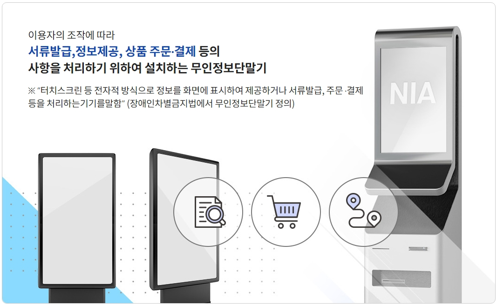

## 4. 접근성 가이드라인

### 4.4 무인정보단말기 접근성
> **무인정보단말기 접근성(accessibility of self-service kiosk)** 란 이용자의 조작에 따라 서류 발급, 정보 제공, 상품 주문 및 결제 등의 사항을 처리하기 위하여 설치하는 단말기를 의미한다.
**무인정보단말기의 접근성**은 다양한 사용자들이 단말기를 쉽고 편리하게 사용할 수 있도록 보장하는 중요한 요소입니다. 이를 위해서는 설계, 환경, 하드웨어, 소프트웨어, 편의 제공, 개인정보 보호, 지원 서비스, 피드백 수집 및 개선, 교육, 법적 준수 등 다양한 측면에서 종합적인 접근이 필요합니다. 이러한 노력을 통해 모든 사용자가 차별 없이 무인정보단말기를 활용할 수 있는 환경을 조성할 수 있습니다.    
세부적인 접근성 요구사항을 철저히 구현함으로써 모든 사용자가 쉽게 접근하고 이용할 수 있는 무인정보 단말기를 설계하는 것이 중요합니다. 다양한 사용자 요구를 충족시키기 위해 지속적인 피드백 수집과 개선 작업이 필요합니다.   
참조 : 무인정보단말기 접근성 지침 KS X 9211:2022

> “터치스크린 등 전자적 방식으로 정보를 화면에 표시하여 제공하거나 서류발급, 주문 ·결제등을 처리하는기기를말함”    
(장애인차별금지법에서 무인정보단말기 정의)

<figure aria-hidden="true" style="text-align:center">
   
   <figcaption>
      이미지 출처 : 무인정보단말기 UI 플랫폼
   </figcaption>
</figure>

#### 하드웨어 접근성 요구사항
6.1 일반
모든 사용자, 특히 장애가 있는 사용자에게 접근성을 보장하기 위한 기본적인 요구사항입니다.

공평한 접근성 보장: 모든 사용자가 장비를 접근할 수 있어야 합니다. 예를 들어, 휠체어 사용자가 키오스크를 이용할 수 있도록 적절한 높이와 위치에 설치합니다.
사용자 다양성 고려: 다양한 연령대와 신체 능력을 가진 사용자를 고려하여 설계합니다.
포괄적인 디자인: 사용자 인터페이스와 물리적 장치 모두 접근성을 고려해 설계합니다.

6.2 시각정보 제공
시각 장애가 있는 사용자도 정보를 접근하고 이해할 수 있도록 지원합니다.

화면 읽기 장치와의 호환성: 텍스트 정보를 음성으로 변환해 주는 장치와 호환되도록 합니다.
점자 디스플레이와의 연동: 점자 디스플레이 장치를 지원하여 시각 정보를 점자로 제공할 수 있게 합니다.
대체 텍스트 제공: 모든 시각적 콘텐츠에 대해 대체 텍스트를 제공합니다. 예를 들어, 이미지나 그래프에 대한 설명 텍스트를 포함합니다.
큰 글자 및 고대비 모드: 시력이 약한 사용자를 위해 글자 크기 조절과 고대비 모드를 지원합니다.

6.3 청각정보 제공
청각 장애가 있는 사용자를 위한 접근성을 보장합니다.

텍스트 자막 제공: 모든 음성 정보에 대해 자막을 제공합니다. 예를 들어, 비디오 콘텐츠에 자막을 포함합니다.
시각적 경고 및 알림: 청각 경고를 대신할 수 있는 시각적 알림을 제공합니다. 예를 들어, 소리 대신 화면에 깜박임 효과를 사용합니다.
보청기와의 호환성: 보청기 사용자가 장치를 쉽게 사용할 수 있도록 호환성을 유지합니다.
진동 알림: 음성이나 소리를 대신할 수 있는 진동 기능을 제공합니다. 예를 들어, 휴대전화의 진동 알림 기능을 활용합니다.

6.4 동등한 대체 콘텐츠 제공
모든 사용자가 동일한 콘텐츠에 접근할 수 있도록 대체 수단을 제공합니다.

텍스트 대체물 제공: 모든 멀티미디어 콘텐츠에 대해 텍스트 설명을 제공합니다. 예를 들어, 비디오에 대한 텍스트 설명을 포함합니다.
다중 접근 방식: 시각적 및 청각적 정보를 여러 방식으로 접근할 수 있도록 합니다. 예를 들어, 텍스트와 음성, 비디오로 정보를 제공합니다.
개인화된 접근성 옵션: 사용자가 자신의 필요에 맞게 접근성 옵션을 조정할 수 있게 합니다.

6.5 위협 요소 배제
사용자의 안전을 보장하기 위한 설계 기준입니다.

날카로운 모서리 제거: 장비의 모든 날카로운 모서리를 제거하여 사용자 부상을 예방합니다.
안정적인 구조 설계: 장비가 견고하고 안전하게 설계되었는지 확인합니다. 예를 들어, 무인 정보 단말기가 쉽게 넘어지지 않도록 합니다.
전자기파 최소화: 장비에서 나오는 전자기파가 사용자의 건강에 해롭지 않도록 규제합니다.
유해 물질 노출 방지: 장비에 사용되는 모든 물질이 안전하며 유해하지 않음을 보장합니다.

6.6 용이한 조작
모든 사용자가 장비를 쉽게 조작할 수 있도록 설계합니다.

쉬운 인터페이스 디자인: 사용하기 쉬운 직관적인 인터페이스를 제공합니다. 예를 들어, 메뉴와 버튼이 명확하게 표시됩니다.
조작 최소화: 최소한의 힘으로 조작할 수 있는 버튼과 스위치를 사용합니다.
접근 가능한 위치: 조작부가 사용자가 쉽게 접근할 수 있는 위치에 배치됩니다.
다양한 입력 장치 지원: 키보드, 마우스, 터치스크린 등 다양한 입력 장치를 지원합니다.

6.7 스위치, 버튼 및 키패드
사용자들이 이를 쉽게 사용하고 접근할 수 있도록 보장합니다.

버튼 크기와 간격: 버튼과 키패드는 충분히 크고 간격이 넓어야 합니다. 예를 들어, 사용자가 손쉽게 누를 수 있는 크기로 설계합니다.
촉각 피드백 제공: 버튼을 누를 때 촉각적 반응을 제공합니다. 예를 들어, 클릭 감이 느껴지도록 합니다.
시각적 피드백 제공: 버튼을 누를 때 시각적 변화가 나타나야 합니다. 예를 들어, 버튼이 눌린 상태를 표시합니다.
청각적 피드백 제공: 버튼을 누를 때 소리로 반응을 제공합니다. 예를 들어, 클릭 소리를 포함합니다.

6.8 사용자 컨트롤 조작
다양한 방법으로 장비의 기능을 제어할 수 있게 합니다.

터치스크린과 물리적 버튼: 두 가지 방식의 입력을 모두 지원하여 사용자 선택의 폭을 넓힙니다.
음성 명령 인식: 음성으로 장비를 조작할 수 있는 기능을 제공합니다.
제스처 기반 인터페이스: 손동작으로 장비를 제어할 수 있도록 합니다.
원격 제어 옵션: 원격으로 장비를 제어할 수 있는 기능을 포함합니다.

6.9 매체의 용이한 사용
사용자가 다양한 유형의 미디어를 쉽게 사용할 수 있도록 지원합니다.

다양한 파일 포맷 지원: 텍스트, 오디오, 비디오 등 여러 포맷을 지원합니다.
직관적인 미디어 재생: 미디어 재생을 위한 조작이 직관적이어야 합니다. 예를 들어, 재생, 일시정지, 정지 버튼이 명확하게 표시됩니다.
접근성 기능이 포함된 미디어 플레이어: 자막, 음성 설명 등 접근성 기능이 포함된 미디어 플레이어를 제공합니다.
사용자 맞춤형 옵션: 재생 속도 조절, 자막 크기 조절 등의 맞춤형 설정을 제공합니다.

#### 온-스크린 콘텐츠접근성 요구사항
> 다양한 이용자가 콘텐츠를 쉽게 접근하고 사용할 수 있도록 설계된 가이드라인입니다.   

7.1 일반
접근성 표준 준수: 온-스크린 콘텐츠는 국제 및 국가 접근성 표준을 준수해야 합니다.
사용자 피드백 수용: 사용자 피드백을 반영하여 지속적으로 접근성을 개선합니다.

7.2 시각정보 제공
명확한 시각적 표시: 중요한 정보는 명확하고 쉽게 구분할 수 있도록 제공해야 합니다.
높은 대비 색상 사용: 배경과 텍스트 간의 색상 대비를 충분히 높여 시각적 접근성을 향상시킵니다.
확대 기능 제공: 사용자가 화면 콘텐츠를 확대할 수 있는 기능을 제공하여 시력이 좋지 않은 사람들도 이용할 수 있게 합니다.

7.3 동등한 대체 콘텐츠 제공
텍스트 대체: 이미지, 비디오 등의 비텍스트 콘텐츠에 대해 텍스트 대체 콘텐츠를 제공해야 합니다. 예를 들어, 이미지에는 대체 텍스트(alt text)를 제공하고, 비디오에는 자막을 제공해야 합니다.
음성 안내: 시각 정보가 중요한 콘텐츠는 음성 안내를 통해 대체 정보를 제공해야 합니다.

7.4 위협 요소 배제
플래싱 콘텐츠 제한: 발작을 유발할 수 있는 플래싱 콘텐츠를 피하거나 제한합니다.
안전한 인터페이스: 사용자가 실수로 위험한 동작을 실행하지 않도록 안전 장치를 마련합니다.

7.5 용이한 조작
단순한 인터페이스: 복잡하지 않은 인터페이스를 제공하여 다양한 사용자가 쉽게 이용할 수 있도록 합니다.
사용자 맞춤 설정: 인터페이스를 사용자의 필요에 맞게 조정할 수 있는 설정을 제공합니다.

7.6 키보드에 의한 조작
키보드 접근성: 모든 기능은 키보드만으로도 접근할 수 있어야 합니다. 마우스를 사용할 수 없는 사용자를 위해 키보드 단축키 등을 마련합니다.
포커스 표시: 현재 포커스가 어디에 있는지 명확히 표시하여 키보드 사용자가 쉽게 조작할 수 있도록 합니다.

7.7 쉬운 이해
명확한 언어 사용: 명확하고 간단한 언어를 사용하여 누구나 쉽게 이해할 수 있도록 합니다.
설명과 지침 제공: 각 기능과 메뉴에 대한 설명과 지침을 제공하여 사용자가 혼란 없이 이용할 수 있게 합니다.
무인정보단말기 접근성 관련
물리적 접근성: 단말기의 설치 위치는 휠체어 사용자를 포함한 모든 사람이 접근하기 쉬워야 합니다.
시각적/청각적 안내: 시각적 및 청각적 안내를 통해 사용자가 단말기를 쉽게 이용할 수 있도록 합니다.
터치스크린 접근성: 터치스크린은 반응이 빠르고 정확해야 하며, 시각장애인을 위한 점자 표시 또는 음성 안내 기능을 지원해야 합니다.
높이 및 각도 조절: 단말기의 화면 높이와 각도는 다양한 사용자에 맞게 조절할 수 있어야 합니다.
간단한 인터페이스: 메뉴와 기능은 직관적이고 쉽게 이해할 수 있도록 설계해야 합니다.

#### 편의 제공 요구사항
8.1 정보 제공
무인정보단말기는 사용자에게 필요한 정보를 적시에 명확하게 제공해야 합니다. 이를 위해 다음과 같은 사항을 준수해야 합니다:

명확한 메뉴 구조: 사용자가 원하는 정보를 쉽게 찾을 수 있도록 메뉴 구조가 명확해야 합니다.
실시간 업데이트: 제공되는 정보는 최신 상태로 유지되어야 하며, 필요시 실시간 업데이트가 이루어져야 합니다.
이해하기 쉬운 언어: 전문 용어나 어려운 표현을 지양하고, 일반 사용자가 쉽게 이해할 수 있는 언어를 사용해야 합니다.
다양한 언어 지원: 다양한 언어를 지원하여 외국인 사용자도 편리하게 이용할 수 있어야 합니다.
시각적 도움: 텍스트 외에도 이미지, 아이콘, 동영상 등 시각적 요소를 활용하여 정보를 직관적으로 전달해야 합니다.

8.2 작업 종료
작업 종료 시 사용자가 혼란스럽지 않도록 명확한 안내와 절차를 제공해야 합니다. 이를 위해 다음과 같은 사항을 준수해야 합니다:

명확한 종료 버튼: 작업 종료 버튼은 눈에 잘 띄고 쉽게 찾을 수 있는 위치에 있어야 합니다.
종료 확인: 사용자가 작업을 종료하기 전에 확인 메시지를 제공하여 실수로 작업을 종료하는 일이 없도록 해야 합니다.
종료 후 안내: 작업 종료 후 다음 단계를 안내하거나, 필요한 경우 고객센터 등의 추가 지원 정보를 제공해야 합니다.
자동 로그아웃: 일정 시간 동안 사용하지 않으면 자동으로 로그아웃되도록 하여 보안을 강화해야 합니다.
종료 전 저장: 사용자가 작업 종료 전에 진행 중인 작업을 저장할 수 있도록 안내해야 합니다.

8.3 간결한 언어 사용
무인정보단말기의 모든 안내와 정보는 간결하고 명확한 언어로 제공되어야 합니다. 이를 위해 다음과 같은 사항을 준수해야 합니다:

짧고 명확한 문장: 불필요하게 길고 복잡한 문장은 피하고, 짧고 명확한 문장을 사용해야 합니다.
직관적인 용어: 사용자가 직관적으로 이해할 수 있는 용어를 사용해야 합니다.
중요 정보 강조: 중요한 정보는 굵은 글씨나 색상 등으로 강조하여 사용자가 놓치지 않도록 해야 합니다.
일관된 용어 사용: 동일한 기능이나 개념에 대해 일관된 용어를 사용하여 혼란을 방지해야 합니다.
사용자 피드백 반영: 사용자 피드백을 반영하여 지속적으로 언어를 개선해야 합니다.

8.4 되돌릴 수 없는 기능의 안내
되돌릴 수 없는 기능을 사용할 때는 사용자가 충분히 이해하고 신중하게 결정할 수 있도록 명확한 안내가 필요합니다. 이를 위해 다음과 같은 사항을 준수해야 합니다:

명확한 경고 메시지: 되돌릴 수 없는 기능을 실행하기 전에 명확한 경고 메시지를 제공해야 합니다.
확인 절차: 사용자가 되돌릴 수 없는 기능을 실행하기 전에 확인 버튼을 눌러 다시 한 번 확인하도록 해야 합니다.
상세 설명 제공: 해당 기능이 어떤 영향을 미치는지 상세히 설명하여 사용자가 충분히 이해할 수 있도록 해야 합니다.
취소 옵션 제공: 가능하다면 기능 실행 후 취소할 수 있는 옵션을 제공하여 사용자의 실수를 최소화해야 합니다.
사용자 교육: 해당 기능의 사용법과 주의사항에 대해 사용자 교육 자료를 제공하여 사전에 충분히 숙지할 수 있도록 해야 합니다.

### 참조
- [W3C Mobile Accessibility at W3C](https://www.w3.org/WAI/standards-guidelines/mobile/){: target="_blank"}   
- [W3C Mobile Accessibility: How WCAG 2.0 and Other W3C/WAI Guidelines Apply to Mobile](https://www.w3.org/TR/mobile-accessibility-mapping/){: target="_blank"}    
- [W3C First Public Working Draft](https://www.w3.org/news/2015/first-public-working-draft-performance-timeline-level-2/){: target="_blank"}    
- [W3C User Agent Accessibility Guidelines (UAAG) 2.0](https://www.w3.org/TR/UAAG20/){: target="_blank"}   
- [W3C Mobile Accessibility Examples from UAAG 2.0 Reference](https://www.w3.org/TR/IMPLEMENTING-UAAG20/mobile.html){: target="_blank"}   
- [MDN Mobile accessibility checklist](https://developer.mozilla.org/en-US/docs/Web/Accessibility/Mobile_accessibility_checklist){: target="_blank"}   
- [보건복지부 블로그](https://blog.naver.com/prologue/PrologueList.naver?blogId=mohw2016){: target="_blank"}   
- [보건복지부 - 장애인의 무인정보단말기 등 접근성 강화방안 마련 연구](https://www.mohw.go.kr/synap/doc.html?fn=1635730805506_20211101104005.pdf&rs=/upload/result/202405/){: target="_blank"}   
- [무인정보단발기 UI플랫폼 - 무인정보단말기 접근성 지침](https://www.kioskui.or.kr/index.do?menu_id=00000985){: target="_blank"}   
- [무인정보단말기(키오스크, 스마트자판기 등) 접근성 지침](https://standard.go.kr/KSCI/standardIntro/getStandardSearchView.do?menu19&topMenuId=502&upperMenuId=503&ksNo=KSX9211&tmprKsNo=KS_X_NEW_2015_1845&reformNo=01){: target="_blank"}   
- [Guidelines for Public Access Terminals Accessibility - Printable Version](https://mada.org.qa/wp-content/uploads/2020/01/Ireland-Guidelines-for-Public-Access-Terminals-Accessibility.pdf){: target="_blank"}   
- [산업통상자원부 국가기술표준원 e-나라표준인증 기계가독화 표준 원문 데이터](https://standard.go.kr){: target="_blank"}   
