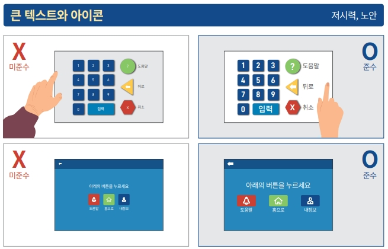

## 4. 접근성 가이드라인

### 4.4 무인정보단말기 접근성
> **무인정보단말기 접근성(accessibility of self-service kiosk)** 란 이용자의 조작에 따라 서류 발급, 정보 제공, 상품 주문 및 결제 등의 사항을 처리하기 위하여 설치하는 단말기를 의미한다.
웹 접근성과 마찬가지로 **무인정보단말기 접근성(accessibility of self-service kiosk)** 도 모든 사람들이 정보통신 기기나 서비스를 손쉽게 활용할 수 있도록 만드는 것을 목표로 두고, 이를 통해 무인정보단말기를 사용하는 모든 사용자들이 편리하게 정보를 얻을 수 있도록 고려하여 설계되어야 하며, 공공 및 민간 분야에서 널리 사용되는 무인정보단말기를 비장애인 뿐만 아니라 다양한 장애를 지닌 사용자나 고령자도 편리하게 이용할 수 있도록 보장해야 한다.    
예)시각장애인 모드에서 터치스크린의 ‘다음’ 버튼을 터치하면 버튼의 레이블을 알려주는 등의 기능이 포함될 수 있습니다.    

<figure aria-hidden="true" style="text-align:center">
   
   <figcaption>이미지 출처 : 보건복지부</figcaption>
</figure>

#### 사용자별 무인정보단말기 이용상 어려움
##### 1. **고령자(노인)**    
   - **글씨나 아이콘이 너무 작고 흐려서 알아보기 어려움**: 시력이 약해진 고령자에게 작은 글씨와 아이콘은 식별이 어렵습니다. 글씨 크기를 키우고, 아이콘을 선명하게 할 필요가 있습니다.      
   - **화면이 복잡하고 이해하기 어려우며 무엇을 조작해야 하는지 알 수 없음**: 사용자 인터페이스가 복잡하면 고령자가 쉽게 이해하지 못할 수 있습니다. 화면을 단순화하고 직관적인 인터페이스를 제공해야 합니다.         
   - **음성안내가 제공되지 않아 내용을 파악하는 데 오래 걸림**: 음성 안내가 제공되면 시각적인 정보 이해가 어려운 고령자도 쉽게 사용할 수 있습니다. 다양한 언어와 음성 안내 옵션을 제공하는 것이 좋습니다.            
   - **사용자 입력 대기 시간이 짧아서 내용을 파악하기도 전에 초기 화면으로 전환되어 버림**: 사용자 입력 대기 시간을 길게 설정하여 고령자들이 충분히 내용을 파악하고 입력할 시간을 제공해야 합니다.         

<figure aria-hidden="true" style="text-align:center">
   
   <figcaption>이미지 출처 : 보건복지부</figcaption>
</figure>

##### 2. **휠체어 사용자**   
   - **디스플레이 위치가 높아 화면을 볼 수 없음**: 단말기의 디스플레이 위치를 낮추거나 각도를 조절하여 휠체어 사용자도 쉽게 화면을 볼 수 있도록 해야 합니다.   
   - **조작 버튼 위치가 높아 조작이 어려움**: 조작 버튼을 손이 닿기 쉬운 위치에 배치해야 합니다.     
   - **화면에 빛의 비침 때문에 따라 보기 어려움**: 반사 방지 화면을 사용하거나 디스플레이의 밝기를 조절할 수 있는 기능을 추가하여 빛 반사 문제를 해결해야 합니다.     

<figure aria-hidden="true" style="text-align:center">
   
   <figcaption>이미지 출처 : 보건복지부</figcaption>
</figure>

##### 3. **시각 장애인**      
   - 전맹: 음성 안내와 점자 지원이 되지 않아 사용할 수 없음. 시각 장애인을 위해 음성 안내 기능과 점자 디스플레이를 추가해야 합니다.   
   - 저시력: 화면 색 대비가 뚜렷하지 않아서 내용을 파악하기 어려움. 저시력 사용자를 위해 화면 색 대비를 높이고, 확대 기능을 제공해야 합니다.   

<figure aria-hidden="true" style="text-align:center">
   
   <figcaption>이미지 출처 : 보건복지부</figcaption>
</figure>

##### 4. **청각 장애인**   
   - **기계에서 신용카드가 나오지 않는 등 고장 시, 담당자 통화 버튼으로 음성 통화가 어려워 도움을 청할 방법이 없음**: 청각 장애인을 위해 문자 기반의 실시간 채팅 지원이나 시각적인 안내 시스템을 제공해야 합니다. 또한, 고장 시 시각적으로 알림을 받을 수 있는 기능이 필요합니다.   

<figure aria-hidden="true" style="text-align:center">
   
   <figcaption>이미지 출처 : 보건복지부</figcaption>
</figure>

#### 무인정보단말기 정보접근성 준수 기본적인 고려사항
##### 1. **터치 스크린 버튼 간 충분한 간격**
   - 대상 : 노인, 손떨림 장애   
   - 터치 실수를 방지하기 위해 버튼 간 충분한 간격을 유지하여 사용자가 쉽게 버튼을 선택할 수 있도록 합니다.   
   - 컨트롤 간 간격 2.5mm 이상 권고

<figure aria-hidden="true" style="text-align:center">
   
   <figcaption>이미지 출처 : 보건복지부</figcaption>
</figure>

##### 2. **작동부와 디스플레이 위치**
   - 대상 : 휠체어 사용자, 어린이   
   - 휠체어 사용자와 키가 작은 어린이도 접근할 수 있도록 작동부와 디스플레이의 높이와 위치를 조절합니다.   

<figure aria-hidden="true" style="text-align:center">
   
   <figcaption>이미지 출처 : 보건복지부</figcaption>
</figure>

##### 3. **쉽고 간단한 설명**
   - 대상 : 노인, 발달장애   
   - 간단한 언어와 시각적 도움을 통해 사용법을 설명하여 이해를 돕습니다.   

<figure aria-hidden="true" style="text-align:center">
   
   <figcaption>이미지 출처 : 보건복지부</figcaption>
</figure>

##### 4. **고대비 필요**
   - 대상 : 저시력, 노안   
   - 텍스트와 배경 간의 색 대비를 높여 가독성을 향상시킵니다. 예를 들어, 흰색 배경에 검은색 텍스트를 사용합니다.   

<figure aria-hidden="true" style="text-align:center">
   
   <figcaption>이미지 출처 : 보건복지부</figcaption>
</figure>

##### 5. **큰 텍스트와 아이콘**
   - 대상 : 저시력, 노안    
   - 텍스트와 아이콘의 크기를 크게 하여 쉽게 식별할 수 있도록 합니다.   

<figure aria-hidden="true" style="text-align:center">
   
   <figcaption>이미지 출처 : 보건복지부</figcaption>
</figure>

##### 6. **설명과 버튼의 명확한 연결**
   - 대상 : 노인, 저시력     
   - 설명과 버튼이 명확하게 연결되어 사용자가 쉽게 이해할 수 있도록 합니다.   

<figure aria-hidden="true" style="text-align:center">
   
   <figcaption>이미지 출처 : 보건복지부</figcaption>
</figure>

##### 7. **불명확한 아이콘 대신 글자 설명 추가**
   - 대상 : 노인     
   - 아이콘의 의미를 명확히 하기 위해 글자 설명을 추가합니다.   

<figure aria-hidden="true" style="text-align:center">
   
   <figcaption>이미지 출처 : 보건복지부</figcaption>
</figure>

##### 8. **물리적 버튼에 점자 표시**
   - 대상 : 노인     
   - 물리적 버튼에 점자를 추가하여 시각장애인이 버튼을 쉽게 인식하고 사용할 수 있도록 합니다.   

<figure aria-hidden="true" style="text-align:center">
   
   <figcaption>이미지 출처 : 보건복지부</figcaption>
</figure>

##### 9. **누르는 조작에 필요한 힘**
   - 대상 : 상지장애, 시각장애인     
   - 버튼을 누르는 데 필요한 힘을 줄여 상지장애인도 쉽게 사용할 수 있도록 합니다.     

<figure aria-hidden="true" style="text-align:center">
   
   <figcaption>이미지 출처 : 보건복지부</figcaption>
</figure>

##### 10. **화면 반사 해결**
   - 대상 : 휠체어 사용자   
   - 화면의 반사를 줄여 다양한 각도에서 화면을 쉽게 볼 수 있도록 매트 스크린이나 안티-글레어 코팅을 사용합니다.   

<figure aria-hidden="true" style="text-align:center">
   
   <figcaption>이미지 출처 : 보건복지부</figcaption>
</figure>

##### 11. **촉각돌기를 이용한 인식**
   - 대상 : 노인, 시각장애   
   - 촉각돌기를 추가하여 시각장애인이 작동부를 쉽게 인식할 수 있도록 합니다.        

<figure aria-hidden="true" style="text-align:center">
   
   <figcaption>이미지 출처 : 보건복지부</figcaption>
</figure>

##### 12. **음성 설명**
   - 대상 : 전맹, 시각장애        
   - 주요 기능과 사용 방법을 음성으로 안내하여 시각장애인이 독립적으로 사용할 수 있도록 합니다.   

<figure aria-hidden="true" style="text-align:center">
   
   <figcaption>이미지 출처 : 보건복지부</figcaption>
</figure>

##### 13. **삽입구, 버튼, 깉카 스위치 등 인식**
   - 대상 : 시각장애인   
   - 삽입구, 버튼 등의 위치를 촉각 및 청각적 신호로 쉽게 인식할 수 있도록 합니다.   

<figure aria-hidden="true" style="text-align:center">
   
   <figcaption>이미지 출처 : 보건복지부</figcaption>
</figure>

##### 14. **배출 후 고정**
   - 대상 : 시각장애인   
   - 배출된 물품이 고정되어 쉽게 찾을 수 있도록 합니다.   

<figure aria-hidden="true" style="text-align:center">
   
   <figcaption>이미지 출처 : 보건복지부</figcaption>
</figure>

##### 15. **색을 이용한 정보의 제공 금지**
   - 대상 : 시각장애인   
   - 정보를 전달할 때 색상만을 사용하지 않도록 하고, 텍스트나 아이콘 등을 함께 사용합니다.   

<figure aria-hidden="true" style="text-align:center">
   
   <figcaption>이미지 출처 : 보건복지부</figcaption>
</figure>

##### 16. **작업 종료 수단 제공**
   - 대상 : 모든 사용자   
   - 사용자가 작업을 중단하거나 종료할 수 있는 명확한 방법을 제공합니다.   

<figure aria-hidden="true" style="text-align:center">
   
   <figcaption>이미지 출처 : 보건복지부</figcaption>
</figure>

##### 17. **충분한 시간 제공(제한시간 변경 등)**
   - 대상 : 모든 사용자   
   - 사용자가 충분한 시간을 가지고 작업을 완료할 수 있도록 제한시간을 연장할 수 있는 옵션을 제공합니다.   

<figure aria-hidden="true" style="text-align:center">
   
   <figcaption>이미지 출처 : 보건복지부</figcaption>
</figure>

##### 18. **헬프 데스크 운영**
   - 대상 : 모든 사용자   
   - 문제가 발생했을 때 도움을 받을 수 있도록 헬프 데스크를 운영합니다.   

<figure aria-hidden="true" style="text-align:center">
   
   <figcaption>이미지 출처 : 보건복지부</figcaption>
</figure>

### 참조
- [W3C Mobile Accessibility at W3C](https://www.w3.org/WAI/standards-guidelines/mobile/){: target="_blank"}   
- [W3C Mobile Accessibility: How WCAG 2.0 and Other W3C/WAI Guidelines Apply to Mobile](https://www.w3.org/TR/mobile-accessibility-mapping/){: target="_blank"}    
- [W3C First Public Working Draft](https://www.w3.org/news/2015/first-public-working-draft-performance-timeline-level-2/){: target="_blank"}    
- [W3C User Agent Accessibility Guidelines (UAAG) 2.0](https://www.w3.org/TR/UAAG20/){: target="_blank"}   
- [W3C Mobile Accessibility Examples from UAAG 2.0 Reference](https://www.w3.org/TR/IMPLEMENTING-UAAG20/mobile.html){: target="_blank"}   
- [MDN Mobile accessibility checklist](https://developer.mozilla.org/en-US/docs/Web/Accessibility/Mobile_accessibility_checklist){: target="_blank"}   
- [보건복지부 블로그](https://blog.naver.com/prologue/PrologueList.naver?blogId=mohw2016){: target="_blank"}   
- [보건복지부 - 장애인의 무인정보단말기 등 접근성 강화방안 마련 연구](https://www.mohw.go.kr/synap/doc.html?fn=1635730805506_20211101104005.pdf&rs=/upload/result/202405/){: target="_blank"}   
- [무인정보단발기 UI플랫폼 - 무인정보단말기 접근성 지침](https://www.kioskui.or.kr/index.do?menu_id=00000985){: target="_blank"}   
- [무인정보단말기(키오스크, 스마트자판기 등) 접근성 지침](https://standard.go.kr/KSCI/standardIntro/getStandardSearchView.do?menu19&topMenuId=502&upperMenuId=503&ksNo=KSX9211&tmprKsNo=KS_X_NEW_2015_1845&reformNo=01){: target="_blank"}   
- [Guidelines for Public Access Terminals Accessibility - Printable Version](https://mada.org.qa/wp-content/uploads/2020/01/Ireland-Guidelines-for-Public-Access-Terminals-Accessibility.pdf){: target="_blank"}   
