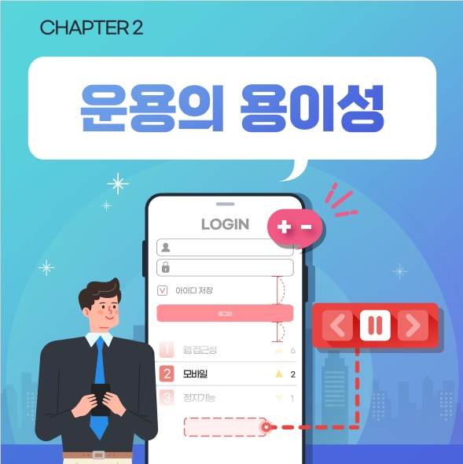
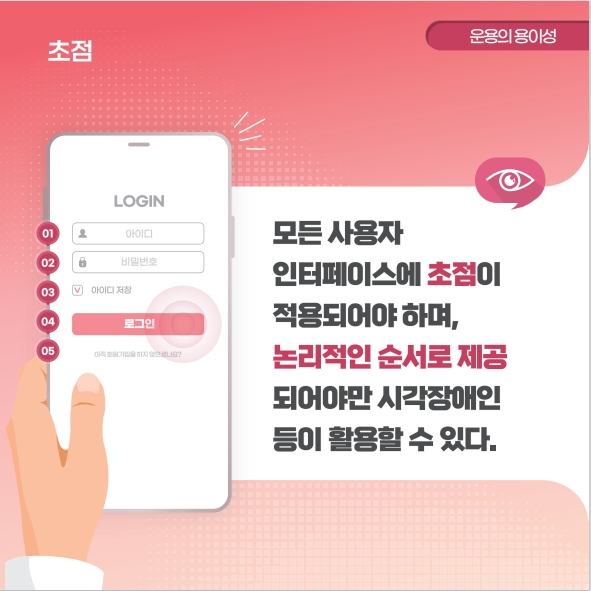
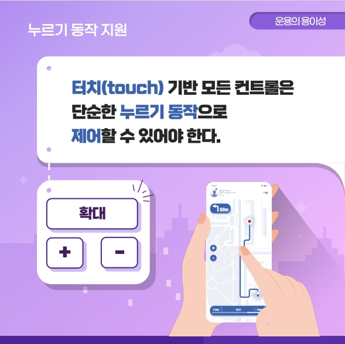
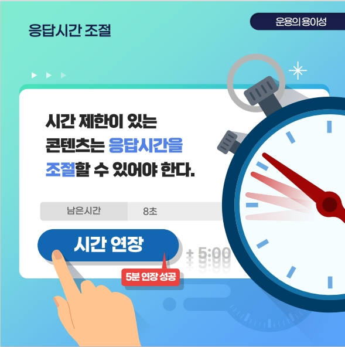
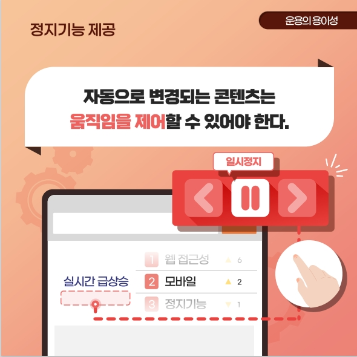
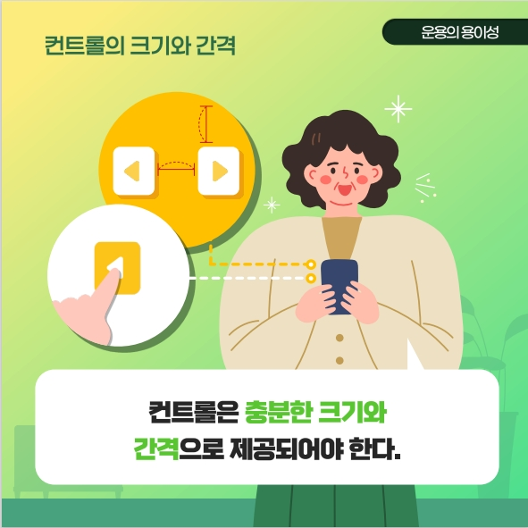

## 모바일 앱 접근성

### **운용의 용이성 (Operable)**
>**운용의 용이성 (Operable)** 은 사용자가 장애 유무 등에 관계없이 웹 사이트에서 제공하는 모든 기능들을 운용할 수 있도록 제공하는 것을 의미한다.    

<figure aria-hidden="true" style="text-align:center">
   
   <figcaption>이미지 출처 : 보건복지부</figcaption>
</figure>

#### 6.1. 초점
> 의미나 기능을 갖는 모든 사용자 인터페이스 컴포넌트에는 초점(focus)이 적용되고, 초점은 논리적인 순서로 이동되어야 한다.    

**고려 사항**
- 초점은 사용자가 예측할 수 있도록 논리적인 순서로 이동해야 한다.   
- 초점은 화면에서 보이지 않거나 논리적으로 의미를 갖지 않는 사용자 인터페이스 컴포넌트로 이동하지 않도록 해야 한다.   
- 표시되는 초점의 영역은 콘텐츠의 위치와 크기가 맞도록 제공해야 한다.   

<figure aria-hidden="true" style="text-align:center">
   
   <figcaption>이미지 출처 : 보건복지부</figcaption>
</figure>

#### 6.2. 누르기 동작 지원 
> 터치(touch) 기반 모바일 기기의 모든 컨트롤은 누르기 동작으로 제어할 수 있어야 한다.     
 
**고려 사항**
- 두 개 이상의 손가락을 동시에 이용해야 하는 다중 누르기(multi-touch) 동작, 팬(pan), 끌기와 놓기(drag and drop) 등의 복잡한 누르기 동작은 단순한 누르기 동작을 함께 제공해야 한다.   

<figure aria-hidden="true" style="text-align:center">
   
   <figcaption>이미지 출처 : 보건복지부</figcaption>
</figure>

#### 6.3. 응답 시간 조절 
> 시간 제한이 있는 콘텐츠는 응답 시간을 조절할 수 있어야 한다.     
 
**고려 사항**
- 시간 제한이 있는 경우에는 제한 시간 연장 또는 이를 제어할 수 있는 수단을 함께 제공해야 한다.    
- 불가피한 사유로 시간 제한이 있는 경우에는 제한 시간 연장 또는 이를 제어할 수 있는 수단을 함께 제공의 기능을 제공할 수 없는 경우에는 사용자에게 시간 제한이 있다는 것을 미리 알려주고, 종료되었을 경우에도 이를 알려주어야 한다.    
  예)불가피한 경우: 보안, 게임 등    

<figure aria-hidden="true" style="text-align:center">
   
   <figcaption>이미지 출처 : 보건복지부</figcaption>
</figure>

#### 6.4. 정지 기능 제공 
> 자동으로 변경되는 콘텐츠는 움직임을 제어할 수 있어야 한다.     
 
**고려 사항**
- 자동으로 변경되는 콘텐츠에는 앞으로 이동, 뒤로 이동, 일시 정지, 정지와 같이 이를 제어할 수 있는 수단을 제공해야 한다.   

<figure aria-hidden="true" style="text-align:center">
   
   <figcaption>이미지 출처 : 보건복지부</figcaption>
</figure>

#### 6.5. 컨트롤의 크기와 간격 
> 컨트롤은 충분한 크기와 간격으로 제공되어야 한다.       
 
**고려 사항**
- 컨트롤 간에 외곽선을 표시하지 않는 경우 컨트롤 간의 중심 간 간격을 충분히 제공해야 한다.   
- 기본 사용자 인터페이스 컴포넌트와 같이 운영체제에게 기본적으로 제공하는 컨트롤의 경우 예외로 한다.   
- 모바일 기기의 화면크기에 관계없이 컨트롤의 가로와 세로 크기는 각각 9 mm 이상으로 제공하는것이 바람직하다.   

<figure aria-hidden="true" style="text-align:center">
   
   <figcaption>이미지 출처 : 보건복지부</figcaption>
</figure>

### 참조
- [W3C WCAG 1.0](https://www.w3.org/TR/WCAG10/){: target="_blank"}   
- [W3C WCAG 2.0](https://www.w3.org/TR/WCAG20/){: target="_blank"}   
- [W3C WCAG 2.1](https://www.w3.org/TR/WCAG21/){: target="_blank"}   
- [W3C WCAG 2.2](https://www.w3.org/TR/WCAG22/){: target="_blank"}    
- [W3C WCAG 3.0 Draft](https://www.w3.org/TR/2021/WD-wcag-3.0-20210121/){: target="_blank"}   
- [W3C/WAI Guidelines Apply to Mobile](https://www.w3.org/TR/2015/WD-mobile-accessibility-mapping-20150226/){: target="_blank"}    
- [W3C User Agent Accessibility Guidelines (UAAG) 2.0](https://www.w3.org/TR/UAAG20/){: target="_blank"}    
- [W3C/WAI Guidelines Apply to Mobile](https://www.w3.org/TR/IMPLEMENTING-UAAG20/mobile.html){: target="_blank"}   
- [W3C UAAG Github](https://github.com/w3c/UAAG){: target="_blank"}   
- [모바일 애플리케이션 콘텐츠 접근성 지침 2.0](http://www.webwatch.or.kr/pds/(KS%20X%203253)%EB%AA%A8%EB%B0%94%EC%9D%BC%20%EC%95%A0%ED%94%8C%EB%A6%AC%EC%BC%80%EC%9D%B4%EC%85%98%20%EC%BD%98%ED%85%90%EC%B8%A0%20%EC%A0%91%EA%B7%BC%EC%84%B1%20%20%EC%A7%80%EC%B9%A8%202.0.pdf){: target="_blank"}    

