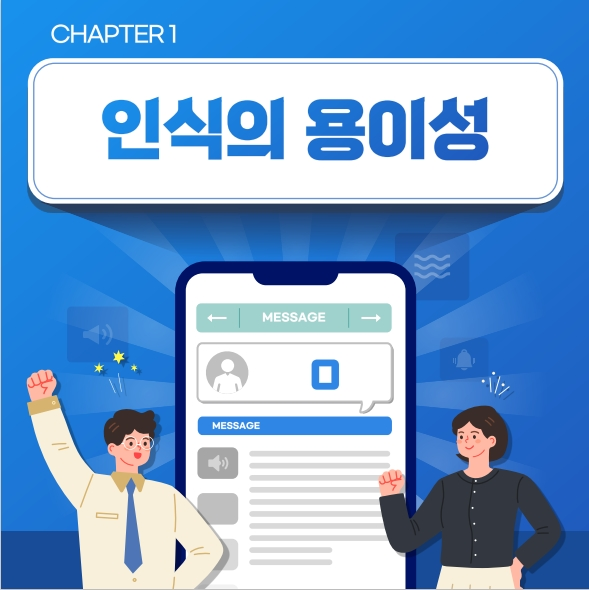
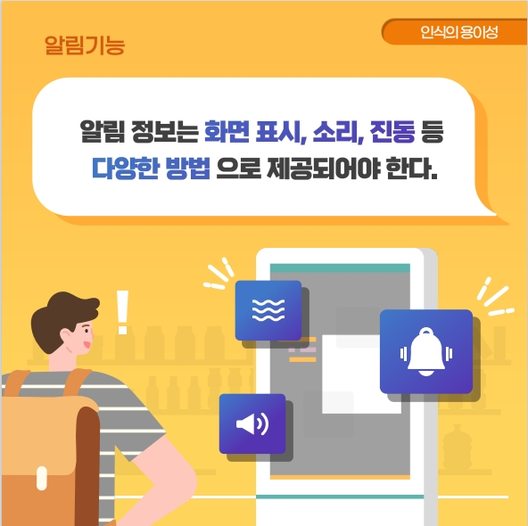

## 모바일 앱 접근성

>WCAG 2.0(Web Content Accessibility Guidelines 2.0)에서 제시하고 있는 접근성 설계의 4가지 원칙인 인식의 용이성, 운용의 용이성, 이해의 용이성, 견고성을 기준으로, 접근성 있는 모바일 애플리케이션 콘텐츠의 설계 및 개발을 위한 지침을 제시하고 있다.    

### 인식의 용이성 (Perceivable)
>**인식의 용이성 (Perceivable)** 은 사용자가 장애 유무 등에 관계없이 웹 사이트에서 제공하는 모든 콘텐츠를 동등하게 인식할 수 있도록 제공하는 것을 의미한다.

<figure aria-hidden="true" style="text-align:center">
   
   <figcaption>이미지 출처 : 보건복지부</figcaption>
</figure>

#### 5.1. 대체 텍스트 
> 텍스트 아닌 콘텐츠는 대체 가능한 텍스트와 함께 제공되어야 한다.   
 
**고려 사항**
- 텍스트 아닌 콘텐츠에 대한 대체 텍스트는 그 의미나 기능을 동등한 수준으로 짧고 명확하게 제공해야 한다

<figure aria-hidden="true" style="text-align:center">
   
   <figcaption>이미지 출처 : 보건복지부</figcaption>
</figure>

#### 5.2. 자막, 수화 등의 제공 
> 영상이나 음성 콘텐츠에는 동등한 내용의 자막, 원고 또는 수화가 제공 되어야 한다.  
 
**고려 사항**
- 영상이나 음성 콘텐츠 내 제공되는 모든 음성정보는 동등한 내용의 자막, 원고, 수화 중 적어도 하나 이상을 제공해야 한다.   
- 영상이나 음성 콘텐츠에서 화면에 문자 정보가 의미를 가지고 있는 경우 이를 설명하는 별도의 음성 콘텐츠나 원고를 제공해야 한다.   
- 자막, 원고 또는 수화는 재생되고 있는 영상이나 음성 콘텐츠와 동기화하여 제공한다. 단, 실시간으로 제공되는 영상이나 음성 콘텐츠의 경우는 실시간 자막 또는 수화로 제공할 수 있다.   
- 음성이나 문자정보 없이 제공되는 영상이나 음성 콘텐츠는 이를 설명하는 화면해설을 제공하는것이 바람직하다.   

<figure aria-hidden="true" style="text-align:center">
   
   <figcaption>이미지 출처 : 보건복지부</figcaption>
</figure>

#### 5.3. 색에 무관한 인식 
> 화면에 표시되는 모든 정보는 색에 관계없이 인식될 수 있어야 한다.      
 
**고려 사항**
- 콘텐츠에서 제공하는 모든 정보는 특정한 색을 구별할 수 없는 사용자, 흑백 디스플레이 사용자, 흑백 인쇄물을 보는 사용자 및 고대비 모드 사용자가 인식할 수 있도록 제공해야 한다.   

<figure aria-hidden="true" style="text-align:center">
   
   <figcaption>이미지 출처 : 보건복지부</figcaption>
</figure>

#### 5.4. 명도 대비 
> 화면에 표시되는 모든 사용자 인터페이스 컴포넌트와 텍스트는 전경색과 배경색이 구분될 수 있도록 제공되어야 한다.   
 
**고려 사항**
- 화면에 표시되는 모든 사용자 인터페이스 컴포넌트와 텍스트는 전경색과 배경색이 구분될 수 있도록 명도 대비를 3：1 이상으로 제공해야 한다.   

<figure aria-hidden="true" style="text-align:center">
   
   <figcaption>이미지 출처 : 보건복지부</figcaption>
</figure>

#### 5.5. 명확한 지시 사항 
> 지시 사항은 모양, 크기, 위치, 방향, 색, 소리 등에 관계없이 인식될 수 있어야 한다.   
 
**고려 사항**
- 화면에 표시되는 특정 사용자 인터페이스 컴포넌트를 가리키거나 지시 사항을 전달하는 콘텐츠의 경우 가리키고자 하는 사용자 인터페이스 컴포넌트의 실제 명칭이나 그 사용자 인터페이스 컴포넌트가 포함하고 있는 대체 텍스트를 사용해 지칭하거나, 하나의 감각에 의존하지 않고 여러감각을 이용하는 정보를 함께 제공해야 한다.   
- 음성이나 음향을 사용해 지시 사항을 전달하는 경우 사용자가 소리를 들을 수 없더라도 지시사항을 인식할 수 있어야 한다.   

<figure aria-hidden="true" style="text-align:center">
   
   <figcaption>이미지 출처 : 보건복지부</figcaption>
</figure>

#### 5.6. 알림 기능
> 알림 정보는 화면 표시, 소리, 진동 등 다양한 방법으로 제공되어야 한다.      
 
**고려 사항**
- 중요한 알림 정보는 시각, 청각, 촉각 등 다양한 감각으로 인식될 수 있어야 한다.   
- 알림 정보는 사용자가 자신에게 적합한 방법을 선택할 수 있도록 제공하는 것이 바람직하다.   

<figure aria-hidden="true" style="text-align:center">
   
   <figcaption>이미지 출처 : 보건복지부</figcaption>
</figure>

### 참조
- [W3C WCAG 1.0](https://www.w3.org/TR/WCAG10/){: target="_blank"}   
- [W3C WCAG 2.0](https://www.w3.org/TR/WCAG20/){: target="_blank"}   
- [W3C WCAG 2.1](https://www.w3.org/TR/WCAG21/){: target="_blank"}   
- [W3C WCAG 2.2](https://www.w3.org/TR/WCAG22/){: target="_blank"}    
- [W3C WCAG 3.0 Draft](https://www.w3.org/TR/2021/WD-wcag-3.0-20210121/){: target="_blank"}   
- [W3C/WAI Guidelines Apply to Mobile](https://www.w3.org/TR/2015/WD-mobile-accessibility-mapping-20150226/){: target="_blank"}    
- [W3C User Agent Accessibility Guidelines (UAAG) 2.0](https://www.w3.org/TR/UAAG20/){: target="_blank"}    
- [W3C/WAI Guidelines Apply to Mobile](https://www.w3.org/TR/IMPLEMENTING-UAAG20/mobile.html){: target="_blank"}   
- [W3C UAAG Github](https://github.com/w3c/UAAG){: target="_blank"}   
- [모바일 애플리케이션 콘텐츠 접근성 지침 2.0](http://www.webwatch.or.kr/pds/(KS%20X%203253)%EB%AA%A8%EB%B0%94%EC%9D%BC%20%EC%95%A0%ED%94%8C%EB%A6%AC%EC%BC%80%EC%9D%B4%EC%85%98%20%EC%BD%98%ED%85%90%EC%B8%A0%20%EC%A0%91%EA%B7%BC%EC%84%B1%20%20%EC%A7%80%EC%B9%A8%202.0.pdf){: target="_blank"}    

