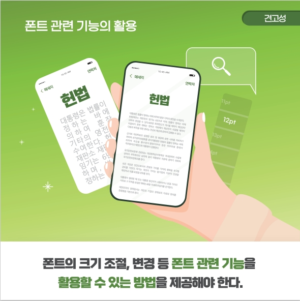
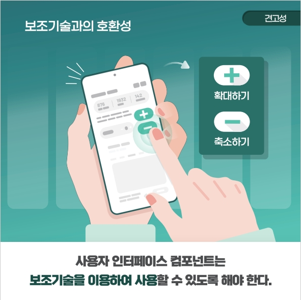

## 모바일 앱 접근성

### **견고성 (Robust)**
>**견고성 (Robust)** 은 사용자가 콘텐츠를 이용할 수 있도록 기술에 영향을 받지 않아야 함을 의미한다.

<figure aria-hidden="true" style="text-align:center">
   
   <figcaption>이미지 출처 : 보건복지부</figcaption>
</figure>

#### 8.1. 폰트 관련 기능의 활용
> 텍스트 콘텐츠는 운영체제에서 제공하는 폰트 관련 기능을 활용할 수 있는 방법을 제공해야 한다.   

**고려 사항**
- 텍스트 콘텐츠는 폰트 크기의 조절이 가능하도록 제공되어야 한다.   
- 폰트 크기 조절 시 화면 레이아웃이 유지될 수 있는 범위 내에서 적용한다.   
- 폰트 관련 기능을 활용할 수 있도록 범용폰트를 활용하는 것이 바람직하다.   

<figure aria-hidden="true" style="text-align:center">
   
   <figcaption>이미지 출처 : 보건복지부</figcaption>
</figure>

#### 8.2. 보조 기술과의 호환성
> 사용자 인터페이스 컴포넌트는 보조 기술을 이용하여 사용할 수 있도록 해야 한다.   

**고려 사항**
- 운영체제에서 제공하는 기본 사용자 인터페이스 컴포넌트를 최대한 이용하는 것이 바람직하다.   
- 부득이하게 기본 사용자 인터페이스 컴포넌트를 사용할 수 없을 시에는 운영체제에서 제공하는 보조 기술을 사용할 수 있도록 해야 한다.   
- 기본 컴포넌트를 원래의 기능과 다른 기능으로 제공할 경우 사용자가 컨트롤의 기능을 이해할 수 있도록 그 기능에 대한 정보를 제공해야 한다.   

<figure aria-hidden="true" style="text-align:center">
   
   <figcaption>이미지 출처 : 보건복지부</figcaption>
</figure>

### 참조
- [W3C WCAG 1.0](https://www.w3.org/TR/WCAG10/){: target="_blank"}   
- [W3C WCAG 2.0](https://www.w3.org/TR/WCAG20/){: target="_blank"}   
- [W3C WCAG 2.1](https://www.w3.org/TR/WCAG21/){: target="_blank"}   
- [W3C WCAG 2.2](https://www.w3.org/TR/WCAG22/){: target="_blank"}    
- [W3C WCAG 3.0 Draft](https://www.w3.org/TR/2021/WD-wcag-3.0-20210121/){: target="_blank"}   
- [W3C/WAI Guidelines Apply to Mobile](https://www.w3.org/TR/2015/WD-mobile-accessibility-mapping-20150226/){: target="_blank"}    
- [W3C User Agent Accessibility Guidelines (UAAG) 2.0](https://www.w3.org/TR/UAAG20/){: target="_blank"}    
- [W3C/WAI Guidelines Apply to Mobile](https://www.w3.org/TR/IMPLEMENTING-UAAG20/mobile.html){: target="_blank"}   
- [W3C UAAG Github](https://github.com/w3c/UAAG){: target="_blank"}   
- [모바일 애플리케이션 콘텐츠 접근성 지침 2.0](http://www.webwatch.or.kr/pds/(KS%20X%203253)%EB%AA%A8%EB%B0%94%EC%9D%BC%20%EC%95%A0%ED%94%8C%EB%A6%AC%EC%BC%80%EC%9D%B4%EC%85%98%20%EC%BD%98%ED%85%90%EC%B8%A0%20%EC%A0%91%EA%B7%BC%EC%84%B1%20%20%EC%A7%80%EC%B9%A8%202.0.pdf){: target="_blank"}    

