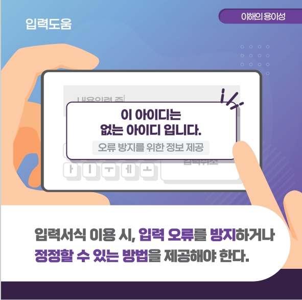
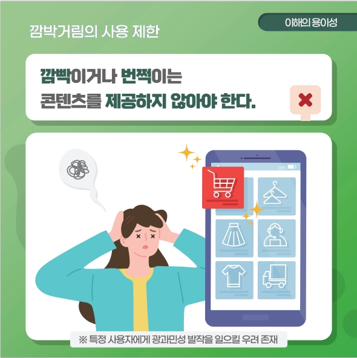
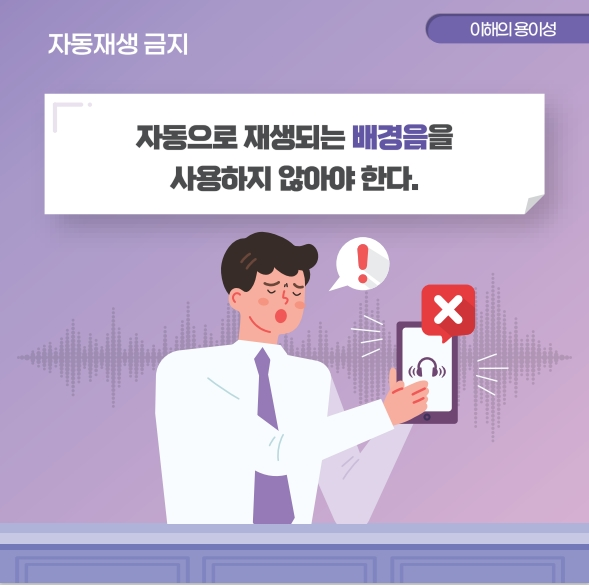
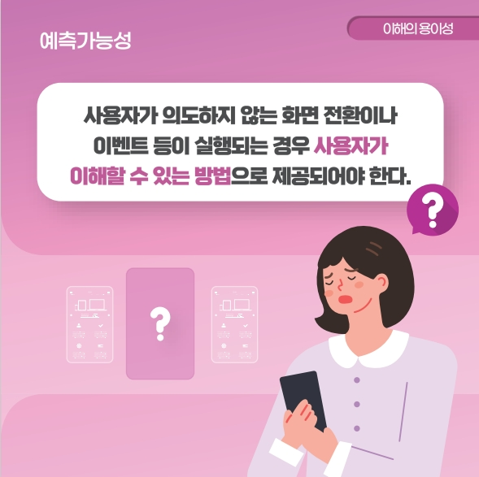

## 모바일 앱 접근성

### **이해의 용이성 (Understandable)**
>**이해의 용이성 (Understandable)** 은 사용자가 장애 유무 등에 관계없이 웹 사이트에서 제공하는 콘텐츠를 이해할 수 있도록 제공하는 것을 의미한다.    

<figure aria-hidden="true" style="text-align:center">
   
   <figcaption>이미지 출처 : 보건복지부</figcaption>
</figure>

#### 7.1. 입력 도움
> 입력 서식 이용 시, 입력 오류를 방지하거나 정정할 수 있는 방법을 제공해야 한다.       

**고려 사항**
- 입력 서식에는 용도와 목적을 알 수 있는 대체 정보를 제공해야 한다.   
- 별도의 입력 방식이 있는 입력 서식에는 입력 오류를 방지하기 위하여 입력내용에 대한 설명 정보를 제공해야 한다.   
- 사용자 입력 값에 오류가 있는 경우 오류 내용을 이해하고 이를 정정할 수 있도록 해당 오류내용을 알릴 수 있는 방법을 제공해야 한다.   
- 입력 서식의 오류 내용을 수정하기 용이하도록 오류가 발생된 지점으로 초점을 이동시키는 것이 바람직하다.   

<figure aria-hidden="true" style="text-align:center">
   
   <figcaption>이미지 출처 : 보건복지부</figcaption>
</figure>

#### 7.2. 사용자 인터페이스의 일관성
> 사용자 인터페이스 컴포넌트들은 일관성 있게 배치되어야 한다.    

**고려 사항**
- 화면에 표시되는 콘텐츠들의 배치는 일관성 있게 제공되어야 한다.   
- 애플리케이션 내의 유사한 기능을 가지고 있는 컨트롤은 동일하게 제공되어야 한다.   

<figure aria-hidden="true" style="text-align:center">
   
   <figcaption>이미지 출처 : 보건복지부</figcaption>
</figure>

#### 7.3. 깜박거림의 사용 제한
> 깜빡이거나 번쩍이는 콘텐츠를 제공하지 않아야 한다.    

**고려 사항**
- 화면상에서 깜빡임의 효과를 제공해야 하는 콘텐츠는 초당 3 ~ 50 회의 주기는 피해서 제공하는것이 바람직하다.   
- 불가피하게 사용할 경우, 깜빡임을 제공하는 콘텐츠는 사전에 알리고, 회피할 수 있는 방법을 제공해야 한다.   

<figure aria-hidden="true" style="text-align:center">
   
   <figcaption>이미지 출처 : 보건복지부</figcaption>
</figure>

#### 7.4. 자동재생 금지
> 자동으로 재생되는 배경음을 사용하지 않아야 한다.       

**고려 사항**
- 자동으로 재생되는 배경음은 제공하지 않아야 한다. 단, 3 초 미만의 배경음은 예외로 인정한다.   
- 배경음을 사용할 경우, 사용자가 손쉽게 멈춤, 일시 정지, 음량조절 등과 같이 이를 제어할 수 있는 수단을 제공해야 한다.   

<figure aria-hidden="true" style="text-align:center">
   
   <figcaption>이미지 출처 : 보건복지부</figcaption>
</figure>

#### 7.5. 예측가능성
> 사용자가 의도하지 않는 화면 전환이나 이벤트 등이 실행되는 경우 사용자가 이해할 수 있는 방법으로 제공되어야 한다.       

**고려 사항**
- 화면이 전환되거나 팝업과 같은 이벤트가 실행되는 경우 이를 예측할 수 있는 방법을 제공해야 한다.   
- 다른 애플리케이션으로 연결 및 전환되는 경우 이를 예측할 수 있는 방법을 제공해야 한다.   

<figure aria-hidden="true" style="text-align:center">
   
   <figcaption>이미지 출처 : 보건복지부</figcaption>
</figure>

### 참조
- [W3C WCAG 1.0](https://www.w3.org/TR/WCAG10/){: target="_blank"}   
- [W3C WCAG 2.0](https://www.w3.org/TR/WCAG20/){: target="_blank"}   
- [W3C WCAG 2.1](https://www.w3.org/TR/WCAG21/){: target="_blank"}   
- [W3C WCAG 2.2](https://www.w3.org/TR/WCAG22/){: target="_blank"}    
- [W3C WCAG 3.0 Draft](https://www.w3.org/TR/2021/WD-wcag-3.0-20210121/){: target="_blank"}   
- [W3C/WAI Guidelines Apply to Mobile](https://www.w3.org/TR/2015/WD-mobile-accessibility-mapping-20150226/){: target="_blank"}    
- [W3C User Agent Accessibility Guidelines (UAAG) 2.0](https://www.w3.org/TR/UAAG20/){: target="_blank"}    
- [W3C/WAI Guidelines Apply to Mobile](https://www.w3.org/TR/IMPLEMENTING-UAAG20/mobile.html){: target="_blank"}   
- [W3C UAAG Github](https://github.com/w3c/UAAG){: target="_blank"}   
- [모바일 애플리케이션 콘텐츠 접근성 지침 2.0](http://www.webwatch.or.kr/pds/(KS%20X%203253)%EB%AA%A8%EB%B0%94%EC%9D%BC%20%EC%95%A0%ED%94%8C%EB%A6%AC%EC%BC%80%EC%9D%B4%EC%85%98%20%EC%BD%98%ED%85%90%EC%B8%A0%20%EC%A0%91%EA%B7%BC%EC%84%B1%20%20%EC%A7%80%EC%B9%A8%202.0.pdf){: target="_blank"}    

