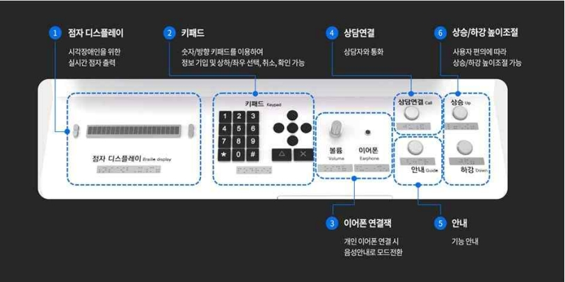
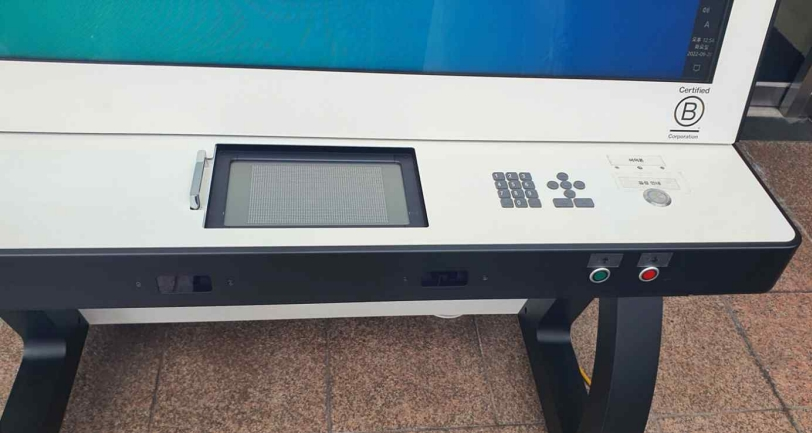
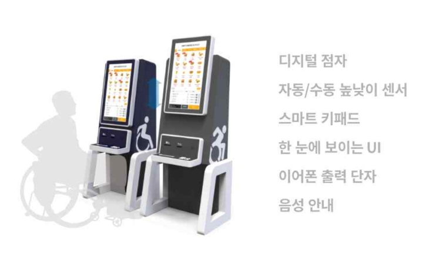
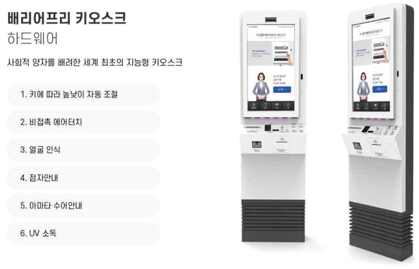
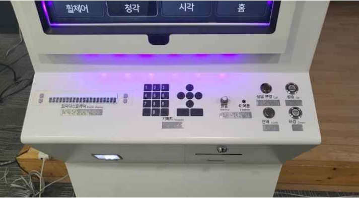

## 접근성 체크리스트

### 무인정보단말기 접근성
> **무인정보단말기**는 유형과 용도에 관계없이 "기본" 접근성 평가는 반드시 이루어져야 하며, "기본" 이외의 항목은 해당 사항이 있는 경우만 실시한다.   
무인정보단말기(키오스크)의 접근성에 대해 정리할 때, 웹 접근성과 모바일 앱 접근성 지침 기준을 참고할 수 있습니다. 한국의 웹 접근성 관련 지침은 주로 WCAG(Web Content Accessibility Guidelines)를 바탕으로 하고 있으며, 모바일 접근성 지침도 이와 유사한 원칙을 따릅니다.    
아래 제공되는 정보는 무인정보단말기 정보접근성 검증기준 문서에 따릅니다.

<figure aria-hidden="true" style="text-align:center">
   
   
   
   
   
   <figcaption>이미지 출처 : 무인정보단말기 접근성 검증기준 문서</figcaption>
</figure>

#### 1. 손 또는 팔 동작 보완
**(기본) 검증 기준**   
- 모든 컨트롤은 두 개 이상의 손가락을 동시에 이용해야 하는 다중 누르기(multi-touch) 동작을 요구하지 않아야 한다.    
- 다중 누르기 동작은 연속된 단순 누르기 동작으로 대체하여야 한다.    
- 화면상의 모든 이웃한 컨트롤 간에는 2.5mm 이상의 충분한 간격을 제공하여야 한다.    
- 모든 컨트롤은 표면적의 크기가 150mm2 이상, 한 변의 길이가 최소 12mm 이상으로 제공하여야 한다.   
- 모든 컨트롤을 활성화하는데 필요한 힘은 유형에 관계없이 최대 22.2N를 넘지 않아야 한다.    

**(결제) 검증 기준**   
- 카드 투입구는 카드의 원활한 삽입을 도와주는 모양으로 되어 있거나 가이드를 제공하여야 한다.    
- 카드 삽입 방향이 잘못되었을 경우 곧바로 카드를 배출하고 경고음을 발생시켜야 한다.    

**(개인 정보 입력) 검증 기준**   
- 여권, 또는 바코드 등을 정확하게 스캔하기 위한 가이드를 제공하여야 한다.    
- 지문 인식을 위해 손가락을 정확하게 올려놓을 수 있는 가이드를 제공해야 한다.    

**(매체 출력) 검증 기준**   
- 사용자가 출력 매체(영수증, 티켓 등)를 회수할 수 있도록 제공하여야 한다. 이를 위해,     
  * 출력 매체가 작은 티켓 등의 경우, 배출구 밖 최소 20 mm 이상 나오면서 바닥에 떨어지지 않도록 잡아주고,    
  * 서류용지같이 출력 매체가 큰 경우, 받침 상자에 출력해준다.    

#### 2. 반응시간 보완
**(기본) 검증 기준**   
- 사용자의 조작 없이 자동으로 변경되는 콘텐츠는 사용되지 않아야 한다.     
- 광고 등과 같이 자동으로 변경되는 콘텐츠가 부득이하게 사용될 경우에는, 앞/뒤로 이동, 일시정지와 같이 이를 제어할 수 있는 수단을 제공해야 한다.    
- 사용자의 선택적 응답을 요구하는 조작에는 시간제한(timeout)을 두지 않는다.    
- 부득이하게 시간제한을 두는 경우, 화면에 남은 제한시간을 표시하여 사용자에게 알려주어야 한다.   

#### 3. 시력 보완 및 대체   
**(기본) 검증 기준**   
- 모든 시각적 정보는 음성과 함께 제공한다. 사용자의 선호에 따라 음성 정보를 활성화시키거나 차단할 수 있어야 한다.   
- 음성 정보의 사용을 위해 별도의 음성출력장치를 이용할 수 있는 단자 및 연결 기능을 제공하여야 한다.   
- 별도의 음성출력장치를 연결하면 스피커에서 읽어주는 소리는 차단되어야 한다.   
  * 표준 이어폰(3.5 mm) 또는 무선 이어폰 등을 연결할 수 있어야 한다.
- 별도의 음성출력장치를 이용하는 경우, 음량조절기능, 일시정지 및 다시 듣기 기능 등을 제공하여야 한다.   
  * **(음량조절범위)** 음량 조절 범위는 50dB 범위 내에서 조절할 수 있어야 한다.
  * **(다시듣기)** 음성 다시듣기 기능이 제공되어야 한다.
- 모든 선택 가능한 시각적 정보는 물리적 키패드로 선택할 수 있어야 한다.   
  * 물리적 키패드는 화면상에서 초점의 이동 수단을 제공하는 숫자 키패드 또는 화살표 방향 키패드 등을 의미한다.
- 물리적 키패드 입력장치는 기준점에 돌기 표시를 붙여 촉각으로 위치와 배열을 파악할 수 있어야 한다.   
- 고대비 화면을 제공하며, 사용자가 이를 쉽게 활성화시킬 수 있도록 제공하여야 한다.   
- 중요한 입력이 완료된 경우에는 이를 알려주는 소리 정보를 제공하여야 한다.   
- 화면을 통해서 제공되는 모든 시각적 정보는 확대, 또는 축소할 수 있어야 한다.   
- 화면상의 글자의 크기는 휠체어 사용자의 팔 길이를 고려한 최대 가시거리 500mm 기준으로 글자의 높이가 12mm 이상으로 제공하여야 한다.   
  * 한글의 글자 높이는 영어와 달리 종성 받침이 포함되는 높이이므로, 휠체어 사용자의 최대 팔 길이의 가시거리에서 0.7도 * 2 로 계산해야 한다.   
- 모든 시각적 정보는 배경으로부터 뚜렷하게 구분되어야 하며, 최소 4.5:1 이상의 명도 대비를 제공하여야 한다.   
  * 글자 크기가 12mm보다 큰 경우에는 명도 대비 3:1까지 낮출 수 있다,   
- 주요 기능을 나타내는 컨트롤(또는 픽토그램)은 식별하기 쉬운 표준 모양으로 표시되어야 한다.   
- 키패드, 버튼, 등의 물리적 장치는 주변보다 2mm이상 돌출 또는 함몰되도록 해야 하며 위치 또는 내용을 알 수 있도록 음성안내 또는 점자 표시(또는 점자 레이블)를 제공하여야 한다.   

**(스크린리더) 검증 기준**   
- 화면에 문자 및 그림, 영상 정보가 의미를 가지고 있는 경우, 이와 동등한 대체 콘텐츠를 제공하여야 한다.   

#### 4. 색상 식별능력 보완   
**(기본) 검증 기준**   
- 모든 시각적 정보는 녹색 바탕에 빨간색 텍스트, 파란색 바탕에 노란색 텍스트로 제공되지 않아야 한다.   
- 모든 시각적 정보는 색을 배제하더라도 다른 방법으로 식별이 가능하도록 중복적인 방법으로 설계되어야 한다.   
  * 흑백 모니터로도 시각적 정보를 구분할 수 있어야 한다.   

#### 5. 청력 보완 및 대체   
**(기본) 검증 기준**   
- “확인” 버튼과 같이 입력의 완료를 나타내는 경우, 소리와 함께 시각적 표시를 제공하여야 한다.   
  * 컨트롤 버튼의 색상 변화 등을 활용한다.   
- 음성이나 음향으로 출력되는 내용은 시각 또는 촉각적 대체 방법과 함께 제공하여야 한다.   
- 경고음은 점멸, 불빛, 등의 시각적 효과와 함께 제공하여야 한다.   
- 음성출력장치(스피커)의 음량은 최대음량 65 dB 내에서 사용자가 직접 조절할 수 있어야 한다.   

#### 6. 음성 입력 대체   
**(기본) 검증 기준**   
- 음성 입력을 요구하는 경우, 이를 대체할 수 있는 수단이 제공되어야 한다.   

#### 7. 인지능력 보완   
**(기본) 검증 기준**   
- 사용자가 언제든지 실행을 되돌리거나 취소 및 초기화가 가능하여야 한다.   
  * 언제든지 쉽게 시작화면 또는 홈 화면으로 돌아가서 처음부터 다시 시작할 수 있어야 한다.   
  * 초기화하는 경우에는 입력된 정보의 삭제, 삽입되어 있는 카드 등의 회수가 이루어진 뒤 처음부터 다시 조작이 시작되어야 한다.   
- 작업의 실행에 대한 알림정보(피드백)는 시각, 청각, 촉각 등 다양한 감각으로 제공되어야 한다.   
- 모든 설계 요소는 사용자가 논리적으로 쉽게 이해할 수 있도록 단순하고 일관성 있게 배치되어야 한다.   
- 사용자가 의도하지 않는 화면 전환이나 이벤트 등이 자동적으로 실행되지 않아야 한다.   
- 도움을 요청할 수 있는 연락처가 명시되어 있거나 직원의 도움을 호출하는 버튼을 제공하여야 한다.   
- 기호 또는 심볼로 표시된 정보는 문자와 함께 제공되어야 한다.   
- 글자 정보는 어려운 관용구나 외래어 등으로 표시되어 있지 않아야 한다.   
- 모든 설계 요소의 초점은 사용자가 쉽게 이해할 수 있도록 스크린리더 상에서 논리적으로 이동되어야 한다.

#### 8. 깜빡거림 사용 제한   
**(기본) 검증 기준**   
- 화면에 깜빡이거나 번쩍이는 객체가 사용되지 않아야 한다.   
- 화면에 깜빡이는 객체가 있다면, 초당 3~50 회의 주기로 깜빡이지 않아야 한다.   

#### 9. 휠체어 사용자 접근   
**(기본) 검증 기준**   
- 화면 또는 인터페이스에 부착된 컨트롤의 위치는 바닥으로부터 400mm ~ 1,220mm 사이에 있어야 한다.   
- 화면 내의 시각적 정보의 위치는 바닥으로부터 1,220mm를 넘지 않아야 한다.   

#### 10. 개인정보 보호   
**(개인정보 입력) 검증 기준**   
- 개인정보는 사용자가 직접 설정할 수 있도록 제공하여야 한다.   
- 개인정보 이외에 사용자를 인식할 수 있는 다양한 형태의 방법을 제공하여야 한다.   
- 개인정보는 어떠한 경우에도 화면에 그대로 표시되지 않아야 한다.   
- 개인정보를 입력하는 경우 이를 음성으로 읽어주지 않아야 한다.    

### 참조
- [W3C Mobile Accessibility at W3C](https://www.w3.org/WAI/standards-guidelines/mobile/){: target="_blank"}   
- [W3C Mobile Accessibility: How WCAG 2.0 and Other W3C/WAI Guidelines Apply to Mobile](https://www.w3.org/TR/mobile-accessibility-mapping/){: target="_blank"}    
- [W3C First Public Working Draft](https://www.w3.org/news/2015/first-public-working-draft-performance-timeline-level-2/){: target="_blank"}    
- [W3C User Agent Accessibility Guidelines (UAAG) 2.0](https://www.w3.org/TR/UAAG20/){: target="_blank"}   
- [W3C Mobile Accessibility Examples from UAAG 2.0 Reference](https://www.w3.org/TR/IMPLEMENTING-UAAG20/mobile.html){: target="_blank"}   
- [MDN Mobile accessibility checklist](https://developer.mozilla.org/en-US/docs/Web/Accessibility/Mobile_accessibility_checklist){: target="_blank"}   
- [보건복지부 블로그](https://blog.naver.com/prologue/PrologueList.naver?blogId=mohw2016){: target="_blank"}   
- [보건복지부 - 장애인의 무인정보단말기 등 접근성 강화방안 마련 연구](https://www.mohw.go.kr/synap/doc.html?fn=1635730805506_20211101104005.pdf&rs=/upload/result/202405/){: target="_blank"}   
- [무인정보단발기 UI플랫폼 - 무인정보단말기 접근성 지침](https://www.kioskui.or.kr/index.do?menu_id=00000985){: target="_blank"}   
- [무인정보단말기(키오스크, 스마트자판기 등) 접근성 지침](https://standard.go.kr/KSCI/standardIntro/getStandardSearchView.do?menu19&topMenuId=502&upperMenuId=503&ksNo=KSX9211&tmprKsNo=KS_X_NEW_2015_1845&reformNo=01){: target="_blank"}   
- [Guidelines for Public Access Terminals Accessibility - Printable Version](https://mada.org.qa/wp-content/uploads/2020/01/Ireland-Guidelines-for-Public-Access-Terminals-Accessibility.pdf){: target="_blank"}   
- [경향신문 - ‘버튼 높이는 120㎝ 아래에’ 접근성 강화한 키오스크 표준 나온다](https://www.khan.co.kr/economy/market-trend/article/202109231513001#csidxf8d9d8b51bed28bbb4fad083122f3af){: target="_blank"}   

