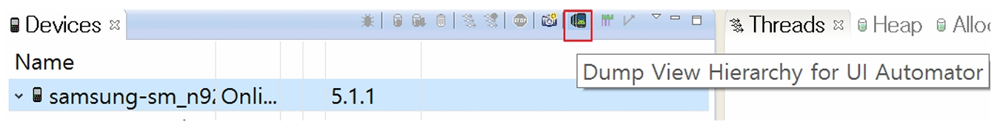
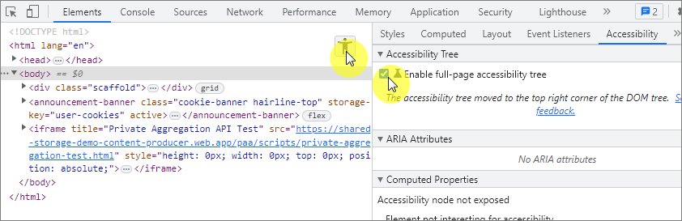

# 접근성 콘텐츠 제작 기법
> 접근성 콘텐츠 제작 기법은 모든 사용자, 특히 장애가 있는 사용자가 웹과 모바일 콘텐츠에 접근하고 사용할 수 있도록 보장하는 방법입니다. 이 기법은 웹 접근성 지침(WCAG: Web Content Accessibility Guidelines)과 모바일 접근성 표준을 따르는 것이 중요합니다. 각각의 영역에 대해 접근성 작업 시 도움이 될 수 있도록 작업되었습니다. 접근성은 법적 요구사항일 뿐만 아니라 사용자를 위한 기본적인 배려이기도 합니다.  

## 모바일 앱 접근성 콘텐츠 제작 기법   
> 사용자가 장애를 가지고 있거나 특정 기능적 제한을 겪는 경우에도 원활하게 모바일 앱을 이용할 수 있도록 하는 방법을 의미합니다. 이러한 접근성을 고려한 콘텐츠 제작은 다양한 사용자들의 요구를 충족시키며, 앱의 사용성을 크게 향상시킵니다.    

### 보조 기술과의 호환성
**관련 지침 : 사용자 인터페이스 컴포넌트는 보조 기술을 이용하여 사용할 수 있도록 해야 한다.**   
대체 텍스트는 비 텍스트 콘텐츠를 설명하는 중요한 요소로, 접근성을 높이기 위해 필수적으로 제공되어야 합니다. 다양한 테스트 도구를 활용해 웹 및 모바일 앱에서 대체 텍스트를 포함한 접근성 요소를 철저히 점검하고, 사용자 경험을 개선할 수 있습니다. 접근성을 준수함으로써 모든 사용자에게 포용적인 디지털 환경을 제공합니다.   
[WCAG 2.2 Quick Reference - Non-text Content](https://www.w3.org/WAI/WCAG22/quickref/#non-text-content){: target="_blank"}

**키워드**   
#모바일 앱 접근성, #모바일 앱 접근성 콘텐츠 제작 기법, #WCAG2.2, #대체 텍스트, #비 텍스트 콘텐츠, #accessibilityLabel, #contentDescription, #보조기술과의호환성, #접근성 테스트 도구 활용 점검방법, #스크린 리더, #VoiceOver, #TalkBack, #UIAccessibility API #AccessibilityNodeInfo API, #Swift, #Kotlin, #네이티브 #하이브리드

#### 1. 필요성        
대체 텍스트는 이미지, 동영상, 아이콘 등 비 텍스트 콘텐츠의 의미를 텍스트로 설명하여, 시각 장애인이나 저시력 사용자가 스크린 리더를 통해 콘텐츠를 이해할 수 있도록 돕습니다. 이는 접근성을 보장하며, 웹 및 앱에서 모든 사용자가 동등하게 콘텐츠에 접근할 수 있게 합니다.   

#### 2. 대상       
- **시각 장애인**: 스크린 리더를 사용하는 사용자들.   
- **저시력 사용자**: 텍스트 크기 조정 및 색상 대비에 의존하는 사용자들.   
- **고령자**: 시력이 저하된 사용자들.   
- **인지 장애인**: 복잡한 비주얼 콘텐츠를 이해하는 데 어려움을 겪는 사용자들.   

#### 3. 체크리스트       
- **대체 텍스트 제공 여부**: 모든 비 텍스트 콘텐츠에 대체 텍스트가 제공되고 있는가?   
- **적절성**: 대체 텍스트가 콘텐츠의 의미를 정확하게 전달하고 있는가?   
- **중복 여부**: 같은 콘텐츠에 대해 중복된 대체 텍스트가 제공되고 있지 않은가?    
- **불필요한 정보 배제**: 장식용 이미지에 대체 텍스트가 불필요하게 포함되어 있지 않은가?     
- **스크린 리더 테스트**: 대체 텍스트가 스크린 리더에서 올바르게 읽히는가?     


#### 4. 기기별 테스트 방법      
**iOS**     
- **VoiceOver 활성화**: 설정 > 접근성 > VoiceOver를 활성화하여 대체 텍스트가 올바르게 읽히는지 테스트합니다.   
- **Accessibility Inspector 사용**: Xcode의 'Accessibility Inspector'를 통해 UI 요소의 대체 텍스트 적용 상태를 확인합니다.    
- [iPhone 사용 설명서 - VoiceOver](https://help.apple.com/iphone/11/?lang=ko#/iph3e2e415f){: target="_blank"}
   
**Android**   
- **TalkBack 활성화**: 설정 > 접근성 > TalkBack을 활성화하여 대체 텍스트가 적절하게 읽히는지 테스트합니다.    
- **Accessibility Scanner 사용**: Google Play에서 제공하는 'Accessibility Scanner' 앱을 사용하여 대체 텍스트의 적용 여부를 자동으로 탐지합니다.      
- [Android 접근성 고객센터 - TalkBack 및 Android](https://support.google.com/accessibility/android/topic/10601571?hl=ko&ref_topic=3529932&sjid=14261166623289476037-AP){: target="_blank"}

#### 5. QA 지표       
- **대체 텍스트 오류 비율**: 대체 텍스트가 누락되거나 부정확하게 제공된 UI 요소의 비율.   
- **스크린 리더 정확성**: 스크린 리더를 통해 올바르게 읽히는 대체 텍스트의 비율.   
- **사용자 피드백**: 실제 사용자 테스트를 통해 대체 텍스트의 적절성에 대한 피드백을 수집.   


#### 6. 개발방법     
시각장애인 사용자는 스크린리더 프로그램을 사용하여 콘텐츠 정보를 인식하고 사용합니다. 다음 그림에 보이는 바와 같이 스크린리더는 각각의 콘텐츠가 갖고 있는 정보를 음성으로 알려줍니다. 콘텐츠의 용도를 알 수 있는 텍스트 정보(●) 예: 블루라이트 필터, 콘텐츠가 어떤 컨트롤인지 버튼인지, 토글 버튼인지 등 유형 정보(▲) 예: 스위치, 콘텐츠 유형에 따른 상태 정보(◼︎) 예:사용 안 함, 콘텐츠를 사용하기에 필요한 힌트 정보(★) 예:전환하려면 두 번 탭 하세요. 를 음성으로 알려주는 것을 볼 수 있습니다.    
<figure aria-hidden="true" style="text-align:center;border:1px solid #000">
   
   <figcaption>출처 : NULI</figcaption>
</figure>

**네이티브**     
iOS는 accessibilityLabel로 Android는 contentDescription으로 대체 텍스트 정보를 제공할 수 있습니다.   

- **iOS**    
  - [관련문서:Apple's Accessibility Programming Guide for iOS](https://developer.apple.com/accessibility/ios/){: target="_blank"}
  - **Interface Builder 이용하여 요소에 대체 텍스트 적용하는 방법**   
      - 방법1. Xcode의 Accessibility 패널에서 Label 제공   
        <figure aria-hidden="true" style="text-align:center;border:1px solid #000">
          
          <figcaption>출처 : NULI</figcaption>
        </figure>
        
        - ① Accessibility 에서 Enabled 을 선택해 접근성 기능을 활성화한 상태에서    
        - ② Label 에 콘텐츠의 의미를 명확하게 전달할 수 있는 대체 텍스트를 작성합니다.    
      - 방법2. 코드로 Label 제공   
         ```sh
          var.isAccessibilityElement = true   // ① 접근성 요소 활성화
          var.accessibilityLabel = "대체 텍스트" // ② 대체 텍스트 정보
          ```    
  - **UIAccessibility API를 활용하여 코드에 대체 텍스트 제공**    
    ```sh
    let imageView = UIImageView(image: UIImage(named: "sunrise.png"))
    imageView.accessibilityLabel = "A beautiful sunrise over the mountains"
    ```

- **Android**         
  - [관련문서:Android Accessibility Overview](https://developer.android.com/guide/topics/ui/accessibility){: target="_blank"}
  - 방법1. Android Studio Properties 창에서 contentDescription 제공   
    <figure aria-hidden="true" style="text-align:center;border:1px solid #000">
      
      <figcaption>출처 : NULI</figcaption>
    </figure>
  - 방법2. 코드로 contentDescription제공   
    ```sh
    android:contentDescription = "대체 텍스트" // UI 레이아웃 XML에서 제공
    ```   
    </figure>
  - **contentDescription 속성 사용**    
  ```sh
  <ImageView
      android:id="@+id/myImage"
      android:layout_width="wrap_content"
      android:layout_height="wrap_content"
      android:contentDescription="A beautiful sunrise over the mountains" />
  ```   
  - **코드에서 contentDescription 설정**    
  ```sh
  val myButton: Button = findViewById(R.id.my_button)
  myButton.contentDescription = "Submit"
  ```

- **하이브리드(html)**    
```sh

```
- **하이브리드(Vue)**    
```sh
<template>
  
</template>

<script>
export default {
  data() {
    return {
      sunriseImage: 'sunrise.png'
    };
  }
};
</script>
```
- **하이브리드(React)**    
```sh
import React from 'react';

function SunriseImage() {
  return ;
}

export default SunriseImage;
```
**이미지 alt속성 작성 예시**    
카카오페이 신용대출 서비스 화면 중 대출 가능성 배너를 보여주는 UI로 다음은 alt속성 작성 예시 방법입니다.    
<figure aria-hidden="true" style="text-align:center;border:1px solid #000">
  
  <figcaption>출처 : kakaopay</figcaption>
</figure>

- **alt 속성을 사용하지 않은 경우**   
  ```sh
  
  음성출력 형태 : 이미지 넛지 타입비 삼백이십엑스이백십구피엔지 이미지
  ``` 
   - 스크린 리더는 이미지에 alt 속성이 없으면 파일 이름을 표현합니다.    
   - 대체 텍스트가 없기 때문에 대신 이미지 경로 정보인 src를 음성으로 전달합니다.     
   - 파일의 이름으로 콘텐츠를 설명하는 것도 방법이 될 수는 있습니다. 하지만 네트워크 오류, 콘텐츠 차단 등 서비스 관련 이미지를 표시할 수 없는 경우에는 서비스와 무관한 이미지의 alt 값이 음성으로 출력되기 때문에 접근성뿐만 아니라 다양한 환경의 사용자를 고려한다면 alt 속성은 꼭 필요한 속성입니다.   
- **alt 속성을 사용했지만 값을 제공하지 않는 경우**    
  ```sh
  
  음성출력 형태 : 없음
  ``` 
   - alt 속성의 값을 빈 값("")으로 생략해 제공하는 경우에는 이미지가 핵심 요소가 아님을 뜻하기 때문에 스크린 리더는 img 태그를 해석하지 않습니다.    
   - 이 경우 스크린 리더 사용자는 웹 브라우징 과정에서 이미지 요소가 있다는 것을 알 수 없습니다.     
   - 따라서 배경 이미지처럼 단순 디자인의 목적을 가진 이미지는 의도적으로 대체 텍스트를 빈 값으로 작성해 스크린 리더가 읽지 않도록 할 수 있습니다.     
   - 하지만 이미지 1번 영역 죠르디의 상태로 높은 대출 승인율을 표현하는 콘텐츠임을 감안하면, 사용자에게 이미지 설명을 전달할 필요가 있다고 생각하기 때문에 다음 단계로 넘어가 alt 속성에 대체 텍스트를 작성해 보도록 하겠습니다.      
- **적합한 대체 텍스트를 작성하지 않은 경우**    
  ```sh
  
  음성출력 형태 : 기뻐하는 죠르디 이미지 이미지
  ``` 
   - 시맨틱 태그는 암시적으로 role을 갖고 있으며, 스크린 리더는 &lt;img&gt;를 ‘이미지’로 자동으로 결정하게 됩니다.     
   - 따라서 이미지의 존재 여부를 표현하는 ‘사진, 이미지, 아이콘’등의 단어를 대체 텍스트에 포함하게 되면 스크린 리더가 기본적으로 해석한 ‘이미지’와 중복된 의미를 갖기 때문에 적합하지 않습니다.      
- **(권장)적합한 대체 텍스트를 제공한 경우**    
  ```sh
  
  음성출력 형태 : 기뻐하는 죠르디 이미지
  ```   
**버튼에 이미지 작성 예시**    
아래 이미지의 2번 영역에 있는 물음표 모양 버튼을 보면 우리는 너무나도 쉽게 내 대출 승인율이 무엇인지 자세한 정보를 확인할 수 있는 버튼임을 인식할 수 있습니다.    
먼저 우리는 스크린 리더가 코드를 어떻게 해석하는지 알아야 합니다.     
- 브라우저는 코드를 스크린 리더가 읽을 수 있는 접근성 트리(Accessibility Tree)로 만듭니다.    
- 스크린 리더는 접근성 트리의 요소를 순차 탐색하게 되는데, 접근성 트리에 표시되는 요소의 Name을 기반으로 해석합니다.     
- 여기서 말하는 Name은 Accessible Name이라고도 하며 스크린 리더가 요소를 포커스했을 때 읽는 값으로 author와 contents 중 하나로 결정됩니다.    
- 이때, author가 contents보다 우선순위가 높습니다.    
  - author: aria-label, aria-labelledby, title 속성, &lt;img&gt;의 alt 속성, svg의 &lt;desc&gt;
  - contents: Text 노드
<figure aria-hidden="true" style="text-align:center;border:1px solid #000">
  
  <figcaption>출처 : kakaopay</figcaption>
</figure>

```sh
<button type="button">
  <!-- : 구체적이지 않으며 추상적 -->
  
</button>
음성출력 형태 : 내 대출 승인율이란 버튼
``` 
   - &lt;img&gt;의 author는 alt 속성으로 Accessible Name은 “내 대출 승인율이란”이 됩니다.    
   - &lt;button&gt;은 author가 설정되지 않은 경우 자식 요소의 Accessible Name을 모아 contents로 사용하는 Children Presentational이라는 특징을 갖습니다.    
   - 따라서 &lt;button&gt;의 content는 ‘내 대출 승인율이란’이 되고 스크린 리더는 자동적으로 결정한 role과 결합해 “내 대출 승인율이란 버튼”이라고 해석하게 됩니다.      

**텍스트와 상호작용 요소의 분리 예시**    
텍스트 안에 링크나 버튼을 넣지 않아야 한다. 아래 예처럼 텍스트 안에 링크가 있는 경우 스크린 리더는 빠르게 텍스트를 읽어 나가기 때문에 화면의 레이아웃을 파악하기 힘든 시각장애인은 링크 위치를 알 수 없다. 텍스트와 상호작용이 가능한 요소는 분리하여 디자인해야 인식 가능하다.     

<figure aria-hidden="true" style="text-align:center;border:1px solid #000">
  
  <figcaption>출처 : 모바일 UI UX 기본가이드 | 브런치 스토리 by최철호</figcaption>
</figure>

이미지 요소에 어떤 내용으로 대체 텍스트를 제공할 것인지 고민하기 전에, 이미지를 어떤 목적으로 사용하고 있는지를 생각해 봐야 합니다.     
이미지가 주요 콘텐츠의 일부로서 사용자에게 정보를 전달하는 역할을 한다면 적절한 의미에 맞는 대체 텍스트를 제공하면 됩니다.    
반대로 이미지가 콘텐츠의 내용을 설명하는 핵심적인 요소가 아니라면 대체 텍스트를 생략하거나 배경 이미지 속성을 활용함으로써 스크린 리더 사용자에게 불필요한 정보를 전달하지 않도록 합니다.    


#### 7. 점검 기준     
텍스트가 아닌 콘텐츠에 해당 이미지가 제공하는 의미나 용도를 동일하게 인식할 수 있는 적절한 대체 텍스트를 제공한다.    

**오류유형**    
- 이미지 요소가 제공하는 정보와 동일한 정보가 음성으로 출력되지 않는 경우      
- 의미와 용도를 이해할 수 없는 대체 텍스트를 제공하는 경우     
- 의미없는 이미지에 대체텍스트를 제공하는 경우     
- 대체 텍스트 제공 없이 설명만 제공되는 경우(Hint로만 제공된 경우)     
- 객체 유형 정보가 반복 제공되는 경우 (~이미지이미지, ~버튼버튼 등)    
- 객체 유형에 대한 정보가 잘못 제공된 경우     
- display:none, visibility:hidden으로 대체텍스트가 제공된 경우     
- 화면에 보이지 않는 형태로 대체텍스트가 제공된 경우 (터치방식으로 대체정보 확인이 불가한 경우)       
   
**주의사항**     
- 기능을 제공하는 경우 이용방법 등 충분한 설명을 제공하지 않은 경우 (권고)     
- 숫자 정보에 대해 의미전달이 미흡한 대체텍스트를 제공하는 경우 (권고) :    
- 준수예) 6.20 --> 6월20일     
- 권고) 객체 유형정보를 정확히 제공할 것을 권장함(Traits 정보)     
- IR기법으로 대체텍스트를 제공 시 hidden형태가 아니더라도 화면 터치방식으로는 대체정보 인지 불가함(오류)     

#### 8. 점검 방법     
**iOS**         
- **음성출력 형태**: VoiceOver는 UI 요소의 accessibilityLabel을 읽어줍니다. 예를 들어, "Submit button"이라고 출력합니다.    
- **제공방법**: Xcode의 Interface Builder에서 Label 필드에 텍스트를 입력하거나, 코드에서 accessibilityLabel을 설정합니다.    

**Android**    
- **음성출력 형태**: TalkBack은 contentDescription 속성에 설정된 텍스트를 읽어줍니다.    
- **제공방법**: Android Studio에서 XML의 contentDescription 속성을 사용하거나, 코드에서 직접 설정합니다.    

**방법 1 (네이티브-문서 제공기준)**     
TalkBack(또는 Voice Assistant 등) 기능으로 텍스트가 아닌 콘텐츠에 대응하는 대체 텍스트의 적절성 여부를 확인한다.    
- 화면 구성 정보를 제공하는지 확인한다. (Title, List View, Grid View)     
- 화면 내 구체적인 Contents를 읽어주는지 확인한다. (Text, Imge)     
- 화면 내 기능을 읽어주는지 확인한다. (Button 등)     
<figure aria-hidden="true" style="text-align:center;border:1px solid #000">
   
   
   <figcaption>출처 : 모바일 애플리케이션 접근성 제작기법</figcaption>
</figure>

**방법 2 (네이티브-문서 제공기준)**      
음성출력 표시 기능으로 텍스트가 아닌 콘텐츠에 대응하는 대체 텍스트의 적절성 여부를 점검한다.    
- 설정→접근성→시각→Talk Back→설정→개발자 설정→음성출력 표시 체크 후 확인한다.     
<figure aria-hidden="true" style="text-align:center;border:1px solid #000">
   
   <figcaption>출처 : 모바일 애플리케이션 접근성 제작기법</figcaption>
</figure>

**방법 3 (네이티브-문서 제공기준)**   
UIAutoMatorViewer를 활용하여 점검한다.     
- Android Studio를 이용한 실행방법     
  - Toolbar에서 Android Device Monitor 버튼을 선택    
    <figure aria-hidden="true" style="text-align:center;border:1px solid #000">
        
        <figcaption>출처 : 모바일 애플리케이션 접근성 제작기법</figcaption>
    </figure>
  - Devices 탭에서 디바이스가 연결된 상태로 점검할 화면을 띄운 뒤 Dump View Hierarchy for UI Automator버튼을 선택 
    <figure aria-hidden="true" style="text-align:center;border:1px solid #000">
        
        <figcaption>출처 : 모바일 애플리케이션 접근성 제작기법</figcaption>
    </figure>
- ADT(Android Developer Tools) 를 이용한 실행 방법     
  - DDMS(Dalvik Debug Monitor Server) 를 실행    
  - Devices 탭에서 디바이스가 연결된 상태로 점검할 화면을 띄운 뒤 Dump View Hierarchy for UI Automator버튼을 선택 
    <figure aria-hidden="true" style="text-align:center;border:1px solid #000">
        
        <figcaption>출처 : 모바일 애플리케이션 접근성 제작기법</figcaption>
    </figure>
- SDK 내부의UIAutomator Viewer 실행     
  - Android sdk폴더의 tools 안에있는 uiautomatorviewer.bat 파일실행 
    <figure aria-hidden="true" style="text-align:center;border:1px solid #000">
        
        <figcaption>출처 : 모바일 애플리케이션 접근성 제작기법</figcaption>
    </figure>
  - 실행화면 
    <figure aria-hidden="true" style="text-align:center;border:1px solid #000">
        
        <figcaption>출처 : 모바일 애플리케이션 접근성 제작기법</figcaption>
    </figure>
  - Device Screenshot 선택 
    <figure aria-hidden="true" style="text-align:center;border:1px solid #000">
        
        <figcaption>출처 : 모바일 애플리케이션 접근성 제작기법</figcaption>
    </figure>

**방법 4 (네이티브-문서 제공기준)**    
UIAutomatorViewer를 이용하여 점검한다.     
- 점검할 화면을 띄운다.    
- 점검할 UI객체를 선택하여 상세정보를 확인한다.     
    <figure aria-hidden="true" style="text-align:center;border:1px solid #000">
        
        <figcaption>출처 : 모바일 애플리케이션 접근성 제작기법</figcaption>
    </figure>
- ImageButton, ImageView의경우 content-desc항목이 적용되어있는지 확인해야 한다.     
  - 대체텍스트 적용 시 Node Detail과 계층구조의{ }안에 대체텍스트내용이 표시 된다. 
    <figure aria-hidden="true" style="text-align:center;border:1px solid #000">
        
        <figcaption>출처 : 모바일 애플리케이션 접근성 제작기법</figcaption>
    </figure>
  - 대체텍스트 미적용 시 Node Detai과 계층구조에 대체텍스트가 표시되지 않는다. 
    <figure aria-hidden="true" style="text-align:center;border:1px solid #000">
        
        <figcaption>출처 : 모바일 애플리케이션 접근성 제작기법</figcaption>
    </figure>     
- TextView, Button, EditText등의 경우 content-desc에 대체텍스트가 적용되지 않고 text에 대체텍스트가 적용될 수 있다.     
    <figure aria-hidden="true" style="text-align:center;border:1px solid #000">
        
        
        <figcaption>출처 : 모바일 애플리케이션 접근성 제작기법</figcaption>
    </figure>
    

**방법 5 (하이브리드)**    
크롬(Chrome) 브라우저 요소검사를 이용하여 점검한다.    
- 해당 이미지 요소를 선택하여 우측클릭하여 요소검사를 하여 코드로 확인.    
  <figure aria-hidden="true" style="text-align:center;border:1px solid #000">
    
    <figcaption>크롬(Chrome) 브라우저 이미지 요소검사</figcaption>
  </figure>
 

**주의사항**    
- 개발방법에 따라 연관된 타 UI 객체에 대체텍스트를 적용하고 있는경우가 있다. 이런경우엔 오류항목으로 볼 수 없다.     
- UIAutoMatorViewe 를 활용한 대체텍스트 확인은 다른 점검기법과 병행되어 사용하는 것이 바람직하다.     
    

#### 9. 준수 사례       

**사례1**   

- 아이콘 + 텍스트와 같이 제공되는 경우    
  <figure aria-hidden="true" style="text-align:center;border:1px solid #000">
    
    <figcaption>출처 : 무인정보단말기 UI 플랫폼</figcaption>
  </figure>
  
  - 음성출력 형태(Talkback) : UI 가이드 원칙 링크 6개 중 첫번째. 활성화하려면 두 번 탭하세요. 링크 사용가능. 세 손가락으로 탭 동작으로 보기.

**사례2**   

- 이미지로 제공되는 경우    
  <figure aria-hidden="true" style="text-align:center;border:1px solid #000">
    
    <figcaption>출처 : 무인정보단말기 UI 플랫폼</figcaption>
  </figure>
  
  - 음성출력 형태(Talkback) : 정보접근성이 보장된 무인정보단말기 UI 플랫폼 고령자도 OK! 장애인도 OK! 무인정보단말기의 정보접근성을 모두 갖춘 무인정보단말기 UI 플랫폼과 개발도구 제공 자세히 보기. 활성화하려면 두 번 탭하세요. 링크 사용가능. 세 손가락으로 탭 동작으로 보기.

**사례3**   

- 의미와 용도를 이해할 수 있도록 적절하게 대체텍스트를 제공한 경우    
  <figure aria-hidden="true" style="text-align:center;border:1px solid #000">
    
    <figcaption>출처 : 모바일애플리케이션콘텐츠접근성지침2.0</figcaption>
  </figure>
  
  - 다음 메일 Kakao corp. 별점 평점 4.3"으로 해당 메일의 정보를 올바르게 제공함

**사례4**   

- 이미지 버튼에 적절한 대체텍스트를 제공한 경우    
  <figure aria-hidden="true" style="text-align:center;border:1px solid #000">
    
    <figcaption>출처 : 모바일애플리케이션콘텐츠접근성지침2.0</figcaption>
  </figure>
  
  - "옵션 버튼" 으로 해당 버튼의 정보를 올바르게 제공함

#### 10. 미준수 사례       

**사례1**   

- 이미지 요소가 제공하는 정보와 동일한 정보가 음성으로 출력되지 않는 경우    
  <figure aria-hidden="true" style="text-align:center;border:1px solid #000">
    
    <figcaption>출처 : 모바일애플리케이션콘텐츠접근성지침2.0</figcaption>
  </figure>
  
  - 개선 전 : "이벤트"로 해당 이미지에 대해 대체텍스트가 부적절하게 제공됨   
  - 개선 후 : "릴레이팡팡 한방에 달성하기!"로 해당 이미지에 대해 대체텍스트가 제공되어야 함   

**사례2**   

- 의미와 용도를 이해할 수 없는 대체 텍스트를 제공하는 경우    
  <figure aria-hidden="true" style="text-align:center;border:1px solid #000">
    
    <figcaption>출처 : 모바일애플리케이션콘텐츠접근성지침2.0</figcaption>
  </figure>
  
  - 개선 전 : “버튼 -4 라벨지정안됨” 으로 해당 이미지 버튼에 대체텍스트가 부적절하게 제공됨   
  - 개선 후 : "카드 설정 버튼" 또는 "의미와 용도에 맞는 텍스트 정보" 로 해당 이미지에 대해 대체텍스트가 제공되어야 함   

**사례3**   

- 버튼에 대체텍스트가 제공되지 않은 경우    
  <figure aria-hidden="true" style="text-align:center;border:1px solid #000">
    
    <figcaption>출처 : 모바일애플리케이션콘텐츠접근성지침2.0</figcaption>
  </figure>
  
  - 개선 전 : 보안 키패드에 대체텍스트가 제공되지 않음   
  - 개선 후 : 각 버튼에 대해 대체텍스트가 제공되어야 함   
  - [키패드 적용 기본 예시](https://codepen.io/io-uxkm/pen/qBzgvpX){: target="_blank"} 

**사례4**   

- 의미없는 대체 텍스트가 제공된 경우    
  - 개선 전 : 의미를 갖지 않는 장식용 이미지에 alt가 제공   
    아이콘 자체로 의미를 갖지 않는 경우 alt="" 제공해도 무방합니다.    
  <figure aria-hidden="true" style="text-align:center;border:1px solid #000">
    
    <figcaption>출처 : 카카오</figcaption>
  </figure>
  
  - 개선 후 : 불필요한 alt값 제거로 화면을 읽는데 불편함(불필요한 내용으로 피곤함 유발, 텍스트와 중복된 내용) 방지   
  <figure aria-hidden="true" style="text-align:center;border:1px solid #000">
    
    <figcaption>출처 : 카카오</figcaption>
  </figure>

**사례6**   

- 의미없는 대체 텍스트가 제공된 경우와 암묵적으로 제시된 이미지에 중복 사용된 경우    
  - 개선 전 : 의미를 갖지 않는 장식용 이미지에 alt가 제공    
    의미를 가지는 정보는 날짜 같은 경우는 풀어서 제공해줘야 함. 예)~2024.09.30 -> 2024년 09월 30까지      
    음성출력 형태(Talkback) : **"유플닷컴 출석체크 이벤트 2024년 9월 30일 달력 이미지"** 링크 활성화하려면 두 번 탭하세요. 링크 사용가능. 세 손가락으로 탭 동작으로 보기.      
    음성출력 형태(Voiceover) : **"유플닷컴 출석체크 이벤트 물결 2024점 9점 30점 슬래시 달력 이미지"** 링크    
  <figure aria-hidden="true" style="text-align:center;border:1px solid #000">
    
    <figcaption>출처 : LGU+</figcaption>
  </figure>
  
  - 개선 후 : 의미없는 장식용 이미지에 대한 alt값 제거 및 이미지에 대한 중복 사용 제거   
    음성출력 형태(Talkback) : **"유플닷컴 출석체크 이벤트 기간 2024년 9월 30일 까지"** 링크 활성화하려면 두 번 탭하세요. 링크 사용가능. 세 손가락으로 탭 동작으로 보기.
    음성출력 형태(Voiceover) : **"유플닷컴 출석체크 이벤트 기간 2024년 9월 30일 까지"** 링크
  <figure aria-hidden="true" style="text-align:center;border:1px solid #000">
    
    <figcaption>출처 : LGU+</figcaption>
  </figure>

#### 11. 관련 영상       
<iframe style="width:100%;min-height:315px;" src="https://www.youtube.com/embed/eQHPJ4tk-ag?si=mMQd3txeiPLQc_4B" title="YouTube video player" frameborder="0" allow="accelerometer; autoplay; clipboard-write; encrypted-media; gyroscope; picture-in-picture; web-share" referrerpolicy="strict-origin-when-cross-origin" allowfullscreen></iframe>

[AOA11Y 모바일 앱 접근성 (1.대체 텍스트)](https://www.youtube.com/watch?v=eQHPJ4tk-ag){: target="_blank"}    
   
---
<details>
<summary><strong style="font-size:20px;cursor:pointer;">접근성 테스트 도구 활용 점검방법</strong></summary>
<div markdown="1">

**Lighthouse**   
Lighthouse is an open-source, automated tool for improving the quality of web pages.    
Lighthouse는 구글에서 제공하는 웹 페이지 품질 개선을 위한 오픈 소스로 자동화 도구입니다. Lighthouse는 사이트의 성능, 접근성, SEO 등에 대한 전반적인 진단을 해줍니다.    
상세 설명 [Lighthouse Overview 공식 문서 참조](https://developer.chrome.com/docs/lighthouse/overview/){: target="_blank"}  


- **참고** 
  - Lighthouse 모바일의 경우 네트워크 속도를 최대 4배정도 느리게 측정하기 때문에 모바일 Performance가 비교적 낮게 나옵니다.    
  - Metric 별로 어떤 성능 점수가 나는지 Lighthouse 계산기를 통해서 자세히 확인할 수 있습니다.    
- **카테고리가 측정하는 내용**    
  - **Performance** : 웹 페이지의 로딩 속도 등 실제 성능을 측정. 성능의 측정항목은 6가지 Metric으로 정의되며, 각 Metric들은 페이지가 로드되는 속도를 다양한 측면에서 측정합니다.  자세한 설명은 [Lighthouse Performance Audits 문서](https://developer.chrome.com/docs/lighthouse/performance/){: target="_blank"}에서 확인.     
  - **Best practices** : Best practices를 따라 개발되었는지 확인   
  - **Accessibility** : 접근성 확인. 폰트 사이즈, 메뉴간 간격 등을 측정   
  - **Progressive Web App (PWA)** : 웹과 네이티브 앱의 기능 모두의 이점을 가지도록 만들어진 서비스인지 체크   
  - **SEO** : Search Engine Optimization의 약자로 검색 엔진 수집 최적화 측정    
- **사용법**    
    1. Google Chrome에서 웹 페이지를 엽니다.    
    2. DevTools (F12)를 열고 'Lighthouse' 탭을 선택합니다. (단축키 맥:Cmd⌘+Option⌥+I / 윈도우:Ctrl+Shift+I)     
    3. 'Accessibility' 항목을 선택하고 우측 상단의 'Analyze page load'를 클릭하여 보고서를 생성합니다.    
    <figure aria-hidden="true" style="text-align:center;border:1px solid #000">
      
      <figcaption>Lighthouse를 활용한 검사</figcaption>
    </figure>
    4. Lighthouse는 접근성 점수와 함께 개선이 필요한 부분을 제시합니다.    
    <figure aria-hidden="true" style="text-align:center;border:1px solid #000">
      
      <figcaption>Lighthouse를 활용한 검사</figcaption>
    </figure>
   
**WAVE**    
WAVE는 WebAIM에서 만든 확장 프로그램으로 현재 화면의 각 요소가 접근성을 준수하는지 평가합니다. 각 요소가 위반한 내용에 대한 이유와 해결 방법을 제시하여 접근성을 준수하는 개발을 쉽게 할 수 있도록 돕습니다.    

- **사용법**        
    1. Chrome 브라우저에서 WAVE 확장 프로그램을 설치합니다.   
    <figure aria-hidden="true" style="text-align:center;border:1px solid #000">
      
      <figcaption>WAVE를 활용한 검사</figcaption>
    </figure>
    2. 페이지를 열고 WAVE 확장 프로그램을 실행하여 분석을 시작합니다.   
    <figure aria-hidden="true" style="text-align:center;border:1px solid #000">
      
      <figcaption>WAVE를 활용한 검사</figcaption>
    </figure>
    3. WAVE 페이지에서 발견된 접근성 문제를 제시합니다.   
    <figure aria-hidden="true" style="text-align:center;border:1px solid #000">
      
      <figcaption>WAVE를 활용한 검사</figcaption>
    </figure>
   
**Accessibility Scanner (Android)**    
Accessibility Scanner는 Android 기기에서 접근성 문제를 탐지하는 Google Play의 앱입니다.    

- **사용법**    
    1. Android 기기에 Accessibility Scanner 앱을 설치합니다.   
    <figure aria-hidden="true" style="text-align:center;border:1px solid #000">
      
      <figcaption>Accessibility Tree 활용한 검사</figcaption>
    </figure>
    2. 앱을 실행하고 분석하려는 화면에서 스캔을 시작합니다.   
    3. 앱은 화면에서 발견된 접근성 문제를 보고하고 개선 방법을 제시합니다.   
 
   
**접근성 트리 뷰(Accessibility Tree)**    
스크린 리더와 같은 보조 기술은 크로미움의 접근성 API를 사용해 웹콘텐츠와 상호 작용합니다. 접근성 API의 기본 모델은 접근성 트리입니다. 접근성 객체의 트리를 통해 보조 기술은 각 속성과 실제 속성값을 탐색하고 필요한 작업을 수행할 수 있습니다. 웹 개발자는 주로 HTML에서 ARIA 속성과 같은 DOM 속성값을 통해 접근성 트리를 만들고 이를 다룹니다.    
크롬 개발자 도구에서는 개발자에게 콘텐츠가 보조 기술에 어떤 식으로 전달되는지 이해할 수 있게 접근성 창을 제공하고 있습니다. DOM 트리 뷰어에서 노드를 선택하면 해당하는 접근성 노드의 속성 정보가 상위 노드, 직계 자식 노드와 함께 창에 표시됩니다.    
<figure aria-hidden="true" style="text-align:center;border:1px solid #000">
    
    <figcaption>Accessibility Tree 활용한 검사</figcaption>
</figure>

- **사용법**        
    1. 개발자 도구에서 Elements 항목을 선택하고 오른쪽 창에서 Accessibility를 선택하면 "Enable full-page accessibility tree" 항목을 체크   
    <figure aria-hidden="true" style="text-align:center;border:1px solid #000">
      
      <figcaption>Accessibility Tree 활용한 검사</figcaption>
    </figure>
    2. 해당 노드 선택 후 검사   
    <figure aria-hidden="true" style="text-align:center;border:1px solid #000">
      
      <figcaption>Accessibility Tree 활용한 검사</figcaption>
    </figure>    
     
**Accessibility Scanner (Android)**    
Accessibility Scanner는 Android 기기에서 접근성 문제를 탐지하는 Google Play의 앱입니다.    

- **사용법**    
    1. Android 기기에 Accessibility Scanner 앱을 설치합니다.   
    <figure aria-hidden="true" style="text-align:center;border:1px solid #000">
      
      <figcaption>Accessibility Tree 활용한 검사</figcaption>
    </figure>

    2. 앱을 실행하고 분석하려는 화면에서 스캔을 시작합니다.   
    <figure aria-hidden="true" style="text-align:center;border:1px solid #000">
      
      <figcaption>Accessibility Tree 활용한 검사</figcaption>
    </figure>

    3. 앱은 화면에서 발견된 접근성 문제를 보고하고 개선 방법을 제시합니다.   
    <figure aria-hidden="true" style="text-align:center;border:1px solid #000">
      
      
      <figcaption>Accessibility Tree 활용한 검사</figcaption>
    </figure>
 
   
**VSCode 확장 접근성 검사(axe Accessibility Linter)**    
VSCode 사용 시 별도 확장 설치 후 소스 코드에서 잘못 작성된 부분을 사전에 감지하여 수정할 수 있습니다.    
<figure aria-hidden="true" style="text-align:center;border:1px solid #000">
  
  <figcaption>VS Code extensions axe Accessibility Linter</figcaption>
</figure>
 
   
**eslint-plugin-jsx-a11y(ReactJS + ESLint)**    
접근성 오류 부분이 있는지 분석해 주는 플러그인이며 서비스 개발 환경이 React라면 실시간으로 JSX 요소에 대한 접근성 규칙을 확인하고 준수할 수 있도록 돕는 패키지를 설치해 개발할 수 있습니다. 기본적으로 추천되는 규칙 외에 예외로 사용하고 싶은 부분이 있다면 같이 서비스를 개발하는 개발자들과 협의하면서 lint 규칙을 만들어가다 보면 접근성을 준수하는 서비스 개발에 도움이 될 것입니다.    
[규칙 상세 설명 : jsx-eslint/eslint-plugin-jsx-a11y](https://github.com/jsx-eslint/eslint-plugin-jsx-a11y){: target="_blank"}  

**사용법**   
eslint를 전역 설치했다면, eslint-plugin-jsx-a11y 플러그인도 전역으로 설치.  
```sh
npm install eslint-plugin-jsx-a11y
// 또는
yarn add eslint-plugin-jsx-a11y
``` 
.eslintrc.json 파일에 다음과 같이 추가한다.   
```sh
{
  "extends": "plugin:jsx-a11y/recommended",
  "plugins": "jsx-a11y",
  "rules": {
    "jsx-a11y/aria-role": [
      "error",
      {
        "allowedInvalidRoles": ["text"],
        "ignoreNonDOM": true
      }
    ]
  }
}
```
   
**iOS : Accessibility Inspector**    
iOS 앱 개발도구인 xcode에는 Accessibility Inspector 툴을 통해 접근성을 수동 검사할 수 있습니다.    
   
- Xcode에서 Accessibility Inspector 툴을 실행합니다. (Xcode > Open Developer Tool > Accessibility Inspector)   
  <figure aria-hidden="true" style="text-align:center;border:1px solid #000">
    
    <figcaption>출처 : NULI</figcaption>
  </figure>  
- 테스트할 장치를 선택합니다. 저는 진단하고 싶은 앱을 실행 후 아이폰을 노트북에 연결하여 장치 선택을 했어요. 개발 중인 앱을 Simulator로 빌드 하셨다면 Simulator를 선택하여 진단하실 수 있습니다.   
  <figure aria-hidden="true" style="text-align:center;border:1px solid #000">
    
    
    <figcaption>출처 : NULI</figcaption>
  </figure>  
- Accessibility Inspector 툴 오른쪽 상단에서 audit 버튼을 선택합니다. Run Audit 버튼을 선택합니다.   
  <figure aria-hidden="true" style="text-align:center;border:1px solid #000">
    
    <figcaption>출처 : NULI</figcaption>
  </figure>  
- 결과 이슈 목록을 선택하거나 눈 버튼을 선택하시면 해당 항목을 보여줍니다. 장치를 보시면 노란색으로 표시되고, 물음표 버튼를 선택하시면 해당 이슈를 해결할 수 있는 방법을 알려줍니다.   
  <figure aria-hidden="true" style="text-align:center;border:1px solid #000">
    
    <figcaption>출처 : NULI</figcaption>
  </figure>  
- 물음표 버튼를 선택하시면 해당 이슈를 해결할 수 있는 방법을 알려줍니다.   
  <figure aria-hidden="true" style="text-align:center;border:1px solid #000">
    
    <figcaption>출처 : NULI</figcaption>
  </figure>  
- 목록에서 주의 깊게 봐야 할 이슈는 바로 description에 대한 이슈입니다. 대체 텍스트 이슈는 접근성 사용자에게 매우 크리티컬한 이슈이면서 해결 방법이 매우 수월한 이슈입니다.   
  <figure aria-hidden="true" style="text-align:center;border:1px solid #000">
    
    
    <figcaption>출처 : NULI</figcaption>
  </figure>  
- Xcode의 Identity Inspector 탭의 Accessibility 패널에 **대체 텍스트**를 넣어주세요.   
- 대체 텍스트 외에도 명도대비, 작은 터치영역등 다양한 접근성 이슈를 체크해주고 있습니다.   
  <figure aria-hidden="true" style="text-align:center;border:1px solid #000">
    
    <figcaption>출처 : NULI</figcaption>
  </figure>  

- **Inspection**   
  각 요소별 접근성 항목을 확인할 수 있고, iOS 스크린리더인 VoiceOver 음성으로 들어볼 수 있습니다.    
  <figure aria-hidden="true" style="text-align:center;border:1px solid #000">
    
    <figcaption>출처 : NULI</figcaption>
  </figure>  

  1. 스피커      
    현재 초점이 위치한 요소의 정보를 VoiceOver 음성으로 들려줍니다.   
  2. 이전 요소 탐색   
    현재 초점이 위치한 곳에서 이전 요소의 정보를 VoiceOver 음성으로 들려줍니다.   
  3. 자동 탐색   
    현재 초점이 위치한 곳에서 모든 요소를 자동으로 탐색하며 요소의 정보를 VoiceOver 음성으로 들려줍니다.   
  4. 다음 요소 탐색    
    현재 초점이 위치한 곳에서 다음 요소의 정보를 VoiceOver 음성으로 들려줍니다.   
  5. 직접 탐색   
    마우스로 요소를 직접 선택하여 탐색합니다.   
  6. 현재 초점이 위치한 요소의 접근성 항목을 나타냅니다.   
    항목은 Label(대체 텍스트), Value(값), Traits(유형 정보), Identifier(식별자), Hint(힌트 정보), User Input Labels(사용자 입력 텍스트 정보)입니다.      

**Android : Lint**    
Android 앱 개발도구인 Android Studio 의 Lint를 통해 개발과정에서 접근성을 수동 검사할 수 있습니다.   
- Analyze > Inspect Code를 실행합니다.   
  <figure aria-hidden="true" style="text-align:center;border:1px solid #000">
    
    <figcaption>출처 : NULI</figcaption>
  </figure>  
- Android Studio 4.1.1. 버전을 사용. Android Studio Electric Eel 2022.1.1 Patch 2버전이면 Code 메뉴에 inspect Code가 보임.   
  <figure aria-hidden="true" style="text-align:center;border:1px solid #000">
    
    <figcaption>출처 : NULI</figcaption>
  </figure>  
- Inspection profile에서 더보기 버튼을 실행합니다.   
  <figure aria-hidden="true" style="text-align:center;border:1px solid #000">
    
    <figcaption>출처 : NULI</figcaption>
  </figure>  
- Inspections 창에서 Lint > Accessibility 항목 중 “Image without contentDescription” 항목과 "Missing accessibility label"을 체크합니다.   
- Android에서 Accessibility 항목 중 주의 깊게 봐야 할 이슈는 바로 이미지 대체 텍스트와 입력 서식 라벨에 대한 이슈입니다.    
- Severity를 Error로 체크해 주세요. Error 이슈를 해결하기 전까지는 빌드 성공을 할 수 없음.     
  <figure aria-hidden="true" style="text-align:center;border:1px solid #000">
    
    <figcaption>출처 : NULI</figcaption>
  </figure>  
- 진단 범위도 설정. 모든 범위 In All Sccopes     
  <figure aria-hidden="true" style="text-align:center;border:1px solid #000">
    
    <figcaption>출처 : NULI</figcaption>
  </figure>  
- OK를 누르고 코드를 확인. contentDescription 이 없는 ImageView 또는 ImageButton에 빨간색으로 표시된 것을 확인할 수가 있습니다. labelFor 또는 hint가 없는 EditText 역시 빨간색으로 표시된 것을 볼 수 있습니다.        
  <figure aria-hidden="true" style="text-align:center;border:1px solid #000">
    
    
    <figcaption>출처 : NULI</figcaption>
  </figure>  
- 이슈 해결 - ImageView 클래스에 contentDescription을 코드에서 추가. 빨간색으로 표시되었던 코드가 노란색 코드로 변경.        
  <figure aria-hidden="true" style="text-align:center;border:1px solid #000">
    
    <figcaption>출처 : NULI</figcaption>
  </figure>  
- 이슈 해결 : EditText 역시 hint 코드를 추가. 빨간색으로 표시되었던 코드가 노란색 코드로 변경.        
  <figure aria-hidden="true" style="text-align:center;border:1px solid #000">
    
    <figcaption>출처 : NULI</figcaption>
  </figure>  

</div>
</details>


 
#### 결론     
**접근성은 시작은 있지만 끝이 없는 작업입니다.**    
오류 항목을 정기적으로 점검하여 접근성 개선을 한다면 점차 검사를 할 항목이 줄어들게 될 것입니다. 모두가 차별 없이 서비스를 이용할 수 있도록 접근성 유지를 위한 모두의 노력이 필요합니다. 무엇보다 접근성 작업은 서비스를 제공한다면 **선택이 아닌 필수**로 지켜야하는 항목임을 잊지 말아야 합니다.     

**접근성 작업 시 점검 필수사항**    
- 접근성 가이드(WCAG, KWCAG, WAI-ARIA) 내용 숙지    
- 접근성 체크리스트 작성    
- 접근성 자동 및 수동 검사(스크린리더) 진행       
- 접근성 검사 툴(Lighthouse Accessibility 등) 활용 오류 항목 개선 및 내용 정리     
- 접근성 사용자 테스트    
- 접근성 정기적인 모니터링    


### 참조    
- [W3C Mobile Accessibility at W3C](https://www.w3.org/WAI/standards-guidelines/mobile/){: target="_blank"}    
- [W3C Mobile Accessibility: How WCAG 2.0 and Other W3C/WAI Guidelines Apply to Mobile](https://www.w3.org/TR/mobile-accessibility-mapping/){: target="_blank"}    
- [W3C First Public Working Draft](https://www.w3.org/news/2015/first-public-working-draft-performance-timeline-level-2/){: target="_blank"}   
- [W3C User Agent Accessibility Guidelines (UAAG) 2.0](https://www.w3.org/TR/UAAG20/){: target="_blank"}    
- [W3C Mobile Accessibility Examples from UAAG 2.0 Reference](https://www.w3.org/TR/IMPLEMENTING-UAAG20/mobile.html){: target="_blank"}    
- [MDN Mobile accessibility checklist](https://developer.mozilla.org/en-US/docs/Web/Accessibility/Mobile_accessibility_checklist){: target="_blank"}    
- [보건복지부 블로그](https://blog.naver.com/prologue/PrologueList.naver?blogId=mohw2016){: target="_blank"}     
- [행정안전부 - 전자정부 웹사이트 UI UX 가이드라인](https://www.mois.go.kr/frt/bbs/type001/commonSelectBoardArticle.do?bbsId=BBSMSTR_000000000045&nttId=69451){: target="_blank"}     
- [널리 알리는 기술 소식 커뮤니티](https://nuli.navercorp.com/community/article){: target="_blank"}     
