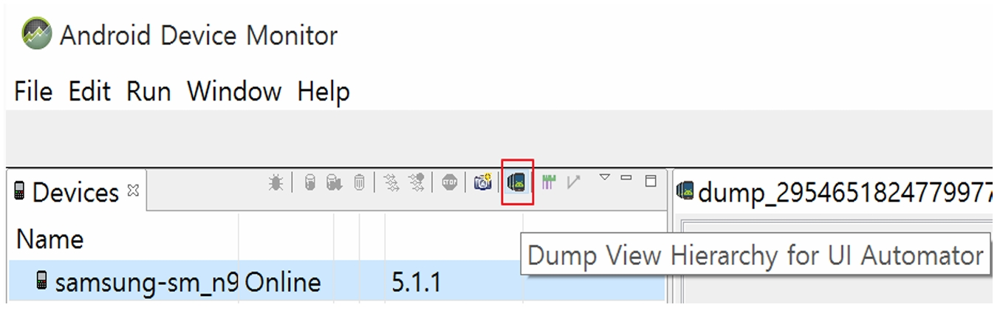
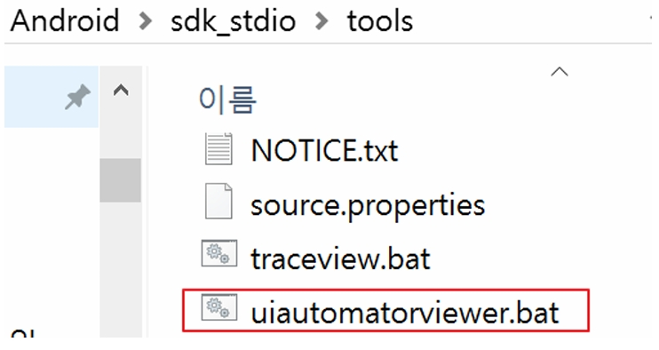
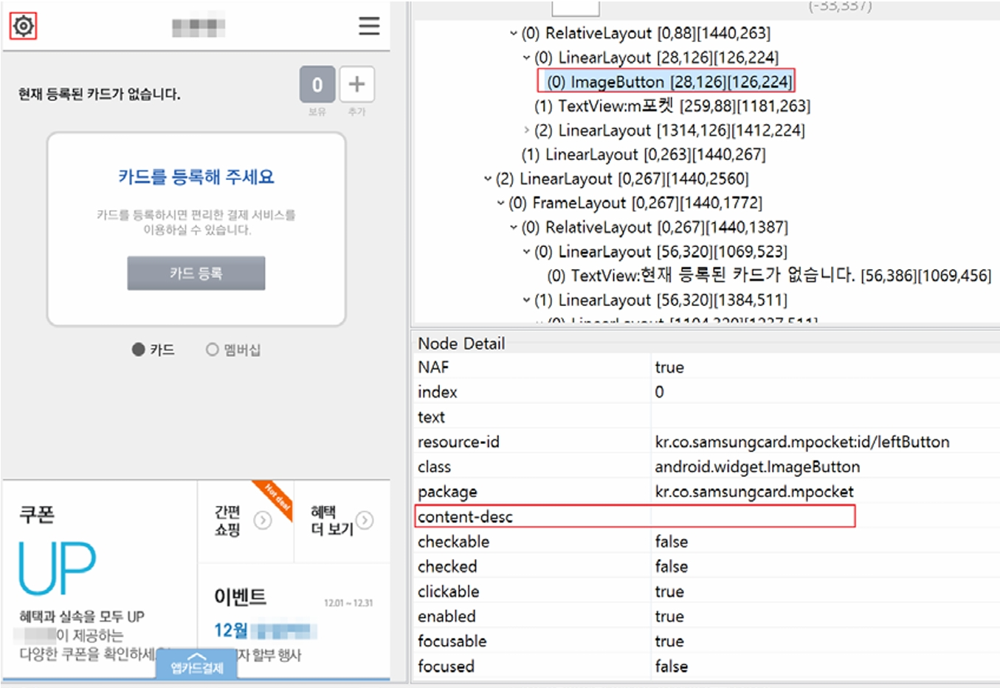
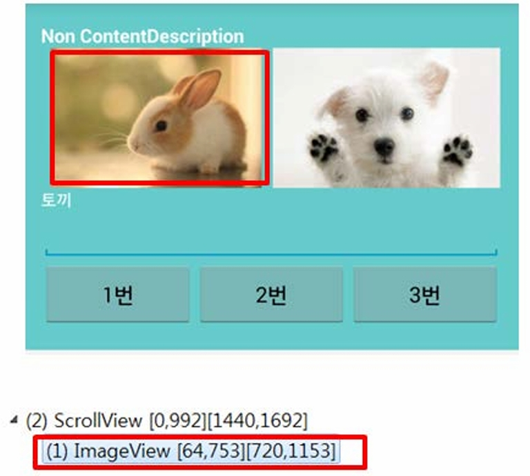
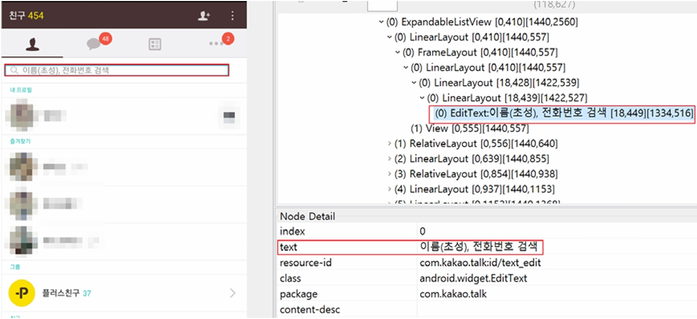
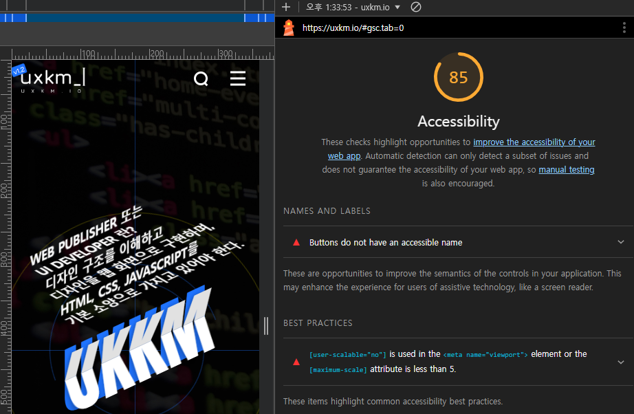
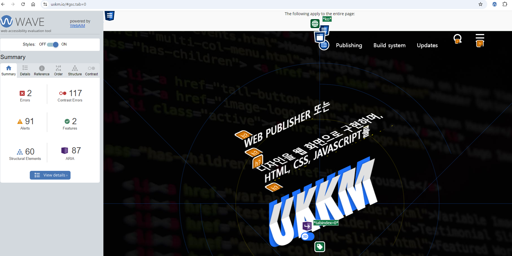
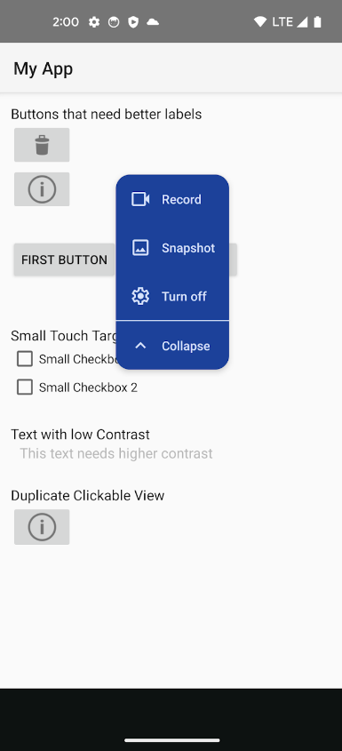
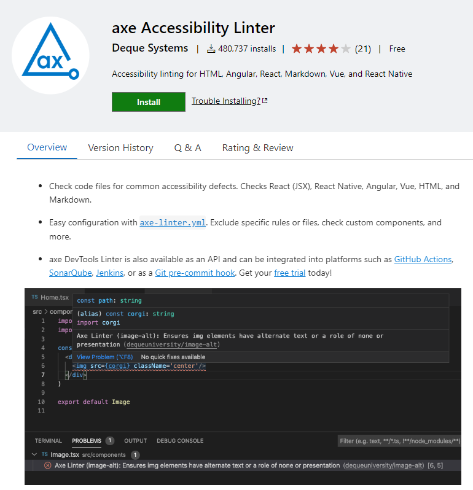

# 접근성 콘텐츠 제작 기법
> 접근성 콘텐츠 제작 기법은 모든 사용자, 특히 장애가 있는 사용자가 웹과 모바일 콘텐츠에 접근하고 사용할 수 있도록 보장하는 방법입니다. 이 기법은 웹 접근성 지침(WCAG: Web Content Accessibility Guidelines)과 모바일 접근성 표준을 따르는 것이 중요합니다. 각각의 영역에 대해 접근성 작업 시 도움이 될 수 있도록 작업되었습니다. 접근성은 법적 요구사항일 뿐만 아니라 사용자를 위한 기본적인 배려이기도 합니다.  

## 모바일 앱 접근성 콘텐츠 제작 기법   
> 사용자가 장애를 가지고 있거나 특정 기능적 제한을 겪는 경우에도 원활하게 모바일 앱을 이용할 수 있도록 하는 방법을 의미합니다. 이러한 접근성을 고려한 콘텐츠 제작은 다양한 사용자들의 요구를 충족시키며, 앱의 사용성을 크게 향상시킵니다.    

### 대체 텍스트 제공 (Alternative Text)
**관련 지침 : 텍스트가 아닌 콘텐츠는 대체 가능한 텍스트와 함께 제공되어야 한다.**   
대체 텍스트는 비 텍스트 콘텐츠를 설명하는 중요한 요소로, 접근성을 높이기 위해 필수적으로 제공되어야 합니다. 다양한 테스트 도구를 활용해 웹 및 모바일 앱에서 대체 텍스트를 포함한 접근성 요소를 철저히 점검하고, 사용자 경험을 개선할 수 있습니다. 접근성을 준수함으로써 모든 사용자에게 포용적인 디지털 환경을 제공합니다.   
[WCAG 2.2 Quick Reference - Non-text Content](https://www.w3.org/WAI/WCAG22/quickref/#non-text-content){: target="_blank"}

**키워드**   
#모바일 앱 접근성, #모바일 앱 접근성 콘텐츠 제작 기법, #WCAG2.2, #대체 텍스트, #비 텍스트 콘텐츠, #accessibilityLabel, #contentDescription, #보조기술과의호환성, #접근성 테스트 도구 활용 점검방법, #스크린 리더, #VoiceOver, #TalkBack, #UIAccessibility API #AccessibilityNodeInfo API, #Swift, #Kotlin, #네이티브 #하이브리드

#### 1. 필요성        
대체 텍스트는 이미지, 동영상, 아이콘 등 비 텍스트 콘텐츠의 의미를 텍스트로 설명하여, 시각 장애인이나 저시력 사용자가 스크린 리더를 통해 콘텐츠를 이해할 수 있도록 돕습니다. 이는 접근성을 보장하며, 웹 및 앱에서 모든 사용자가 동등하게 콘텐츠에 접근할 수 있게 합니다.   

#### 2. 대상       
- **시각 장애인**: 스크린 리더를 사용하는 사용자들.   
- **저시력 사용자**: 텍스트 크기 조정 및 색상 대비에 의존하는 사용자들.   
- **고령자**: 시력이 저하된 사용자들.   
- **인지 장애인**: 복잡한 비주얼 콘텐츠를 이해하는 데 어려움을 겪는 사용자들.   

#### 3. 체크리스트       
- **대체 텍스트 제공 여부**: 모든 비 텍스트 콘텐츠에 대체 텍스트가 제공되고 있는가?   
- **적절성**: 대체 텍스트가 콘텐츠의 의미를 정확하게 전달하고 있는가?   
- **중복 여부**: 같은 콘텐츠에 대해 중복된 대체 텍스트가 제공되고 있지 않은가?    
- **불필요한 정보 배제**: 장식용 이미지에 대체 텍스트가 불필요하게 포함되어 있지 않은가?     
- **스크린 리더 테스트**: 대체 텍스트가 스크린 리더에서 올바르게 읽히는가?     


#### 4. 기기별 테스트 방법      
**iOS**     
- **VoiceOver 활성화**: 설정 > 접근성 > VoiceOver를 활성화하여 대체 텍스트가 올바르게 읽히는지 테스트합니다.   
- **Accessibility Inspector 사용**: Xcode의 'Accessibility Inspector'를 통해 UI 요소의 대체 텍스트 적용 상태를 확인합니다.    
- [iPhone 사용 설명서 - VoiceOver](https://help.apple.com/iphone/11/?lang=ko#/iph3e2e415f){: target="_blank"}
   
**Android**   
- **TalkBack 활성화**: 설정 > 접근성 > TalkBack을 활성화하여 대체 텍스트가 적절하게 읽히는지 테스트합니다.    
- **Accessibility Scanner 사용**: Google Play에서 제공하는 'Accessibility Scanner' 앱을 사용하여 대체 텍스트의 적용 여부를 자동으로 탐지합니다.      
- [Android 접근성 고객센터 - TalkBack 및 Android](https://support.google.com/accessibility/android/topic/10601571?hl=ko&ref_topic=3529932&sjid=14261166623289476037-AP){: target="_blank"}

#### 5. QA 지표       
- **대체 텍스트 오류 비율**: 대체 텍스트가 누락되거나 부정확하게 제공된 UI 요소의 비율.   
- **스크린 리더 정확성**: 스크린 리더를 통해 올바르게 읽히는 대체 텍스트의 비율.   
- **사용자 피드백**: 실제 사용자 테스트를 통해 대체 텍스트의 적절성에 대한 피드백을 수집.   


#### 6. 개발방법       
**네이티브**     

- **iOS**    
  - [관련문서:Apple's Accessibility Programming Guide for iOS](https://developer.apple.com/accessibility/ios/){: target="_blank"}
  - **Interface Builder 이용하여 요소에 대체 텍스트 적용하는 방법**   
      - Xcode에서 Interface Builder를 열고, UI 요소를 선택합니다.    
      - 'Identity Inspector'의 'Accessibility' 섹션을 찾아 'Label' 필드에 대체 텍스트를 입력합니다.   
  - **UIAccessibility API를 활용하여 코드에 대체 텍스트 제공**    
  ```sh
  let imageView = UIImageView(image: UIImage(named: "sunrise.png"))
  imageView.accessibilityLabel = "A beautiful sunrise over the mountains"
  ```

- **Android**         
  - [관련문서:Android Accessibility Overview](https://developer.android.com/guide/topics/ui/accessibility){: target="_blank"}
  - **contentDescription 속성 사용**    
  ```sh
  <ImageView
      android:id="@+id/myImage"
      android:layout_width="wrap_content"
      android:layout_height="wrap_content"
      android:contentDescription="A beautiful sunrise over the mountains" />
  ```   
  - **코드에서 contentDescription 설정**    
  ```sh
  val myButton: Button = findViewById(R.id.my_button)
  myButton.contentDescription = "Submit"
  ```

- **하이브리드(html)**    
```sh

```
- **하이브리드(Vue)**    
```sh
<template>
  
</template>

<script>
export default {
  data() {
    return {
      sunriseImage: 'sunrise.png'
    };
  }
};
</script>
```
- **하이브리드(React)**    
```sh
import React from 'react';

function SunriseImage() {
  return ;
}

export default SunriseImage;
```


#### 7. 점검 기준     
텍스트가 아닌 콘텐츠에 해당 이미지가 제공하는 의미나 용도를 동일하게 인식할 수 있는 적절한 대체 텍스트를 제공한다.    

**오류유형**    
- 이미지 요소가 제공하는 정보와 동일한 정보가 음성으로 출력되지 않는 경우      
- 의미와 용도를 이해할 수 없는 대체 텍스트를 제공하는 경우     
- 의미없는 이미지에 대체텍스트를 제공하는 경우     
- 대체 텍스트 제공 없이 설명만 제공되는 경우(Hint로만 제공된 경우)     
- 객체 유형 정보가 반복 제공되는 경우 (~이미지이미지, ~버튼버튼 등)    
- 객체 유형에 대한 정보가 잘못 제공된 경우     
- display:none, visibility:hidden으로 대체텍스트가 제공된 경우     
- 화면에 보이지 않는 형태로 대체텍스트가 제공된 경우 (터치방식으로 대체정보 확인이 불가한 경우)       
   
**주의사항**     
- 기능을 제공하는 경우 이용방법 등 충분한 설명을 제공하지 않은 경우 (권고)     
- 숫자 정보에 대해 의미전달이 미흡한 대체텍스트를 제공하는 경우 (권고) : 준수예) 6.20 --> 6월20일     
- 권고) 객체 유형정보를 정확히 제공할 것을 권장함(Traits 정보)     
- IR기법으로 대체텍스트를 제공 시 hidden형태가 아니더라도 화면 터치방식으로는 대체정보 인지 불가함(오류)     

#### 8. 점검 방법     
**VoiceOver**         
- **음성출력 형태**: VoiceOver는 UI 요소의 accessibilityLabel을 읽어줍니다. 예를 들어, "Submit button"이라고 출력합니다.    
- **제공방법**: Xcode의 Interface Builder에서 Label 필드에 텍스트를 입력하거나, 코드에서 accessibilityLabel을 설정합니다.    

**TalkBack**    
- **음성출력 형태**: TalkBack은 contentDescription 속성에 설정된 텍스트를 읽어줍니다.    
- **제공방법**: Android Studio에서 XML의 contentDescription 속성을 사용하거나, 코드에서 직접 설정합니다.    

**방법 1 (네이티브-문서 제공기준)**     
TalkBack(또는 Voice Assistant 등) 기능으로 텍스트가 아닌 콘텐츠에 대응하는 대체 텍스트의 적절성 여부를 확인한다.    
- 화면 구성 정보를 제공하는지 확인한다. (Title, List View, Grid View)     
- 화면 내 구체적인 Contents를 읽어주는지 확인한다. (Text, Imge)     
- 화면 내 기능을 읽어주는지 확인한다. (Button 등)     
<figure aria-hidden="true" style="text-align:center;border:1px solid #000">
   
   
   <figcaption>이미지 출처 : 모바일 애플리케이션 접근성 제작기법</figcaption>
</figure>

**방법 2 (네이티브-문서 제공기준)**      
음성출력 표시 기능으로 텍스트가 아닌 콘텐츠에 대응하는 대체 텍스트의 적절성 여부를 점검한다.    
- 설정→접근성→시각→Talk Back→설정→개발자 설정→음성출력 표시 체크 후 확인한다.     
<figure aria-hidden="true" style="text-align:center;border:1px solid #000">
   
   <figcaption>이미지 출처 : 모바일 애플리케이션 접근성 제작기법</figcaption>
</figure>

**방법 3 (네이티브-문서 제공기준)**   
UIAutoMatorViewer를 활용하여 점검한다.     
- Android Studio를 이용한 실행방법     
  - Toolbar에서 Android Device Monitor 버튼을 선택    
    <figure aria-hidden="true" style="text-align:center;border:1px solid #000">
        
        <figcaption>이미지 출처 : 모바일 애플리케이션 접근성 제작기법</figcaption>
    </figure>
  - Devices 탭에서 디바이스가 연결된 상태로 점검할 화면을 띄운 뒤 Dump View Hierarchy for UI Automator버튼을 선택 
    <figure aria-hidden="true" style="text-align:center;border:1px solid #000">
        
        <figcaption>이미지 출처 : 모바일 애플리케이션 접근성 제작기법</figcaption>
    </figure>
- ADT(Android Developer Tools) 를 이용한 실행 방법     
  - DDMS(Dalvik Debug Monitor Server) 를 실행    
  - Devices 탭에서 디바이스가 연결된 상태로 점검할 화면을 띄운 뒤 Dump View Hierarchy for UI Automator버튼을 선택 
    <figure aria-hidden="true" style="text-align:center;border:1px solid #000">
        
        <figcaption>이미지 출처 : 모바일 애플리케이션 접근성 제작기법</figcaption>
    </figure>
- SDK 내부의UIAutomator Viewer 실행     
  - Android sdk폴더의 tools 안에있는 uiautomatorviewer.bat 파일실행 
    <figure aria-hidden="true" style="text-align:center;border:1px solid #000">
        
        <figcaption>이미지 출처 : 모바일 애플리케이션 접근성 제작기법</figcaption>
    </figure>
  - 실행화면 
    <figure aria-hidden="true" style="text-align:center;border:1px solid #000">
        
        <figcaption>이미지 출처 : 모바일 애플리케이션 접근성 제작기법</figcaption>
    </figure>
  - Device Screenshot 선택 
    <figure aria-hidden="true" style="text-align:center;border:1px solid #000">
        
        <figcaption>이미지 출처 : 모바일 애플리케이션 접근성 제작기법</figcaption>
    </figure>

**방법 4 (네이티브-문서 제공기준)**    
UIAutomatorViewer를 이용하여 점검한다.     
- 점검할 화면을 띄운다.    
- 점검할 UI객체를 선택하여 상세정보를 확인한다.     
    <figure aria-hidden="true" style="text-align:center;border:1px solid #000">
        
        <figcaption>이미지 출처 : 모바일 애플리케이션 접근성 제작기법</figcaption>
    </figure>
- ImageButton, ImageView의경우 content-desc항목이 적용되어있는지 확인해야 한다.     
  - 대체텍스트 적용 시 Node Detail과 계층구조의{ }안에 대체텍스트내용이 표시 된다. 
    <figure aria-hidden="true" style="text-align:center;border:1px solid #000">
        
        <figcaption>이미지 출처 : 모바일 애플리케이션 접근성 제작기법</figcaption>
    </figure>
  - 대체텍스트 미적용 시 Node Detai과 계층구조에 대체텍스트가 표시되지 않는다. 
    <figure aria-hidden="true" style="text-align:center;border:1px solid #000">
        
        <figcaption>이미지 출처 : 모바일 애플리케이션 접근성 제작기법</figcaption>
    </figure>     
- TextView, Button, EditText등의 경우 content-desc에 대체텍스트가 적용되지 않고 text에 대체텍스트가 적용될 수 있다.     
    <figure aria-hidden="true" style="text-align:center;border:1px solid #000">
        
        
        <figcaption>이미지 출처 : 모바일 애플리케이션 접근성 제작기법</figcaption>
    </figure>
    

**방법 5 (하이브리드)**    
크롬(Chrome) 브라우저 요소검사를 이용하여 점검한다.    
- 해당 이미지 요소를 선택하여 우측클릭하여 요소검사를 하여 코드로 확인.    
    <figure aria-hidden="true" style="text-align:center;border:1px solid #000">
        
        <figcaption>크롬(Chrome) 브라우저 이미지 요소검사</figcaption>
    </figure>
 

**주의사항**    
- 개발방법에 따라 연관된 타 UI 객체에 대체텍스트를 적용하고 있는경우가 있다. 이런경우엔 오류항목으로 볼 수 없다.     
- UIAutoMatorViewe 를 활용한 대체텍스트 확인은 다른 점검기법과 병행되어 사용하는 것이 바람직하다.     
    

#### 9. 준수 사례       


#### 10. 미준수 사례       


#### 11. 관련 영상       
<iframe style="width:100%;min-height:315px;" src="https://www.youtube.com/embed/eQHPJ4tk-ag?si=mMQd3txeiPLQc_4B" title="YouTube video player" frameborder="0" allow="accelerometer; autoplay; clipboard-write; encrypted-media; gyroscope; picture-in-picture; web-share" referrerpolicy="strict-origin-when-cross-origin" allowfullscreen></iframe>

[AOA11Y 모바일 앱 접근성 (1.대체 텍스트)](https://www.youtube.com/watch?v=eQHPJ4tk-ag){: target="_blank"}    
   


#### 12. 접근성 테스트 도구 활용 점검방법      
**Lighthouse**   
Lighthouse is an open-source, automated tool for improving the quality of web pages.    
Lighthouse는 구글에서 제공하는 웹 페이지 품질 개선을 위한 오픈 소스로 자동화 도구입니다. Lighthouse는 사이트의 성능, 접근성, SEO 등에 대한 전반적인 진단을 해줍니다.    
상세 설명 [Lighthouse Overview 공식 문서 참조](https://developer.chrome.com/docs/lighthouse/overview/){: target="_blank"}  

- **참고** 
  - Lighthouse 모바일의 경우 네트워크 속도를 최대 4배정도 느리게 측정하기 때문에 모바일 Performance가 비교적 낮게 나옵니다.    
  - Metric 별로 어떤 성능 점수가 나는지 Lighthouse 계산기를 통해서 자세히 확인할 수 있습니다.    
- **카테고리가 측정하는 내용**    
  - **Performance** : 웹 페이지의 로딩 속도 등 실제 성능을 측정. 성능의 측정항목은 6가지 Metric으로 정의되며, 각 Metric들은 페이지가 로드되는 속도를 다양한 측면에서 측정합니다.  자세한 설명은 [Lighthouse Performance Audits 문서](https://developer.chrome.com/docs/lighthouse/performance/){: target="_blank"}에서 확인.     
  - **Best practices** : Best practices를 따라 개발되었는지 확인   
  - **Accessibility** : 접근성 확인. 폰트 사이즈, 메뉴간 간격 등을 측정   
  - **Progressive Web App (PWA)** : 웹과 네이티브 앱의 기능 모두의 이점을 가지도록 만들어진 서비스인지 체크   
  - **SEO** : Search Engine Optimization의 약자로 검색 엔진 수집 최적화 측정    
- **사용법**    
    1. Google Chrome에서 웹 페이지를 엽니다.    
    2. DevTools (F12)를 열고 'Lighthouse' 탭을 선택합니다. (단축키 맥:Cmd⌘+Option⌥+I / 윈도우:Ctrl+Shift+I)     
    3. 'Accessibility' 항목을 선택하고 우측 상단의 'Analyze page load'를 클릭하여 보고서를 생성합니다.    
    <figure aria-hidden="true" style="text-align:center;border:1px solid #000">
      
      <figcaption>Lighthouse를 활용한 검사</figcaption>
    </figure>
    4. Lighthouse는 접근성 점수와 함께 개선이 필요한 부분을 제시합니다.    
    <figure aria-hidden="true" style="text-align:center;border:1px solid #000">
      
      <figcaption>Lighthouse를 활용한 검사</figcaption>
    </figure>
   
**WAVE**    
WAVE는 WebAIM에서 만든 확장 프로그램으로 현재 화면의 각 요소가 접근성을 준수하는지 평가합니다. 각 요소가 위반한 내용에 대한 이유와 해결 방법을 제시하여 접근성을 준수하는 개발을 쉽게 할 수 있도록 돕습니다.    

- **사용법**        
    1. Chrome 브라우저에서 WAVE 확장 프로그램을 설치합니다.   
    <figure aria-hidden="true" style="text-align:center;border:1px solid #000">
      
      <figcaption>WAVE를 활용한 검사</figcaption>
    </figure>
    2. 페이지를 열고 WAVE 확장 프로그램을 실행하여 분석을 시작합니다.   
    <figure aria-hidden="true" style="text-align:center;border:1px solid #000">
      
      <figcaption>WAVE를 활용한 검사</figcaption>
    </figure>
    3. WAVE 페이지에서 발견된 접근성 문제를 제시합니다.   
    <figure aria-hidden="true" style="text-align:center;border:1px solid #000">
      
      <figcaption>WAVE를 활용한 검사</figcaption>
    </figure>
   
**Accessibility Scanner (Android)**    
Accessibility Scanner는 Android 기기에서 접근성 문제를 탐지하는 Google Play의 앱입니다.    

- **사용법**    
    1. Android 기기에 Accessibility Scanner 앱을 설치합니다.   
    <figure aria-hidden="true" style="text-align:center;border:1px solid #000">
      
      <figcaption>Accessibility Tree 활용한 검사</figcaption>
    </figure>
    2. 앱을 실행하고 분석하려는 화면에서 스캔을 시작합니다.   
    3. 앱은 화면에서 발견된 접근성 문제를 보고하고 개선 방법을 제시합니다.   
 
   
**접근성 트리 뷰(Accessibility Tree)**    
스크린 리더와 같은 보조 기술은 크로미움의 접근성 API를 사용해 웹콘텐츠와 상호 작용합니다. 접근성 API의 기본 모델은 접근성 트리입니다. 접근성 객체의 트리를 통해 보조 기술은 각 속성과 실제 속성값을 탐색하고 필요한 작업을 수행할 수 있습니다. 웹 개발자는 주로 HTML에서 ARIA 속성과 같은 DOM 속성값을 통해 접근성 트리를 만들고 이를 다룹니다.    
크롬 개발자 도구에서는 개발자에게 콘텐츠가 보조 기술에 어떤 식으로 전달되는지 이해할 수 있게 접근성 창을 제공하고 있습니다. DOM 트리 뷰어에서 노드를 선택하면 해당하는 접근성 노드의 속성 정보가 상위 노드, 직계 자식 노드와 함께 창에 표시됩니다.    
<figure aria-hidden="true" style="text-align:center;border:1px solid #000">
    
    <figcaption>Accessibility Tree 활용한 검사</figcaption>
</figure>

- **사용법**        
    1. 개발자 도구에서 Elements 항목을 선택하고 오른쪽 창에서 Accessibility를 선택하면 "Enable full-page accessibility tree" 항목을 체크   
    <figure aria-hidden="true" style="text-align:center;border:1px solid #000">
      
      <figcaption>Accessibility Tree 활용한 검사</figcaption>
    </figure>
    2. 해당 노드 선택 후 검사   
    <figure aria-hidden="true" style="text-align:center;border:1px solid #000">
      
      <figcaption>Accessibility Tree 활용한 검사</figcaption>
    </figure>    
     
**Accessibility Scanner (Android)**    
Accessibility Scanner는 Android 기기에서 접근성 문제를 탐지하는 Google Play의 앱입니다.    

- **사용법**    
    1. Android 기기에 Accessibility Scanner 앱을 설치합니다.   
    <figure aria-hidden="true" style="text-align:center;border:1px solid #000">
      
      <figcaption>Accessibility Tree 활용한 검사</figcaption>
    </figure>

    2. 앱을 실행하고 분석하려는 화면에서 스캔을 시작합니다.   
    <figure aria-hidden="true" style="text-align:center;border:1px solid #000">
      
      <figcaption>Accessibility Tree 활용한 검사</figcaption>
    </figure>

    3. 앱은 화면에서 발견된 접근성 문제를 보고하고 개선 방법을 제시합니다.   
    <figure aria-hidden="true" style="text-align:center;border:1px solid #000">
      
      
      <figcaption>Accessibility Tree 활용한 검사</figcaption>
    </figure>
 
   
**VSCode 확장 접근성 검사(axe Accessibility Linter)**    
VSCode 사용 시 별도 확장 설치 후 소스 코드에서 잘못 작성된 부분을 사전에 감지하여 수정할 수 있습니다.    
<figure aria-hidden="true" style="text-align:center;border:1px solid #000">
  
  <figcaption>VS Code extensions axe Accessibility Linter</figcaption>
</figure>
 
   
**eslint-plugin-jsx-a11y(ReactJS + ESLint)**    
접근성 오류 부분이 있는지 분석해 주는 플러그인이며 서비스 개발 환경이 React라면 실시간으로 JSX 요소에 대한 접근성 규칙을 확인하고 준수할 수 있도록 돕는 패키지를 설치해 개발할 수 있습니다. 기본적으로 추천되는 규칙 외에 예외로 사용하고 싶은 부분이 있다면 같이 서비스를 개발하는 개발자들과 협의하면서 lint 규칙을 만들어가다 보면 접근성을 준수하는 서비스 개발에 도움이 될 것입니다.    
[규칙 상세 설명 : jsx-eslint/eslint-plugin-jsx-a11y](https://github.com/jsx-eslint/eslint-plugin-jsx-a11y){: target="_blank"}  


**사용법**   
- eslint를 전역 설치했다면, eslint-plugin-jsx-a11y 플러그인도 전역으로 설치.  
```sh
npm install eslint-plugin-jsx-a11y
// 또는
yarn add eslint-plugin-jsx-a11y
``` 
- .eslintrc.json 파일에 다음과 같이 추가한다.   
```sh
{
  "extends": "plugin:jsx-a11y/recommended",
  "plugins": "jsx-a11y",
  "rules": {
    "jsx-a11y/aria-role": [
      "error",
      {
        "allowedInvalidRoles": ["text"],
        "ignoreNonDOM": true
      }
    ]
  }
}
```
 
#### 13. 결론     
**접근성은 시작은 있지만 끝이 없는 작업입니다.**    
오류 항목을 정기적으로 점검하여 접근성 개선을 한다면 점차 검사를 할 항목이 줄어들게 될 것입니다. 모두가 차별 없이 서비스를 이용할 수 있도록 접근성 유지를 위한 모두의 노력이 필요합니다. 무엇보다 접근성 작업은 서비스를 제공한다면 **선택이 아닌 필수**로 지켜야하는 항목임을 잊지 말아야 합니다.     

**접근성 작업 시 점검 필수사항**    
- 접근성 가이드(WCAG, KWCAG, WAI-ARIA) 내용 숙지    
- 접근성 체크리스트 작성    
- 접근성 자동 및 수동 검사(스크린리더) 진행       
- 접근성 검사 툴(Lighthouse Accessibility 등) 활용 오류 항목 개선 및 내용 정리     
- 접근성 사용자 테스트    
- 접근성 정기적인 모니터링    


---


**자막, 수화 등의 제공**   
   - 영상이나 음성 콘텐츠에는 동등한 내용의 자막, 원고 또는 수화가 제공되어야 한다.   
   
**색에 무관한 인식**   
   - 화면에 표시되는 모든 정보는 색에 관계없이 인식될 수 있어야 한다.      
   
**명도 대비**   
   - 화면에 표시되는 모든 사용자 인터페이스 컴포넌트와 텍스트는 전경색과 배경색이 구분될 수 있도록 제공되어야 한다.      
   
**명확한 지시 사항**    
   - 지시 사항은 모양, 크기, 위치, 방향, 색, 소리 등에 관계없이 인식될 수 있어야 한다.       
   
**알림 기능**    
   - 알림 정보는 화면 표시, 소리, 진동 등 다양한 방법으로 제공되어야 한다.       
   
**초점**     
   - 의미나 기능을 갖는 모든 사용자 인터페이스 컴포넌트에는 초점(focus)이 적용되고, 초점은 논리적인 순서로 이동되어야 한다.       
   
**누르기 동작 지원**     
   - 터치(touch) 기반 모바일 기기의 모든 컨트롤은 누르기 동작으로 제어할 수 있어야 한다.       
   
**응답 시간 조절**     
    - 시간 제한이 있는 콘텐츠는 응답 시간을 조절할 수 있어야 한다.       
   
**정지 기능 제공**     
    - 자동으로 변경되는 콘텐츠는 움직임을 제어할 수 있어야 한다.       
   
**컨트롤의 크기와 간격**     
    - 컨트롤은 충분한 크기와 간격으로 제공되어야 한다.       
   
**입력 도움**     
    - 입력 서식 이용 시, 입력 오류를 방지하거나 정정할 수 있는 방법을 제공해야 한다.       
   
**사용자 인터페이스의 일관성**     
    - 사용자 인터페이스 컴포넌트들은 일관성 있게 배치되어야 한다.       
   
**깜박거림의 사용 제한**     
    - 깜빡이거나 번쩍이는 콘텐츠를 제공하지 않아야 한다.       
   
**자동재생 금지**     
    - 자동으로 재생되는 배경음을 사용하지 않아야 한다.       
   
**예측가능성**     
    - 사용자가 의도하지 않는 화면 전환이나 이벤트 등이 실행되는 경우 사용자가 이해할 수 있는 방법으로 제공되어야 한다.       
   
**폰트 관련 기능의 활용**     
    - 텍스트 콘텐츠는 운영체제에서 제공하는 폰트 관련 기능을 활용할 수 있는 방법을 제공해야 한다.       
   
**보조 기술과의 호환성**     
    - 사용자 인터페이스 컴포넌트는 보조 기술을 이용하여 사용할 수 있도록 해야 한다.       
   


### 참조    
- [W3C Mobile Accessibility at W3C](https://www.w3.org/WAI/standards-guidelines/mobile/){: target="_blank"}    
- [W3C Mobile Accessibility: How WCAG 2.0 and Other W3C/WAI Guidelines Apply to Mobile](https://www.w3.org/TR/mobile-accessibility-mapping/){: target="_blank"}    
- [W3C First Public Working Draft](https://www.w3.org/news/2015/first-public-working-draft-performance-timeline-level-2/){: target="_blank"}   
- [W3C User Agent Accessibility Guidelines (UAAG) 2.0](https://www.w3.org/TR/UAAG20/){: target="_blank"}    
- [W3C Mobile Accessibility Examples from UAAG 2.0 Reference](https://www.w3.org/TR/IMPLEMENTING-UAAG20/mobile.html){: target="_blank"}    
- [MDN Mobile accessibility checklist](https://developer.mozilla.org/en-US/docs/Web/Accessibility/Mobile_accessibility_checklist){: target="_blank"}    
- [보건복지부 블로그](https://blog.naver.com/prologue/PrologueList.naver?blogId=mohw2016){: target="_blank"}     
- [행정안전부 - 전자정부 웹사이트 UI UX 가이드라인](https://www.mois.go.kr/frt/bbs/type001/commonSelectBoardArticle.do?bbsId=BBSMSTR_000000000045&nttId=69451){: target="_blank"}     
