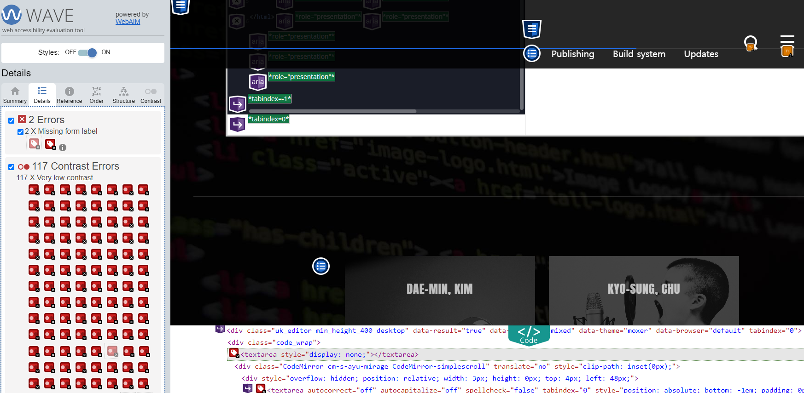
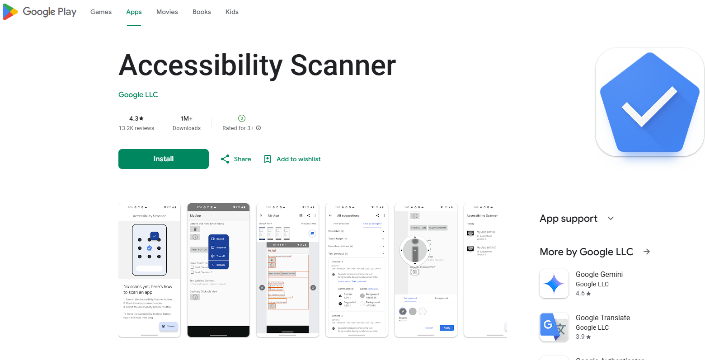

# 접근성 콘텐츠 제작 기법
> 접근성 콘텐츠 제작 기법은 모든 사용자, 특히 장애가 있는 사용자가 웹과 모바일 콘텐츠에 접근하고 사용할 수 있도록 보장하는 방법입니다. 이 기법은 웹 접근성 지침(WCAG: Web Content Accessibility Guidelines)과 모바일 접근성 표준을 따르는 것이 중요합니다. 각각의 영역에 대해 접근성 작업 시 도움이 될 수 있도록 작업되었습니다. 접근성은 법적 요구사항일 뿐만 아니라 사용자를 위한 기본적인 배려이기도 합니다.  

## 모바일 앱 접근성 콘텐츠 제작 기법   
> 사용자가 장애를 가지고 있거나 특정 기능적 제한을 겪는 경우에도 원활하게 모바일 앱을 이용할 수 있도록 하는 방법을 의미합니다. 이러한 접근성을 고려한 콘텐츠 제작은 다양한 사용자들의 요구를 충족시키며, 앱의 사용성을 크게 향상시킵니다.    
     
   
### 응답 시간 조절
**관련 지침 : 시간 제한이 있는 콘텐츠는 응답 시간을 조절할 수 있어야 한다.**   
응답 시간 조절 기능을 제공함으로써 사용자는 콘텐츠에 필요한 만큼의 시간을 확보할 수 있고, 특히 접근성이 필요한 사용자에게 필수적인 유연성을 제공합니다. 이러한 방법으로 모든 사용자에게 시간을 조절할 수 있는 옵션을 제공하여 접근성을 높일 수 있습니다.   
[WCAG 2.2 Quick Reference - Timeouts](https://www.w3.org/WAI/WCAG22/quickref/#timeouts){: target="_blank"}

**키워드**   
#모바일 앱 접근성, #모바일 앱 접근성 콘텐츠 제작 기법, #WCAG2.2, #응답 시간 조절, #시간 제한, #사용자 제어, #타이머 설정, #시간 연장, #인지 장애 사용자, #운동 장애 사용자

#### 1. 필요성        

응답 시간을 조절할 수 있는 기능은 사용자에게 여러 가지 이점을 제공합니다.    

- **사용자 경험 개선**: 사용자가 충분히 콘텐츠를 읽고 이해할 시간을 확보할 수 있어 만족도가 높아집니다.    
- **모든 사용자 지원**: 물리적 또는 인지적 한계가 있는 사용자는 시간을 더 필요로 할 수 있습니다.    
- **접근성 향상**: 다양한 속도로 콘텐츠를 이용하는 사용자가 자신의 필요에 맞는 속도로 작업을 완료할 수 있습니다.    

#### 2. 대상       

- **인지 장애 사용자**: 시간 제한이 빠르면 정보를 처리하기 어려운 사용자.    
- **운동 장애 사용자**: 조작 속도가 느려 시간 제한이 있는 작업을 어려워하는 사용자.    
- **일반 사용자**: 예기치 못한 상황으로 인해 제한 시간을 늘리고 싶은 사용자에게도 유용합니다.    

#### 3. 체크리스트       

- **시간 연장 옵션 제공**: 시간 제한이 있는 작업을 수행할 때 시간을 연장할 수 있는 옵션을 제공합니다.    
- **자동 갱신 제한**: 자동으로 시간이 갱신되지 않도록 설정하고, 사용자가 시간을 직접 조절할 수 있도록 합니다.    
- **타이머 경고 제공**: 시간 제한이 임박했을 때 사용자에게 알림을 제공합니다.    
- **시간 연장 방법의 다양성**: 사용자 선택에 따라 다양한 방식(추가 버튼 클릭, 자동 연장 등)으로 시간을 연장할 수 있도록 합니다.    

#### 4. 기기별 테스트 방법      

- **iOS**: 시간 연장 기능이 VoiceOver로 제대로 인식되고, 연장 버튼이 터치로 접근 가능한지 확인합니다.    
- **Android**: TalkBack을 사용하여 시간 연장 기능이 시각적 또는 음성으로 사용자에게 충분히 제공되는지 테스트합니다.    
- **웹 및 하이브리드 앱(HTML, Vue, React)**: 여러 브라우저와 장치에서 시간 제한이 있는 콘텐츠를 테스트하고, 응답 시간을 쉽게 조절할 수 있는지 확인합니다.    

#### 5. QA 지표       

- **시간 연장 가능 여부**: 사용자 요청에 따라 시간 제한을 연장할 수 있는지 확인합니다.    
- **경고 제공 여부**: 시간 제한이 임박했을 때 사용자에게 경고가 제공되는지 확인합니다.    
- **사용자 만족도**: 사용자에게 시간 조절 기능이 적절하게 제공되었는지 평가합니다.     

#### 6. 개발방법     

**iOS (Swift)**    

- 타이머 기능 구현 및 시간 연장 버튼 제공    

```sh
import UIKit

class ViewController: UIViewController {
    var timer: Timer?
    var timeLeft = 30 // 제한 시간 설정 (예: 30초)

    override func viewDidLoad() {
        super.viewDidLoad()
        startTimer()
    }

    func startTimer() {
        timer = Timer.scheduledTimer(withTimeInterval: 1.0, repeats: true) { timer in
            self.timeLeft -= 1
            if self.timeLeft == 0 {
                timer.invalidate()
                self.showTimeExpiredAlert()
            }
        }
    }

    func showTimeExpiredAlert() {
        let alert = UIAlertController(title: "시간 초과", message: "시간을 연장하시겠습니까?", preferredStyle: .alert)
        alert.addAction(UIAlertAction(title: "연장", style: .default) { _ in
            self.timeLeft = 30 // 시간 연장
            self.startTimer()
        })
        alert.addAction(UIAlertAction(title: "취소", style: .cancel, handler: nil))
        present(alert, animated: true, completion: nil)
    }
}
```

**Android (Kotlin)**    

- CountDownTimer 및 시간 연장 다이얼로그 구현    

```sh
import android.os.Bundle
import android.os.CountDownTimer
import android.widget.Toast
import androidx.appcompat.app.AlertDialog
import androidx.appcompat.app.AppCompatActivity

class MainActivity : AppCompatActivity() {
    private var timeLeftInMillis: Long = 30000 // 30초 제한 시간 설정
    private lateinit var countDownTimer: CountDownTimer

    override fun onCreate(savedInstanceState: Bundle?) {
        super.onCreate(savedInstanceState)
        setContentView(R.layout.activity_main)
        startTimer()
    }

    private fun startTimer() {
        countDownTimer = object : CountDownTimer(timeLeftInMillis, 1000) {
            override fun onTick(millisUntilFinished: Long) {
                timeLeftInMillis = millisUntilFinished
            }

            override fun onFinish() {
                showTimeExpiredDialog()
            }
        }.start()
    }

    private fun showTimeExpiredDialog() {
        AlertDialog.Builder(this)
            .setTitle("시간 초과")
            .setMessage("시간을 연장하시겠습니까?")
            .setPositiveButton("연장") { _, _ ->
                timeLeftInMillis = 30000 // 시간 연장
                startTimer()
            }
            .setNegativeButton("취소", null)
            .show()
    }
}
```

**HTML**    

- 타이머 기능 및 시간 연장 대화상자 제공    

```sh
<div id="timer">남은 시간: 30초</div>
<button id="extendButton" style="display: none;" onclick="extendTime()">시간 연장</button>

<script>
  let timeLeft = 30;
  let timerInterval = setInterval(updateTimer, 1000);

  function updateTimer() {
    document.getElementById("timer").textContent = `남은 시간: ${timeLeft}초`;
    if (timeLeft <= 0) {
      clearInterval(timerInterval);
      showExtendDialog();
    } else {
      timeLeft--;
    }
  }

  function showExtendDialog() {
    if (confirm("시간을 연장하시겠습니까?")) {
      extendTime();
    }
  }

  function extendTime() {
    timeLeft = 30;
    timerInterval = setInterval(updateTimer, 1000);
  }
</script>
```

**Vue.js**    

- 타이머 및 시간 연장 구현    

```sh
<template>
  <div>
    <p>남은 시간: {{ timeLeft }}초</p>
    <button v-if="timeLeft === 0" @click="extendTime">시간 연장</button>
  </div>
</template>

<script>
export default {
  data() {
    return {
      timeLeft: 30,
      timer: null,
    };
  },
  mounted() {
    this.startTimer();
  },
  methods: {
    startTimer() {
      this.timer = setInterval(() => {
        if (this.timeLeft > 0) {
          this.timeLeft--;
        } else {
          clearInterval(this.timer);
          if (confirm("시간을 연장하시겠습니까?")) {
            this.extendTime();
          }
        }
      }, 1000);
    },
    extendTime() {
      this.timeLeft = 30;
      this.startTimer();
    },
  },
};
</script>
```

**React**    

- 타이머 및 시간 연장 구현    

```sh
import React, { useEffect, useState } from 'react';

function App() {
  const [timeLeft, setTimeLeft] = useState(30);

  useEffect(() => {
    const timer = setInterval(() => {
      setTimeLeft((prevTime) => (prevTime > 0 ? prevTime - 1 : prevTime));
    }, 1000);
    
    if (timeLeft === 0) {
      clearInterval(timer);
      if (window.confirm("시간을 연장하시겠습니까?")) {
        extendTime();
      }
    }
    
    return () => clearInterval(timer);
  }, [timeLeft]);

  const extendTime = () => setTimeLeft(30);

  return (
    <div>
      <p>남은 시간: {timeLeft}초</p>
      {timeLeft === 0 && <button onClick={extendTime}>시간 연장</button>}
    </div>
  );
}

export default App;
```

#### 7. 점검 기준    

- **시간 연장 기능 확인**: 시간 제한이 있는 콘텐츠에 대해 연장 기능이 제공되는지 확인합니다.    
- **경고 제공 여부**: 시간 제한이 임박했을 때 사용자에게 경고가 제공되는지 점검합니다.    
- **사용자 제어 기능**: 시간 연장 방식이 사용자에게 제어할 수 있는 방식으로 제공되는지 확인합니다.    

#### 8. 점검 방법     

- **자동화 도구**: 접근성 검사 도구로 시간 연장 기능이 제대로 작동하는지 확인합니다.    
- **수동 점검**: 타이머가 설정된 콘텐츠에서 시간 연장 기능이 적절하게 제공되는지 직접 테스트합니다.    
- **사용자 테스트**: 사용자 피드백을 통해 시간 조절 기능이 충분히 이해되고 적절히 제공되는지 확인합니다.    

#### 9. 준수 사례       

- **타이머 설정 및 시간 연장 기능 제공**: 사용자가 필요한 경우 시간을 연장할 수 있는 옵션이 있는 타이머 기능.    
- **명확한 경고 제공**: 시간 제한이 임박했을 때 사용자에게 시각적 또는 청각적 경고를 제공하여 충분히 준비할 시간을 주는 사례.    

#### 10. 미준수 사례       

- **시간 연장 옵션 미제공**: 사용자가 요청할 수 있는 시간 연장 기능이 없이 자동으로 제한 시간이 종료되는 경우.    
- **경고 미제공**: 시간 제한이 임박했음에도 사용자에게 알림이나 경고가 제공되지 않아 제한 시간이 종료되는 경우.     

#### 11. 관련 영상       
<iframe style="width:100%;min-height:315px;" src="https://www.youtube.com/embed/erHH3hX9OgI?si=SsARKrXEhpO8ZoiJ" title="YouTube video player" frameborder="0" allow="accelerometer; autoplay; clipboard-write; encrypted-media; gyroscope; picture-in-picture; web-share" referrerpolicy="strict-origin-when-cross-origin" allowfullscreen></iframe>

[NULI 모바일 앱 접근성 (9. 응답시간조절)](https://www.youtube.com/embed/erHH3hX9OgI?si=SsARKrXEhpO8ZoiJ){: target="_blank"}    
   
---
<details>
<summary><strong style="font-size:20px;cursor:pointer;">접근성 테스트 도구 활용 점검방법</strong></summary>
<div markdown="1">

**Lighthouse**   
Lighthouse is an open-source, automated tool for improving the quality of web pages.    
Lighthouse는 구글에서 제공하는 웹 페이지 품질 개선을 위한 오픈 소스로 자동화 도구입니다. Lighthouse는 사이트의 성능, 접근성, SEO 등에 대한 전반적인 진단을 해줍니다.    
상세 설명 [Lighthouse Overview 공식 문서 참조](https://developer.chrome.com/docs/lighthouse/overview/){: target="_blank"}  


- **참고** 
  - Lighthouse 모바일의 경우 네트워크 속도를 최대 4배정도 느리게 측정하기 때문에 모바일 Performance가 비교적 낮게 나옵니다.    
  - Metric 별로 어떤 성능 점수가 나는지 Lighthouse 계산기를 통해서 자세히 확인할 수 있습니다.    
- **카테고리가 측정하는 내용**    
  - **Performance** : 웹 페이지의 로딩 속도 등 실제 성능을 측정. 성능의 측정항목은 6가지 Metric으로 정의되며, 각 Metric들은 페이지가 로드되는 속도를 다양한 측면에서 측정합니다.  자세한 설명은 [Lighthouse Performance Audits 문서](https://developer.chrome.com/docs/lighthouse/performance/){: target="_blank"}에서 확인.     
  - **Best practices** : Best practices를 따라 개발되었는지 확인   
  - **Accessibility** : 접근성 확인. 폰트 사이즈, 메뉴간 간격 등을 측정   
  - **Progressive Web App (PWA)** : 웹과 네이티브 앱의 기능 모두의 이점을 가지도록 만들어진 서비스인지 체크   
  - **SEO** : Search Engine Optimization의 약자로 검색 엔진 수집 최적화 측정    
- **사용법**    
    1. Google Chrome에서 웹 페이지를 엽니다.    
    2. DevTools (F12)를 열고 'Lighthouse' 탭을 선택합니다. (단축키 맥:Cmd⌘+Option⌥+I / 윈도우:Ctrl+Shift+I)     
    3. 'Accessibility' 항목을 선택하고 우측 상단의 'Analyze page load'를 클릭하여 보고서를 생성합니다.    
    <figure aria-hidden="true" style="text-align:center;border:1px solid #000">
      
      <figcaption>Lighthouse를 활용한 검사</figcaption>
    </figure>
    4. Lighthouse는 접근성 점수와 함께 개선이 필요한 부분을 제시합니다.    
    <figure aria-hidden="true" style="text-align:center;border:1px solid #000">
      
      <figcaption>Lighthouse를 활용한 검사</figcaption>
    </figure>
   
**WAVE**    
WAVE는 WebAIM에서 만든 확장 프로그램으로 현재 화면의 각 요소가 접근성을 준수하는지 평가합니다. 각 요소가 위반한 내용에 대한 이유와 해결 방법을 제시하여 접근성을 준수하는 개발을 쉽게 할 수 있도록 돕습니다.    

- **사용법**        
    1. Chrome 브라우저에서 WAVE 확장 프로그램을 설치합니다.   
    <figure aria-hidden="true" style="text-align:center;border:1px solid #000">
      
      <figcaption>WAVE를 활용한 검사</figcaption>
    </figure>
    2. 페이지를 열고 WAVE 확장 프로그램을 실행하여 분석을 시작합니다.   
    <figure aria-hidden="true" style="text-align:center;border:1px solid #000">
      
      <figcaption>WAVE를 활용한 검사</figcaption>
    </figure>
    3. WAVE 페이지에서 발견된 접근성 문제를 제시합니다.   
    <figure aria-hidden="true" style="text-align:center;border:1px solid #000">
      
      <figcaption>WAVE를 활용한 검사</figcaption>
    </figure>
   
**Accessibility Scanner (Android)**    
Accessibility Scanner는 Android 기기에서 접근성 문제를 탐지하는 Google Play의 앱입니다.    

- **사용법**    
    1. Android 기기에 Accessibility Scanner 앱을 설치합니다.   
    <figure aria-hidden="true" style="text-align:center;border:1px solid #000">
      
      <figcaption>Accessibility Tree 활용한 검사</figcaption>
    </figure>
    2. 앱을 실행하고 분석하려는 화면에서 스캔을 시작합니다.   
    3. 앱은 화면에서 발견된 접근성 문제를 보고하고 개선 방법을 제시합니다.   
 
   
**접근성 트리 뷰(Accessibility Tree)**    
스크린 리더와 같은 보조 기술은 크로미움의 접근성 API를 사용해 웹콘텐츠와 상호 작용합니다. 접근성 API의 기본 모델은 접근성 트리입니다. 접근성 객체의 트리를 통해 보조 기술은 각 속성과 실제 속성값을 탐색하고 필요한 작업을 수행할 수 있습니다. 웹 개발자는 주로 HTML에서 ARIA 속성과 같은 DOM 속성값을 통해 접근성 트리를 만들고 이를 다룹니다.    
크롬 개발자 도구에서는 개발자에게 콘텐츠가 보조 기술에 어떤 식으로 전달되는지 이해할 수 있게 접근성 창을 제공하고 있습니다. DOM 트리 뷰어에서 노드를 선택하면 해당하는 접근성 노드의 속성 정보가 상위 노드, 직계 자식 노드와 함께 창에 표시됩니다.    
<figure aria-hidden="true" style="text-align:center;border:1px solid #000">
    
    <figcaption>Accessibility Tree 활용한 검사</figcaption>
</figure>

- **사용법**        
    1. 개발자 도구에서 Elements 항목을 선택하고 오른쪽 창에서 Accessibility를 선택하면 "Enable full-page accessibility tree" 항목을 체크   
    <figure aria-hidden="true" style="text-align:center;border:1px solid #000">
      
      <figcaption>Accessibility Tree 활용한 검사</figcaption>
    </figure>
    2. 해당 노드 선택 후 검사   
    <figure aria-hidden="true" style="text-align:center;border:1px solid #000">
      
      <figcaption>Accessibility Tree 활용한 검사</figcaption>
    </figure>    
     
**Accessibility Scanner (Android)**    
Accessibility Scanner는 Android 기기에서 접근성 문제를 탐지하는 Google Play의 앱입니다.    

- **사용법**    
    1. Android 기기에 Accessibility Scanner 앱을 설치합니다.   
    <figure aria-hidden="true" style="text-align:center;border:1px solid #000">
      
      <figcaption>Accessibility Tree 활용한 검사</figcaption>
    </figure>

    2. 앱을 실행하고 분석하려는 화면에서 스캔을 시작합니다.   
    <figure aria-hidden="true" style="text-align:center;border:1px solid #000">
      
      <figcaption>Accessibility Tree 활용한 검사</figcaption>
    </figure>

    3. 앱은 화면에서 발견된 접근성 문제를 보고하고 개선 방법을 제시합니다.   
    <figure aria-hidden="true" style="text-align:center;border:1px solid #000">
      
      
      <figcaption>Accessibility Tree 활용한 검사</figcaption>
    </figure>
 
   
**VSCode 확장 접근성 검사(axe Accessibility Linter)**    
VSCode 사용 시 별도 확장 설치 후 소스 코드에서 잘못 작성된 부분을 사전에 감지하여 수정할 수 있습니다.    
<figure aria-hidden="true" style="text-align:center;border:1px solid #000">
  
  <figcaption>VS Code extensions axe Accessibility Linter</figcaption>
</figure>
 
   
**eslint-plugin-jsx-a11y(ReactJS + ESLint)**    
접근성 오류 부분이 있는지 분석해 주는 플러그인이며 서비스 개발 환경이 React라면 실시간으로 JSX 요소에 대한 접근성 규칙을 확인하고 준수할 수 있도록 돕는 패키지를 설치해 개발할 수 있습니다. 기본적으로 추천되는 규칙 외에 예외로 사용하고 싶은 부분이 있다면 같이 서비스를 개발하는 개발자들과 협의하면서 lint 규칙을 만들어가다 보면 접근성을 준수하는 서비스 개발에 도움이 될 것입니다.    
[규칙 상세 설명 : jsx-eslint/eslint-plugin-jsx-a11y](https://github.com/jsx-eslint/eslint-plugin-jsx-a11y){: target="_blank"}  

**사용법**   
eslint를 전역 설치했다면, eslint-plugin-jsx-a11y 플러그인도 전역으로 설치.  
```sh
npm install eslint-plugin-jsx-a11y
// 또는
yarn add eslint-plugin-jsx-a11y
``` 
.eslintrc.json 파일에 다음과 같이 추가한다.   
```sh
{
  "extends": "plugin:jsx-a11y/recommended",
  "plugins": "jsx-a11y",
  "rules": {
    "jsx-a11y/aria-role": [
      "error",
      {
        "allowedInvalidRoles": ["text"],
        "ignoreNonDOM": true
      }
    ]
  }
}
```
   
**iOS : Accessibility Inspector**    
iOS 앱 개발도구인 xcode에는 Accessibility Inspector 툴을 통해 접근성을 수동 검사할 수 있습니다.    
   
- Xcode에서 Accessibility Inspector 툴을 실행합니다. (Xcode > Open Developer Tool > Accessibility Inspector)   
  <figure aria-hidden="true" style="text-align:center;border:1px solid #000">
    
    <figcaption>출처 : NULI</figcaption>
  </figure>  
- 테스트할 장치를 선택합니다. 저는 진단하고 싶은 앱을 실행 후 아이폰을 노트북에 연결하여 장치 선택을 했어요. 개발 중인 앱을 Simulator로 빌드 하셨다면 Simulator를 선택하여 진단하실 수 있습니다.   
  <figure aria-hidden="true" style="text-align:center;border:1px solid #000">
    
    
    <figcaption>출처 : NULI</figcaption>
  </figure>  
- Accessibility Inspector 툴 오른쪽 상단에서 audit 버튼을 선택합니다. Run Audit 버튼을 선택합니다.   
  <figure aria-hidden="true" style="text-align:center;border:1px solid #000">
    
    <figcaption>출처 : NULI</figcaption>
  </figure>  
- 결과 이슈 목록을 선택하거나 눈 버튼을 선택하시면 해당 항목을 보여줍니다. 장치를 보시면 노란색으로 표시되고, 물음표 버튼를 선택하시면 해당 이슈를 해결할 수 있는 방법을 알려줍니다.   
  <figure aria-hidden="true" style="text-align:center;border:1px solid #000">
    
    <figcaption>출처 : NULI</figcaption>
  </figure>  
- 물음표 버튼를 선택하시면 해당 이슈를 해결할 수 있는 방법을 알려줍니다.   
  <figure aria-hidden="true" style="text-align:center;border:1px solid #000">
    
    <figcaption>출처 : NULI</figcaption>
  </figure>  
- 목록에서 주의 깊게 봐야 할 이슈는 바로 description에 대한 이슈입니다. 대체 텍스트 이슈는 접근성 사용자에게 매우 크리티컬한 이슈이면서 해결 방법이 매우 수월한 이슈입니다.   
  <figure aria-hidden="true" style="text-align:center;border:1px solid #000">
    
    
    <figcaption>출처 : NULI</figcaption>
  </figure>  
- Xcode의 Identity Inspector 탭의 Accessibility 패널에 **대체 텍스트**를 넣어주세요.   
- 대체 텍스트 외에도 명도대비, 작은 터치영역등 다양한 접근성 이슈를 체크해주고 있습니다.   
  <figure aria-hidden="true" style="text-align:center;border:1px solid #000">
    
    <figcaption>출처 : NULI</figcaption>
  </figure>  

- **Inspection**   
  각 요소별 접근성 항목을 확인할 수 있고, iOS 스크린리더인 VoiceOver 음성으로 들어볼 수 있습니다.    
  <figure aria-hidden="true" style="text-align:center;border:1px solid #000">
    
    <figcaption>출처 : NULI</figcaption>
  </figure>  

  1. 스피커      
    현재 초점이 위치한 요소의 정보를 VoiceOver 음성으로 들려줍니다.   
  2. 이전 요소 탐색   
    현재 초점이 위치한 곳에서 이전 요소의 정보를 VoiceOver 음성으로 들려줍니다.   
  3. 자동 탐색   
    현재 초점이 위치한 곳에서 모든 요소를 자동으로 탐색하며 요소의 정보를 VoiceOver 음성으로 들려줍니다.   
  4. 다음 요소 탐색    
    현재 초점이 위치한 곳에서 다음 요소의 정보를 VoiceOver 음성으로 들려줍니다.   
  5. 직접 탐색   
    마우스로 요소를 직접 선택하여 탐색합니다.   
  6. 현재 초점이 위치한 요소의 접근성 항목을 나타냅니다.   
    항목은 Label(대체 텍스트), Value(값), Traits(유형 정보), Identifier(식별자), Hint(힌트 정보), User Input Labels(사용자 입력 텍스트 정보)입니다.      

**Android : Lint**    
Android 앱 개발도구인 Android Studio 의 Lint를 통해 개발과정에서 접근성을 수동 검사할 수 있습니다.   
- Analyze > Inspect Code를 실행합니다.   
  <figure aria-hidden="true" style="text-align:center;border:1px solid #000">
    
    <figcaption>출처 : NULI</figcaption>
  </figure>  
- Android Studio 4.1.1. 버전을 사용. Android Studio Electric Eel 2022.1.1 Patch 2버전이면 Code 메뉴에 inspect Code가 보임.   
  <figure aria-hidden="true" style="text-align:center;border:1px solid #000">
    
    <figcaption>출처 : NULI</figcaption>
  </figure>  
- Inspection profile에서 더보기 버튼을 실행합니다.   
  <figure aria-hidden="true" style="text-align:center;border:1px solid #000">
    
    <figcaption>출처 : NULI</figcaption>
  </figure>  
- Inspections 창에서 Lint > Accessibility 항목 중 “Image without contentDescription” 항목과 "Missing accessibility label"을 체크합니다.   
- Android에서 Accessibility 항목 중 주의 깊게 봐야 할 이슈는 바로 이미지 대체 텍스트와 입력 서식 라벨에 대한 이슈입니다.    
- Severity를 Error로 체크해 주세요. Error 이슈를 해결하기 전까지는 빌드 성공을 할 수 없음.     
  <figure aria-hidden="true" style="text-align:center;border:1px solid #000">
    
    <figcaption>출처 : NULI</figcaption>
  </figure>  
- 진단 범위도 설정. 모든 범위 In All Sccopes     
  <figure aria-hidden="true" style="text-align:center;border:1px solid #000">
    
    <figcaption>출처 : NULI</figcaption>
  </figure>  
- OK를 누르고 코드를 확인. contentDescription 이 없는 ImageView 또는 ImageButton에 빨간색으로 표시된 것을 확인할 수가 있습니다. labelFor 또는 hint가 없는 EditText 역시 빨간색으로 표시된 것을 볼 수 있습니다.        
  <figure aria-hidden="true" style="text-align:center;border:1px solid #000">
    
    
    <figcaption>출처 : NULI</figcaption>
  </figure>  
- 이슈 해결 - ImageView 클래스에 contentDescription을 코드에서 추가. 빨간색으로 표시되었던 코드가 노란색 코드로 변경.        
  <figure aria-hidden="true" style="text-align:center;border:1px solid #000">
    
    <figcaption>출처 : NULI</figcaption>
  </figure>  
- 이슈 해결 : EditText 역시 hint 코드를 추가. 빨간색으로 표시되었던 코드가 노란색 코드로 변경.        
  <figure aria-hidden="true" style="text-align:center;border:1px solid #000">
    
    <figcaption>출처 : NULI</figcaption>
  </figure>  

</div>
</details>


 
#### 결론     
**접근성은 시작은 있지만 끝이 없는 작업입니다.**    
오류 항목을 정기적으로 점검하여 접근성 개선을 한다면 점차 검사를 할 항목이 줄어들게 될 것입니다. 모두가 차별 없이 서비스를 이용할 수 있도록 접근성 유지를 위한 모두의 노력이 필요합니다. 무엇보다 접근성 작업은 서비스를 제공한다면 **선택이 아닌 필수**로 지켜야하는 항목임을 잊지 말아야 합니다.     

**접근성 작업 시 점검 필수사항**    
- 접근성 가이드(WCAG, KWCAG, WAI-ARIA) 내용 숙지    
- 접근성 체크리스트 작성    
- 접근성 자동 및 수동 검사(스크린리더) 진행       
- 접근성 검사 툴(Lighthouse Accessibility 등) 활용 오류 항목 개선 및 내용 정리     
- 접근성 사용자 테스트    
- 접근성 정기적인 모니터링    


### 참조    
- [W3C Mobile Accessibility at W3C](https://www.w3.org/WAI/standards-guidelines/mobile/){: target="_blank"}    
- [W3C Mobile Accessibility: How WCAG 2.0 and Other W3C/WAI Guidelines Apply to Mobile](https://www.w3.org/TR/mobile-accessibility-mapping/){: target="_blank"}    
- [W3C First Public Working Draft](https://www.w3.org/news/2015/first-public-working-draft-performance-timeline-level-2/){: target="_blank"}   
- [W3C User Agent Accessibility Guidelines (UAAG) 2.0](https://www.w3.org/TR/UAAG20/){: target="_blank"}    
- [W3C Mobile Accessibility Examples from UAAG 2.0 Reference](https://www.w3.org/TR/IMPLEMENTING-UAAG20/mobile.html){: target="_blank"}    
- [MDN Mobile accessibility checklist](https://developer.mozilla.org/en-US/docs/Web/Accessibility/Mobile_accessibility_checklist){: target="_blank"}    
- [보건복지부 블로그](https://blog.naver.com/prologue/PrologueList.naver?blogId=mohw2016){: target="_blank"}     
- [행정안전부 - 전자정부 웹사이트 UI UX 가이드라인](https://www.mois.go.kr/frt/bbs/type001/commonSelectBoardArticle.do?bbsId=BBSMSTR_000000000045&nttId=69451){: target="_blank"}     
- [널리 알리는 기술 소식 커뮤니티](https://nuli.navercorp.com/community/article){: target="_blank"}     
