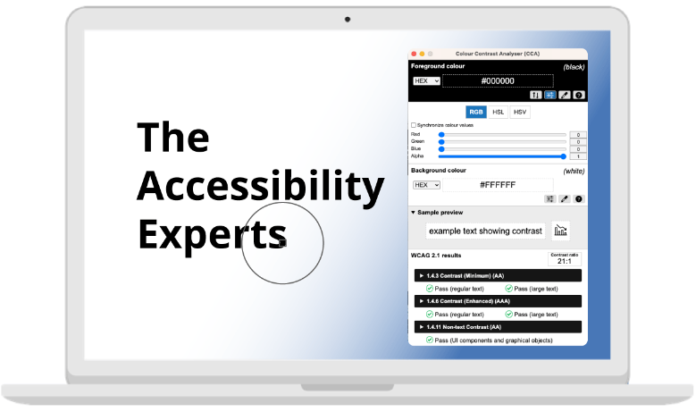

# 9. 관련 도구 및 플러그인
> WAI-ARIA 적용을 돕는 도구와 추가 학습을 위한 리소스 제공.

## 9.1 보조 기술이 필요한 장애 유형   
1. **시각** : 실명, 색각 이상, 다양한 형태의 저시력을 포함한 시각 장애    
2. **이동성** : 파킨슨병, 근육병, 뇌성마비, 뇌졸중과 같은 조건으로 인한 근육 속도 저하, 근육 제어 손실로 말미암아 손을 쓰기 어렵거나 쓸 수 없는 상태    
3. **청각** : 영상, 음성 콘텐츠에 자막, 원고, 수화 등의 대체수단 부제로 인한 인식이 불가능한 상태    
4. **인지** : 문제 해결과 논리 능력, 집중력, 기억력에 문제가 있는 정신 지체 및 발달 장애, 학습 장애(난독증, 난산증 등)    

## 9.2 시각장애인용 스크린리더란?   
시각장애인들에게 컴퓨터의 화면과 자신이 입력한 키보드 정보 그리고 마우스 좌표 등을 음성으로 알려 주어 컴퓨터를 사용할 수 있도록 도와주는 소프트웨어입니다.    
    
**스크린리더 기술**      
Jaws와 같은 PC형 스크린리더와 보이스 몬, 웹톡스와 같은 웹 스크린리더 방식의 두 가지로 이루어집니다.   

**스크린리더 발전**   
스크린리더는 외국에서 개발된 것들을 비롯하여 다양한 종류의 프로그램들이 있는데 우리나라는 1990년대에 ‘가라사대’를 시작으로 ‘소리눈’, ‘아이즈2000(eyes2000)’, ‘이브 포 윈도우(Eve for Windows), 실로암시각장애인복지관의 ’ 드림보이스‘, 엑스비전 테크놀로지의 ‘센스리더’ 등이 개발되었습니다.   

## 9.3 대표적인 스크린리더의 종류   
### 1. 센스리더(Sense Reader)   
센스리더는 유료이며 정품을 보유하고 있지 않을 경우 시간 혹은 사용에 제한이 있습니다. 무료로 사용할 경우에는 30분 시간 제약이 있으며, 다시 사용하려면 컴퓨터를 재부팅해야 하는 번거로움이 있습니다.   
또한 국내에서만 사용하며, 접근성 마크 심사를 진행할 경우 국내에서는 센스리더로 검사를 하기 때문에 국내에서는 필수라고 할 수 있습니다.   
센스리더는 마이크로소프트의 운영체제인 윈도우와 기반 응용 프로그램을 사용할 수 있도록 도와주는 스크린리더로 디스플레이상에 표시되는 텍스트와 그래픽 정보를 음성합성 장치나 TTS 엔진을 사용해 읽어줌으로써 시각장애를 가진 사람들이 컴퓨터를 사용할 수 있도록 도와주는 응용 소프트웨어입니다.    

**센스리더 특징**   
1. **리뷰 기능**    
   리뷰 기능은 화면에 표시된 내용을 살펴볼 수 있는 기능으로 센스리더는 이 기능을 제공해 줍니다.   
2. **다양한 환경설정 기능**    
   리뷰 기능은 화면에 표시된 내용을 살펴볼 수 있는 기능으로 센스리더는 이 기능을 제공해 줍니다.   
3. **주요 응용프로그램을 위한 별도의 인터페이스를 제공**    
   리뷰 기능은 화면에 표시된 내용을 살펴볼 수 있는 기능으로 센스리더는 이 기능을 제공해 줍니다.   

**센스리더 환경 설정**   
1. 가상 커서 환경설정(ctrl + shift + F9)을 호출하여 숨긴 내용 읽기를 해제합니다.   
2. 가상 커서 설정에서 새 페이지 자동 읽기를 ‘읽지 않기’ 또는 ‘간략하게 읽기’로 설정합니다.   
3. 가상 커서 설정에서 셀 주소 읽기를 뒤에 읽기로 설정합니다. 이렇게 하면 테이블 탐색 시에 병합된 셀 파악이 가능합니다.   
4. Internet Explorer 메뉴 > 도구 > 인터넷 옵션 > 보안 탭에서 '인터넷 보호 모드' 사용을 해제하면 센스리더에서 제공하는 가상 커서의 임시 해제(ctrl + 아래쪽 화살표)를 사용할 수 있습니다.   

### 2. JAWS(Job Access With Speech)  
1. 1995년도에 출시한 JAWS는 스크린 리더의 원조이며, 옛날부터 존재하던 스크린 리더이기 때문에 제일 많은 사용자들이 익숙하고 사용하던 스크린 리더일 것입니다.    
2. 현재 JAWS는 스크린 리더에 필요한 모든 기능을 갖추고 있지만 최근에는 시장 점유율을 잃어가고 있습니다.    
3. 이유는 다른 스크린 리더도 충분히 JAWS를 대체할 수 있고 무엇보다 가격이 가장 큰 장벽을 들 수 있는데 가격을 살펴보면 여러 가지 옵션이 있지만 기본 1년에 $90 혹은 라이선스 구매를 $1000에 할 수 있습니다.    
4. 무료인 NVDA와 비교해 봤을 때 가격에서 대비가 됩니다. 가격이 높다고 하더라도 예전부터 사용하던 이용자들은 JAWS를 편하게 생각하기 때문에 계속 찾을 수도 있습니다.    
5. JAWS 데모를 이용하면 컴퓨터를 재시작할 때마다 40분 동안 무료로 이용할 수 있으며, JAWS를 켰을 때 라이선스 등록하라고 물어보는 팝업이 뜨기 전에 1분가량 이용할 수도 있습니다.    

<figure class="img_figure mt_m" style="text-align:center">
  
  <figcaption>
    <b class="t_black">JAWS(Job Access With Speech)</b> 
    출처 : https://www.freedomscientific.com/products/software/jaws/
  </figcaption>
</figure>

## 3. NVDA(NonVisual Desktop Access)   
NVDA는 2006년에 출시한 오픈소스 스크린리더로서 무료로 사용 가능하며 다국어를 지원합니다.   
최근에는 인기가 급상승하면서 2017년에는 스크린 리더의 원조 격인 JAWS 만큼이나 이용되고 있습니다.    
그 비결은 무료이면서도 비슷한 기능을 제공하기 때문일 것입니다.    
WebAIM에서 2019년 8월부터 9월까지 스크린 리더 사용자의 선호도를 조사한 결과 Jaws 보다 NVDA가 앞서고 있는 것을 볼 수 있습니다.    

**NVDA 사용 시 간단한 관련 설정**   
1. NVDA 환경설정을 호출하려면 NVDA를 실행한 상태에서 언제든지 insert와 n키를 누르면 됩니다.   
2. 인터넷 관련 환경설정은 설정 > 브라우저 모드에 있습니다.      
3. 다른 값은 다 기본으로 두셔도 되지만 페이지가 로딩되면 자동으로 읽기 항목은 체크 해제하고 테스트하시기 바랍니다. 이는 우리나라의 많은 사이트에서는 페이지가 열렸을 때 포커스가 항상 문서 처음으로 가지 않는 경우가 많으므로 포커스가 있는 그 라인을 읽어주는 것이 사용자에게 더 명확한 정보를 줄 수 있기 때문입니다.    
4. "화면 레이아웃, 지원되면 사용" 항목은 센스리더와 비슷한 환경을 구현하기 위하여 해제하고 테스트합니다. 이렇게 되면 센스리더처럼 모든 객체는 다른 라인으로 분리하여 출력합니다.   
    

<figure class="img_figure mt_m" style="text-align:center">
  
  <figcaption>
    <b class="t_black">NVDA(NonVisual Desktop Access)</b> 
    출처 : https://ul.gpii.net/content/nvda-screenreader
  </figcaption>
</figure>

## 9.4 접근성 테스트 도구 및 리소스  

**1. axe Accessibility Checker**   
- Deque Systems에서 제공하는 브라우저 확장 프로그램으로, 웹 페이지의 접근성 문제를 감지합니다. WAI-ARIA 역할과 속성 사용의 적절성을 평가합니다.    
- 웹 페이지의 접근성 문제 자동 검출, WAI-ARIA 검증.    
- [axe: Accessibility Testing Tools and Software - Deque](https://www.deque.com/axe/){: target="_blank"}   

**2. WAVE (Web Accessibility Evaluation Tool)**
- 웹 페이지의 접근성을 시각적으로 평가할 수 있는 도구로, WAI-ARIA의 적절한 사용 여부를 포함한 다양한 접근성 문제를 감지합니다.    
- 웹 페이지의 구조적 접근성 분석, 시각적 피드백 제공.    
- 브라우저 부가기능 WAVE Evaluation Tool 추가하여 사용 가능.    
- [WAVE Web Accessibility Evaluation Tools](https://wave.webaim.org/){: target="_blank"}   

**3. Lighthouse**
- Lighthouse는 웹페이지 품질을 개선하기 위한 오픈소스 자동화 도구입니다. 모든 공개 웹페이지 또는 인증이 필요한 웹페이지에 대해 실행할 수 있습니다.    
- Google Chrome에 내장된 개발자 도구로, 성능, 접근성, 프로그레시브 웹 앱, 검색엔진 최적화 등에 대한 감사가 제공됩니다.    
- WAI-ARIA 역할과 속성 사용 검토, 접근성 개선 제안.    
- [Chrome DevTools에서 Lighthouse 실행](https://developer.chrome.com/docs/lighthouse/overview?hl=ko#devtools){: target="_blank"}   

**4. Accessibility Insights**
- Microsoft에서 제공하는 브라우저 확장 프로그램으로, 웹 페이지의 접근성 문제를 발견하고 해결할 수 있도록 돕습니다.    
- WAI-ARIA 역할 및 속성 검토, 웹 페이지의 접근성 상태 시각화.    
- [Accessibility Insights](https://accessibilityinsights.io/){: target="_blank"}   

**5. The A11Y Project**
- 웹 접근성을 중심으로 한 오픈 소스 커뮤니티로, 다양한 접근성 리소스와 WAI-ARIA 관련 자료를 제공합니다.    
- 접근성 모범 사례, WAI-ARIA 사용 예제 및 가이드.    
- [A11Y Project checklist](https://www.a11yproject.com/checklist/#content){: target="_blank"}   

**6. 명도 대비 검사 툴**
- [Colour Contrast Analyzer (CCA)](https://www.tpgi.com/color-contrast-checker/){: target="_blank"}   
- [WCAG - Contrast Checker](https://contrastchecker.com/){: target="_blank"}   
- [WCAG Contrast Checker](https://w3cag.com/){: target="_blank"}   
- [Contrast Checker - WebAIM](https://webaim.org/resources/contrastchecker/){: target="_blank"}   
- [Contrast Check](https://accessibilitycheck.org/contrast/){: target="_blank"}   
- [Contrast Finder](https://app.contrast-finder.org/?lang=ko){: target="_blank"}   

<figure class="img_figure mt_m" style="text-align:center">
  
  <figcaption>
    <b class="t_black">Colour Contrast Analyzer (CCA)</b> 
    출처 : https://www.tpgi.com/color-contrast-checker/
  </figcaption>
</figure>

## 참조
- [(주)엑스비전테크놀로지](http://www.xvtech.com/){: target="_blank"}   
- [JAWS® Solutions](https://www.freedomscientific.com/products/software/jaws/){: target="_blank"}   
- [NVDA Screenreader](https://ul.gpii.net/content/nvda-screenreader){: target="_blank"}   
- [webaim.org Screen Reader User Survey](https://webaim.org/projects/screenreadersurvey8/){: target="_blank"}   
- [JAWS verses NVDA](https://digitalaccessibilitycentre.org/index.php/blog/20-diary/211-jaws-verses-nvda){: target="_blank"}   