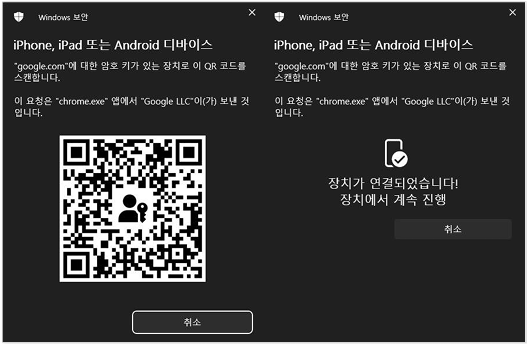
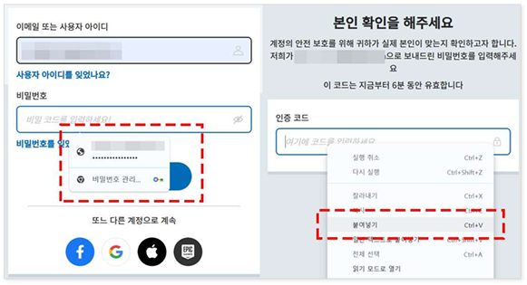
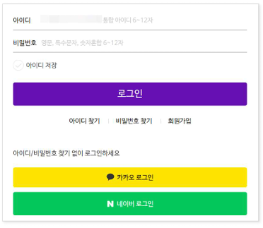
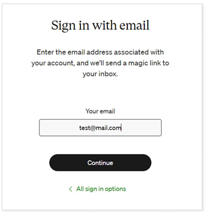
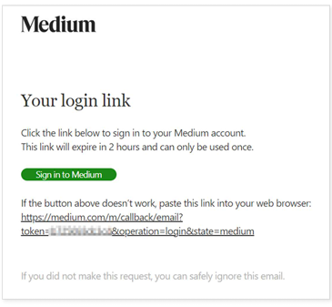
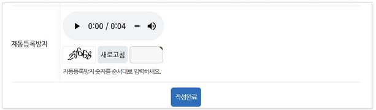
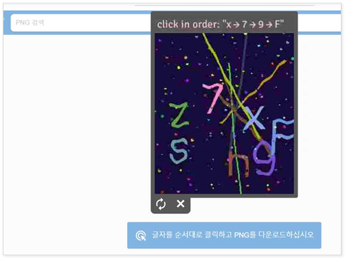

# 접근성 콘텐츠 제작 기법
> 접근성 콘텐츠 제작 기법은 모든 사용자, 특히 장애가 있는 사용자가 웹 콘텐츠에 접근하고 사용할 수 있도록 보장하는 방법입니다. 이 기법은 웹 접근성 지침(WCAG: Web Content Accessibility Guidelines) 표준을 따르는 것이 중요합니다. 각각의 영역에 대해 접근성 작업 시 도움이 될 수 있도록 작업되었습니다. 접근성은 법적 요구사항일 뿐만 아니라 사용자를 위한 기본적인 배려이기도 합니다.  

## 웹 접근성 콘텐츠 제작 기법   
> 사용자가 장애를 가지고 있거나 특정 기능적 제한을 겪는 경우에도 원활하게 웹을 이용할 수 있도록 하는 방법을 의미합니다. 이러한 접근성을 고려한 콘텐츠 제작은 다양한 사용자들의 요구를 충족시키며, 웹의 사용성을 크게 향상시킵니다.    


**키워드**   
#웹 접근성, #웹 접근성 콘텐츠 제작 기법, #한국형 웹 콘텐츠 접근성 지침 2.2, #WCAG2.2, #KWCAG2.2, #접근 가능한 인증, #보조기술과의호환성, #접근성 테스트 도구 활용 점검방법, #스크린 리더, #Jaws, #NVDA, #센스리더, #Sense Reader, #인지장애인, #시각장애인, #고령자, #보조기기 사용자


### 접근 가능한 인증 [신규 항목] 
**관련 지침 : 인증 과정은 인지 기능 테스트에만 의존해서는 안 된다.**   
사용자 로그인 등과 같은 인증 과정이 인지 기능 테스트(예: 로그인을 위한 비밀번호 입력, 터치스크린 화면의 패턴 인식, 임의의 문자열 기억, 계산 수행, 특정 객체를 포함하고 있는 이미지 찾기 등)에 의존하는 경우, 인지 기능 테스트에 의존하지 않는 인증 방법을 적어도 하나 이상 제공해야 한다.      
인지 기능 테스트에 의존하지 않고 인증을 하기 위해서는 브라우저가 아이디/비밀번호를 저장할 수 있도록 마크업된 서식, 공개인증(OAuth: Open Authorization)를 통한 서드 파티, 신체(얼굴, 지문 등)나 물건(휴대폰, USB 등)을 이용한 인증 등을 이용할 수 있다. 다만, 이미 사용자 자신에게 익숙하여 별 도의 인지적인 노력을 필요로 하지 않는 사용자의 이름이나 이메일 주소, 전화번호는 인지 기능 테 스트로 간주하지 않는다.     

[3.3.8 접근 가능한 인증 (최소, Level AA)](https://www.w3.org/TR/WCAG22/#accessible-authentication-minimum){: target="_blank"}    
[3.3.9 접근 가능한 인증 (향상, Level AAA)](https://www.w3.org/TR/WCAG22/#accessible-authentication-enhanced){: target="_blank"}   


- 3.3.8 접근 가능한 인증(최소) (레벨 AA): 인증 과정에서 인지 기능 테스트(예: 비밀번호 입력, 패턴 인식 등)에 의존하는 경우, 인지 기능을 사용하지 않는 하나 이상의 대체 수단을 제공해야 합니다. ​     
- 3.3.9 접근 가능한 인증(향상) (레벨 AAA): 인증 과정에서 인지 기능 테스트를 완전히 배제하고, 다른 인증 수단을 제공해야 합니다.       


**기대효과**   

- 기억, 읽기, 숫자계산 등에 어려움이 있는 사용자도 인지 능력에 상관없이 인증 과정을 수행할 수 있다.     

#### 1. 필요성        
가장 널리 사용되고 있는 인증 형태인 아이디(또는 이름, 이메일 등)와 비밀번호를 사용하는 방법은 사용자의 기억 능력에 의존해야 하기 때문에 인지 장애가 있는 사용자들은 어려움을 겪을 수 있다.    
또한 추가 인증 단계로 일회성 확인 코드를 따라 작성하거나 문제를 풀어야 하는 등의 방식이 제공되는 경우, 학습 능력이나 인지 능력에 어려움이 있는 사용자는 인증이 불가능할 수 있다.    


- 인지 기능에 대한 부담 감소   
- 보조 기술 사용자 배려   
- 다양한 수단 제공 (메일 인증, 생체 인증 등)   


#### 2. 대상       

| 사용자 유형   | 인증 접근성 필요 이유 |
|---------------|--------------------|
| 인지장애인     | 비밀번호 기억, 보안 질문 응답이 어려움  
| 시각장애인     | CAPTCHA 이미지 해석 불가  
| 고령자         | 복잡한 인증 구조 인지 어려움  
| 보조기기 사용자 | 인증 흐름에 대한 시멘틱 안내 필요  


#### 3. 체크리스트       

- CAPTCHA에 대체 수단 제공 여부   
- autocomplete 등 저장된 인증 정보 활용 가능 여부   
- 인증 흐름을 보조기술로 안내 가능한지   

#### 4. 테스트 방법      

- 스크린 리더 인증 흐름 테스트   
- 키보드만으로 인증 가능 여부 확인   
- 오류 메시지와 재입력 UX 확인    

#### 5. QA 지표       

- 인증 실패율   
- 자동입력 필드 활용률   
- 보조기기 사용자의 인증 완료 성공률   

#### 6. 개발방법     
인증 과정에서 보안과 접근성 사이의 균형을 유지하면서 사용자의 인지 또는 학습 능력에 의존하지 않는 다양한 인증 방식 대안을 제공해야 한다.    

예를 들어 다음의 대안을 제공하는 것을 고려해 볼 수 있다.    

- 지문, 얼굴 인식 등을 이용한 생체인증, 패스키나 애플리케이션을 통한 인증과 같이 사용자 기기를 사용한 인증 방식 등을 사용하여 기억이나 인지 능력에 의존하지 않도록 한다.    
- 비밀번호 관리 프로그램이 자동으로 채워 넣을 수 있도록 허용한다.    
- 메모장에 적어둔 비밀번호, 이메일로 전달받은 OTP 등의 사용을 쉽게 할 수 있도록 복사 + 붙여넣기를 허용한다.    
- 이메일이나 SMS를 통한 링크 인증 방법을 사용하여 복잡한 입력 과정을 생략한다.   

**HTML 예시 – 이메일 인증**
```html
<form>
  <label for="email">이메일</label>
  <input type="email" id="email" autocomplete="email" />
  <button type="submit">인증 메일 보내기</button>
</form>
```

**CAPTCHA 대체 질문**
```html
<label for="question">5 더하기 3은?</label>
<input id="question" type="text" />
```

**Vue 예시**
```vue
<template>
  <div>
    <label>이메일</label>
    <input v-model="email" autocomplete="email" />
    <button @click="sendLoginLink">로그인 링크 전송</button>
  </div>
</template>
<script setup>
import { ref } from 'vue';
const email = ref('');
const sendLoginLink = () => alert(`${email.value} 주소로 인증 메일을 전송했습니다.`);
</script>
```

**React 예시**
```jsx
function LoginForm() {
  const [email, setEmail] = React.useState('');
  const sendLogin = () => alert(`${email}로 인증 메일 전송`);
  return (
    <>
      <label htmlFor="email">이메일</label>
      <input
        id="email"
        type="email"
        value={email}
        onChange={e => setEmail(e.target.value)}
        autoComplete="email"
      />
      <button onClick={sendLogin}>로그인 링크 전송</button>
    </>
  );
}
```


#### 7. 점검 기준     

- 인증 방식이 기억 기반만인가?    
- CAPTCHA에 대체 수단 제공되는가?   
- 시멘틱 구조로 스크린 리더가 흐름 안내 가능한가?   

#### 8. 점검 방법     

- 보조기기(스크린 리더 등)로 필드 및 버튼 안내 테스트   
- 키보드 조작만으로 인증 완료 가능 여부 확인   

#### 9. 준수 사례       

**사용자 기기를 사용한 인증 방식 제공**     
사용자 기기를 사용하여 기기의 생체 인증, 패스키, 인증 애플리케이션 등을 통하여 인증을 대체하는 방식을 제공한다. 음은 기기에 저장된 패스키를 사용하여 인지 능력을 활용하지 않고도 인증을 받을 수 있도록 제공한 사례이다.     
단, 이러한 방식으로 제공할 경우 QR 코드를 촬영하기 위해서는 시각을 활용하기 어려운 사용자를 위한 또 다른 대체 방안이 제공되어야 할 수 있다.    

<figure>

<figcaption>출처 : 웹 접근성을 고려한 콘텐츠 제작기법 개정판</figcaption>   
</figure>

**복사하여 붙여넣기, 자동 채움 기능 허용**     
비밀번호 관리 프로그램을 사용하여 비밀번호 입력 필드를 자동으로 채우는 기능을 허용하여 사용자의 기억력에 의존하지 않도록 한다.    
추가 인증 과정에서 이메일로 OTP 코드를 발송하고 이를 작성하게 하는 등의 경우에도 단순히 복사하여 붙여 넣는 기능을 허용함으로써 사용자가 인지 능력에 의존하지 않도록 한다.    
다음은 메일로 전송된 인증 코드를 복사하여 인증 코드 입력창에 복사하여 붙여넣을 수 있도록 허용된 사례이다.     

<figure>

<figcaption>출처 : 웹 접근성을 고려한 콘텐츠 제작기법 개정판</figcaption>   
</figure>

**oAuth를 사용하여 타사 공급자를 통한 인증 제공**     
소셜 미디어 계정이나 이메일 계정과 같이 익숙한 타사 공급자 계정으로 인증할 수 있도록 제공한다.     

<figure>

<figcaption>출처 : 웹 접근성을 고려한 콘텐츠 제작기법 개정판</figcaption>   
</figure>

**이메일 링크 인증**     
이메일 링크 인증은 사용자가 인지 능력을 과도하게 사용하지 않고도 계정에 접근할 수 있도록 돕는 인증 방식이다. 기본적으로 사용자 이름과 비밀번호를 통한 로그인 방식을 제공하되, 비밀번호를 잊었을 경우 이메일을 통해 별도의 인증 링크를 제공한다. 사용자가 자신의 이메일 주소를 입력하고 양식을 제출하면, 사이트는 해당 이메일로 인증 링크를 전송한다. 사용자는 도착한 이메일 속 링크를 클릭하기만 하면 복잡한 절차 없이 곧바로 웹 사이트에 로그인된다.    
이 방법을 통해 사용자는 복잡한 비밀번호를 기억하거나 퍼즐을 푸는 등의 인지 부담을 덜 수 있으며, 별도의 인지 기능 테스트에 의존하지 않고도 안전하고 편리하게 인증 과정을 거칠 수 있다. 이러한 접근은 다양한 사용자에게 편의를 제공하며, 접근 가능한 인증을 구현하는 한 사례가 된다.     

<figure>


<figcaption>출처 : 웹 접근성을 고려한 콘텐츠 제작기법 개정판</figcaption>   
</figure>


```html
<input type="email" autocomplete="email" />
```

#### 10. 미준수 사례       

**인지 기능 테스트만으로 인증**     
다음은 게시글 자동 등록을 방지하기 위해 인지 기능 테스트로 사람임을 인증하는 사례이다.     
왜곡된 문자 그림을 보고 필사하거나 빠르게 읽어주는 음성을 듣고 기억하여 필사해야 하는 테스트이기 때문에 난독증 등 일부 사용자들에게는 테스트를 통과하는 것이 매우 어려울 수 있다.     

<figure>

<figcaption>출처 : 웹 접근성을 고려한 콘텐츠 제작기법 개정판</figcaption>   
</figure>

**개선 방법**    
사용자가 패턴을 찾거나 해독하지 않아도 되는 인지 부담이 적은 대체 방법을 제공한다. 예를 들어 “나는 로봇이 아닙니다”와 같은 ReCAPTCHA v3를 고려해 볼 수 있다.    

**캡챠 인식과 인지 기능을 같이 요구**     
다음은 게시글 자동 등록을 방지하기 위해 인지 기능 테스트로 사람임을 인증하는 사례이다.     
왜곡된 문자 그림을 보고 필사하거나 빠르게 읽어주는 음성을 듣고 기억하여 필사해야 하는 테스트이기 때문에 난독증 등 일부 사용자들에게는 테스트를 통과하는 것이 매우 어려울 수 있다.     

<figure>

<figcaption>출처 : 웹 접근성을 고려한 콘텐츠 제작기법 개정판</figcaption>   
</figure>

**개선 방법**    
시각 장애인도 가능한 인증 방법 및 사용자가 패턴을 찾거나 해독하지 않아도 되는 인지 부담이 적은 대체 방법을 제공한다.    

```html

<input type="text" />
```


#### 11. 관련 영상       
<iframe style="width:100%;min-height:315px;" src="https://www.youtube.com/embed/GLdQvi-SWGQ?si=oTPR5wBO3yqWjpD5" title="YouTube video player" frameborder="0" allow="accelerometer; autoplay; clipboard-write; encrypted-media; gyroscope; picture-in-picture; web-share" referrerpolicy="strict-origin-when-cross-origin" allowfullscreen></iframe>

[리베하얀 웹 접근성 (접근 가능한 인증)](https://www.youtube.com/embed/GLdQvi-SWGQ?si=oTPR5wBO3yqWjpD5){: target="_blank"}    
   
--- 
<strong style="font-size:20px;cursor:pointer;">접근성 테스트 도구 활용 점검방법</strong>
모바일 앱 접근성 과 내용 동일

 
#### 결론     
모바일 앱 접근성 과 내용 동일


### 참조    
- [Web Content Accessibility Guidelines (WCAG) 2.2](https://www.w3.org/TR/WCAG22/){: target="_blank"}    
- [WCAG 2.2 Understanding Docs](https://www.w3.org/WAI/WCAG22/Understanding/){: target="_blank"}    
- [WCAG (Quick Reference)](https://www.w3.org/WAI/WCAG22/quickref/?versions=2.2&showtechniques=111){: target="_blank"}    
- [웹 콘텐츠 접근성 지침(WCAG) 2.2 - 번역판](https://a11ykr.github.io/wcag22/){: target="_blank"}    
- [smashingmagazine - WCAG 2.2 Checklist with Filter and Links](https://codepen.io/smashingmag/pen/MWLgQzm){: target="_blank"}    
- [MDN 웹 컨텐츠 접근성 지침 이해하기](https://developer.mozilla.org/ko/docs/Web/Accessibility/Understanding_WCAG){: target="_blank"}    
- [보건복지부 블로그](https://blog.naver.com/prologue/PrologueList.naver?blogId=mohw2016){: target="_blank"}     
- [행정안전부 - 전자정부 웹사이트 UI UX 가이드라인](https://www.mois.go.kr/frt/bbs/type001/commonSelectBoardArticle.do?bbsId=BBSMSTR_000000000045&nttId=69451){: target="_blank"}     
- [널리 알리는 기술 소식 커뮤니티](https://nuli.navercorp.com/community/article){: target="_blank"}     
