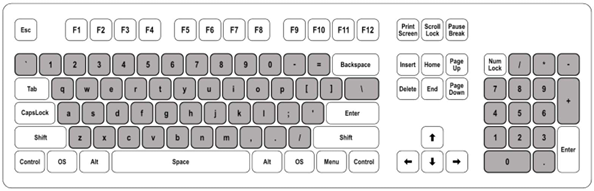
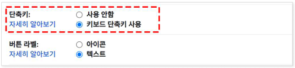
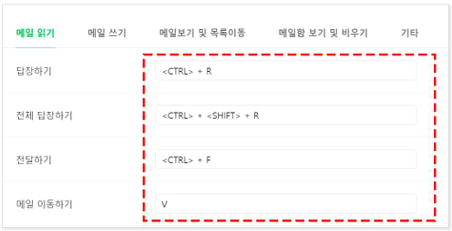
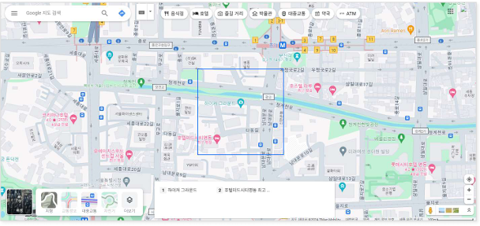
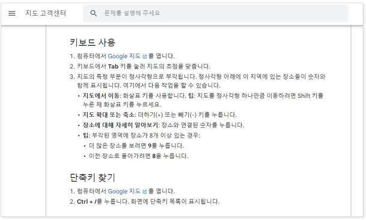
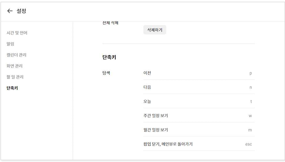

# 접근성 콘텐츠 제작 기법
> 접근성 콘텐츠 제작 기법은 모든 사용자, 특히 장애가 있는 사용자가 웹 콘텐츠에 접근하고 사용할 수 있도록 보장하는 방법입니다. 이 기법은 웹 접근성 지침(WCAG: Web Content Accessibility Guidelines) 표준을 따르는 것이 중요합니다. 각각의 영역에 대해 접근성 작업 시 도움이 될 수 있도록 작업되었습니다. 접근성은 법적 요구사항일 뿐만 아니라 사용자를 위한 기본적인 배려이기도 합니다.  

## 웹 접근성 콘텐츠 제작 기법   
> 사용자가 장애를 가지고 있거나 특정 기능적 제한을 겪는 경우에도 원활하게 웹을 이용할 수 있도록 하는 방법을 의미합니다. 이러한 접근성을 고려한 콘텐츠 제작은 다양한 사용자들의 요구를 충족시키며, 웹의 사용성을 크게 향상시킵니다.    


**키워드**   
#웹 접근성, #웹 접근성 콘텐츠 제작 기법, #한국형 웹 콘텐츠 접근성 지침 2.2, #WCAG2.2, #KWCAG2.2, #보조기술과의호환성, #접근성 테스트 도구 활용 점검방법, #스크린 리더, #Jaws, #NVDA, #센스리더, #Sense Reader, #스크린 리더 사용자, #지체장애 사용자, #비장애 사용자


### 문자 단축키 [신규 항목]
**관련 지침 : 문자 단축키는 오동작으로 인한 오류를 방지하여야 한다.**   
문자 단축키 검사항목은 키보드나 음성 명령을 사용하는 사용자들이 의도하지 않게 단축키가 실행되어 발생하는 문제를 예방하는 것을 목적으로 한다. 특히 음성 입력 사용자의 발음을 잘못 인식하거나 운동 장애가 있는 사용자의 키보드 오입력으로 인한 의도하지 않은 기능 실행을 방지하여 웹 콘텐츠를 안전하게 이용할 수 있도록 보장하는 것에 중점을 둔다.     

[2.1.4 문자 단축키 (Character Key Shortcuts) (Level A)](https://www.w3.org/TR/WCAG22/#character-key-shortcuts){: target="_blank"}    
[WAI - Understanding Character Key Shortcuts](https://www.w3.org/WAI/WCAG22/Understanding/character-key-shortcuts.html){: target="_blank"}    
[MDN - KeyboardEvent.key](https://developer.mozilla.org/en-US/docs/Web/API/KeyboardEvent/key){: target="_blank"}    


단일 문자 단축키(예: 대/소문자, 구두점, 기호 등 글자키나 숫자키 또는 특수문자키)를 제공하는 경우, 오류를 방지하기 위하여 다음 중 하나 이상을 충족해야 한다.    
- 비활성화: 단축키를 끌 수 있는 방법을 제공해야 한다.     
- 재설정: 한 개 이상의 기능키(예: Ctrl, Alt, Shift, Option, Command 등)를 조합하여 단축키를 재설정할 수 있어야 한다.    
- 초점을 받은 경우에만 활성화: 사용자 인터페이스 구성요소(예: 폼 콘트롤, 링크, 콘텐츠 에디터 등)가 초점을 받은 경우에만 단축키가 활성화되어야 한다.    


**기대효과**   

- 음성명령 사용자가 입력을 위해 음성을 사용하는 것만으로도 의도하지 않게 단일 문자 단축키를 실행시키는 오작동을 방지할 수 있다.    
- 손 사용이 원활하지 않은 사용자의 단일 문자 단축키 사용 오류를 방지할 수 있다.    
- 단일 문자 단축키 재설정 기능을 활용하여 익숙한 단축키로 변경할 수 있다.    

**[용어]**    
**단일 문자 단축키**     
하나의 문자, 숫자, 기호 키를 입력하는 것만으로 특정 기능을 수행하는 단축키를 의미한다.    

<figure>

<figcaption>출처 : 웹 접근성을 고려한 콘텐츠 제작기법 개정판</figcaption>   
</figure>


**수식키**     
Ctrl, Alt (Mac에서는 Option), Shift와 같이 다른 키와 조합하여 기능을 변경하거나 활성화하는 특수 키를 의미한다. 이 키들은 단독으로 사용할 때는 별도의 기능을 수행하지 않는다. 기능키(F1 등)는 단독 실행 되므로 수식키에 포함되지 않는다.   

#### 1. 필요성        
문자 단축키는 빠른 탐색이나 효율적인 키보드 사용에 도움이 되지만, 음성 입력 사용자나 뜻하지 않게 다른 키를 누를 가능성이 있는 사용자에게 문제가 될 수 있다.    
예를 들어, 음성 명령 기반으로 컴퓨터를 조작하는 사용자는 단어를 받아쓰는 과정에서 특정 문자를 발음했을 때, 해당 문자에 할당된 단축키가 갑작스럽게 실행될 수 있다. 이는 작성 중이던 내용을 방해하거나 흐름을 깨뜨려 사용자 경험을 저해한다. 이메일 본문 작성 중 NIA를 입력하기 위해 "N"을 발음했을 때 "N" 단축키가 실행되어 갑자기 새로운 메일 작성 페이지로 이동되어 작성 중이던 이메일 입력에 방해 받을 수 있다. 이는 음성 명령 입력 방식 중, 받아쓰기와 음성 명령을 혼합하여 사용할 수 있는 ‘단일 모드’에서 문제가 발생할 수 있다.    
운동 기능 제약으로 인해 키보드 사용 시 정확한 키 입력이 어려운 사용자도 우발적인 키 입력으로 원치 않는 기능이 작동할 수 있다. 단축키를 끄거나 보조키(Ctrl, Alt, Shift)와 조합하도록 재설정할 수 있으면 이러한 문제를 예방할 수 있다.    
또한 단축키를 사용자가 원하는 방식으로 설정할 수 있도록 허용하면 일부 인지 장애가 있는 사용자에게 도움이 될 수 있다. 자신이 자주 쓰는 단축키를 동일하게 여러 애플리케이션에 할당하여 같은 작업을 수행할 수 있기 때문이다.    

- 스크린 리더는 문자 키를 사용해 명령을 수행하기 때문에 단축키 충돌 발생 가능성     
- 키보드 실수로 중요한 기능이 실행될 수 있음    
- 오작동 방지를 위한 키 조합 요구 또는 끄기 기능 필요     

#### 2. 대상       

| 사용자 유형         | 이유 |
|----------------------|------|
| 스크린 리더 사용자     | 단축키 충돌 방지 필요 (예: NVDA는 문자 키 사용)  
| 지체장애 사용자       | 비의도적인 키 입력으로 오류 발생 가능  
| 비장애 사용자           | 실수 입력에 따른 동작 최소화  

#### 3. 체크리스트       

- 문자 하나만으로 실행되는 단축키가 있는가?    
- 단축키를 비활성화하거나 키 조합으로 대체할 수 있는가?    
- 사용자 설정을 통해 단축키를 변경할 수 있는가?    

#### 4. 테스트 방법      

- 문자 키 하나를 눌렀을 때 기능이 실행되는지 확인    
- 단축키를 끌 수 있는 설정이 존재하는지 확인   
- `Alt`, `Ctrl` 등의 조합 없이 문자 단독 입력으로 동작이 일어나는지 확인   

#### 5. QA 지표       

- 단일 문자 단축키 기능 수   
- 단축키 충돌 방지 옵션 제공률   
- 사용자 설정 가능 여부   

#### 6. 개발방법     
다음 중 한 가지 이상을 충족해야 한다.    

1. 문자 단축키 기능을 끌 수 있는 설정 제공: 사용자가 문자 단축키 기능을 끄거나 켤 수 있는 설정을 제공한다.    
2. 단축키 재설정: 단독으로 작동하는 문자 단축키에 수식키(Ctrl, Alt, Shift 등)를 조합하거나 다른 단축키로 변경할 수 있는 기능을 제공한다.    
3. 초점을 받은 상태에서만 단축키 실행: 특정 컨트롤이나 영역에 초점이 있을 때만 문자 단축키 기능이 작동하도록 한다. 예를 들어, 지도 서비스에서는 지도 영역에 초점이 있을 때만 '+', '-'키로 확대/축소를 실행하고, 메일 서비스에서는 이메일 목록 영역에 초점이 있을 때만 'D' 키로 메일 삭제 기능을 수행하도록 한다.   


#### HTML + JavaScript 예시 – 단축키 옵션 비활성화
```html
<label>
  <input type="checkbox" id="shortcutToggle" checked />
  단축키 사용
</label>

<script>
document.addEventListener("keydown", function (e) {
  const useShortcut = document.getElementById("shortcutToggle").checked;
  if (useShortcut && e.key === "d") {
    alert("삭제 기능 실행");
  }
});
</script>
```

#### Vue 예시 – 단축키 비활성화 및 조합 필요
```vue
<template>
  <div>
    <label>
      <input type="checkbox" v-model="useShortcut" />
      단축키 사용
    </label>
  </div>
</template>

<script setup>
import { ref, onMounted, onUnmounted } from 'vue';
const useShortcut = ref(true);

function handleKey(e) {
  if (useShortcut.value && e.ctrlKey && e.key === 'd') {
    alert('Ctrl + D: 삭제 기능 실행');
  }
}

onMounted(() => window.addEventListener('keydown', handleKey));
onUnmounted(() => window.removeEventListener('keydown', handleKey));
</script>
```

#### React 예시
```jsx
import React, { useEffect, useState } from "react";

function ShortcutComponent() {
  const [useShortcut, setUseShortcut] = useState(true);

  useEffect(() => {
    const handleKey = (e) => {
      if (useShortcut && e.ctrlKey && e.key === "d") {
        alert("Ctrl + D: 삭제 기능 실행");
      }
    };
    window.addEventListener("keydown", handleKey);
    return () => window.removeEventListener("keydown", handleKey);
  }, [useShortcut]);

  return (
    <label>
      <input
        type="checkbox"
        checked={useShortcut}
        onChange={(e) => setUseShortcut(e.target.checked)}
      />
      단축키 사용
    </label>
  );
}
```

#### 7. 점검 기준     

- 단일 문자 입력만으로 기능이 실행되지 않는가?    
- 단축키를 비활성화할 수 있는가?    
- 사용자 설정 또는 조합 키 필요 설정이 있는가?   

#### 8. 점검 방법     

- 키보드로 문자 키만 눌렀을 때 기능이 작동하는지 확인    
- 해당 기능을 끌 수 있는 UI 옵션 또는 설정이 있는지 확인    

#### 9. 준수 사례       

**단일 문자 단축키를 끄는 설정 제공**   
메일 서비스 설정 화면에서 단축키 기능을 끌 수 있는 옵션을 제공하여 의도치 않은 단축키 실행을 방지한다.    

<figure>

<figcaption>출처 : 웹 접근성을 고려한 콘텐츠 제작기법 개정판</figcaption>   
</figure>

**단일 문자 단축키 재설정 기능 제공**   
문자 단축키를 수식키와 조합하여 재설정할 수 있는 기능을 제공한다. 이를 통해 단순 문자 입력만으로 동작하지 않도록 하여, 의도치 않은 실행을 예방한다.   

<figure>

<figcaption>출처 : 웹 접근성을 고려한 콘텐츠 제작기법 개정판</figcaption>   
</figure>

**초점을 받은 상태에서만 단일 문자 단축키 실행**   
지도 영역에 초점을 둔 상태일 때만 + / - 키로 확대·축소 기능을 수행하도록 하고, 초점이 다른 곳에 있으면 단축키가 동작하지 않게 한다.    

<figure>


<figcaption>출처 : 웹 접근성을 고려한 콘텐츠 제작기법 개정판</figcaption>   
</figure>

```js
if (e.ctrlKey && e.key === "d") {
  // 의도적 단축키
}
```

#### 10. 미준수 사례       

**문자 단축키 기능을 사용자가 끄거나 재설정할 수 없고, 현재 초점과 무관하게 실행**    
다음은 단일 문자 단축키 기능을 제공하는 달력 서비스 사례이다.  
달력 서비스에서 이전/다음 달 이동, 일정 생성 등 다양한 기능에 대한 단축키를 제공하는데 다음과 같은 문제점을 가지고 있다    

1. 달력 외 영역에 초점이 있을 때에도 단축키 기능이 실행된다.    
2. 단축키를 켜거나 끌 수 있는 설정이 제공되어 있지 않다.    
3. 단축키를 보조키를 조합하여 재설정할 수 없다.   
   이로 인해 음성 명령 또는 키보드 사용자가 의도하지 않은 단축키를 실행하게 되기 쉽다.   

<figure>

<figcaption>출처 : 웹 접근성을 고려한 콘텐츠 제작기법 개정판</figcaption>   
</figure>

**개선 방안**    
다음 중 하나 이상의 방법을 적용한다.   

1. 문자 단축키 기능을 끌 수 있는 설정을 제공한다.    
2. 문자 단축키를 수식키 조합으로 재설정할 수 있게 한다.    
3. 달력 영역에 초점을 받을 때만 단축키가 작동하도록 한다.   

```js
if (e.key === "d") {
  // 단일 키로 삭제 실행 → 실수 가능성
}
```

#### 11. 관련 영상       
<iframe style="width:100%;min-height:315px;" src="https://www.youtube.com/embed/tfCMRvwHuPI?si=SEdScK7mKDB8weTt" title="YouTube video player" frameborder="0" allow="accelerometer; autoplay; clipboard-write; encrypted-media; gyroscope; picture-in-picture; web-share" referrerpolicy="strict-origin-when-cross-origin" allowfullscreen></iframe>

[리베하얀 웹 접근성 (문자 단축키)](https://www.youtube.com/embed/tfCMRvwHuPI?si=SEdScK7mKDB8weTt){: target="_blank"}    
   
--- 
<strong style="font-size:20px;cursor:pointer;">접근성 테스트 도구 활용 점검방법</strong>
모바일 앱 접근성 과 내용 동일

 
#### 결론     
모바일 앱 접근성 과 내용 동일


### 참조    
- [Web Content Accessibility Guidelines (WCAG) 2.2](https://www.w3.org/TR/WCAG22/){: target="_blank"}    
- [WCAG 2.2 Understanding Docs](https://www.w3.org/WAI/WCAG22/Understanding/){: target="_blank"}    
- [WCAG (Quick Reference)](https://www.w3.org/WAI/WCAG22/quickref/?versions=2.2&showtechniques=111){: target="_blank"}    
- [웹 콘텐츠 접근성 지침(WCAG) 2.2 - 번역판](https://a11ykr.github.io/wcag22/){: target="_blank"}    
- [smashingmagazine - WCAG 2.2 Checklist with Filter and Links](https://codepen.io/smashingmag/pen/MWLgQzm){: target="_blank"}    
- [MDN 웹 컨텐츠 접근성 지침 이해하기](https://developer.mozilla.org/ko/docs/Web/Accessibility/Understanding_WCAG){: target="_blank"}    
- [보건복지부 블로그](https://blog.naver.com/prologue/PrologueList.naver?blogId=mohw2016){: target="_blank"}     
- [행정안전부 - 전자정부 웹사이트 UI UX 가이드라인](https://www.mois.go.kr/frt/bbs/type001/commonSelectBoardArticle.do?bbsId=BBSMSTR_000000000045&nttId=69451){: target="_blank"}     
- [널리 알리는 기술 소식 커뮤니티](https://nuli.navercorp.com/community/article){: target="_blank"}     
