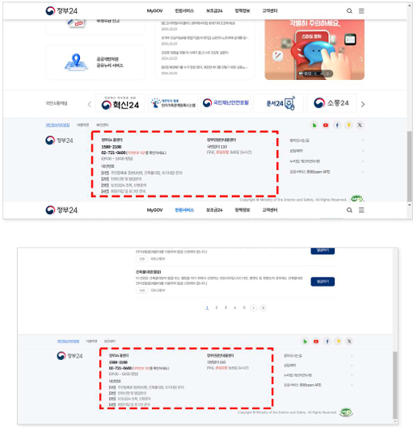
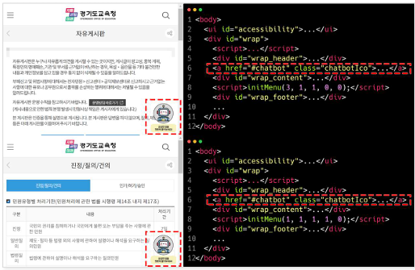
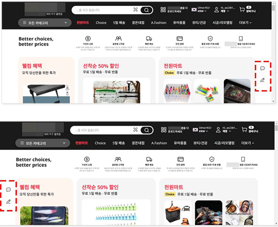
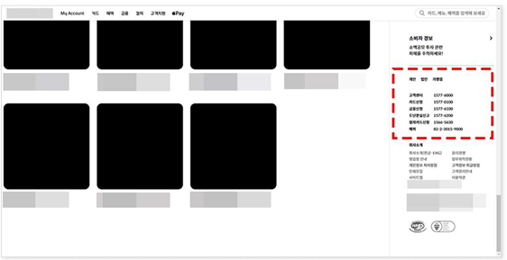
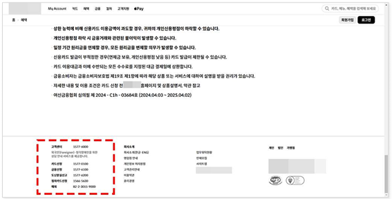

# 접근성 콘텐츠 제작 기법
> 접근성 콘텐츠 제작 기법은 모든 사용자, 특히 장애가 있는 사용자가 웹 콘텐츠에 접근하고 사용할 수 있도록 보장하는 방법입니다. 이 기법은 웹 접근성 지침(WCAG: Web Content Accessibility Guidelines) 표준을 따르는 것이 중요합니다. 각각의 영역에 대해 접근성 작업 시 도움이 될 수 있도록 작업되었습니다. 접근성은 법적 요구사항일 뿐만 아니라 사용자를 위한 기본적인 배려이기도 합니다.  

## 웹 접근성 콘텐츠 제작 기법   
> 사용자가 장애를 가지고 있거나 특정 기능적 제한을 겪는 경우에도 원활하게 웹을 이용할 수 있도록 하는 방법을 의미합니다. 이러한 접근성을 고려한 콘텐츠 제작은 다양한 사용자들의 요구를 충족시키며, 웹의 사용성을 크게 향상시킵니다.    


**키워드**   
#웹 접근성, #웹 접근성 콘텐츠 제작 기법, #한국형 웹 콘텐츠 접근성 지침 2.2, #WCAG2.2, #KWCAG2.2, #보조기술과의호환성, #접근성 테스트 도구 활용 점검방법, #스크린 리더, #Jaws, #NVDA, #센스리더, #Sense Reader, #인지장애인, #시각장애인, #고령자, #비장애 사죵자


### 찾기 쉬운 도움 정보 [신규 항목] 
**관련 지침 : 도움 정보가 제공되는 경우, 각 페이지에서 동일한 상대적인 순서로 접근할 수 있어야 한다.**   
단일 페이지 웹 애플리케이션 또는 웹 페이지 세트에서 다음 도움 정보 중 하나 이상의 도움 정보가 제공되면, 최소한 하나의 도움 정보는 해당 페이지에서 동일한 상대적인 순서대로 제공되어야 한다.     
즉, 사용자가 웹 사이트에서 제공된 도움 정보(연락처, FAQ, 챗봇 등)가 필요할 때 어디서든 쉽게 찾고 접근할 수 있도록 돕기 위한 것이다. 

[3.2.6 찾기 쉬운 도움 정보 (Level AAA)](https://www.w3.org/TR/WCAG22/#consistent-help){: target="_blank"}

- 담당자 상세 연락처: 전화번호, 이메일, 운영시간 등   
- 담당자 연락 방법: 메신저, 채팅창, 게시판, SNS 등   
- 도움말 옵션: FAQ, 사용법 등   
- 자동화된 연결방법: 챗봇 등    

**기대효과**   

-  도움 정보가 상대적으로 동일한 위치에 제공되지 않으면, 사용자는 원하는 도움 정보를 찾는 데 어려움을 겪을 수 있다. 그러나 도움 정보가 동일한 상대적인 순서대로 제공되면, 사용자는 해당 도움 정보에 보다 쉽게 접근할 수 있다.    

**도움 정보**    
사용자가 서비스 이용에 필요로 하는 지원이나 안내를 제공하는 정보를 말한다.    

- 전화번호, 이메일 주소, 운영 시간 등의 인적 연락처 정보   
- 메신저, 채팅, 문의 게시판, SNS 등과 같은 직접 상담 연결    
- 자주 묻는 질문, 사용 방법, 고객 지원 페이지와 같은 셀프 서비스    
- 챗봇과 같은 완전 자동화 된 지원 방식    

**동일한 상대적인 순서**     

- 웹 사이트 각 페이지에서 도움 정보가 시각적 위치뿐만 아니라 코드 구조(마크업 순서) 상에서도 일관되게 배치되는 것을 의미한다. 예를 들어, 모든 페이지 푸터 영역 끝부분에 동일한 도움 정보 링크를 두는 경우가 해당된다.     

#### 1. 필요성        
웹사이트나 웹 애플리케이션에서 사용 설명서, 고객센터 링크, 도움말 콘텐츠 등 사용자 지원 정보가 존재하는 경우, 해당 정보는 일관된 위치에 제공되어야 하며, 모든 페이지에서 동일한 방식으로 접근 가능해야 합니다.    

- 사용자는 서비스 이용 중 문제 해결을 위해 도움 정보를 자주 탐색    
- 도움 정보가 매번 다른 위치에 있다면 탐색 시간이 증가    
- 인지장애 사용자나 고령 사용자의 경우 반복적인 구조가 학습을 돕고 오류를 줄임   

**사용자가 필요한 도움 정보를 찾으려 할 때, 여러 페이지에서 일관된 위치에 제공하지 않을 경우 어려움 요소**    
- 화면 낭독 프로그램 사용자: 페이지마다 위치가 바뀌면 매번 페이지 전체를 탐색해서 다시 찾아야 하므로 시간과 노력이 크게 든다.    
- 화면 확대를 사용하는 저시력자: 페이지마다 다른 위치에 있는 도움 정보를 찾기 위해 화면을 계속 스크롤하거나 이동하며 탐색해야 하므로 피로도가 증가한다.    
- 인지 능력에 제한이 있는 사용자: 위치가 매번 바뀌면 새로운 정보를 기억해야 하고, 원래 하려던 작업을 잊을 수도 있다.     
- 학습 능력에 제한이 있는 사용자: 웹 사이트 구조 학습에 시간이 더 걸리고, 일관성이 없으면 혼란을 느낄 수 있다.    

#### 2. 대상       

| 사용자 유형     | 이유 |
|------------------|------|
| 인지장애인       | 반복된 UI 패턴으로 도움말 접근성 향상 |
| 시각장애인       | 스크린 리더 탐색 시 위치 예측 가능 |
| 고령자           | 학습된 구조 유지로 인지적 부담 완화 |
| 비장애 사용자      | 일관된 도움말 위치는 사용자 경험 개선에 기여 |

#### 3. 체크리스트       

- 모든 페이지에 도움말 또는 고객 지원 링크가 존재하는가?   
- 동일한 시각적 위치 또는 DOM 구조 내에서 도움 정보가 위치하는가?   
- 키보드 탐색 순서가 일관적인가?   
- 스크린 리더 사용자에게도 동일한 방식으로 노출되는가?   

#### 4. 테스트 방법      

- 임의의 여러 페이지에서 도움말 위치 비교   
- DOM 상 구조적 위치 확인 (예: 헤더 우측 상단)   
- 키보드로 탐색 시 동일한 순서에 위치하는지 확인   
- 스크린 리더 탐색 시 도움 정보의 위치와 내용이 일정한지 확인    

#### 5. QA 지표       

- 페이지별 도움 링크 위치 일치율   
- 도움 정보 탐색 시간 평균   
- 키보드 사용자 도움 정보 도달 성공률   

#### 6. 개발방법     

- 일관된 위치 제공: 도움 정보가 제공되는 모든 페이지에서 동일한 시각적 영역에 도움 정보를 배치한다.     
- 마크업 순서 상으로도 동일한 위치(예: 헤더에 들어가는 마지막 항목, 푸터에 들어가는 첫 번째 항목)로 설정하여 보조기술 사용자가 예측 가능하도록 한다.     
- 콘텐츠의 일관성 유지: 도움 정보의 내용(FAQ, 고객센터 연락처, 챗봇 호출 버튼 등)과 표시 형식을 모든 페이지에서 일관되게 유지한다.    

#### HTML 예시 – 헤더 영역에 일관된 도움말 위치
```html
<header>
  <nav>
    <ul>
      <li><a href="/home">홈</a></li>
      <li><a href="/support" id="help-link">도움말</a></li>
      <li><a href="/contact">문의하기</a></li>
    </ul>
  </nav>
</header>
```

#### Vue 예시 – Layout 구조에 포함
```vue
<template>
  <header>
    <nav>
      <ul>
        <li><a href="/">홈</a></li>
        <li><a href="/support" id="help-link">도움말</a></li>
        <li><a href="/contact">문의하기</a></li>
      </ul>
    </nav>
  </header>
  <main>
    <slot />
  </main>
</template>
```

#### React 예시 – 공통 Header 컴포넌트에 도움말 위치 고정
```jsx
function Header() {
  return (
    <header>
      <nav>
        <ul>
          <li><a href="/">홈</a></li>
          <li><a href="/support" id="help-link">도움말</a></li>
          <li><a href="/contact">문의하기</a></li>
        </ul>
      </nav>
    </header>
  );
}
``` 

#### 7. 점검 기준     

- 동일한 위치에 도움 정보가 항상 존재하는가?   
- 레이아웃 구조 내 동일한 DOM 순서로 구성되어 있는가?   
- 스크린 리더 및 키보드 탐색 사용자에게 일관되게 노출되는가?   

#### 8. 점검 방법     

- 여러 페이지 열람 후 시각적 및 구조적 위치 비교   
- 키보드 탐색 순서 기록    
- 스크린 리더로 `도움말` 텍스트 탐색 위치 분석   

#### 9. 준수 사례       

**연락처를 일관된 위치에 제공**    
<figure>

<figcaption>출처 : 웹 접근성을 고려한 콘텐츠 제작기법 개정판</figcaption>   
</figure>

**자동화된 챗봇 버튼의 통일된 배치**    
<figure>

<figcaption>출처 : 웹 접근성을 고려한 콘텐츠 제작기법 개정판</figcaption>   
</figure>

#### 10. 미준수 사례       

**[접근 시마다 다른 곳에 실시간 채팅 버튼 노출]**    
<figure>

<figcaption>출처 : 웹 접근성을 고려한 콘텐츠 제작기법 개정판</figcaption>   
</figure>

**개선방법**    
페이지가 변경되어도 실시간 채팅 버튼은 고정된 영역에 배치하고, 마크업 순서 뿐 아니라 시각적으로도 동일한 위치에 유지 될 수 있도록 제공한다. 이 때, 광고 등 다른 요소가 도움 정보 위치에 영향을 주지 않도록 고려하여 디자인한다.    

**[인적 연락처 정보가 서로 다른 위치에 제공]**    
<figure>


<figcaption>출처 : 웹 접근성을 고려한 콘텐츠 제작기법 개정판</figcaption>   
</figure>

**개선방법**   
모든 페이지에서 연락처 정보는 동일한 시각적, 마크업 위치에 유지되도록 푸터 첫 번째 항목으로 “고객센터 연락처”를 고정 배치하여 제공한다.

#### 11. 관련 영상       
<iframe style="width:100%;min-height:315px;" src="https://www.youtube.com/embed/7qlDWDXnwsc?si=Srg27nDRtv6HiWJY" title="YouTube video player" frameborder="0" allow="accelerometer; autoplay; clipboard-write; encrypted-media; gyroscope; picture-in-picture; web-share" referrerpolicy="strict-origin-when-cross-origin" allowfullscreen></iframe>

[리베하얀 웹 접근성 (찾기 쉬운 도움 정보)](https://www.youtube.com/embed/7qlDWDXnwsc?si=Srg27nDRtv6HiWJY){: target="_blank"}    
   
--- 
<strong style="font-size:20px;cursor:pointer;">접근성 테스트 도구 활용 점검방법</strong>
모바일 앱 접근성 과 내용 동일

 
#### 결론     
모바일 앱 접근성 과 내용 동일


### 참조    
- [Web Content Accessibility Guidelines (WCAG) 2.2](https://www.w3.org/TR/WCAG22/){: target="_blank"}    
- [WCAG 2.2 Understanding Docs](https://www.w3.org/WAI/WCAG22/Understanding/){: target="_blank"}    
- [WCAG (Quick Reference)](https://www.w3.org/WAI/WCAG22/quickref/?versions=2.2&showtechniques=111){: target="_blank"}    
- [웹 콘텐츠 접근성 지침(WCAG) 2.2 - 번역판](https://a11ykr.github.io/wcag22/){: target="_blank"}    
- [smashingmagazine - WCAG 2.2 Checklist with Filter and Links](https://codepen.io/smashingmag/pen/MWLgQzm){: target="_blank"}    
- [MDN 웹 컨텐츠 접근성 지침 이해하기](https://developer.mozilla.org/ko/docs/Web/Accessibility/Understanding_WCAG){: target="_blank"}    
- [보건복지부 블로그](https://blog.naver.com/prologue/PrologueList.naver?blogId=mohw2016){: target="_blank"}     
- [행정안전부 - 전자정부 웹사이트 UI UX 가이드라인](https://www.mois.go.kr/frt/bbs/type001/commonSelectBoardArticle.do?bbsId=BBSMSTR_000000000045&nttId=69451){: target="_blank"}     
- [널리 알리는 기술 소식 커뮤니티](https://nuli.navercorp.com/community/article){: target="_blank"}     
