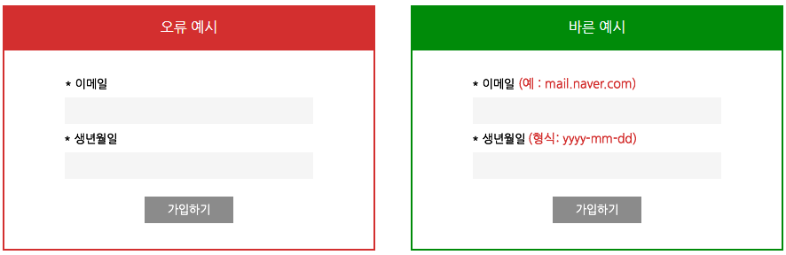
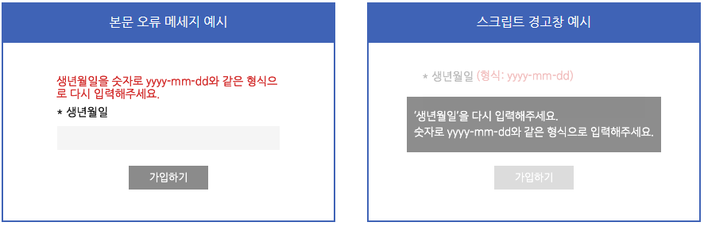

# 접근성 콘텐츠 제작 기법
> 접근성 콘텐츠 제작 기법은 모든 사용자, 특히 장애가 있는 사용자가 웹 콘텐츠에 접근하고 사용할 수 있도록 보장하는 방법입니다. 이 기법은 웹 접근성 지침(WCAG: Web Content Accessibility Guidelines) 표준을 따르는 것이 중요합니다. 각각의 영역에 대해 접근성 작업 시 도움이 될 수 있도록 작업되었습니다. 접근성은 법적 요구사항일 뿐만 아니라 사용자를 위한 기본적인 배려이기도 합니다.  

## 웹 접근성 콘텐츠 제작 기법   
> 사용자가 장애를 가지고 있거나 특정 기능적 제한을 겪는 경우에도 원활하게 웹을 이용할 수 있도록 하는 방법을 의미합니다. 이러한 접근성을 고려한 콘텐츠 제작은 다양한 사용자들의 요구를 충족시키며, 웹의 사용성을 크게 향상시킵니다.    


**키워드**   
#웹 접근성, #웹 접근성 콘텐츠 제작 기법, #한국형 웹 콘텐츠 접근성 지침 2.2, #WCAG2.2, #KWCAG2.2, #보조기술과의호환성, #접근성 테스트 도구 활용 점검방법, #스크린 리더, #Jaws, #NVDA, #센스리더, #Sense Reader, #인지장애인, #시각장애인, #고령자, #비 장애인 사용자


### 오류 정정
**관련 지침 : 입력 오류를 정정할 수 있는 방법을 제공해야 한다.**   
입력서식 작성 시, 사용자의 실수로 오류가 발생할 경우, 이를 정정할 수 있는 방법을 제공해야 한다.      
[WCAG 2.2 Quick Reference - Non-text Content](https://www.w3.org/WAI/WCAG22/quickref/#non-text-content){: target="_blank"}

**사용자 입력 오류 안내**   
온라인 서식에서 오류가 발생하는 경우, 사용자에게 오류가 발생한 위치와 오류를 유발하게 된 이유 등에 관한 정보를 알려 주어야 한다.    
예를 들어, 이름, 주소, 전화번호, 이메일 주소를 입력하도록 구성한 입력 서식에서 일부 항목을 기입하지 않고 제출하였을 경우, 어떤 항목의 입력이 누락되었는지를 알려 주어야 한다.    
시스템 또는 플랫폼에서 발생한 오류에는 본 검사항목이 적용되지 않는다.    

**기대효과**   

- 입력 오류를 수정할 수 있는 방법에 대한 정보를 텍스트로 자세하게 제공하는 것은 학습장애가 있는 사용자가 입력 서식을 성공적으로 작성할 수 있도록 도와준다. 오류가 있는 곳에만 오류 표시를 하면 시각장애인이나 저시력장애인은 오류가 난 곳에 도달하기 전까지는 어떤 오류가 발생했는지 알기 어렵지만, 오류의 내용을 먼저 텍스트로 설명해주거나, 프로그램을 통해 오류가 발생한 위치로 초점을 이동시킨 후 오류의 내용을 설명해주면 입력 오류를 더 쉽게 정정할 수 있다.     
- 실수로 인해 빚어지는 심각한 결과 또는 과실을 피하기 위해 오류 정정에 필요한 정보나 수단을 제공하는 것은 장애인뿐만 아니라 비장애인에게도 도움을 준다.    


#### 1. 필요성        
사용자가 양식 또는 입력 필드에서 오류를 발생시켰을 때, 이를 인지하고 수정할 수 있도록 적절한 오류 메시지와 정정 방법을 제공해야 합니다. 오류가 발생한 위치와 원인을 명확히 제시함으로써 사용자의 인지적 부담을 줄이고 접근성을 확보할 수 있습니다.    

- 입력 오류를 인식하지 못할 경우 서비스 이용에 큰 장애가 발생    
- 오류 메시지가 없거나 모호할 경우 정정이 불가능    
- 장애인, 고령자, 인지장애 사용자의 작업 성공률을 높임    

#### 2. 대상       

| 사용자 유형   | 이유 |
|---------------|------|
| 인지장애인 | 실수 인식과 수정이 어려움 → 구체적인 피드백 필요  
| 시각장애인 | 오류 위치 및 내용을 스크린 리더로 안내받아야 함  
| 고령자 | 메시지 이해가 어려운 경우 많음, 단순하고 명확한 안내 필요  

#### 3. 체크리스트       

- 필수 입력 항목 누락 시 메시지를 표시하는가?    
- 잘못된 입력에 대해 어떤 값이 잘못되었는지 안내하는가?     
- 오류 메시지에 정정 방법 또는 예시를 포함하는가?    
- 시각적 표시 외에 보조기술 사용자에게도 오류를 안내하는가?   

#### 4. 테스트 방법      

- 일부 입력 필드를 비워두고 제출하여 오류 메시지 출력 여부 확인   
- 스크린 리더로 오류 메시지 인식 및 읽기 여부 확인   
- 키보드만으로 오류 필드로 포커스가 이동되는지 확인   

#### 5. QA 지표       

- 오류 발생 시 사용자 정정 성공률   
- 스크린 리더 사용자 오류 인지율   
- 자동 테스트 도구의 오류 검출률 (WAVE, Axe 등)   

#### 6. 개발방법     


#### HTML 예시 – 오류 메시지 제공
```html
<form>
  <label for="email">이메일</label>
  <input type="email" id="email" name="email" required />
  <div id="error-email" role="alert" style="color:red;">이메일을 입력해 주세요.</div>
</form>
```

#### ARIA 예시 – 오류 연결
```html
<input id="email" aria-describedby="error-email" />
<div id="error-email" role="alert">올바른 이메일 주소를 입력하세요.</div>
```

#### Vue 예시
```vue
<template>
  <form @submit.prevent="validateForm">
    <label for="name">이름</label>
    <input id="name" v-model="name" :aria-describedby="nameError ? 'nameError' : null" />
    <p v-if="nameError" id="nameError" role="alert">{{ nameError }}</p>
    <button type="submit">제출</button>
  </form>
</template>

<script setup>
import { ref } from 'vue';
const name = ref('');
const nameError = ref('');
function validateForm() {
  nameError.value = name.value.trim() === '' ? '이름을 입력해 주세요.' : '';
}
</script>
```

#### React 예시
```jsx
function Form() {
  const [name, setName] = React.useState('');
  const [error, setError] = React.useState('');

  const handleSubmit = e => {
    e.preventDefault();
    if (!name.trim()) setError('이름을 입력해 주세요.');
    else setError('');
  };

  return (
    <form onSubmit={handleSubmit}>
      <label htmlFor="name">이름</label>
      <input
        id="name"
        value={name}
        onChange={e => setName(e.target.value)}
        aria-describedby={error ? "name-error" : undefined}
      />
      {error && <div id="name-error" role="alert" style={{ color: "red" }}>{error}</div>}
      <button type="submit">제출</button>
    </form>
  );
}
```
사용자가 입력해야 하는 내용에 대해 쉽게 안내해주어야 합니다.   
<figure>

<figcaption>출처 : 네이버 접근성 정보 접근성 지침 이해하기 - 오류 정정</figcaption>
</figure>

만일 사용자가 잘못 입력했을 경우에는 어느 부분에서 어떤 오류가 났는지 알려 주어야 하고 이를 정정할 수 있는 방법을 제공해야 합니다.   
<figure>

<figcaption>출처 : 네이버 접근성 정보 접근성 지침 이해하기 - 오류 정정</figcaption>
</figure>


#### 7. 점검 기준     

- 오류 발생 시 시각적·청각적(스크린 리더) 방식으로 안내하는가?   
- 정정 방법을 제시하고 있는가?   
- 오류 위치와 내용이 명확하게 제시되는가?   

#### 8. 점검 방법     

- 빈값 제출 등으로 오류 유도 후 안내 메시지 확인     
- 오류 메시지가 스크린 리더로 인식되는지 확인   
- 키보드로 오류 필드 접근 가능한지 확인    

#### 9. 준수 사례       

```html
<label for="phone">전화번호</label>
<input type="tel" id="phone" required />
<p role="alert" id="phoneError">전화번호를 입력해 주세요.</p>
```

#### 10. 미준수 사례       

```html
<input type="text" />
<!-- 오류 발생 시 아무런 안내 없음 -->
```

#### 11. 관련 영상       
<iframe style="width:100%;min-height:315px;" src="https://www.youtube.com/embed/HbaDhv-q0d0?si=Krd7ebfyeeDWErOc" title="YouTube video player" frameborder="0" allow="accelerometer; autoplay; clipboard-write; encrypted-media; gyroscope; picture-in-picture; web-share" referrerpolicy="strict-origin-when-cross-origin" allowfullscreen></iframe>

[AOA11Y 웹 접근성 (오류 정정)](https://www.youtube.com/embed/HbaDhv-q0d0?si=Krd7ebfyeeDWErOc){: target="_blank"}    
   
--- 
<strong style="font-size:20px;cursor:pointer;">접근성 테스트 도구 활용 점검방법</strong>
모바일 앱 접근성 과 내용 동일

 
#### 결론     
모바일 앱 접근성 과 내용 동일


### 참조    
- [Web Content Accessibility Guidelines (WCAG) 2.2](https://www.w3.org/TR/WCAG22/){: target="_blank"}    
- [WCAG 2.2 Understanding Docs](https://www.w3.org/WAI/WCAG22/Understanding/){: target="_blank"}    
- [WCAG (Quick Reference)](https://www.w3.org/WAI/WCAG22/quickref/?versions=2.2&showtechniques=111){: target="_blank"}    
- [웹 콘텐츠 접근성 지침(WCAG) 2.2 - 번역판](https://a11ykr.github.io/wcag22/){: target="_blank"}    
- [smashingmagazine - WCAG 2.2 Checklist with Filter and Links](https://codepen.io/smashingmag/pen/MWLgQzm){: target="_blank"}    
- [MDN 웹 컨텐츠 접근성 지침 이해하기](https://developer.mozilla.org/ko/docs/Web/Accessibility/Understanding_WCAG){: target="_blank"}    
- [보건복지부 블로그](https://blog.naver.com/prologue/PrologueList.naver?blogId=mohw2016){: target="_blank"}     
- [행정안전부 - 전자정부 웹사이트 UI UX 가이드라인](https://www.mois.go.kr/frt/bbs/type001/commonSelectBoardArticle.do?bbsId=BBSMSTR_000000000045&nttId=69451){: target="_blank"}     
- [널리 알리는 기술 소식 커뮤니티](https://nuli.navercorp.com/community/article){: target="_blank"}     
