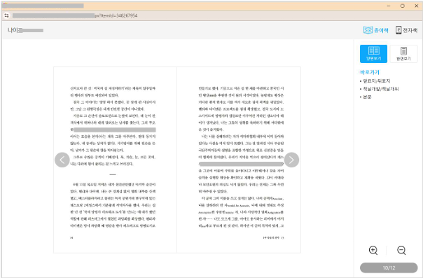
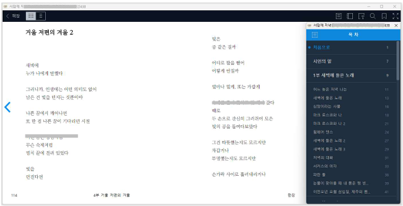
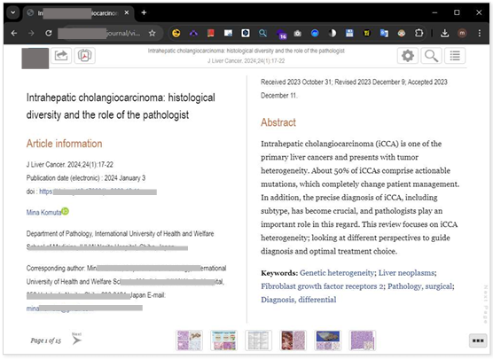

# 접근성 콘텐츠 제작 기법
> 접근성 콘텐츠 제작 기법은 모든 사용자, 특히 장애가 있는 사용자가 웹 콘텐츠에 접근하고 사용할 수 있도록 보장하는 방법입니다. 이 기법은 웹 접근성 지침(WCAG: Web Content Accessibility Guidelines) 표준을 따르는 것이 중요합니다. 각각의 영역에 대해 접근성 작업 시 도움이 될 수 있도록 작업되었습니다. 접근성은 법적 요구사항일 뿐만 아니라 사용자를 위한 기본적인 배려이기도 합니다.  

## 웹 접근성 콘텐츠 제작 기법   
> 사용자가 장애를 가지고 있거나 특정 기능적 제한을 겪는 경우에도 원활하게 웹을 이용할 수 있도록 하는 방법을 의미합니다. 이러한 접근성을 고려한 콘텐츠 제작은 다양한 사용자들의 요구를 충족시키며, 웹의 사용성을 크게 향상시킵니다.    


**키워드**   
#웹 접근성, #웹 접근성 콘텐츠 제작 기법, #한국형 웹 콘텐츠 접근성 지침 2.2, #WCAG2.2, #KWCAG2.2, #보조기술과의호환성, #접근성 테스트 도구 활용 점검방법, #스크린 리더, #Jaws, #NVDA, #센스리더, #Sense Reader, #시각장애인, #학습자 및 연구자, #비장애 사용자


### 고정된 참조 위치 정보 [신규 항목] 
**관련 지침 : 전자출판문서 형식의 웹 페이지는 각 페이지로 이동할 수 있는 기능이 있어야 하고, 서식이나 플랫폼에 상관없이 참조 위치 정보를 일관되게 제공ㆍ유지해야 한다.**   
페이지 구분이 있는 전자출판문서를 웹 페이지 형식으로 제공할 때, 각 페이지에 대한 고정된 참조 위치를 찾을 수 있도록 제공하는 것이 목적이다. 종이책과 디지털 출판물을 동시에 참고하거나 특정 페이지의 문단을 찾아야 할 때, 사용하는 디바이스, 글자 크기·줄 간격 설정이 달라도 동일한 위치를 식별할 수 있도록 돕는다.      

[2.4.13 고정된 참조 위치 정보 (Fixed Reference Points) (Level AAA)](https://www.w3.org/TR/WCAG22/#fixed-reference-points){: target="_blank"}    
[WAI - Understanding Fixed Reference Points](https://www.w3.org/WAI/WCAG22/Understanding/fixed-reference-points.html){: target="_blank"}   

- 전자출판문서 형식의 웹 페이지는 참조 위치 정보(예: 페이지 번호와 같은 페이지 구분자(pagebreak locators))를 제공해야 하고, 각 페이지로 이동할 수 있는 기능도 제공해야 한다.    
- 콘텐츠의 확대/축소 등으로 서식이 변경되거나 플랫폼이 변경되어 참조 위치 정보가 사라지거나 일관된 위치에 제공ㆍ유지되지 않을 경우, 참조 위치 정보를 사용하여 콘텐츠의 특정 부분을 지칭해야 하는 상황(강의 등)에서 어려움이 있을 수 있기 때문에, 해당 참조 위치 정보는 서식이나 플랫폼이 변경되더라도 일관된 위치에 제공ㆍ유지해야 한다.    

**기대효과**   

- 콘텐츠를 확대해서 사용하는 사용자(저시력, 전맹, 인지장애 등)와 확대하지 않고 사용하는 사용자가 페이지 구분자(페이지 번호 등)를 사용하여 동일한 페이지를 참조할 수 있게 된다.    

**[용어]**    
**페이지 구분자(pagebreak locator)** 
페이지 구분을 나타내는 시각적으로 표현되거나 프로그램에 의해 인식 가능한 기준점.    
대표적으로 전자 문서에서의 페이지 번호가 있다.     
디지털 문서나 전자출판문서에서 페이지를 나누는 기준점을 설정하는 기능을 의미한다. 종이책의 페이지 번호처럼, 디지털 문서에서도 위치 정보를 고정하여 페이지를 일정 기준으로 구분한다.    

**전자출판문서**    
텍스트, 이미지, 멀티미디어 등의 디지털 기술의 콘텐츠를 통합적으로 표현할 수 있도록 제작된 문서이다.   

#### 1. 필요성        

전자출판문서 형식의 웹 페이지를 이용할 때 플랫폼이 다르거나, 글자 크기나 줄 간격 설정이 다르거나, 레이아웃이 다르더라도 문서 내 특정 위치를 쉽게 찾을 수 있도록 고정된 참조 위치와 그 위치를 찾을 수 있는 방법이 제공되어야 한다    
예를 들어 수업 시간에 인쇄본에서 ‘26페이지 첫 문단’과와 같이 언급된 부분을 웹 페이지로 제공된 문서에서도 동일하게 찾아야 할 때, 이러한 고정된 참조 위치 정보가 필요하다.    
고정 참조 위치는 특히 마찬가지로 저시력·학습장애·주의력결핍 장애 사용자는 글자 크기나 레이아웃을 조정해도 고정 위치 정보가 있다면 쉽게 원하는 부분으로 이동할 수 있기 때문에 이러한 사용자들에게 매우 유용하다.   
고정된 참조 위치 제공이 필요한 콘텐츠는 다음과 같다.  

- 전자출판문서를 웹페이지로 변환해 제공하는 경우 (예외: PDF 등 전자출판문서를 파일로 그대로 제공하는 경우)     
  전자출판물은 인쇄물과 동일한 위치 기준(페이지 번호)을 가져야 **상호 참조 및 학습 효율성**이 높아짐  
- 인쇄본이 존재하고 해당 페이지 구분을 그대로 웹에 반영해야 하는 경우    
- 전자출판문서를 웹 형태 배포하고, 여러 디바이스나 글꼴 설정 등 변경으로 인해 페이지가 달라질 수 있어 고정 위치가 필요한 경우    
- 스크린 리더 사용자 등도 **페이지 번호를 기준으로 특정 위치 탐색** 가능해야 함  
- 디지털 문서가 어떤 기기, 해상도, 서식에서도 **일관된 참조 정보를 유지**할 수 있어야 함  

#### 2. 대상       

| 사용자 유형         | 이유 |
|----------------------|------|
| 시각장애인            | 스크린 리더를 통해 특정 위치로 빠르게 이동 가능  
| 학습자 및 연구자       | 페이지 참조 기반으로 빠른 정보 탐색  
| 비장애 사용자           | 다른 사용자와 동일한 위치를 공유할 수 있음  

#### 3. 체크리스트       

- 페이지 번호가 모든 플랫폼(PC, 모바일, 리플로우 뷰어 등)에서 동일하게 유지되는가?   
- 참조 위치 이동을 위한 UI(예: ‘10페이지로 이동’)가 있는가?   
- 페이지 번호가 명시적으로 콘텐츠에 표시되어 있는가?   

#### 4. 테스트 방법      

- 전자출판 콘텐츠에서 페이지 이동 기능 존재 여부 확인   
- 페이지 번호가 시각적으로 표시되는지 확인   
- 스크린 리더 사용자 기준에서도 페이지 번호에 접근 가능한지 확인   

#### 5. QA 지표       

- 페이지 번호 표기 일관성률   
- 위치 기반 이동 기능 제공률   
- 참조 위치로 접근 가능성 평가   

#### 6. 개발방법     
- 고정 참조 위치 제공: 화면의 확대 축소에 등 관계 없이 식별할 수 있는 각 페이지(또는 페이지에 해당하는 구간)에 고유 식별자(id 등)를 부여한다.    
  (예) 대응이 필요한 물리적 페이지 번호나 구분자를 id="page26" 같이 부여하여 변하지 않는 위치 정보를 제공한다.     
- 고정 위치 간 이동 UI: 페이지 번호 입력창, 드롭다운, 버튼 등으로 사용자가 특정 페이지(참조 위치)로 바로 이동할 수 있는 UI를 제공한다.    
  (예외) 목차(TOC)는 장 구분은 가능하지만, 모든 페이지에 1:1 대응이 어려워 대안이 될 수 없다.    
- 일관성 유지: 화면 확대와 축소, 글자 크기나 폰트, 레이아웃 변경 시에도 페이지 구분자는 동일한 위치를 가리킬 수 있어야 한다.    

해당 검사 항목의 예외 대상은 다음과 같다.   
- 별도 애플리케이션 설치 후 실행하여 볼 수 있는 전자출판문서 형태 (URL 없이 별도 뷰어 프로그램 사용 시)    
- 웹 페이지로 직접 변환하지 않은 PDF 파일 등의 콘텐츠    
- 단일 스크롤, 즉 한 페이지로 콘텐츠를 제공하는 웹 소설 등 (페이지 구분이 없는 콘텐츠)    


#### HTML 예시 – 페이지 번호 마킹 및 링크
```html
<div class="page" id="page-10" aria-label="페이지 10">
  <p>10페이지 본문 내용입니다.</p>
  <a href="#page-11">다음 페이지로 이동</a>
</div>
```

#### Vue 예시 – 페이지 이동 기능
```vue
<template>
  <div>
    <p :id="'page-' + currentPage" :aria-label="`페이지 ${currentPage}`">
      {{ currentPage }} 페이지 내용
    </p>
    <button @click="goToNext">다음 페이지</button>
  </div>
</template>

<script setup>
import { ref } from 'vue';
const currentPage = ref(10);

function goToNext() {
  currentPage.value++;
}
</script>
```

#### React 예시
```jsx
import React, { useState } from 'react';

function PageNavigator() {
  const [page, setPage] = useState(10);

  return (
    <div>
      <p id={`page-${page}`} aria-label={`페이지 ${page}`}>
        {page} 페이지 내용
      </p>
      <button onClick={() => setPage(page + 1)}>다음 페이지</button>
    </div>
  );
}
```

#### 7. 점검 기준     

- 문서에 페이지 식별 정보(번호 또는 참조 태그)가 있는가?   
- 시각적, 보조기술 모두 접근 가능한 방식으로 제공되는가?    
- 이동 기능 또는 경로가 제공되는가?   

#### 8. 점검 방법     

- 콘텐츠에서 각 페이지 또는 섹션에 번호, ID가 명시되어 있는지 확인    
- DOM에서 `id`, `aria-label` 등을 이용해 페이지 식별이 가능한지 점검    
- 스크린 리더에서 페이지 번호를 인식하고 안내하는지 확인    

#### 9. 준수 사례(예외 사례)       

**예외 사례 - PDF 파일 뷰어**   
출판 된 도서의 미리보기를 PDF 파일 그대로 뷰어 형태로 제공하는 경우로, 고정된 레이아웃을 가지고 있어 페이지 변경없이 확대, 축소된다. PDF 자체가 이미 고정된 페이지 구분을 가지고 있으며, 웹페이지로 직접 변환되어 있지 않으므로 해당 검사항목의 적용 대상으로 볼 수 없다.    

<figure>

<figcaption>출처 : 웹 접근성을 고려한 콘텐츠 제작기법 개정판</figcaption>   
</figure>

**예외 사례 - 설치가 필요한 뷰어 애플리케이션**   
웹 브라우저가 아니라, 별도의 뷰어 프로그램(앱)을 설치 후 실행하여 도서를 확인하는 방식이다.  URL로 접근 가능한 웹페이지가 아니며, 웹 표준 기술로 직접 제공되는 전자출판문서가 아니므로 해당 검사 항목의 검사 대상이 아니다.     

<figure>

<figcaption>출처 : 웹 접근성을 고려한 콘텐츠 제작기법 개정판</figcaption>   
</figure>

#### 10. 미준수 사례       

**논문 전자출판문서를 웹페이지로 제공한 사례**   
논문의 전자출판문서(ePub)를 웹페이지로 볼 수 있게 제공하였다. 이 문서는 사용자가 모니터 해상도나 브라우저 확대, 축소 여부 또는 웹페이지 상에서 폰트 크기나 줄 간격 등을 변경할 수 있으며, 페이지별로 이동 기능도 구현되어 있다.    
이와 같이 사용자 이용 환경이나 설정에 따라 웹페이지상 페이지 번호가 변경된다. 사용자가 폰트 크기나 줄 간격을 조정할 때마다 페이지가 달라져서, 고정된 참조 위치 정보가 유지되지 않는다. 결과적으로 다양한 상황에서 동일한 ‘2’페이지에 해당하는 콘텐츠를 정확히 찾아가기 어렵다.    

<figure>

<figcaption>출처 : 웹 접근성을 고려한 콘텐츠 제작기법 개정판</figcaption>   
</figure>

**개선 방안**    
고정된 참조 위치 정보를 웹페이지 각 구간에 지정하고, 화면 낭독 프로그램 및 사용자 인터페이스(UI)에서 이를 인식하고 조작할 수 있도록 한다. 예로 “페이지 번호 입력” 창을 제공하거나, 목차와 별도로 페이지 단위 바로가기를 구축한다. 사용자가 폰트 크기를 바꿔도 해당 위치가 동일하게 식별되도록 설계한다.    


#### 11. 관련 영상       
<iframe style="width:100%;min-height:315px;" src="https://www.youtube.com/embed/lVEDZ1l_A9g?si=IV0C1jAynOlvuEzB" title="YouTube video player" frameborder="0" allow="accelerometer; autoplay; clipboard-write; encrypted-media; gyroscope; picture-in-picture; web-share" referrerpolicy="strict-origin-when-cross-origin" allowfullscreen></iframe>

[리베하얀 웹 접근성 (고정된 참조 위치 정보)](https://www.youtube.com/embed/lVEDZ1l_A9g?si=IV0C1jAynOlvuEzB){: target="_blank"}    
   
--- 
<strong style="font-size:20px;cursor:pointer;">접근성 테스트 도구 활용 점검방법</strong>
모바일 앱 접근성 과 내용 동일

 
#### 결론     
모바일 앱 접근성 과 내용 동일


### 참조    
- [Web Content Accessibility Guidelines (WCAG) 2.2](https://www.w3.org/TR/WCAG22/){: target="_blank"}    
- [WCAG 2.2 Understanding Docs](https://www.w3.org/WAI/WCAG22/Understanding/){: target="_blank"}    
- [WCAG (Quick Reference)](https://www.w3.org/WAI/WCAG22/quickref/?versions=2.2&showtechniques=111){: target="_blank"}    
- [웹 콘텐츠 접근성 지침(WCAG) 2.2 - 번역판](https://a11ykr.github.io/wcag22/){: target="_blank"}    
- [smashingmagazine - WCAG 2.2 Checklist with Filter and Links](https://codepen.io/smashingmag/pen/MWLgQzm){: target="_blank"}    
- [MDN 웹 컨텐츠 접근성 지침 이해하기](https://developer.mozilla.org/ko/docs/Web/Accessibility/Understanding_WCAG){: target="_blank"}    
- [보건복지부 블로그](https://blog.naver.com/prologue/PrologueList.naver?blogId=mohw2016){: target="_blank"}     
- [행정안전부 - 전자정부 웹사이트 UI UX 가이드라인](https://www.mois.go.kr/frt/bbs/type001/commonSelectBoardArticle.do?bbsId=BBSMSTR_000000000045&nttId=69451){: target="_blank"}     
- [널리 알리는 기술 소식 커뮤니티](https://nuli.navercorp.com/community/article){: target="_blank"}     
