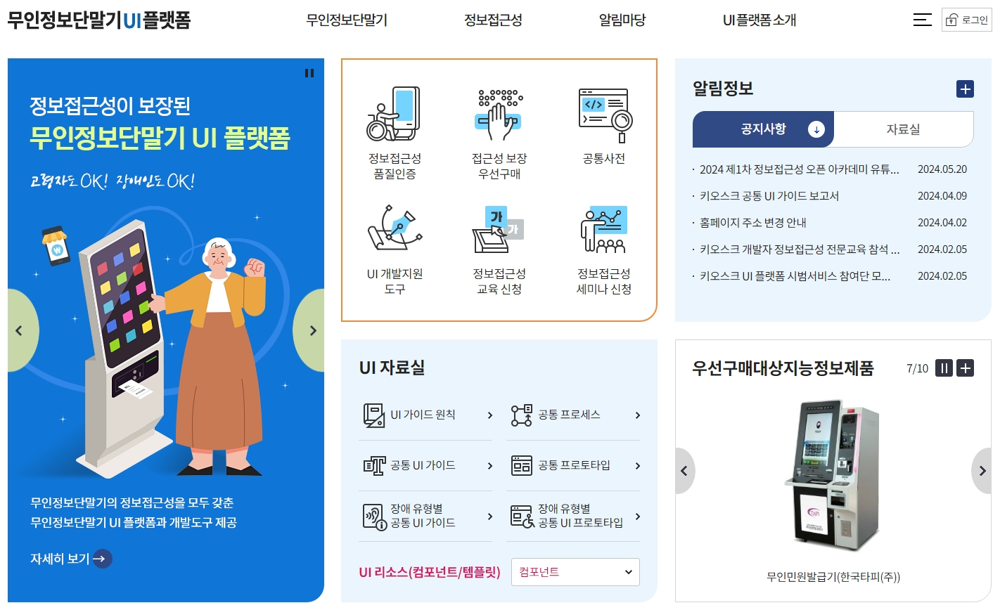

## 7. 접근성 콘텐츠 제작 기법

### 무인정보단말기 접근성
> 무인정보단말기 접근성 콘텐츠 제작 기법은 **무인정보단말기 UI플랫폼** 사이트에 자세히 안내되고 있어서 기본적인 UI가이드 정보만 안내하고 상세내용은 사이트 링크로 제공. 
무인정보단말기(키오스크) UI(사용자 인터페이스) 가이드는 무인정보단말기 시스템을 설계하고 개발할 때 필요한 UI 디자인에 대한 지침을 제공하는 문서이다. 이 가이드는 사용자 경험(UX)을 향상시키고, 사용자가 무인정보단말기를 효과적으로 이용할 수 있도록 하는 데 중점을 둔다. 무인정보단말기의 UI는 모든 사용자에게 접근 가능해야 하므로 장애인을 위한 보조 기술 및 기능성을 고려하여 UI를 설계하도록 지침을 제시한다.

<figure aria-hidden="true" style="text-align:center">
   
   <figcaption>
      이미지 출처 : 무인정보단말기 UI 플랫폼 사이트 메인 캡쳐 
      <a href="https://www.kioskui.or.kr/index.do" target="_blank" title="새 창 열림">무인정보단말기 UI 플랫폼</a>   
   </figcaption>
</figure>

#### 무인정보단말기 개요
> 무인정보단말기(키오스크) UI(사용자 인터페이스) 가이드는 무인정보단말기 시스템을 설계하고 개발할 때 필요한 UI 디자인에 대한 지침을 제공하는 문서이다. 이 가이드는 사용자 경험(UX)을 향상시키고, 사용자가 무인정보단말기를 효과적으로 이용할 수 있도록 하는 데 중점을 둔다. 무인정보단말기의 UI는 모든 사용자에게 접근 가능해야 하므로 장애인을 위한 보조 기술 및 기능성을 고려하여 UI를 설계하도록 지침을 제시한다.   
[무인정보단말기 UI 플랫폼 > 무인정보단말기 > 안내](https://www.kioskui.or.kr/index.do?menu_id=00001026&servletPath=%2Findex.do){: target="_blank"}

#### 무인정보단말기 분류
#####  대분류
> 선행 연구(NIA 연구반, 22년)를 통해 사용자의 무인정보단말기 활용 목적 및 개별 업체의 자율성을 고려하여 4개 유형으로 분류하였다. 본 가이드는 대분류 UI 가이드를 제공한다.

1. **유통(결제형)**   
   - 상품코드(바코드 등)를 사용자가 직접 스캔해서 제품을 구매하는 유형   
     * 예. 대형마트, 편의점 등   
2. **주문(티켓형)**   
   - 직원의 도움이 필요한 음식물 등의 주문 및 구매   
     * 예. 커피숍, 패스트푸드점 등   
3. **발권(티켓/서류)**   
   - 요청에 대해 정보처리 후 인쇄물 제공   
     * 예. 무인민원발급기, 무인처방전발행기, 셀프체크인(공항, 교통)   
4. **안내**   
   - 사용자 조작에 따라 정보 제공   
     * 예. 관광정보시스템, 정보제공시스템, 안내시스템 등   

#####  중분류
> 무인정보단말기 관련 고시인 「장애인·고령자 등의 정보 접근 및 이용 편의 증진을 위한 고시」(과기정통부, 22년)에서 16개 유형으로 분류되어 있으며, 아래 내용은 대분류와 대응하여 매핑한 결과이다.   

1. **유통**   
   - (1)무인주유기 (2)무인주차정산기 (3)무인결제기 (4)무인도서대여반납기      
2. **주문**   
   - (5)무인주문기   
3. **발권**   
   - (6)무인민원발급기 (7)무인발권기 (8)무인발매기 (9)무인증명발매기 (10)셀프체크인 (11)무인처방전발매기 (12)금융자동화기기   
4. **안내**   
   - (13)종합정보시스템 (14)위치정보시스템   
5. **기타**   
   - (15)무인사용자인증기 (16) 기타(사물함, 택배함 등)   

#### UI 가이드 원칙
> UI 원칙은 무인정보단말기 서비스의 사용자 경험을 위해 무인정보단말기 UI 설계 시 준수해야 할 기본 원칙과 방향성을 담고 있다.   
[무인정보단말기 UI 플랫폼 > 무인정보단말기 > UI 가이드 원칙](https://www.kioskui.or.kr/index.do?menu_id=00001210){: target="_blank"}   

1. **사용자 중심 UI**   
   > 사용자 중심 UI 원칙은 사용자 친화적인 UI를 설계해야 함을 의미한다.   
   
   - 용어를 알기 쉽게 정의한다.   
   - 무인정보단말기에서 요구하는 과업의 수준을 사용자에게 적절하게 정의한다.   
   - 사용자가 인지하기 쉬운 무인정보단말기의 정확한 피드백을 정의한다.   
   - UI 컴포넌트는 실제와 유사한 메타포를 바탕으로 만든다.   

2. **사용자에 최적화된 UI**   
   > 사용자에 최적화된 UI 원칙은 사용자의 다양한 능력을 고려한 UI를 설계해야 함을 의미한다.   

   - 무인정보단말기에 사용되는 정보, 기능, 컨트롤을 정의한다.
   - 정보 및 컨트롤 UI 컴포넌트를 인식하기 쉽게 가시적으로 제작한다.
   - 접근성과 사용성 모두 고려해 설계한다.
   - 무인정보단말기에 필요한 접근성 기능을 정의한다.

3. **직관적인 UI**   
   > 직관적인 UI 원칙은 학습이 필요 없는 인지적으로 쉬운 UI를 설계해야 함을 의미한다.   

   - 무인정보단말기에서 발생할 수 있는 오류 상황을 정의한다.
   - 오류 상황에 맞는 적절한 오류 메시지의 피드백 방식을 정의한다.
   - 한가지 방식이 아니라 다양한 사용자가 인지할 수 있는 피드백 방식을 개발한다.
   - 공통된 화면 레이아웃을 통해 구조화된 UI 구성한다.

4. **조작하기 쉬운 UI**   
   > 조작하기 쉬운 UI 원칙은 사용자가 쉽게 화면을 컨트롤 할 수 있는 UI를 설계해야 함을 의미한다.  

   - 무인정보단말기의 기능 및 컨트롤을 정의한다.
   - 기능 및 컨트롤이 다양한 사용자가 쉽게 제어할 수 있도록 구성한다.
   - 과업을 수행하는 도중 쉽게 되돌릴 수 있는 기능을 제공한다. 

5. **지속 가능한 일관된 UI**   
   > 지속 가능한 일관된 UI 원칙은 사용자가 사용에 있어서 일관된 UI를 설계해야 함을 의미한다.  

   - 무인정보단말기 사용에 필요한 과업을 정의한다.
   - 과업의 프로세스가 일관되게 설계한다.
   - 공통된 화면 레이아웃을 통해 구조화되고 일관된 UI 구성한다. 

6. **개인의 정보가 보호되는 UI**   
   > 개인의 정보가 보호되는 UI 원칙은 입출력되는 개인정보가 보호되도록 설계해야 함을 의미한다.    

   - 무인정보단말기에 입력 및 출력되는 개인정보를 정의한다.
   - 개인정보가 보호되는 방법 및 기능을 정의한다.

#### UI 사용성 체크리스트
> 누구에게나 동등한 기회 제공을 위해 무인정보단말기의 사용성 및 접근성을 보장할 필요가 있다.   
[무인정보단말기 UI 플랫폼 > 무인정보단말기 > 공통 UI 가이드](https://www.kioskui.or.kr/index.do?menu_id=00001034){: target="_blank"}   

**화면 레이아웃**   
- **무인정보단말기의 화면 구성(레이아웃)은 일관성 있게 제공해야 한다.**   
화면 요소가 작업의 순서에 맞게 위에서 아래로, 왼쪽에서 오른쪽으로, 화면의 순서상 일관성 있는 것이 정보를 파악하기 쉽다. 시각장애인은 수직계열화 개념이 익숙하므로 화면의 정보 구조를 위에서 아래로 제공하는 것을 권장한다. 모든 설계 요소는 사용자가 논리적으로 쉽게 이해할 수 있도록 단순하고 일관성 있게 배치되어야 한다.   
- **한 화면에 하나의 과업만 보여줘야 한다.**   
사용자의 부하를 줄이기 위해 되도록 한 화면에 하나의 과업만 보여줘야 한다. 사용자가 서비스를 사용하는 흐름이 끊어지지 않게 과업 도중에 새로운 과업의 제안/추천/광고 정보는 지양해야 한다.   
- **화면은 27인치 이상의 크기를 권장한다.**   
접근성을 고려한 글자 크기, 컨트롤의 크기와 간격을 생각했을 때, 27인치 이하의 화면은 콘텐츠를 효율적으로 담기에 무리가 있을 수 있다.
접근성을 위해 27인치 이상의 크기를 권장한다.   

<figure style="text-align:center">
      
    <figcaption>[이미지 출처] 무인정보단말기 UI 플랫폼</figcaption>
</figure>

**사용성 체크리스트**   
- **정보 영역과 컨트롤 영역을 중심 시야각에 위치하도록 한다.**   

<figure style="text-align:center">
      
    <figcaption>[이미지 출처] 무인정보단말기 UI 플랫폼</figcaption>
</figure>

- **무인정보단말기 과업의 단계 표시를 해야 한다.**   

<figure style="text-align:center">
      
    <figcaption>[이미지 출처] 무인정보단말기 UI 플랫폼</figcaption>
</figure>

- **모든 컨트롤은 다중 누르기(multi-touch) 동작을 요구하지 않아야 한다.**   
- **화면 상의 모든 글자의 크기는 글자의 높이가 12mm 이상으로 해야 한다.**     
글자 높이 12mm를 위한 기준 픽셀 (기준. 해상도 1920x1080, 화면 비율 16:9)   
22인치 : 약 48px, 24인치 : 약 43px, 27인치 : 약 39px, 32인치 : 약 33px, 40인치 : 약 27px   
`주의: 실제 업체마다 해상도와 화면 비율이 다르므로, 설계 과정에서 직접 측정해야 한다.`   

<figure style="text-align:center">
      
    <figcaption>[이미지 출처] 무인정보단말기 UI 플랫폼</figcaption>
</figure>

- **모든 컨트롤의 크기는 150mm2이상, 한 변의 길이 12mm 이상, 간격은 2.5mm 이상으로 해야 한다.**   

<figure style="text-align:center">
    2이상, 한 변의 길이 12mm 이상,  간격은 2.5mm 이상으로 해야 한다 권장 사례 예시이미지">  
    <figcaption>[이미지 출처] 무인정보단말기 UI 플랫폼</figcaption>
</figure>

- **의미 있는 글자나 아이콘, 컨트롤은 배경과 명도 대비가 명확해야 한다.**   
- **콘텐츠는 시각적으로 명확히 구분될 수 있도록 한다.**   

<figure style="text-align:center">
      
    <figcaption>[이미지 출처] 무인정보단말기 UI 플랫폼</figcaption>
</figure>

- **불필요한 이미지 삽입을 지양해야 한다.**   

<figure style="text-align:center">
      
    <figcaption>[이미지 출처] 무인정보단말기 UI 플랫폼</figcaption>
</figure>

- **아이콘은 식별하기 쉬운 표준 모양으로 글자와 함께 표시되어야 한다.**   

<figure style="text-align:center">
      
    <figcaption>[이미지 출처] 무인정보단말기 UI 플랫폼</figcaption>
</figure>

- **글자 정보는 일상적이고 자연스러운 용어를 사용해야 한다.**   

<figure style="text-align:center">
      
    <figcaption>[이미지 출처] 무인정보단말기 UI 플랫폼</figcaption>
</figure>

- **색은 강조용으로 사용하고 패턴과 함께 제공해야 한다.**   

<figure style="text-align:center">
      
    <figcaption>[이미지 출처] 무인정보단말기 UI 플랫폼</figcaption>
</figure>

- **추가적인 탐색 인터랙션이 없도록 2줄 카테고리를 사용한다.**   

<figure style="text-align:center">
      
    <figcaption>[이미지 출처] 무인정보단말기 UI 플랫폼</figcaption>
</figure>

- **늘어난 화면은 페이징을 기본으로 스크롤(Scroll) 구성을 해야 한다.**   
- **페이지가 늘어나는 경우, 명확한 페이지 표시를 해야 한다.**   

<figure style="text-align:center">
      
    <figcaption>[이미지 출처] 무인정보단말기 UI 플랫폼</figcaption>
</figure>

- **이전, 처음으로 컨트롤을 제공해야 한다.**   
- **직원 호출 컨트롤을 통해 지원 서비스를 제공해야 한다.**   

<figure style="text-align:center">
      
    <figcaption>[이미지 출처] 무인정보단말기 UI 플랫폼</figcaption>
</figure>

- **사용자의 조작 없이 자동으로 변경되는 콘텐츠는 사용되지 않아야 한다.**   
- **사용자의 선택적 응답을 요구하는 조작에는 시간제한(timeout)을 두지 않아야 한다.**   

<figure style="text-align:center">
      
    <figcaption>[이미지 출처] 무인정보단말기 UI 플랫폼</figcaption>
</figure>

- **화면에 깜빡이거나 번쩍이는 객체가 사용되지 않아야 한다.**   
- **장애인과 고령자에게 접근성을 위한 기능을 제공해야 한다.**   
- **고대비 화면을 제공하며, 사용자가 이를 쉽게 활성화할 수 있도록 제공하여야 한다.**   
- **의미 있는 모든 콘텐츠는 대체 콘텐츠와 함께 제공해야 한다.**   
- **의미 있는 모든 콘텐츠는 음성을 통해 안내해야 한다.**   
- **점자 표시를 제공해야 한다.**   
- **의미 있는 모든 콘텐츠는 수어 안내를 함께 제공해야 한다.**   
- **컨트롤 영역의 위치는 지면에서 400mm~1,220mm 사이에 있어야 한다.**   
- **화면 내의 시각적 정보의 위치는 바닥으로부터 1,220mm를 넘지 않아야 한다.**   
- **중요한 입력이 완료된 경우에는 이를 알려주는 소리 정보를 제공해야 한다.**   
- **입력 오류를 정정하는 방법을 제공해야 하고, 오류 발생 원인에 대한 정확한 시각/비시각 안내가 제공되어야 한다.**   
- **개인정보는 사용자가 직접 설정할 수 있도록 제공해야 한다.**   
- **생체 인식 형태의 사용자 식별 또는 제어를 사용하는 경우, 사용자를 인식할 수 있는 다양한 방법을 제공해야 한다.**   
- **무인정보단말기에 입력 및 출력되는 개인정보는 보호되어야 한다.**   

<figure style="text-align:center">
      
      
    <figcaption>[이미지 출처] 무인정보단말기 UI 플랫폼</figcaption>
</figure>

- **지원되는 모든 외국어 서비스는 한국어 서비스와 동등한 수준의 접근성 서비스를 제공해야 한다.**   

#### 장애 유형별 UI
> **의미 있는 모든 콘텐츠는 대체 콘텐츠와 함께 제공해야 한다.**   
대체 콘텐츠(이미지, 음성 안내, 자막 안내, 수어 안내 등)를 표시해주면 고령자, 장애인 등이 무인정보단말기의 반응을 인지하기 편할 수 있다. 화면에 문자 및 그림, 영상 정보가 의미를 지니는 경우, 이와 동등한 대체 콘텐츠를 제공하여야 한다. 모든 그림과 영상 정보에 대해서 대체 텍스트가 정확한 내용으로 제공되어야 한다.   
[무인정보단말기 UI 플랫폼 > 무인정보단말기 > 장애 유형별 공통 UI 가이드 > 음성](https://www.kioskui.or.kr/index.do?menu_id=00001260){: target="_blank"}   

##### 1. 시각장애인 (음성 안내)   
> 의미 있는 모든 콘텐츠는 음성을 통해 안내해야 한다.   
모든 시각적 정보는 음성과 함께 제공해야 한다. 무인정보단말기의 각 화면에서 어떠한 정보가 주고 어떠한 과업을 수행해야 하는지 알 수 있도록 음성을 통해 안내하여 시각장애인의 정확한 무인정보단말기의 사용을 지원해야 한다.

**음성 출력 기준**   
(단위: dBA (※ A-weighted decibel))
- **음량 보장**   
  * 기준 음량 : 65dBA   
  * 스피커를 통해 제공되는 음량은 오픈된 장소에서도 인지할 수 있도록 65dBA 보장해야 하며, 65dBA 이하로 조절할 수 있는 수단을 제공해야 한다.   
- **음량 초기화**   
  * 기준 음량 : 65dBA 이하   
  * 단말기 음성이 소음이 되지 않도록 사용 후 스피커 음량을 65dBA 이하로 자동으로 작은 소리로 초기화할 수 있는 기능이 제공되어야 한다.   
- **음량 조절 범위**   
  * 기준 음량 : 18dB 이상   
  * 사용자의 청력에 따라 조절할 수 있는 충분한 범위를 제공하기 위해 음량 조절 범위는 18dB 이상으로 한다. (예. 65dBA-18dB ~ 65dBA+18dB)   
- **음량 조절 단계**   
  * 기준 음량 : 12dB 이하   
  * 음량 조절 단계는 12dB 미만으로 하여 정교한 조절이 가능하게 한다. 적어도 하나 이상의 조절 단계를 제공하도록 설계되어야 한다.   

**음성 안내 세부 설정**   
- **사용자가 인지할 수 있는 음성 출력 기준을 준수해야 한다.**   
음량의 크기는 65dBA를 보장하며, 음량의 조절 범위는 18dB 이상으로 제공해야 한다.   \

- **음성 안내를 제어할 수 있도록 해야 한다.**   
음성 안내를 중지할 수 있는 기능이 제공되어야 하며 음성 안내에 대한 음량 및 속도를 직접 조절할 수 있도록 제공해야 한다.    
음성 안내 다시 듣기 기능을 제공함으로써 편의성을 제공한다.     
과업에 방해가 될 수 있으니, 사용자의 선호에 따라 음성 안내를 활성화하거나 차단할 수 있어야 한다.   
- **다시 듣기 기능을 제공해야 한다.**    
음성으로 안내되는 긴 문장을 기억하기 어려운 사용자는 이를 반복해서 읽어주는 수단이 필요하다.    
‘다시 듣기’ 컨트롤을 제공하여, 해당 컨트롤을 누를 때마다 직전의 음성 안내 또는 맥락에 맞는 음성 안내를 반복해서 읽어준다.      
- **음성 안내 종료 기능을 제공해야 한다.**   
음성을 제공하는 무인정보단말기는 음성으로 읽어주는 과정에서, 이를 종료할 수 있는 기능이 제공되어야 한다.    
화면 전환, 서식 작성 등과 같이 맥락의 변화가 있을 경우, 음성 안내를 멈추지 않으면 맥락의 변화로 인한 새로운 음성 안내와 중첩되어 사용자가 음성 안내를 정확히 인식하기 어렵다.   
컨트롤이나 키를 누르면 이전의 음성 안내를 멈추고 새로운 음성 안내를 시작한다.   

**음성 안내 원칙**   
- **음성 안내를 간결하고 명확하게 제공해야 한다.**   
음성 안내 제공 시 피드백 및 안내를 짧게 유지하여 제공한다. 발화량을 단순하게 유지하여 간결하고 짧게 제공하도록 한다. 음성 안내 시 간결한 방식으로 제공하며 시각장애인이 쉽고 빠르게 이해하고 접근할 수 있도록 한다.
- **음성 안내는 인터페이스와 마찬가지로 일관성이 있어야 한다.**   
음성 안내는 무인정보단말기 사용에 있어서 유사한 동작이 유사한 결과를 초래하도록 하여 일관성을 유지해야 한다.
- **실제 세계의 언어와 개념을 일치시켜야 한다.**   
음성 안내는 실제 세계의 상징과 조작법과 일치시켜야 한다. 음성 안내에서 사용되는 언어와 개념은 사용자가 일상적으로 사용하는 것과 일치해야 한다. 사용자에게 친숙한 단어, 구어체 등을 사용하여 정보를 자연스럽고 논리적인 순서로 제공할 수 있어야 한다. 개념을 일치하여 시각장애인들에게 혼란을 방지하고 이해하기 쉽도록 도와줄 수 있다. 시각장애인들에게 ‘예, 아니요’ 응답을 받을 경우에는 숫자 키패드 버튼으로 안내하기보단 ‘확인’, ‘취소’ 버튼을 누르도록 안내하도록 한다.
- **시스템의 가시성/피드백을 제공해야 한다.**    
음성 안내는 무인정보단말기의 상태를 표시하고 사용자에게 유익한 피드백을 제공해야 한다. 시각장애인이 입력에 대한 피드백을 음성 안내를 통해 제공하거나 현재 무인정보단말기의 진행 상태를 시각장애인에게 명확히 전달하는 것을 의미한다. 음성 안내를 통한 가시성/피드백 제공은 시각장애인에게 입력이 올바르게 이루어졌는지 인지하는 데 도움을 주어 입력 오류와 혼란을 최소화하도록 한다.
- **사용자가 오류를 인식하고 복구할 수 있도록 지원해야 한다.**   
사용자 오류 방지를 지원해야 한다. 음성 안내는 사용자가 무인정보단말기를 사용할 때 오류가 발생하지 않도록 오류 방지 메커니즘과 제한 조건이 구축되어 있어야 한다. 사용자 인터페이스는 간단한 오류 처리와 복구 기능을 제공하여 사용자가 오류를 인식하고 복구할 수 있도록 도와야 한다.

**음성 안내 제작**   
- **무인정보단말기가 제공하는 서비스에 맞는 음성 안내 스크립트를 작성해야 한다.**   
음성 안내 스크립트를 작성하는 데 있어서, 먼저 무인정보단말기가 어떤 서비스나 정보를 제공하는지 이해하고 목적을 정의한다. 무인정보단말기를 사용할 예상 대상 사용자를 고려하여, 나이, 언어, 문화적 배경 등을 고려하여 음성 안내 스크립트를 작성한다. 사용자의 흐름을 고려하여 시나리오 기반으로 설계하며, 사용자가 어떤 단계에서 어떤 정보가 있어야 하는지를 고려하여 음성 안내를 설계해야 한다.   
- **간결하고 명확한 언어를 사용해야 한다.**   
음성 안내를 만들 때는 명확하고 사용자가 이해하기 쉬운 스크립트를 작성해야 한다. 자연스러운, 일상적인 언어를 사용하여 음성 안내를 설계해야 하며, 형식적이거나 어색한 표현을 피한다.   
- **음성 안내의 어조와 속도는 사용자를 고려해야 한다.**   
음성 안내의 목적을 정의하고 어떤 사용자를 대상으로 하는지를 정의한다. 명확한 목적과 대상 사용자를 기반으로 설계해야 한다. 안내 음성의 톤과 속도를 자연스럽게 조절하고, 긴장이나 혼란을 줄이기 위해 차분하고 친근한 어조를 사용해야 한다. 사용자에게 친근하고 신뢰감을 줄 수 있는 톤을 선택한다.   
- **설계한 음성 안내를 실제 사용자에게 테스트하고, 사용자 피드백을 수집하여 개선해야 한다.**   
- **음성 안내 시스템이 다루는 정보가 민감한 경우, 보안 및 개인정보 보호에 유의하여 시스템을 구성해야 한다.**   
보안 및 개인정보 보호 민감한 정보를 다루는 경우 보안과 개인정보 보호를 고려하여 음성 안내를 설계해야 한다.

**음성 안내 항목 및 내용**   
- **음성 안내는 무인정보단말기 사용 도움말을 제공해야 한다.**   
음성 안내 시 사용자에게 무인정보단말기 사용 도움말을 제공하여 명확한 사용 방법을 안내해야 한다.    
상세한 도움말은 사용자의 오류를 줄이고 불필요한 혼란을 방지하는 데 도움을 준다.    
사용자가 과업별로 진행하기 위하여 어떠한 과업을 진행해야 하는지, 어떻게 입력하는지 등에 대해서 알려주어야 한다.    
추가로 이어폰 단자, 카드 투입구, 영수증 출력구, 바코드 등 디바이스의 위치를 안내하여 사용할 수 있도록 해야 한다.   
- **무인주문기 음성 안내 예시**   
음성 안내 설계 가이드에 따라 무인주문기 음성 안내의 각 화면의 음성 안내를 작성한 예시이다.    
이를 참고하여 음성 안내를 설계할 수 있다.   

   <video controls="" style="width:100%;">
      <source src="https://www.kioskui.or.kr/cmsh/kioskui.or.kr/file/order_voice.mp4" type="video/mp4">
   </video>
   
무인주문기 음성 안내 예시 출처 - 무인정보단말기 UI 플랫폼

   
https://www.kioskui.or.kr/index.do?menu_id=00001089

##### 2. 시각장애인 (점자 표기)   
> **점자 표시를 제공해야 한다.**   
무인정보단말기에 부착된 장치(예: 신용카드 투입구, 티켓 배출함 등)에 용도와 목적을 알 수 있도록 점자 표시를 하여 시각장애인의 정확한 무인정보단말기의 사용을 지원해야 한다.   
[무인정보단말기 UI 플랫폼 > 무인정보단말기 > 장애 유형별 공통 UI 가이드 > 점자](https://www.kioskui.or.kr/index.do?menu_id=00001049){: target="_blank"}   

**점자 기본 정의**   
> 점자란 시각장애인들이 사용하는 ‘문자’ 다. 
점자는 양각된 6개의 점(가로 3줄, 세로 2줄)으로 이루어지며, 점의 수와 위치에 의하여 63개의 서로 다른 점형이 만들어지고 각 점형에 글자를 배정하여 문자 체계를 이룬다.    
한 칸을 구성하는 각각의 점에는 번호가 매겨져 있으며, 왼쪽 위에서 아래로 1점, 2점, 3점과 오른쪽 위에서 아래로 4점, 5점, 6점으로 구분한다.    
점자는 시각을 통해 읽는 문자와 달리 튀어나온 점을 촉각으로 식별해야 해서 점의 높이, 점의 지름 및 점간 거리 등이 점자식별 및 가독성에 많은 영향을 미친다.    
점자에 대한 자세한 내용은 국립국어원의 ‘한글 점자 규정 해설’을 참고하길 바란다.   
[국립국어원 ‘점자 규정과 해설’](https://www.korean.go.kr/front/page/pageView.do?page_id=P000499){: target="_blank"}   

<figure style="text-align:center">
      
    <figcaption>[이미지 출처] 무인정보단말기 UI 플랫폼</figcaption>
</figure>

**점자 표시 규격**   
- **한국 점자 규격을 준수하여 점자 표시를 해야 한다.**   
   * 무인정보단말기에 표시되는 점자는 가독성이 높도록 점자 규격을 준용해야 하며, 점자 표시는 반구형으로 제작하는 것을 원칙으로 한다. 평평하고 각진 부식형의 경우 손빔, 이질적 촉지감, 가독성 등 이유로 사용을 금하도록 한다.   
   * 「점자법」제10조(점자규정 등의 제정 및 개정)에 따라 한국 점자 규정(문화체육관광부고시)에서 점자 표시 방법을 규정하고 있다. 무인정보단말기의 점자 표시는 해당 고시를 따라 기재하는 것을 기본 원칙으로 한다. 제작된 무인정보단말기의 점자 표시는 점역 교정사의 검수를 받아 실제 인식 정확도 확인 작업을 거쳐야 한다. (※ 점자 표기 방법은 한국 점자 규정[문화체육관광부고시 제2020-38호(2020.9.10.)]에 따르는 것을 기본 원칙)   
<figure style="text-align:center">
      
    <figcaption>[이미지 출처] 무인정보단말기 UI 플랫폼 - 반구형 점자</figcaption>
</figure>

- **점자의 세부규격**   
  * 점 높이: 반구형 점의 중심정에서 밑면까지의 거리.    
  **0.6mm ~ 0.9mm**   
  * 점 지름: 반구형 점의 밑면 중심을 지나 점의 둘레와 만나는 직선거리   
  **1.5mm ~ 1.6mm**   
  * 점간 거리: 점칸 내 한 점의 중심점에서 인접한 다른 점의 중심점까지의 거리   
  **2.3mm ~ 2.5mm**   
  * 자간 거리: 수평으로 나열된 두 점칸에서 같은 점 번호에 해당하는 두 점의 중심점 사이의 거리   
  **5.5mm ~ 6.9mm(종이, 스티커)**   
  **5.5mm ~ 7.3mm(PVC)**   
  **5.5mm ~ 7.6mm(알루미늄, 스테인리스)**   
  **기타 재질 : 위의 규격을 준용**   
  * 줄간 거리: 수직으로 나열된 두 점칸에서 같은 점 번호에 해당하는 두 점의 중심점 사이의 거리    
  **10.0mm 이상**   
<figure style="text-align:center">
      
    <figcaption>[이미지 출처] 무인정보단말기 UI 플랫폼 - 점자 규격(단위:mm)</figcaption>
</figure>

**점자 표시 위치**   
- **점자 표시 위치를 되도록 일관되게 제공해야 한다.**   
시각장애인이 무인정보단말기에 부착된 장치를 쉽게 구별하기 위해서는 장치마다 일관된 위치에 점자를 표시하는 것이 중요하다. 결제 단말기, 바코드 스캐너 등과 같이 돌출된 때도 있으므로 가급적 개별 장치 윗면에 표시할 것을 권장한다. 일반 활자와 겹쳐서 표시하지 않는 것을 원칙으로 한다. 또한, 점자 외 디자인 목적의 표시 등이 손가락으로 점자를 인지하는 데 어려움이 없도록 한다. 점자 표시의 일관된 위치를 제공해 명확한 장치 식별이 가능해야 오사용에 따른 피해를 방지할 수 있다.   
- **점자 표시 방향을 준수해야 한다.**   
무인정보단말기를 설계하고 제조하는 사람은 시각장애인이 아니기에 점자 내용을 모를 수 있다. 예시처럼 같은 내용이 뒤집어 부착된다면, 시각장애인은 촉지를 통해 점자 내용을 알 수 없게 된다. 반드시 점자 내용을 확인해 부착 방향을 준수하여 제공해야 한다. 설계 및 제조 과정에서 점역 교정사에게 검수받는 것을 권장한다.   
<figure style="text-align:center">
      
    <figcaption>[이미지 출처] 무인정보단말기 UI 플랫폼 - 방향 준수 예시</figcaption>
</figure>

**점자 표시 제작**   
- **점자 표시는 알루미늄, 스테인리스처럼 내구성과 내마모성이 우수한 재질을 사용해야 한다.**   
재질은 내마모성 및 내구성이 좋은 재질로 하며, 이질감과 손빔을 방지할 수 있는 재질을 사용하도록 한다. 또한, 온도의 변화에 쉽게 영향을 받지 않으며 청결을 유지할 수 있어야 한다.   
**재질 특성**
   * 폴리카보네이트 : 뛰어난 내충격성과 내후성, 시공성 우수, 내열성이 높고 저온 특수성이 우수하고(-40℃∼135℃), 흡수성이 적으며 자기 소화성이 아주 좋다. 무독성이며 물, 약산에 아주 좋다.   
   * 알루미늄, 스테인리스 : 뛰어난 내충격성과 내후성, 시공성 우수하며 반영구적, 흡수성이 없다.   
   * 투명테이프(다이모, 모텍스 등) : 보존적으로 약하므로 사용을 금한다. 부득이하게 사용하게 될 때는 임시 방편용으로만 사용하도록 한다.   
- **표시된 점자의 유지 및 보수에 신경 써야 한다.**   
무인정보단말기의 부착된 장치의 위치나 내용이 변경되었을 경우 점자 표시의 내용도 즉각 수정해야 한다. 사용 중인 무인정보단말기의 점자 표시의 점자가 일부 소실되거나 마모되어 인지하기 힘든 경우 즉시 새것으로 교체해야 한다. 점자는 시각장애인이 촉지를 통해 인지하므로 점자 표시의 표면은 정기적으로 청소하여 청결하게 유지해야 한다.   

**점자 표시 항목 및 내용**   
- **정확하고 통일된 내용을 점자 표시에 사용해야 한다.**   
무인정보단말기의 부착된 모든 개별 장치에 점자 표시를 해야 하며, 정확하고 통일된 내용을 점자 표시에 사용해야 한다.   

**점자 표시 문구 예시**
<figure style="text-align:center">
      
    <figcaption>[이미지 출처] 무인정보단말기 UI 플랫폼 - 신용카드 점자표시</figcaption>
</figure>
<figure style="text-align:center">
      
    <figcaption>[이미지 출처] 무인정보단말기 UI 플랫폼 - 신용카드 넣는 곳 점자표시</figcaption>
</figure>
<figure style="text-align:center">
      
    <figcaption>[이미지 출처] 무인정보단말기 UI 플랫폼 - 카드 넣는 곳 점자표시</figcaption>
</figure>
<figure style="text-align:center">
      
    <figcaption>[이미지 출처] 무인정보단말기 UI 플랫폼 - 결제 단말기 점자표시</figcaption>
</figure>
<figure style="text-align:center">
      
    <figcaption>[이미지 출처] 무인정보단말기 UI 플랫폼 - 바코드 점자표시</figcaption>
</figure>
<figure style="text-align:center">
      
    <figcaption>[이미지 출처] 무인정보단말기 UI 플랫폼 - 바코드 스캐너 점자표시</figcaption>
</figure>
<figure style="text-align:center">
      
    <figcaption>[이미지 출처] 무인정보단말기 UI 플랫폼 - 바코드 대는 곳 점자표시</figcaption>
</figure>
<figure style="text-align:center">
      
    <figcaption>[이미지 출처] 무인정보단말기 UI 플랫폼 - 영수증 점자표시</figcaption>
</figure>
<figure style="text-align:center">
      
    <figcaption>[이미지 출처] 무인정보단말기 UI 플랫폼 - 영수증 나오는 곳 점자표시</figcaption>
</figure>
<figure style="text-align:center">
      
    <figcaption>[이미지 출처] 무인정보단말기 UI 플랫폼 - 용지 나오는 곳 점자표시</figcaption>
</figure>
<figure style="text-align:center">
      
    <figcaption>[이미지 출처] 무인정보단말기 UI 플랫폼 - 출력물 나오는 곳 점자표시</figcaption>
</figure>
<figure style="text-align:center">
      
    <figcaption>[이미지 출처] 무인정보단말기 UI 플랫폼 - 티켓 나오는 곳 점자표시</figcaption>
</figure>
<figure style="text-align:center">
      
    <figcaption>[이미지 출처] 무인정보단말기 UI 플랫폼 - 발권 내역 나오는 곳 점자표시</figcaption>
</figure>
<figure style="text-align:center">
      
    <figcaption>[이미지 출처] 무인정보단말기 UI 플랫폼 - 증명서 나오는 곳 점자표시</figcaption>
</figure>
<figure style="text-align:center">
      
    <figcaption>[이미지 출처] 무인정보단말기 UI 플랫폼 - 음성안내 점자표시</figcaption>
</figure>
<figure style="text-align:center">
      
    <figcaption>[이미지 출처] 무인정보단말기 UI 플랫폼 - 음성 안내 시작 점자표시</figcaption>
</figure>
<figure style="text-align:center">
      
    <figcaption>[이미지 출처] 무인정보단말기 UI 플랫폼 - 이어폰 점자표시</figcaption>
</figure>
<figure style="text-align:center">
      
    <figcaption>[이미지 출처] 무인정보단말기 UI 플랫폼 - 이어폰 연결 점자표시</figcaption>
</figure>
<figure style="text-align:center">
      
    <figcaption>[이미지 출처] 무인정보단말기 UI 플랫폼 - 볼륨 조절 점자표시</figcaption>
</figure>
<figure style="text-align:center">
      
    <figcaption>[이미지 출처] 무인정보단말기 UI 플랫폼 - 음성 안내 볼륨 조절 점자표시</figcaption>
</figure>
<figure style="text-align:center">
      
    <figcaption>[이미지 출처] 무인정보단말기 UI 플랫폼 - 키패드 조절 점자표시</figcaption>
</figure>
<figure style="text-align:center">
      
    <figcaption>[이미지 출처] 무인정보단말기 UI 플랫폼 - 숫자 키패드 점자표시</figcaption>
</figure>
<figure style="text-align:center">
      
    <figcaption>[이미지 출처] 무인정보단말기 UI 플랫폼 - 방향 키패드 점자표시</figcaption>
</figure>
<figure style="text-align:center">
      
    <figcaption>[이미지 출처] 무인정보단말기 UI 플랫폼 - 시각장애인 전용 키패드 점자표시</figcaption>
</figure>
<figure style="text-align:center">
      
    <figcaption>[이미지 출처] 무인정보단말기 UI 플랫폼 - 점자 디스플레이 점자표시</figcaption>
</figure>
<figure style="text-align:center">
      
    <figcaption>[이미지 출처] 무인정보단말기 UI 플랫폼 - 디스플레이 점자표시</figcaption>
</figure>
<figure style="text-align:center">
      
    <figcaption>[이미지 출처] 무인정보단말기 UI 플랫폼 - 신분증 올려놓는 곳 점자표시</figcaption>
</figure>
<figure style="text-align:center">
      
    <figcaption>[이미지 출처] 무인정보단말기 UI 플랫폼 - 지폐 넣는 곳 점자표시</figcaption>
</figure>
<figure style="text-align:center">
      
    <figcaption>[이미지 출처] 무인정보단말기 UI 플랫폼 - 지폐 나오는 곳 점자표시</figcaption>
</figure>
<figure style="text-align:center">
      
    <figcaption>[이미지 출처] 무인정보단말기 UI 플랫폼 - 동전 넣는 곳 점자표시</figcaption>
</figure>
<figure style="text-align:center">
      
    <figcaption>[이미지 출처] 무인정보단말기 UI 플랫폼 - 지문인식기 점자표시</figcaption>
</figure>
<figure style="text-align:center">
      
    <figcaption>[이미지 출처] 무인정보단말기 UI 플랫폼 - 장정맥인식기 점자표시</figcaption>
</figure>
<figure style="text-align:center">
      
    <figcaption>[이미지 출처] 무인정보단말기 UI 플랫폼 - 지정맥인식기 점자표시</figcaption>
</figure>
<figure style="text-align:center">
      
    <figcaption>[이미지 출처] 무인정보단말기 UI 플랫폼 - 바이오 인증하는 곳 점자표시</figcaption>
</figure>
<figure style="text-align:center">
      
    <figcaption>[이미지 출처] 무인정보단말기 UI 플랫폼 - 직원 호출 점자표시</figcaption>
</figure>

##### 3. 청각장애인 (수어 안내)   
> **수어 안내를 제공해야 한다.**   
청각장애인이 무인정보단말기 사용 상황과 맥락을 알 수 있도록 의미 있는 모든 콘텐츠는 수어 안내를 제공해야 한다.   
수어 안내 제공을 위한 리소스가 부족하다면, 자막 안내로 대체해야 한다.   
[무인정보단말기 UI 플랫폼 > 무인정보단말기 > 장애 유형별 공통 UI 가이드 > 수어](https://www.kioskui.or.kr/index.do?menu_id=00001050){: target="_blank"}   

**용어 정리**
1. 청각장애인 : 청력에 장애가 있는 사람.
2. 한국수어 : 대한민국 농문화 속에서 시각ㆍ동작 체계를 바탕으로 생겨난 고유한 형식의 언어를 말한다.
3. 농인 : 청각장애를 가진 사람으로서 농문화 속에서 한국수어를 일상어로 사용하는 사람을 말한다.
4. 농문화 : 농인으로서의 농정체성과 가치관을 기반으로 하는 생활양식의 총칭을 말한다.
5. 한국수어사용자 : 청각장애 또는 언어장애로 인하여 한국수어를 일상어로 사용하거나 보조적으로 사용하는 사람을 말한다.
6. 수어통역 : 한국수어를 국어로 변환하거나 국어를 한국수어로 변환하는 것을 말한다.

**수어 안내 규격**   
- **청각장애인이 제 1언어로 사용하는 한국수어의 형태로 제공해야 한다.**   
수어 안내는 표준 한국수어를 사용해야 하며, 무인정보단말기에 표시된 단어를 번역해주는 수지한국어는 지양해야 한다.   
- **수어 안내자 크기는 수어 동작을 명확히 인지할 수 있도록 해야 한다.**   
무인정보단말기 화면과 사용자의 거리를 고려하여 수어의 동작이 명확히 보일 수 있는 수어 안내자의 크기를 반영해야 한다.   
- **수어 안내를 위한 충분한 공간이 확보되어야 한다.**   
수어 안내자의 상체는 전부 보여야 한다. 또한, 수어 안내자의 좌, 우 그리고 머리 위 공간을 활용하는 수어의 표현을 고려하여 수어 안내자의 좌, 우 그리고 머리 위 방향의 충분한 수어 동작 공간이 확보되어야 한다.    
특히 명확한 구분선을 활용하여 별도의 공간으로 수어 안내를 제공하는 경우, 수어 안내자의 팔이 수어 안내 공간 밖으로 이탈하여 동작 확인을 할 수 없는 경우는 허용되어서 안 된다.   
- **수어 동작을 명확히 인지할 수 있도록 수어 안내자 의상 색상을 반영해야 한다.**   
수어 안내자(아바타)의 정확한 동작을 인식할 수 있도록 수어 안내자의 의상 색상과 배경 색상의 대비가 명확해야 한다.    
수어 안내자의 의상은 화려하거나 시선을 분산시키는 무늬로 된 의상, 가독성을 떨어뜨리는 장신구는 착용하지 않아야 한다.    

<figure style="text-align:center">
      
    <figcaption>[이미지 출처] 무인정보단말기 UI 플랫폼</figcaption>
</figure>

**수어 안내 위치**   
- **수어 안내는 정보와 컨트롤 영역을 피해서 고정적으로 특정 영역에 배치해야 한다.**   
수어는 콘텐츠가 없는 상단에 고정적으로 위치시키는 것을 권장한다.    
하단에 배치할 경우 컨트롤 영역과 겹칠 우려가 있어 피하는 것이 좋다.    
또한, 청각장애인이 과업을 수행하는 동안 무인정보단말기의 중앙을 보지 못하고 하단으로 시선이 가기 때문에 과업을 수행하는 데 있어 불편할 수 있다.    
수어 안내를 사용하는 사람에게는 글자보다 수어 안내(영상)가 우선이 돼야 한다.    
수어는 무인정보단말기 콘텐츠를 이용하는 데 불편함이 없도록 위치하여야 한다.    
무인정보단말기의 다른 안내 화면을 가리지 않는 위치에 배치하거나 사용자에 의해서 확대, 축소, 닫기, 열기 기능을 제공하여 불편을 최소화할 수 있도록 권장한다.   

<figure style="text-align:center">
      
    <figcaption>[이미지 출처] 무인정보단말기 UI 플랫폼</figcaption>
</figure>

- **선택적으로 수어 안내 버튼을 눌러서 수어 모드를 선택할 수 있도록 제공해야 한다.**   
수어 안내는 시각장애인이 수어 안내가 필요하다고 판단할 때 사용할 수 있도록 하는 것이 좋다.    
또한, 반복 재생이나 일시 정지가 가능해야 한다.    
수어 아바타를 보조적인 정보 출력 콘텐츠로 제공 시 디스플레이에서 제어할 수 있도록 버튼을 생성하여 수어 아바타의 필요 여부에 따라 사용할 수 있도록 설계되어야 한다.     
보조적인 출력장치로서의 수어 아바타는 필요하지 않은 사용자의 경우 화면 사용에 방해받지 않도록 사이즈와 크기를 조절할 수 있거나, 닫기 버튼을 통해 숨길 수 있도록 권장한다.    
사용자가 수어 아바타의 도움이 필요하여 수어 아바타 ‘켜기‘ 컨트롤을 동작시키면 수어 아바타가 화면에 표출되도록 권장한다.   

**수어 안내 제작**   
- **수어 안내 스크립트(원고) 제작은 무인정보단말기 사용 상황과 맥락을 명확히 알 수 있도록 제작해야 한다.**    
수어 안내는 단순 화면을 설명하는 것이 아니라, 청각장애인이 실질적으로 무인정보단말기를 사용함에 불편함 없이 도움을 줘야 한다.   
   **한국수어와 한국어의 언어 구조적 차이 이해**
   - 한국수어는 한국어와 다른 고유한 문법 체계 및 표현 양식을 지니고 있다. 한국어식으로 표현할 수 없는 통사론적 구문론적 특징이 있다.   
   - 한국수어가 한국어 문장대로 나열하기만 하면 된다고 쉽게 생각하지만, 문장식으로 한국수어를 표현하는 것은 한국수어가 아니다.   
   - 농인들은 한국어 문장식으로 한국수어를 표현하지 않는다.   
   - 영어를 한국어식으로 표현하면 어색한 것처럼, “나는 학교에 간다”라는 말의 영어를 한국어식으로 하면 “I school to go”가 되는데 한국수어를 한국어 문장식으로 표현하면 어색할 뿐만 아니라 보통 농인들이 이해하는데 어려움을 느낀다. 음성으로 한국어 문장을 표현할 수 있어도 손짓으로 한국어 문장을 직역하는 것은 무리이다.   
   - 스크립트를 작성하는 사람은 농인들이 이해할 수 있는 단어나 문장을 선택하여야 한다.   

- **수어 안내를 제작하는데 적절한 인력을 구성해야 한다.**    
수어 안내자와 감수자. 번역가는 2년 이상의 경력을 가진 수어에 능통한 농인이어야 한다.      
수어 안내자의 경우 수어 아바타로 대체 할 수 있다.   
   * **수어 안내자(수어 아바타)** : 수어 안내자는 무인정보단말기 이용대상, 사용 상황 등 무인정보단말기 사용 맥락을 정확히 파악하여 번역된 스크립트 내용을 전달력 있게 구연하는 사람(아바타)을 지칭한다. 이는 아바타로 대체 할 수 있다.   
   * **한국수어 감수자** : 한국수어 감수자는 제작 현장에 참여하여 수어 안내자의 안내 내용 및 방법 등을 지도하고 제작 시 발생하는 오류사항 수정 등 제작 현장을 관리하는 사람을 지칭한다. 한국수어 감수자는 2년 이상의 경력을 가진 수어 및 한국어에 능통한 농인이 포함되어야 한다. 한국수어 감수자는 한국수어 감수표를 표시하며 수어 안내자에게 아래 사항을 지도한다.   
      - 스크립트와 수어 표현의 일치 여부 확인 및 지도   
      - 표정 및 몸짓 지도 등   
   * **한국수어 번역가** : 한국수어 번역가는 청각장애인의 한국수어 능력을 고려하여 무인정보단말기 사용법을 왜곡하지 않는 범위 내에서 한국수어로 번역하는 사람을 지칭한다. 스크립트 제작 및 수어 번역을 하는 것을 의미하며, 한국수어 번역가는 2년 이상의 경력을 가진 수어 및 한국어에 능통한 농인이 포함되어야 한다. 불가피한 경우 2년 이상의 경력을 가진 한국수어 통역사도 참여할 수 있다.    
   * **수어 안내 번역 감수자** : 무인정보단말기 수어 안내를 위하여 한국수어로 번역된 스크립트 내용의 정확성을 점검한다.    

**수어 안내 항목 및 내용**   
- **무인정보단말기 사용 상황과 맥락을 이해하기 위한 수어 안내를 해야 한다.**   
메뉴와 같은 단어 위주가 아닌 무인정보단말기 화면마다 사용 상황과 맥락 맞는 수어 안내를 해야 한다.    
수어는 음성을 표현 양식으로 사용하는 영어나 한국어와 달리 손과 표정, 몸의 움직임과 함께 공간을 활용해 의미 정보와 문법 정보를 전달하는 시각언어이다.    
수어 전문가의 감수를 통해 높은 이해도의 수어 안내를 제공해야 한다. 또한, 수어 안내 콘텐츠 제작 프로세스에서 사용자 UX까지 최적화하여 제공해야 한다.   
- **모든 메뉴에서 수어 안내가 제공되어야 한다.**   
수어 안내만으로 무인정보단말기 사용에 불편함이 없도록 수어 안내 모드가 선택된 경우에는 모든 안내가 수어로 제공되는 것을 권장한다.   
- **글자 안내보다 수어 안내가 우선적으로 제공되어야 한다.**  
수어 안내를 사용하는 사람에게는 글자보다 수어 안내(영상)가 우선이 되어야 하며, 화면의 공간이 확보된다면 수어와 한국어를 함께 제공하는 것을 권장된다.    

### 참조
- [W3C Mobile Accessibility at W3C](https://www.w3.org/WAI/standards-guidelines/mobile/){: target="_blank"}   
- [W3C Mobile Accessibility: How WCAG 2.0 and Other W3C/WAI Guidelines Apply to Mobile](https://www.w3.org/TR/mobile-accessibility-mapping/){: target="_blank"}    
- [W3C First Public Working Draft](https://www.w3.org/news/2015/first-public-working-draft-performance-timeline-level-2/){: target="_blank"}    
- [W3C User Agent Accessibility Guidelines (UAAG) 2.0](https://www.w3.org/TR/UAAG20/){: target="_blank"}   
- [W3C Mobile Accessibility Examples from UAAG 2.0 Reference](https://www.w3.org/TR/IMPLEMENTING-UAAG20/mobile.html){: target="_blank"}   
- [MDN Mobile accessibility checklist](https://developer.mozilla.org/en-US/docs/Web/Accessibility/Mobile_accessibility_checklist){: target="_blank"}   
- [보건복지부 블로그](https://blog.naver.com/prologue/PrologueList.naver?blogId=mohw2016){: target="_blank"}   
- [보건복지부 - 장애인의 무인정보단말기 등 접근성 강화방안 마련 연구](https://www.mohw.go.kr/synap/doc.html?fn=1635730805506_20211101104005.pdf&rs=/upload/result/202405/){: target="_blank"}   
- [무인정보단발기 UI플랫폼 - 무인정보단말기 접근성 지침](https://www.kioskui.or.kr/index.do?menu_id=00000985){: target="_blank"}   
- [무인정보단말기(키오스크, 스마트자판기 등) 접근성 지침](https://standard.go.kr/KSCI/standardIntro/getStandardSearchView.do?menu19&topMenuId=502&upperMenuId=503&ksNo=KSX9211&tmprKsNo=KS_X_NEW_2015_1845&reformNo=01){: target="_blank"}   
- [Guidelines for Public Access Terminals Accessibility - Printable Version](https://mada.org.qa/wp-content/uploads/2020/01/Ireland-Guidelines-for-Public-Access-Terminals-Accessibility.pdf){: target="_blank"}   
- [경향신문 - ‘버튼 높이는 120㎝ 아래에’ 접근성 강화한 키오스크 표준 나온다](https://www.khan.co.kr/economy/market-trend/article/202109231513001#csidxf8d9d8b51bed28bbb4fad083122f3af){: target="_blank"}   

