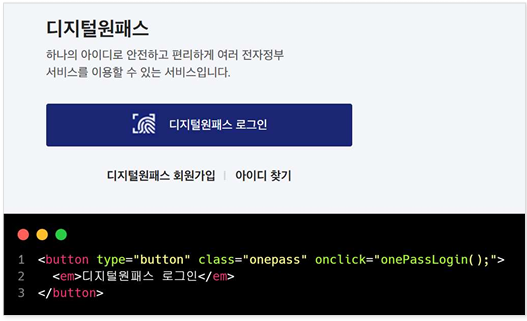
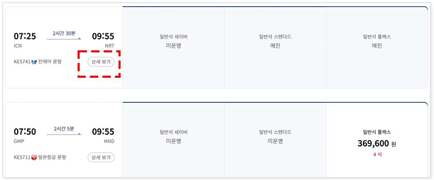
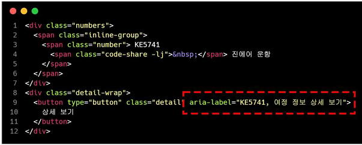
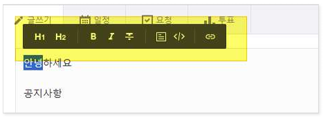
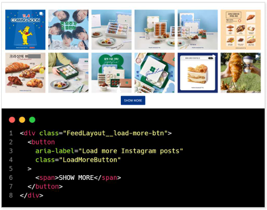

# 접근성 콘텐츠 제작 기법
> 접근성 콘텐츠 제작 기법은 모든 사용자, 특히 장애가 있는 사용자가 웹 콘텐츠에 접근하고 사용할 수 있도록 보장하는 방법입니다. 이 기법은 웹 접근성 지침(WCAG: Web Content Accessibility Guidelines) 표준을 따르는 것이 중요합니다. 각각의 영역에 대해 접근성 작업 시 도움이 될 수 있도록 작업되었습니다. 접근성은 법적 요구사항일 뿐만 아니라 사용자를 위한 기본적인 배려이기도 합니다.  

## 웹 접근성 콘텐츠 제작 기법   
> 사용자가 장애를 가지고 있거나 특정 기능적 제한을 겪는 경우에도 원활하게 웹을 이용할 수 있도록 하는 방법을 의미합니다. 이러한 접근성을 고려한 콘텐츠 제작은 다양한 사용자들의 요구를 충족시키며, 웹의 사용성을 크게 향상시킵니다.    


**키워드**   
#웹 접근성, #웹 접근성 콘텐츠 제작 기법, #한국형 웹 콘텐츠 접근성 지침 2.2, #WCAG2.2, #KWCAG2.2, #보조기술과의호환성, #접근성 테스트 도구 활용 점검방법, #스크린 리더, #Jaws, #NVDA, #센스리더, #Sense Reader, #음성명령 사용자, #텍스트 음성 변환(TTS) 사용자, #시각장애인, #인지장애인, #비장애 사용자


### 레이블과 네임 [신규 항목]
**관련 지침 : 텍스트 또는 텍스트 이미지가 포함된 레이블이 있는 사용자 인터페이스 구성요소는 시각적으로 표시되는 해당 텍스트를 네임에 포함해야 한다.**   
사용자 인터페이스 구성요소(예: 메뉴, 링크, 버튼 등)에서 시각적으로 표시되는 텍스트를 네임에 제공하지 않은 경우 보조기술이 해당 사용자 인터페이스 구성요소를 인식할 수 없기 때문에, 네임에는 시각적으로 표시되는 텍스트를 제공해야 한다. 또한 네임과 텍스트를 다르게 제공한 경우 해당 정보 사용자(예: 음성명령 사용자)가 혼란을 겪을 수 있기 때문에, 네임과 텍스트는 동일하게 제공하는 것이 좋으며, 동일하지 않게 제공할 경우 텍스트는 네임의 앞부분에 제시하는 것이 좋다.    
단, 텍스트나 텍스트 이미지가 포함된 레이블이 없는 사용자 인터페이스 구성요소는 본 지침이 적용되지 않는다.      

[2.5.3 Label in Name (Level A)](https://www.w3.org/TR/WCAG22/#label-in-name){: target="_blank"}    
[WAI - Understanding Label in Name](https://www.w3.org/WAI/WCAG22/Understanding/label-in-name.html){: target="_blank"}    
[Accessible Name and Description Computation](https://www.w3.org/TR/html-aam-1.0/#accessible-name-and-description-computation){: target="_blank"}    
[MDN - aria-label](https://developer.mozilla.org/ko/docs/Web/Accessibility/ARIA/Attributes/aria-label){: target="_blank"}   


**기대효과**   

- 음성 입력(speech-input) 사용자는 시각적으로 표시되는 텍스트를 사용하여 사용자 인터페이스 구성요소를 제어할 수 있다.    
- 텍스트 음성 변환(TTS: Text-to-Speech) 사용자는 보조기술을 통해 음성으로 전달되는 텍스트와 시각적으로 표시되는 텍스트가 일치하기 때문에 해당 사용자 인터페이스 구성요소를 혼란 없이 보다 쉽게 인지ㆍ활용할 수 있다.    

**[용어]**   
**레이블**     
웹 페이지에서 사용자와 상호작용하는 요소에 표시되는 텍스트를 말한다. 예를 들어, 버튼에 "제출"이라고 쓰여 있거나, 입력창 옆에 "이메일"이라고 표시된 텍스트가 레이블이다. 이러한 텍스트는 사용자가 해당 요소가 무엇을 하는지 이해하는 데 도움을 준다. 참고로 input 요소와 짝을 이루는 label 요소만을 이야기하지 않는다.    

**접근 가능한 이름 (네임)**    
보조 기술이 상호작용 가능한 웹 콘텐츠 구성 요소를 인식하고 설명하는데 사용하는 이름이다. 시각적으로 보이는 레이블과 동일하거나 포함될 수 있다.   

**상호작용 요소**     
사용자 인터페이스 구성요소라고도 하며, 사용자가 특정 기능을 사용하기 위해 상호작용 할 수 있는 버튼, 입력창, 링크 등과 같은 웹페이지 요소를 말한다.    

**접근 가능한 이름 계산 알고리즘**    
접근 가능한 이름은 보조기술 사용자가 구성 요소를 인식할 수 있는 장치이기 때문에 어떻게 계산 되는지 이해하는 것이 중요하다.  예를 들어 접근 가능한 이름으로 계산되는 aria-label, aria-labelledby, alt, title, placeholder 등 속성 정보가 중복으로 제공되었을 때, 우선 순위를 가지고 계산한다.    

접근 가능한 이름의 계산은 아래와 같이 이루어진다.    

1. aria-labelledby 속성이 있는가?   
2. aria-label 속성이 있는가?   
3. button, input type=”submit”, “reset”의 value 속성, input type=”image”, img, area의 alt 속성이 있는가?   
4. 텍스트 콘텐츠가 있거나 label 요소가 연결되어 있는가?   
5. title 속성이 있는가?    
6. input 의 경우, placeholder가 있는가?    
7. 위 모든 것이 없으면 name이 없다 판단한다.    


#### 1. 필요성        
음성 입력을 사용하는 사용자는 눈에 보이는 레이블을 사용한다. 보조 기술 사용자가 일관되고 명확하게 콘텐츠를 이해하고 상호작용 할 수 있도록, 화면에 보이는 사용자 인터페이스 구성 요소의 눈에 보이는 레이블이 접근 가능한 이름과 일치시키거나 포함되게 한다.   

- 시각적 텍스트와 보조기술을 통한 **음성 안내 간 불일치** 시 사용자 혼란 발생    
- 동일 UI에서 시각적 텍스트는 “삭제”, 스크린 리더가 읽는 이름은 “제거”인 경우 → 사용자는 동일한 기능이라고 인식하기 어려움    
- 일관된 **이름(label과 name)** 사용은 **신뢰도, 사용성, 접근성 향상**에 직결    

웹 사이트나 애플리케이션을 개발할 때, 사용자 인터페이스 구성 요소에는 시각적인 레이블과 접근 가능한 이름이라는 두 가지 개념이 존재한다.   

- 시각적인 레이블: 사용자가 화면에서 볼 수 있는 텍스트.   
- 접근 가능한 이름: 보조 기술(예: 화면 낭독 프로그램)이 인식하고 사용자에게 전달하는 이름.    

일반적으로 시각적인 레이블이 HTML 표준 연결 방법(예: label 요소, aria-labelledby 속성 등)을 통해 사용자 인터페이스 구성 요소와 적절하게 연결하면, 레이블과 접근 가능한 이름은 일치한다.    
그러나 올바르게 연결되지 않거나, 시각적인 레이블과 접근 가능한 이름이 일치하지 않으면 다음과 같은 문제가 발생할 수 있다.   

- 화면 낭독 프로그램을 함께 사용하는 저시력 사용자: 시각적인 레이블과 스크린 리더가 읽어주는 이름이 다르면, 사용자는 올바른 버튼이나 링크를 찾았는지 확신할 수 없어 혼란을 겪게 된다. 특히 인지 장애를 복합적으로 가 진 경우 그 정도가 더욱 심하다.    
- 음성 명령 사용자: 화면에 보이는 레이블을 말했는데, 실제 요소의 접근 가능한 이름과 일치하지 않으면 음성 명령이 제대로 작동하지 않는다.    

따라서 시각적인 레이블과 접근 가능한 이름의 일치는 접근성을 보장하고 사용자 경험을 향상시키는 데 매우 중요하다.    
그러나 디자인 제약이나 기술적 한계로 인해 완전한 일치가 불가능한 경우도 있다. 이러한 상황에서는 최소한 접근 가능한 이름에 시각적인 레이블을 포함시키고, 이 레이블을 접근 가능한 이름의 앞부분에 위치시키는 것이 좋다.   
예를 들어, 구매하기 텍스트 버튼이 `<a href=”...” aria-lable=”선물하기”>`구매하기`</a>`와 같이 시각적 텍스트와 접근 가능한 이름이 일치하지 않는 경우 보조 기기 사용자는 ‘선물하기’로 잘못된 정보를 전달받게 되어 원하는 작업을 할 수 없게 된다    

#### 2. 대상       

| 사용자 유형   | 필요 이유 |
|----------------|----------|
| 시각장애인     | 스크린 리더 사용 시, 시각 정보와 음성 정보 일치 필요  
| 인지장애 사용자 | UI 기능과 안내 음성 간 의미 일치로 혼란 방지  
| 비장애 사용자     | 시각 정보와 동작 이름 간의 연계성 인식  

#### 3. 체크리스트       

- UI 구성 요소에 시각적으로 표시된 레이블이 있는가?   
- 접근 가능한 네임(name)에 시각적 레이블이 그대로 포함되어 있는가?   
- `aria-label`, `aria-labelledby`, `alt`, `title` 등으로 name을 설정할 경우 시각 텍스트와 일치하는가?   


#### 4. 테스트 방법      

- 버튼, 링크, 입력필드 등의 시각적 텍스트 확인   
- 보조기술(스크린 리더) 사용 시 해당 UI 이름 읽기 확인   
- 눈으로 보이는 텍스트와 음성으로 출력되는 텍스트가 동일한지 비교   

#### 5. QA 지표       

- 시각적 텍스트와 네임 일치율   
- 네임 누락 또는 불일치 항목 수   
- 스크린 리더 사용자 테스트 일치도   

#### 6. 개발방법     

- 가능하면 시각적인 레이블과 접근 가능한 이름을 완전히 일치시킨다.    
- 디자인 제약 등으로 일치가 어려울 경우, 접근 가능한 이름에 시각적인 레이블을 포함시키고, 이를 접근 가능한 이름의 앞부분에 위치시킨다.    

#### HTML 예시 – 시각 텍스트와 name 일치
```html
<button aria-label="삭제">삭제</button> <!-- 일치 → 적합 -->
```

#### 잘못된 예시 – name과 label이 다름
```html
<button aria-label="제거">삭제</button> <!-- 불일치 → 부적합 -->
```

#### Vue 예시
```vue
<template>
  <button aria-label="삭제">삭제</button>
</template>
```

#### React 예시
```jsx
function DeleteButton() {
  return <button aria-label="삭제">삭제</button>;
}
```

#### 7. 점검 기준     

- 모든 시각적 레이블이 접근 가능한 이름에도 포함되어 있는가?   
- `aria-label`, `alt`, `title` 등을 사용할 경우 시각적 텍스트와 같은가?   

#### 8. 점검 방법     

- DOM 요소에 정의된 텍스트 및 `aria-*`, `alt` 속성 확인   
- 스크린 리더(NVDA, JAWS 등)로 네임 읽기 테스트   
- 디자인 화면과 실제 UI 요소 간 텍스트 불일치 여부 비교    

#### 9. 준수 사례       

**눈에 보이는 텍스트 레이블과 일치하는 접근 가능한 이름 제공**   
접근 가능한 이름을 눈에 보이는 텍스트와 일치하게 제공한다.    
다음은 버튼의 접근 가능한 이름을 눈에 보이는 레이블과 일치하게 제공하는 가장 일반적인 사례이다.   

<figure>

<figcaption>출처 : 웹 접근성을 고려한 콘텐츠 제작기법 개정판</figcaption>   
</figure>

**눈에 보이는 레이블을 포함하여 접근 가능한 이름 제공**   
눈에 보이는 레이블이 접근 가능한 이름에 포함되도록 제공한다.    
다음은 “상세 정보”라는 레이블을 가진 버튼이 있는 페이지의 사례이다. 여러 목록에서 동일한 레이블의 버튼이 반복되기 때문에 시각을 활용하기 어려운 사용자가 무엇에 대한 상세 정보 버튼인지 명확한 구분할 수 있는 정보를 조합하여 접근 가능한 이름을 제공할 수 있다.   

<figure>


<figcaption>출처 : 웹 접근성을 고려한 콘텐츠 제작기법 개정판</figcaption>   
</figure>

**텍스트가 기호를 상징하는 기호 문자로 사용된 경우**   
에디터에서 'B' 'I' 와 같이 텍스트가 상징적인 의미를 가지는 경우 'B' 가 아닌 '굵게' 로 해당 버튼이 제공하는 기능으로 접근 가능한 네임을 제공한다.   

<figure>

<figcaption>출처 : 웹 접근성을 고려한 콘텐츠 제작기법 개정판</figcaption>   
</figure>

#### 10. 미준수 사례       

**접근 가능한 이름에 포함되지 않는 레이블**   
다음은 더 많은 콘텐츠를 불러올 수 있는 버튼이 눈에 보이는 레이블과 접근 가능한 이름이 서로 상이한 사례이다.     
다음 사례에서 눈에 보이는 레이블은 “SHOW MORE”로 되어 있으나, 접근 가능한 이름은 “Load more Instagram posts”로 되어 있다. 사람이 인식하는 레이블과 소프트웨어가 인식하게 되는 이름이 서로 다르기 때문에 음성 명령 사용자나 화면 낭독 프로그램 사용자는 컨트롤을 활성화 시키지 못하거나 커뮤니케이션에서 혼란을 느끼기 쉽다.    

<figure>

<figcaption>출처 : 웹 접근성을 고려한 콘텐츠 제작기법 개정판</figcaption>   
</figure>

**개선 방법**    
접근 가능한 이름을 눈에 보이는 레이블과 일치되도록 aria-label을 삭제하거나 눈에 보이는 레이블이 포함되도록 수정한다.    


#### 11. 관련 영상       
<iframe style="width:100%;min-height:315px;" src="https://www.youtube.com/embed/7yznv92N96U?si=U4G9Sz6QXyKK0uDs" title="YouTube video player" frameborder="0" allow="accelerometer; autoplay; clipboard-write; encrypted-media; gyroscope; picture-in-picture; web-share" referrerpolicy="strict-origin-when-cross-origin" allowfullscreen></iframe>

[레베하얀 웹 접근성 (레이블과 네임)](https://www.youtube.com/embed/7yznv92N96U?si=U4G9Sz6QXyKK0uDs){: target="_blank"}    
   
--- 
<strong style="font-size:20px;cursor:pointer;">접근성 테스트 도구 활용 점검방법</strong>
모바일 앱 접근성 과 내용 동일

 
#### 결론     
모바일 앱 접근성 과 내용 동일


### 참조    
- [Web Content Accessibility Guidelines (WCAG) 2.2](https://www.w3.org/TR/WCAG22/){: target="_blank"}    
- [WCAG 2.2 Understanding Docs](https://www.w3.org/WAI/WCAG22/Understanding/){: target="_blank"}    
- [WCAG (Quick Reference)](https://www.w3.org/WAI/WCAG22/quickref/?versions=2.2&showtechniques=111){: target="_blank"}    
- [웹 콘텐츠 접근성 지침(WCAG) 2.2 - 번역판](https://a11ykr.github.io/wcag22/){: target="_blank"}    
- [smashingmagazine - WCAG 2.2 Checklist with Filter and Links](https://codepen.io/smashingmag/pen/MWLgQzm){: target="_blank"}    
- [MDN 웹 컨텐츠 접근성 지침 이해하기](https://developer.mozilla.org/ko/docs/Web/Accessibility/Understanding_WCAG){: target="_blank"}    
- [보건복지부 블로그](https://blog.naver.com/prologue/PrologueList.naver?blogId=mohw2016){: target="_blank"}     
- [행정안전부 - 전자정부 웹사이트 UI UX 가이드라인](https://www.mois.go.kr/frt/bbs/type001/commonSelectBoardArticle.do?bbsId=BBSMSTR_000000000045&nttId=69451){: target="_blank"}     
- [널리 알리는 기술 소식 커뮤니티](https://nuli.navercorp.com/community/article){: target="_blank"}     
