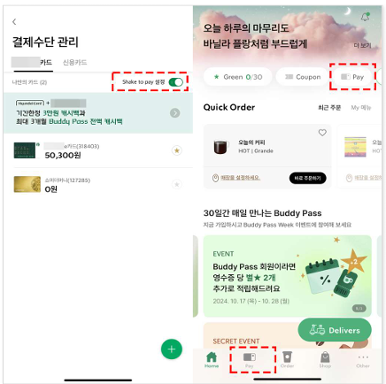
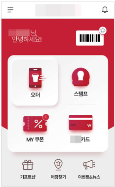
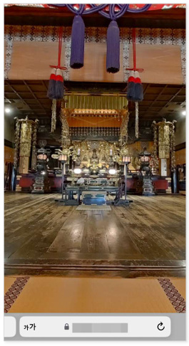

# 접근성 콘텐츠 제작 기법
> 접근성 콘텐츠 제작 기법은 모든 사용자, 특히 장애가 있는 사용자가 웹 콘텐츠에 접근하고 사용할 수 있도록 보장하는 방법입니다. 이 기법은 웹 접근성 지침(WCAG: Web Content Accessibility Guidelines) 표준을 따르는 것이 중요합니다. 각각의 영역에 대해 접근성 작업 시 도움이 될 수 있도록 작업되었습니다. 접근성은 법적 요구사항일 뿐만 아니라 사용자를 위한 기본적인 배려이기도 합니다.  

## 웹 접근성 콘텐츠 제작 기법   
> 사용자가 장애를 가지고 있거나 특정 기능적 제한을 겪는 경우에도 원활하게 웹을 이용할 수 있도록 하는 방법을 의미합니다. 이러한 접근성을 고려한 콘텐츠 제작은 다양한 사용자들의 요구를 충족시키며, 웹의 사용성을 크게 향상시킵니다.    


**키워드**   
#웹 접근성, #웹 접근성 콘텐츠 제작 기법, #한국형 웹 콘텐츠 접근성 지침 2.2, #WCAG2.2, #KWCAG2.2, #보조기술과의호환성, #접근성 테스트 도구 활용 점검방법, #스크린 리더, #Jaws, #NVDA, #센스리더, #Sense Reader, #휠체어 사용자, #파키슨병, #손떨림, #음성 명령 사용자, #지체 장애 사용자, #고정된 환경 사용자, #저시력·인지장애 사용자


### 동작기반 작동 [신규 항목]
**관련 지침 : 동작기반으로 작동하는 기능은 사용자 인터페이스 구성요소로 조작할 수 있고, 동작기반 기능을 비활성화할 수 있어야 한다.**   
기기를 기울이거나 흔들고, 카메라를 통한 제스처 인식 등을 입력 수단으로 활용할 때, 모든 사용자가 의도치 않은 실행을 방지하고 대체 조작 수단(버튼 등)으로 동일한 기능을 실행할 수 있도록 하기 위함이다. 이는 손떨림, 휠체어 사용자, 음성 명령 사용자 등 동작 기반 입력이 곤란한 환경에서도 서비스 사용이 가능하도록 보장하는 데 목적이 있다.    
사용자가 장치를 움직이거나 사용자의 움직임을 통하여 작동하는 기능(예: 흔들어서 실행 취소, 손동작을 이용한 사진 촬영 등)은 사용자 인터페이스 구성요소로 조작할 수 있어야 하며, 의도하지 않는 동작으로 기능이 작동하는 것을 예방하기 위해 해당 기능을 비활성화할 수 있어야 한다.     

**다만, 다음과 같은 경우에는 예외로 간주한다.**    
- 접근성 지원 인터페이스: 동작이 접근성 지원 인터페이스를 통해 기능을 조작하는 데 사용되는 경우(예: 안구마우스)    
- 필수적인 경우: 동작이 기능의 실행에 반드시 필요하고, 동작의 실행에 대한 비활성화가 기능 자체를 무효화할 수 있는 경우(예: 만보기)   

[2.5.4 동작 기반 입력 취소 가능 (Motion Actuation) (Level A)](https://www.w3.org/TR/WCAG22/#motion-actuation){: target="_blank"}    
[MDN - DeviceMotionEvent](https://developer.mozilla.org/en-US/docs/Web/API/DeviceMotionEvent){: target="_blank"}     
[WAI Understanding Motion Actuation](https://www.w3.org/WAI/WCAG22/Understanding/motion-actuation.html){: target="_blank"}   


**기대효과**   

- 장치가 고정되어 있거나 특정 동작을 행할 수 없는 사용자도 기능을 사용할 수 있다.    
- 정확한 동작을 할 수 없거나, 의도하지 않은 동작으로 기능이 실행되는 것을 방지할 수 있다.   

**[용어]**   
**동작기반 작동**    
장치를 흔들거나 기울이는 동작, 카메라를 향한 제스처 등 센서를 통한 신체적 움직임을 직접 입력 신호로 사용하는 방식을 의미한다. 예) 흔들어 새로고침, 손동작으로 이전/다음 슬라이드 전환 등.    

**접근성 지원 인터페이스**    
사용자의 보조 기술(스크린 리더, 음성 명령, 안구 마우스 등) 및 브라우저/OS의 접근성 기능과 호환되어 작동하는 대체 조작 수단이다. 예) 카메라 센서로 눈동자나 깜박임을 인식해 클릭 동작을 대체하는 시스템.    

**가속도계 / 자이로스코프**     
모바일 기기 내부에 탑재된 물리 센서로, 기기의 기울기, 흔들림, 회전 등을 감지하여 동작 기반 입력으로 활용할 수 있다.    

#### 1. 필요성        
스마트폰·태블릿 등에서 가속도계, 자이로스코프, 카메라 센서를 이용해 흔들기·기울이기·제스처 명령 등 동작 기반 기능을 활용하여 기능을 작동 시킬 수 있다. 예를 들어, 장치를 흔들어 정보를 최신화 하거나 특정 기능을 실행 시킬 수 있고 전면 카메라 위에서 손을 움직여서 이전 / 다음 콘텐츠로 이동시키는데 사용할 수도 있다.    
이러한 기능으로 일부 사용자는 다음과 같은 어려움 겪을 수 있다. 파킨슨 병과 같이 심한 손떨림을 가진 사용자는 의도하지 않게 기능이 실행될 수 있고, 휠체어에 기기를 고정해놓고 사용하는 경우 기기를 움직이는 동작을 할 수 없다. 음성 명령과 같은 대체 수단 사용자는 기기를 움직이거나 제스처를 취할 수 없다.    

- 모바일 기기에서 흔들기, 회전 등의 동작은 사용자가 원치 않는 상황에서 기능이 실행될 수 있음   
- 특정 장애 사용자나 고정된 환경(휠체어나 테이블)에 있는 경우, **디바이스를 움직이는 것이 불가능**    
- 이러한 기능은 반드시 **UI 요소로 대체 가능**하며, **비활성화 옵션**도 제공해야 접근성이 확보됨     

#### 2. 대상       

| 사용자 유형     | 필요 이유 |
|------------------|-----------|
| 지체 장애 사용자 | 기기를 물리적으로 움직이기 어렵거나 불가능한 경우  
| 고정된 환경 사용자 | 흔들기, 회전 등이 불가한 환경 (휠체어 장착, 고정 거치대 등)  
| 저시력·인지장애 사용자 | 의도치 않은 동작 인식으로 인한 오류 가능성 있음  

#### 3. 체크리스트       

- 흔들기, 기울이기 등 동작 기반 기능이 존재하는가?    
- 동작을 대체하는 UI 버튼이 제공되는가?    
- 설정에서 해당 동작 기반 기능을 끌 수 있는가?    

#### 4. 테스트 방법      

- 모바일 기기에서 **흔들기, 회전 등의 제스처로 기능이 실행**되는지 확인   
- 동일한 기능을 수행할 수 있는 **UI 버튼 또는 입력 수단이 존재**하는지 확인   
- 설정 또는 스위치를 통해 **해당 기능을 끌 수 있는지** 점검   

#### 5. QA 지표       

- 동작 기반 기능의 UI 대체 제공률   
- 비활성화 가능한 기능 여부   
- 제스처 입력 실패 시 대응 성공률   

#### 6. 개발방법     

- 대체 사용자 인터페이스 제공: 동작 또는 제스처로만 작동하는 기능은 버튼, 링크 등 접근 가능한 사용자 인터페이스를 추가로 제공한다.    
  예) 장치 흔들어 결제 기능에 대한 ‘결제 바코드 노출 버튼’을 병행 제공한다.    
- 동작 기반 기능 비활성화 설정: 손떨림 등으로 인해 원치 않는 동작 실행을 방지하기 위해, 기기를 움직여 실행되는 기능을 끄거나 켤 수 있는 옵션을 제공한다. 예) 흔들기 인식 ‘ON/OFF’ 스위치 제공하고, 기본값 ‘OFF’로 설정하여 사고를 방지한다.     

**다만, 다음과 같은 경우에는 예외로 한다**    

- 접근성 지원 인터페이스: 카메라 센서로 눈동자를 추적하는 ‘안구 마우스’처럼 이미 보조기술로 쓰이는 경우, 해당 동작 입력은 끄지 않아도 된다.    
- 동작이 필수적인 경우: 만보기나 방향 센서를 반드시 사용해야 하는 앱처럼, 동작 자체가 기능의 핵심인 경우 예외로 한다.    


#### HTML + JavaScript 예시 – 기기 흔들기 감지 및 대체 버튼 제공
```html
<button onclick="resetForm()">초기화</button>

<script>
function resetForm() {
  alert('초기화 되었습니다.');
}

if (window.DeviceMotionEvent) {
  window.addEventListener("devicemotion", function(event) {
    const acceleration = event.accelerationIncludingGravity;
    if (acceleration.x > 15 || acceleration.y > 15 || acceleration.z > 15) {
      resetForm(); // 기기 흔들림 감지
    }
  });
}
</script>
```
- 위 코드에서는 `resetForm()`이라는 기능을 **흔들기 동작**과 **버튼 클릭**으로 모두 수행 가능하게 함   
- `설정`을 통해 `motion 기능을 끄는 옵션`도 함께 제공해야 함 (예: toggle 스위치)   


#### Vue 예시 (흔들기와 버튼으로 초기화 기능)
```vue
<template>
  <div>
    <button @click="resetForm">초기화</button>
    <label>
      <input type="checkbox" v-model="motionEnabled" />
      동작 기반 기능 사용
    </label>
  </div>
</template>

<script setup>
import { ref, onMounted, onUnmounted } from 'vue';

const motionEnabled = ref(true);

function resetForm() {
  alert('초기화 되었습니다.');
}

function handleMotion(event) {
  const acc = event.accelerationIncludingGravity;
  if (motionEnabled.value && (acc.x > 15 || acc.y > 15 || acc.z > 15)) {
    resetForm();
  }
}

onMounted(() => {
  window.addEventListener('devicemotion', handleMotion);
});

onUnmounted(() => {
  window.removeEventListener('devicemotion', handleMotion);
});
</script>
```

---

#### React 예시 (흔들기 감지 + 토글 버튼 제공)
```jsx
import React, { useEffect, useState } from "react";

function MotionComponent() {
  const [motionEnabled, setMotionEnabled] = useState(true);

  const resetForm = () => {
    alert("초기화 되었습니다.");
  };

  useEffect(() => {
    const handleMotion = (event) => {
      const acc = event.accelerationIncludingGravity;
      if (motionEnabled && (acc.x > 15 || acc.y > 15 || acc.z > 15)) {
        resetForm();
      }
    };

    window.addEventListener("devicemotion", handleMotion);
    return () => {
      window.removeEventListener("devicemotion", handleMotion);
    };
  }, [motionEnabled]);

  return (
    <>
      <button onClick={resetForm}>초기화</button>
      <label>
        <input
          type="checkbox"
          checked={motionEnabled}
          onChange={(e) => setMotionEnabled(e.target.checked)}
        />
        동작 기반 기능 사용
      </label>
    </>
  );
}

export default MotionComponent;
```

#### 7. 점검 기준     

- 동작 기반 기능을 수행할 수 있는 대체 UI가 존재하는가?    
- 사용자가 해당 기능을 비활성화할 수 있는가?    
- 기능이 의도하지 않게 실행되지 않도록 설계되었는가?   

#### 8. 점검 방법     

- 실제 디바이스 테스트를 통한 동작 감지    
- UI 버튼 조작 가능 여부 확인    
- 비활성화 스위치 존재 여부 점검    

#### 9. 준수 사례       
 
- 흔들어서 초기화 → ‘초기화’ 버튼도 제공   
- 기울이면 메뉴 열림 → ‘메뉴 열기’ 버튼도 함께 제공   
- 설정에서 ‘동작 기반 기능 비활성화’ 옵션 제공    

**동작 기반 기능 비활성화 설정과 접근 가능한 사용자 인터페이스 제공**    
기기를 흔들어 결제를 위한 바코드를 노출시키는 기능이 제공되는 모바일 애플리케이션의 사례.    

- 손떨림이 심한 사용자의 경우 손떨림으로 인한 기기의 흔들림이 의도하지 않은 결제 바코드 노출을 실행하지 않도록 기능을 꺼둘 수 있는 기능이 제공된다.   
- 동시에 이 기능을 꺼두더라도 버튼을 누르는 것만으로도 결제 바코드를 노출시킬 수 있는 대체 버튼을 제공한다.    
- 모바일 애플리케이션의 사례이지만 웹 페이지에서 이러한 동작기반 기능 제공시 이와 동등한 수준으로 제공이 필요하다.    

<figure>

<figcaption>출처 : 웹 접근성을 고려한 콘텐츠 제작기법 개정판</figcaption>   
</figure>

#### 10. 미준수 사례       

- **흔들기만으로 초기화**되고 대체 방법 없음   
- **기울이기 전용**으로 화면 전환되며 조작 불가능    
- 설정이나 접근성 메뉴에서 **비활성화 옵션 없음**   

**동작기반 작동 비활성화 기능 미제공**    
모바일 기기를 흔들면 결제 바코드가 화면에 노출되는 모바일 애플리케이션 사례이다. 기본적으로 ‘흔들기’ 기능이 활성화되어 있어, 손떨림이 심한 사용자는 의도치 않게 결제 바코드가 계속 뜨게 된다.    
이 기능을 끌 수 있는 기능을 제공하고 있지 않아 손떨림 또는 의도치 않게 기기가 흔들리는 상황에서 바코드가 실행되는 오작동을 일으킬 수 있어 사용자가 불편을 겪을 수 있다.    

<figure>

<figcaption>출처 : 웹 접근성을 고려한 콘텐츠 제작기법 개정판</figcaption>   
</figure>

**개선 방법**     
흔들어 결제 바코드를 보여주는 기능을 켜고 끌 수 있는 설정 기능을 제공한다.    
문제를 사전에 예방하기 위해 끔 상태를 기본으로 제공하고 사용자가 원할 때 켤 수 있도록 제공하는 것을 고려할 수 있다.    


**접근 가능한 대체 인터페이스 미제공**    

건물 내부를 VR을 통해 둘러볼 수 있도록 제공한 관광지를 소개하는 웹 페이지 예시)    
기기를 기울이거나 몸을 돌려서 360도 화면을 둘러볼 수 있고, 터치 스와이프 제스처로도 시점을 이동할 수 있다. 하지만 상하좌우 버튼과 같은 추가 조작 인터페이스가 없어, 휠체어에 고정된 기기를 쓰거나 음성 명령만 이용하는 사용자에게는 사실상 VR 시점 이동이 어렵다.    

<figure>

<figcaption>출처 : 웹 접근성을 고려한 콘텐츠 제작기법 개정판</figcaption>   
</figure>

**개선 방법**    
“상하좌우” 이동 버튼을 제공하여, 마우스 클릭이나 키보드·음성 입력만으로도 VR 시점을 조정할 수 있도록 하며, 버튼을 길게 누르면 화면이 계속 회전되는 등 세밀한 이동 방식을 마련해, 동작 없이도 원활히 VR 체험이 가능하도록 한다. 또한 기기를 기울이거나 회전하는 입력을 아예 끌 수 있는 설정을 두어, 의도치 않게 화면이 움직이지 않도록 한다.    


#### 11. 관련 영상       
<iframe style="width:100%;min-height:315px;" src="https://www.youtube.com/embed/59e421exjHQ?si=pQkjgsPYldmaemDG" title="YouTube video player" frameborder="0" allow="accelerometer; autoplay; clipboard-write; encrypted-media; gyroscope; picture-in-picture; web-share" referrerpolicy="strict-origin-when-cross-origin" allowfullscreen></iframe>

[AOA11Y 웹 접근성 (동작기반 작동)](https://www.youtube.com/embed/59e421exjHQ?si=pQkjgsPYldmaemDG){: target="_blank"}    
   
--- 
<strong style="font-size:20px;cursor:pointer;">접근성 테스트 도구 활용 점검방법</strong>
모바일 앱 접근성 과 내용 동일

 
#### 결론     
모바일 앱 접근성 과 내용 동일


### 참조    
- [Web Content Accessibility Guidelines (WCAG) 2.2](https://www.w3.org/TR/WCAG22/){: target="_blank"}    
- [WCAG 2.2 Understanding Docs](https://www.w3.org/WAI/WCAG22/Understanding/){: target="_blank"}    
- [WCAG (Quick Reference)](https://www.w3.org/WAI/WCAG22/quickref/?versions=2.2&showtechniques=111){: target="_blank"}    
- [웹 콘텐츠 접근성 지침(WCAG) 2.2 - 번역판](https://a11ykr.github.io/wcag22/){: target="_blank"}    
- [smashingmagazine - WCAG 2.2 Checklist with Filter and Links](https://codepen.io/smashingmag/pen/MWLgQzm){: target="_blank"}    
- [MDN 웹 컨텐츠 접근성 지침 이해하기](https://developer.mozilla.org/ko/docs/Web/Accessibility/Understanding_WCAG){: target="_blank"}    
- [보건복지부 블로그](https://blog.naver.com/prologue/PrologueList.naver?blogId=mohw2016){: target="_blank"}     
- [행정안전부 - 전자정부 웹사이트 UI UX 가이드라인](https://www.mois.go.kr/frt/bbs/type001/commonSelectBoardArticle.do?bbsId=BBSMSTR_000000000045&nttId=69451){: target="_blank"}     
- [널리 알리는 기술 소식 커뮤니티](https://nuli.navercorp.com/community/article){: target="_blank"}     
