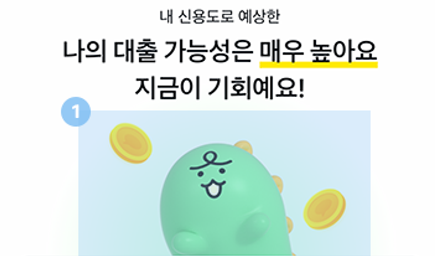
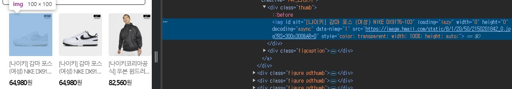

# 접근성 콘텐츠 제작 기법
> 접근성 콘텐츠 제작 기법은 모든 사용자, 특히 장애가 있는 사용자가 웹 콘텐츠에 접근하고 사용할 수 있도록 보장하는 방법입니다. 이 기법은 웹 접근성 지침(WCAG: Web Content Accessibility Guidelines) 표준을 따르는 것이 중요합니다. 각각의 영역에 대해 접근성 작업 시 도움이 될 수 있도록 작업되었습니다. 접근성은 법적 요구사항일 뿐만 아니라 사용자를 위한 기본적인 배려이기도 합니다.  

## 웹 접근성 콘텐츠 제작 기법   
> 사용자가 장애를 가지고 있거나 특정 기능적 제한을 겪는 경우에도 원활하게 웹을 이용할 수 있도록 하는 방법을 의미합니다. 이러한 접근성을 고려한 콘텐츠 제작은 다양한 사용자들의 요구를 충족시키며, 웹의 사용성을 크게 향상시킵니다.    


**키워드**   
#웹 접근성, #웹 접근성 콘텐츠 제작 기법, #한국형 웹 콘텐츠 접근성 지침 2.2, #WCAG2.2, #KWCAG2.2, #대체 텍스트, #비 텍스트 콘텐츠, #보조기술과의호환성, #접근성 테스트 도구 활용 점검방법, #스크린 리더, #Jaws, #NVDA, #센스리더, #Sense Reader, 시각 장애인, 저시력 사용자, 고령자, 인지 장애인


### 대체 텍스트 
**관련 지침 : 텍스트 아닌 콘텐츠는 그 의미나 용도를 인식할 수 있도록 대체 텍스트를 제공해야 한다.**   
이미지 등 텍스트 아닌 콘텐츠를 이용할 경우, 그 의미나 용도를 동등하게 인식할 수 있도록 적절한 대체 텍스트를 제공해야 한다. 또한 대체 텍스트는 간단명료하게 제공해야 한다.     

🔗 관련 WCAG 2.2 성공 기준    
[1.1.1 Non-text Content (Level A)](https://www.w3.org/TR/WCAG22/#non-text-content){: target="_blank"}     
[WAI - Understanding Non-text Content](https://www.w3.org/WAI/WCAG22/Understanding/non-text-content.html){: target="_blank"}       
[MDN - alt 속성](https://developer.mozilla.org/ko/docs/Web/HTML/Element/img#%EB%B3%80%EC%88%98_alt){: target="_blank"}     

- 구체적인 정보를 제공해야 하는 경우: 이미지 링크, 이미지 버튼 등은 용도가 매우 명확하므로, 이미지 링크나 이미지 버튼의 핵심 기능에 대한 설명을 간단한 대체 텍스트로 제공해야 한다.    
- 의미 있는 배경 이미지: 배경 이미지의 의미가 사용자에게 전달되어야 하는 콘텐츠는 그 의미가 보조기술로 전달되도록 대체 텍스트를 제공해야 한다.   
- 충분한 정보가 필요한 경우: 데이터 차트와 같이, 내용이 복잡한 콘텐츠는 사용자가 해당 콘텐츠의 의미를 충분히 파악할 수 있도록 대체 텍스트를 제공해야 한다.   

**다음과 같은 경우에는 대체 텍스트를 제공하지 않거나 제한적으로 제공할 수 있다.**     

- 대체 콘텐츠의 경우: 대체 콘텐츠에는 대체 텍스트를 반드시 제공할 필요는 없다.    
  예를 들어, 텍스트와 함께 동등한 내용의 수어 동영상을 제공하는 경우, 수어 동영상에는 대체 텍스트를 제공할 필요가 없다.     
- 콘텐츠의 내용을 설명하는 대체 텍스트를 제공할 수 없는 경우: 생방송 콘텐츠와 같이, 그 내용이 지속적으로 변화하여 설명하기 어려운 경우, 해당 콘텐츠에 대한 간략한 용도를 알려주는 대체 텍스트를 제공하는 것으로 충분하다. 또한 색맹검사, 청각검사, 시력검사, 받아쓰기 등과 같은 검사 또는 시험의 경우에도 콘텐츠의 간략한 용도를 알려주는 대체 텍스트만으로 충분하다.     
- 특정 감각으로만 제공되는 콘텐츠인 경우: 플루트 독주나 시각적 예술 작품 등의 경우, 해당 콘텐츠에 대한 간략한 용도를 알려주는 대체 텍스트만으로 충분하다.     
- 불필요한 설명을 제공하는 경우: 단순히 장식이나 시각적인 형태를 위해 사용되는 콘텐츠의 경우, 보조기술을 통해 해당 설명을 제공받을 때 오히려 혼란을 일으킬 가능성이 있으므로 대체 텍스트로 공백 문자를 제공해야 한다.     
- 동일한 정보를 중복해서 제공하는 경우: 보조기술로 동일한 정보가 반복해서 전달되지 않도록 구현하는 것이 바람직하다. 

**기대효과**   

- 시각장애 또는 지적장애 등으로 인해 시각적으로 정보를 습득하는 데 어려움을 겪는 사용자들이 화면낭독프로그램과 같은 보조기술을 사용하여 해당 콘텐츠를 음성을 통해 들을 수 있으므로 최소한의 접근권을 보장받을 수 있게 된다.   
- 사용자들을 위해 텍스트 아닌 콘텐츠를 텍스트로 표시하거나 대체 텍스트를 수어로 제공함으로써 해당 콘텐츠에 접근할 수 있다. 시청각중복장애인들 역시 텍스트 아닌 콘텐츠에 대응하는 대체텍스트를 점자로 변환하는 보조기술을 이용하여 해당 콘텐츠에 대한 접근권을 보장받을 수 있다.    
- 콘텐츠에 적절한 대체 텍스트를 제공한 경우, 시각으로 제공받는 정보가 불충분하여 사용자가 콘텐츠의 핵심내용을 인지할 수 없거나 잘못된 정보를 제공받음으로써 겪게 되는 불필요한 혼동을 줄일 수 있다.   
- 대체 텍스트를 제공함으로써 텍스트 아닌 콘텐츠에 대한 검색이 가능하게 된다.   
- 의미가 있는 배경 이미지가 의미하는 대체 텍스트를 보조기술 사용자가 인지할 수 있어 콘텐츠의 이해와 사용이 가능하게 된다.   


#### 1. 필요성        
이미지, 아이콘, 도형, 차트 등 비텍스트 콘텐츠는 시각적 정보만으로 의미를 전달하기 때문에, 이를 인식할 수 없는 사용자(예: 시각장애인 등)를 위해 반드시 대체 텍스트(alt, aria-label 등)를 제공해야 합니다.     

**대체 텍스트의 주요 필요성**   
- **시각장애인 및 저시력 사용자 지원**: 스크린 리더가 이미지를 설명하여 의미를 전달할 수 있음.   
- **이미지 로딩 실패 시 대체 정보 제공**: 이미지가 로드되지 않을 경우 내용을 파악 가능.   
- **검색 엔진 최적화(SEO) 개선**: 검색 엔진이 콘텐츠를 더 잘 인식할 수 있음.   
- **법적 준수 요구**: WCAG(Web Content Accessibility Guidelines), ADA(Americans with Disabilities Act) 등의 접근성 가이드라인 준수 필요.    


#### 2. 대상       

| 사용자 유형     | 이유 |
|------------------|------|
| 시각장애인         | 이미지 등 시각적 콘텐츠를 음성으로 전달  
| 인지장애 사용자     | 복잡한 이미지 의미를 대체 텍스트로 명확히 전달  
| 고령 사용자  | 시력이 저하된 사용자들 이미지가 로드되지 않아도 텍스트로 정보 전달 가능 
| 저시력 사용자  | 이미지가 로드되지 않아도 텍스트로 정보 전달 가능  


#### 3. 체크리스트       
- **대체 텍스트 제공 여부**: 모든 비 텍스트 콘텐츠에 대체 텍스트가 제공되고 있는가?   
- **적절성**: 대체 텍스트가 콘텐츠의 의미를 정확하게 전달하고 있는가?   
- **중복 여부**: 같은 콘텐츠에 대해 중복된 대체 텍스트가 제공되고 있지 않은가?    
- **불필요한 정보 배제**: 장식용 이미지에 대체 텍스트가 불필요하게 포함되어 있지 않은가?     
- **스크린 리더 테스트**: 대체 텍스트가 스크린 리더에서 올바르게 읽히는가?     

<!-- - [ ] 모든 이미지 요소에 alt 속성이 존재하는가?  
- [ ] 대체 텍스트가 해당 콘텐츠의 목적을 명확히 전달하는가?  
- [ ] 장식용 이미지에는 빈 alt 속성(`alt=""`)을 사용하고 있는가?  
- [ ] 중복되거나 의미 없는 대체 텍스트를 사용하고 있지 않은가?   -->

#### 4. 테스트 방법      

1. HTML 요소에서 alt 속성 유무 확인   
2. 스크린 리더(NVDA, JAWS 등)로 이미지가 올바르게 설명되는지 확인   
3. 장식용 이미지가 스크린 리더에 의해 무시되는지 확인   

- [JAWS® Solutions 유료](https://www.freedomscientific.com/products/software/jaws/){: target="_blank"}   
- [NVDA Screenreader 무료](https://ul.gpii.net/content/nvda-screenreader){: target="_blank"}
- 자동 접근성 검사 도구 활용    
    - WAVE   
    - Axe DevTools   
    - Lighthouse(Chrome 내장)   


#### 5. QA 지표       
- **대체 텍스트 오류 비율**: 대체 텍스트가 누락되거나 부정확하게 제공된 UI 요소의 비율.   
- **스크린 리더 정확성**: 스크린 리더를 통해 올바르게 읽히는 대체 텍스트의 비율.   
- **사용자 피드백**: 실제 사용자 테스트를 통해 대체 텍스트의 적절성에 대한 피드백을 수집.   
<!-- 
- 이미지 중 alt 속성 누락 비율  
- 의미 있는 alt 사용 비율  
- 잘못된 alt(파일명, 반복, 불필요) 사용률   -->

#### 6. 개발방법     

- **html**    

```sh

```

- **Vue**    

```sh
<template>
  
</template>

<script>
export default {
  data() {
    return {
      sunriseImage: 'sunrise.png'
    };
  }
};
</script>
```

- **React**    

```sh
import React from 'react';

function SunriseImage() {
  return ;
}

export default SunriseImage;
```

**이미지 alt속성 작성 예시**    
카카오페이 신용대출 서비스 화면 중 대출 가능성 배너를 보여주는 UI로 다음은 alt속성 작성 예시 방법입니다.    
<figure aria-hidden="true" style="text-align:center;border:1px solid #000">
  
  <figcaption>출처 : kakaopay</figcaption>
</figure>

- **alt 속성을 사용하지 않은 경우**   
  
  ```sh
  
  음성출력 형태 : 이미지 넛지 타입비 삼백이십엑스이백십구피엔지 이미지
  ``` 
   - 스크린 리더는 이미지에 alt 속성이 없으면 파일 이름을 표현합니다.    
   - 대체 텍스트가 없기 때문에 대신 이미지 경로 정보인 src를 음성으로 전달합니다.     
   - 파일의 이름으로 콘텐츠를 설명하는 것도 방법이 될 수는 있습니다. 하지만 네트워크 오류, 콘텐츠 차단 등 서비스 관련 이미지를 표시할 수 없는 경우에는 서비스와 무관한 이미지의 alt 값이 음성으로 출력되기 때문에 접근성뿐만 아니라 다양한 환경의 사용자를 고려한다면 alt 속성은 꼭 필요한 속성입니다.   

- **alt 속성을 사용했지만 값을 제공하지 않는 경우**    
  
  ```sh
  
  음성출력 형태 : 없음
  ``` 
   
   - alt 속성의 값을 빈 값("")으로 생략해 제공하는 경우에는 이미지가 핵심 요소가 아님을 뜻하기 때문에 스크린 리더는 img 태그를 해석하지 않습니다.    
   - 이 경우 스크린 리더 사용자는 웹 브라우징 과정에서 이미지 요소가 있다는 것을 알 수 없습니다.     
   - 따라서 배경 이미지처럼 단순 디자인의 목적을 가진 이미지는 의도적으로 대체 텍스트를 빈 값으로 작성해 스크린 리더가 읽지 않도록 할 수 있습니다.     
   - 하지만 이미지 1번 영역 죠르디의 상태로 높은 대출 승인율을 표현하는 콘텐츠임을 감안하면, 사용자에게 이미지 설명을 전달할 필요가 있다고 생각하기 때문에 다음 단계로 넘어가 alt 속성에 대체 텍스트를 작성해 보도록 하겠습니다.      

- **적합한 대체 텍스트를 작성하지 않은 경우**    
  
  ```sh
  
  음성출력 형태 : 기뻐하는 죠르디 이미지 이미지
  ``` 
   
   - 시맨틱 태그는 암시적으로 role을 갖고 있으며, 스크린 리더는 &lt;img&gt;를 ‘이미지’로 자동으로 결정하게 됩니다.     
   - 따라서 이미지의 존재 여부를 표현하는 ‘사진, 이미지, 아이콘’등의 단어를 대체 텍스트에 포함하게 되면 스크린 리더가 기본적으로 해석한 ‘이미지’와 중복된 의미를 갖기 때문에 적합하지 않습니다.      

- **(권장)적합한 대체 텍스트를 제공한 경우**    
  
  ```sh
  
  음성출력 형태 : 기뻐하는 죠르디 이미지
  ```   

**버튼에 이미지 작성 예시**    
아래 이미지의 2번 영역에 있는 물음표 모양 버튼을 보면 우리는 너무나도 쉽게 내 대출 승인율이 무엇인지 자세한 정보를 확인할 수 있는 버튼임을 인식할 수 있습니다.    
먼저 우리는 스크린 리더가 코드를 어떻게 해석하는지 알아야 합니다.     
- 브라우저는 코드를 스크린 리더가 읽을 수 있는 접근성 트리(Accessibility Tree)로 만듭니다.    
- 스크린 리더는 접근성 트리의 요소를 순차 탐색하게 되는데, 접근성 트리에 표시되는 요소의 Name을 기반으로 해석합니다.     
- 여기서 말하는 Name은 Accessible Name이라고도 하며 스크린 리더가 요소를 포커스했을 때 읽는 값으로 author와 contents 중 하나로 결정됩니다.    
- 이때, author가 contents보다 우선순위가 높습니다.    
  - author: aria-label, aria-labelledby, title 속성, &lt;img&gt;의 alt 속성, svg의 &lt;desc&gt;
  - contents: Text 노드
<figure aria-hidden="true" style="text-align:center;border:1px solid #000">
  
  <figcaption>출처 : kakaopay</figcaption>
</figure>

```sh
<button type="button">
  <!-- : 구체적이지 않으며 추상적 -->
  
</button>
음성출력 형태 : 내 대출 승인율이란 버튼
``` 
   
   - &lt;img&gt;의 author는 alt 속성으로 Accessible Name은 “내 대출 승인율이란”이 됩니다.    
   - &lt;button&gt;은 author가 설정되지 않은 경우 자식 요소의 Accessible Name을 모아 contents로 사용하는 Children Presentational이라는 특징을 갖습니다.    
   - 따라서 &lt;button&gt;의 content는 ‘내 대출 승인율이란’이 되고 스크린 리더는 자동적으로 결정한 role과 결합해 “내 대출 승인율이란 버튼”이라고 해석하게 됩니다.      


#### 7. 점검 기준     
텍스트가 아닌 콘텐츠에 해당 이미지가 제공하는 의미나 용도를 동일하게 인식할 수 있는 적절한 대체 텍스트를 제공한다.    

- 모든 비텍스트 콘텐츠에 의미 있는 대체 텍스트가 있는가?    
- 장식용 이미지의 경우 적절히 무시되도록 처리되었는가?    
- 텍스트로 대체하기 어려운 경우 적절한 설명, 캡션, 수어, 대본 등 제공 여부 확인     

#### 8. 점검 방법     

- 페이지 내 ``, `<svg>`, `<object>` 등의 대체 텍스트 존재 여부 확인    
- 보조기술을 사용한 음성 설명 테스트    
- 이미지에 적절한 `alt`, `aria-label`, `title` 속성 사용 여부 확인    

크롬(Chrome) 브라우저 요소검사를 이용하여 점검한다.    
- 해당 이미지 요소를 선택하여 우측클릭하여 요소검사를 하여 코드로 확인.    
  <figure aria-hidden="true" style="text-align:center;border:1px solid #000">
    
    <figcaption>크롬(Chrome) 브라우저 이미지 요소검사</figcaption>
  </figure>

#### 9. 준수 사례       

```html

```

#### 10. 미준수 사례       

```html


```


#### 11. 관련 영상       
<iframe style="width:100%;min-height:315px;" src="https://www.youtube.com/embed/n8pd6_MUzFA?si=lUQplHWABtmx1lyn" title="YouTube video player" frameborder="0" allow="accelerometer; autoplay; clipboard-write; encrypted-media; gyroscope; picture-in-picture; web-share" referrerpolicy="strict-origin-when-cross-origin" allowfullscreen></iframe>

[AOA11Y 웹 접근성 (적절한 대체 텍스트 제공)](https://www.youtube.com/embed/n8pd6_MUzFA?si=lUQplHWABtmx1lyn){: target="_blank"}    
   
--- 
<strong style="font-size:20px;cursor:pointer;">접근성 테스트 도구 활용 점검방법</strong>
모바일 앱 접근성 과 내용 동일

 
#### 결론     
모바일 앱 접근성 과 내용 동일


### 참조    
- [Web Content Accessibility Guidelines (WCAG) 2.2](https://www.w3.org/TR/WCAG22/){: target="_blank"}    
- [WCAG 2.2 Understanding Docs](https://www.w3.org/WAI/WCAG22/Understanding/){: target="_blank"}    
- [WCAG (Quick Reference)](https://www.w3.org/WAI/WCAG22/quickref/?versions=2.2&showtechniques=111){: target="_blank"}    
- [웹 콘텐츠 접근성 지침(WCAG) 2.2 - 번역판](https://a11ykr.github.io/wcag22/){: target="_blank"}    
- [smashingmagazine - WCAG 2.2 Checklist with Filter and Links](https://codepen.io/smashingmag/pen/MWLgQzm){: target="_blank"}    
- [MDN 웹 컨텐츠 접근성 지침 이해하기](https://developer.mozilla.org/ko/docs/Web/Accessibility/Understanding_WCAG){: target="_blank"}    
- [보건복지부 블로그](https://blog.naver.com/prologue/PrologueList.naver?blogId=mohw2016){: target="_blank"}     
- [행정안전부 - 전자정부 웹사이트 UI UX 가이드라인](https://www.mois.go.kr/frt/bbs/type001/commonSelectBoardArticle.do?bbsId=BBSMSTR_000000000045&nttId=69451){: target="_blank"}     
- [널리 알리는 기술 소식 커뮤니티](https://nuli.navercorp.com/community/article){: target="_blank"}     
