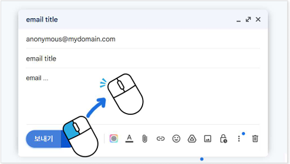
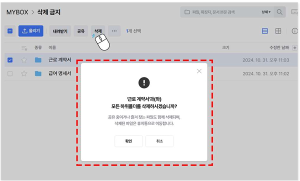
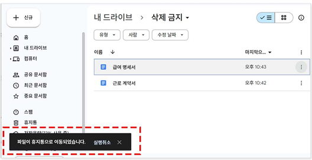
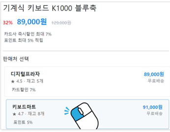
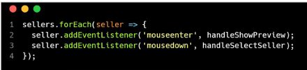
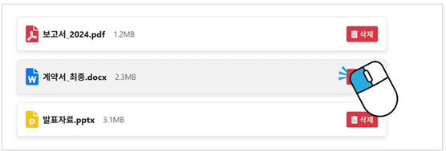
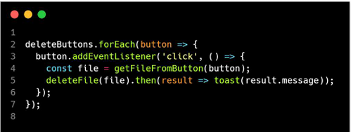
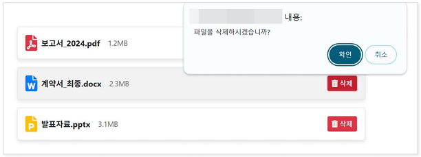
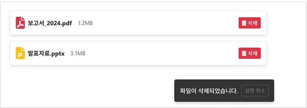

# 접근성 콘텐츠 제작 기법
> 접근성 콘텐츠 제작 기법은 모든 사용자, 특히 장애가 있는 사용자가 웹 콘텐츠에 접근하고 사용할 수 있도록 보장하는 방법입니다. 이 기법은 웹 접근성 지침(WCAG: Web Content Accessibility Guidelines) 표준을 따르는 것이 중요합니다. 각각의 영역에 대해 접근성 작업 시 도움이 될 수 있도록 작업되었습니다. 접근성은 법적 요구사항일 뿐만 아니라 사용자를 위한 기본적인 배려이기도 합니다.  

## 웹 접근성 콘텐츠 제작 기법   
> 사용자가 장애를 가지고 있거나 특정 기능적 제한을 겪는 경우에도 원활하게 웹을 이용할 수 있도록 하는 방법을 의미합니다. 이러한 접근성을 고려한 콘텐츠 제작은 다양한 사용자들의 요구를 충족시키며, 웹의 사용성을 크게 향상시킵니다.    


**키워드**   
#웹 접근성, #웹 접근성 콘텐츠 제작 기법, #한국형 웹 콘텐츠 접근성 지침 2.2, #WCAG2.2, #KWCAG2.2, #보조기술과의호환성, #접근성 테스트 도구 활용 점검방법, #스크린 리더, #Jaws, #NVDA, #센스리더, #Sense Reader, #지체장애 사용자, #터치 스크린 사용자, #고령 사용자, #비장애 사용자


### 포인터 입력 취소 [신규 항목] 
**관련 지침 : 단일 포인터 입력으로 실행되는 기능은 취소할 수 있어야 한다.**   
사용자가 실수로 잘못된 포인터 입력(클릭, 탭 등)을 했을 때, 원치 않는 기능이 실행되지 않도록 하거나 실행 결과를 되돌릴 수 있도록 하기 위함이다. 이는 특히 손떨림이 있거나 정밀한 포인터 조작이 어려운 사용자를 돕기 위한 것이다.    

[2.5.2 Pointer Cancellation (Level A)](https://www.w3.org/TR/WCAG22/#pointer-cancellation){: target="_blank"}    
[WAI - Understanding Pointer Cancellation](https://www.w3.org/WAI/WCAG22/Understanding/pointer-cancellation.html){: target="_blank"}   
[MDN - Pointer Events](https://developer.mozilla.org/en-US/docs/Web/API/Pointer_events){: target="_blank"}    


단일 포인터 입력으로 실행되는 기능은 해당 입력이 실수로 실행되는 것을 방지하기 위하여, 다음 중 하나 이상을 준수해야 한다.       
- 다운 이벤트만으로 실행 금지: 기능은 다운 이벤트만으로 실행되지 않아야 한다.     
- 중지 또는 실행취소: 기능은 업 이벤트에 완료되어야 하며, 실행 전에 중지시키거나 실행 후에 취소시킬 수 있어야 한다.    
- 되돌리기: 다운 이벤트로 실행된 모든 기능은 업 이벤트로 되돌릴 수 있어야 한다.    
- 필수적인 경우: 기능을 완료하는 데 다운 이벤트가 반드시 필요하다.    
  기능을 완료하는 데 다운 이벤트가 필수적인 경우로는 화면 피아노 건반, 슈팅게임 등이 있다.     

**기대효과**   

- 사용자가 잘못된 입력임을 인식했을 때 동작을 취소하거나 실행결과를 되돌릴 수 있다.    
- 우발적으로 오동작을 일으킬 확률을 줄여준다.    

**[용어]**    
**다운 이벤트 (Down Event)**    
포인터(마우스 버튼, 터치 등)를 눌러지는 순간 발생하는 이벤트. 플랫폼에 따라 "터치스타트(touchstart)" 또는 "마우스다운(mousedown)"과 같은 다른 이름을 가질 수 있다.    

**업 이벤트 (Up Event)**     
포인터를 눌렀다가 떼는 순간 발생하는 이벤트. 업 이벤트는 플랫폼에 따라 "터치엔드(touchend)" 또는 "마우스업(mouseup)"과 같은 다른 이름을 가질 수 있다.    


#### 1. 필요성        
마우스나 터치 스크린을 사용하여 버튼이나 링크를 클릭하거나 선택할 때 , 손떨림이 심하거나 정밀한 포인터 조작을 하기 어려운 사용자의 경우 (그리고 장애가 없는 사용자도) 의도하지 않은 요소를 눌러 잘못된 작업을 수행하게 될 수 있다.    
예를 들어, 복잡한 양식을 작성하던 중 실수로 “취소” 버튼을 눌러 모든 정보가 사라지거나, 온라인 쇼핑 중 의도치 않게 제품을 구매하게 되는 상황 등이 발생할 수 있다. 이는 사용자에게 불편함을 줄 수 있으며, 특히 장애가 있는 사용자에게는 더 큰 어려움이 될 수 있다.    

- 손떨림, 실수, 조작 오류로 인해 원치 않는 기능이 실행되는 것을 방지    
- 사용자에게 **실행 전 확인** 또는 **중단 기회 제공**    
- 특히 터치 기반 환경에서 잘못된 입력으로 인한 정보 손실이나 결제를 방지    

#### 2. 대상       

| 사용자 유형         | 이유 |
|----------------------|------|
| 지체장애 사용자       | 손의 불안정성으로 인해 실수로 클릭하는 경우 발생  
| 터치 스크린 사용자    | 손가락 오작동, 손바닥 닿음 등  
| 고령 사용자           | 조작 실수 후 복구 어려움  
| 비장애 사용자           | 실수에 대한 복구 경험이 중요  

#### 3. 체크리스트       

- 단일 클릭 또는 터치로 기능이 즉시 실행되는가?   
- 실행되기 전에 **중단하거나 취소할 수 있는 단계**가 있는가?   
- 드래그, 누르고 떼는 동작이 포함된 경우 **해제 시점에서 실행**되는가?    

#### 4. 테스트 방법      

- 클릭 또는 터치 후 기능 실행 여부 확인   
- 클릭 상태에서 포인터를 움직이거나 취소할 수 있는지 테스트   
- 버튼 누름과 동시에 즉시 실행되는 기능의 중단 가능성 확인   

#### 5. QA 지표       

- 단일 포인터 입력 후 실행 취소 가능 비율   
- 잘못된 입력 발생률 및 취소 기능 존재 비율   
- 사용자 실수 후 복구 성공률   

#### 6. 개발방법     
사용자가 원치 않는 기능의 작동을 방지하거나, 잘못된 입력임을 인식했을 때 실행 결과를 되돌릴 수 있도록 다음 중 하나 이상의 방법을 적용해야 한다.    

1. **다운 이벤트에서 기능 실행 금지:**    
   포인터 입력의 다운 이벤트(누르는 순간)에서 기능이 실행되지 않고, 포인터가 여전히 누른 대상의 경계에 있는 동안 업 이벤트가 발생할(떼는 순간) 때 기능이 실행(이하, 업 이벤트 활성화)되도록 한다.    
   click 이벤트가 이 방법의 대표적인 사례이다.     
2. **업 이벤트 중지:**    
   업 이벤트 활성화로 기능이 작동되도록 제공하여, 포인터의 다운 이벤트가 발생한 후 ESC키를 누르거나 포인터를 누른 대상의 경계 밖으로 옮겨 업 이벤트가 발생하면 기능이 실행되는 것을 중단시킬 수 있도록 한다.    
   끌기와 놓기와 같은 경우, 끌기를 시작 한 후 놓기 전 ESC키를 누르거나 놓을 영역이 아닌 다른 영역에서 놓으면 기능이 무효화 되도록 한다.    
3. **확인 또는 실행 취소 기능 제공:**    
   기능 실행 후 확인 대화상자를 띄우거나, 실행 취소 기능을 제공하여 사용자가 원치 않는 결과를 되돌릴 수 있도록 한다.    

단, 피아노 건반과 같이 누르는 즉시 소리가 나거나 누르는 순간 발사되어야 하는 사격 게임과 같이 누르는 동작에서의 기능 실행이 필수적인 경우는 예외로 한다.


#### HTML + JS 예시 – 클릭 후 확인창
```html
<button onclick="confirmDelete()">삭제</button>

<script>
function confirmDelete() {
  if (confirm('정말 삭제하시겠습니까?')) {
    // 삭제 실행
    alert('삭제 완료');
  }
}
</script>
```

#### Vue 예시
```vue
<template>
  <button @click="confirmDelete">삭제</button>
</template>

<script setup>
function confirmDelete() {
  if (confirm('정말 삭제하시겠습니까?')) {
    alert('삭제 완료');
  }
}
</script>
```

#### React 예시
```jsx
function ConfirmButton() {
  const handleClick = () => {
    if (window.confirm("정말 삭제하시겠습니까?")) {
      alert("삭제 완료");
    }
  };

  return <button onClick={handleClick}>삭제</button>;
}
```


#### 7. 점검 기준     

- 터치 또는 클릭으로 즉시 실행되는 기능에 확인 단계가 있는가?   
- 포인터를 움직여도 실행이 취소되도록 설계되었는가?    
- 취소/확정의 선택지를 제공하고 있는가?   

#### 8. 점검 방법     

- 기능이 즉시 실행되는지 또는 확인 단계가 있는지 테스트    
- 포인터 다운 후 이동 시 기능이 실행되지 않는지 확인    
- 취소 또는 중단할 수 있는 UI가 존재하는지 확인    

#### 9. 준수 사례       

**다운 이벤트로 버튼 실행되지 않고 업 이벤트에 실행되도록 제공**    
기능이 마우스 다운 이벤트가 발생했을 때 실행시키지 않고 업 이벤트가 발생할 때 실행시킨다. 이렇게 하면 잘못 눌렀을 경우 누른 대상의 경계 밖으로 포인터를 옮겨 떼면 기능이 작동되는 것을 방지할 수 있다.    
다음은 메일 서비스에서 보내기 버튼이 다운 이벤트에서 실행되지 않고 업 이벤트에서 중단되는 사례이다.    
사용자가 실수로 보내기 버튼을 눌렀다 하더라도 마우스나 손가락을 떼지 않은 상태로 포인터를 버튼 밖 영역으로 옮긴 이후에 떼면 기능 실행이 중단되어 메일이 발송되지 않는다.    

<figure>

<figcaption>출처 : 웹 접근성을 고려한 콘텐츠 제작기법 개정판</figcaption>   
</figure>

**작업이 완료되기 전에 확인 단계 추가**   
작업이 완료되기 전에 사용자가 최종으로 작업을 확인할 수 있는 단계를 추가하여 의도하지 않은 기능이 실행되는 것을 줄일 수 있다.    
이는 특히 한 번 실행되면 되돌리기 어려운 중요한 작업(삭제, 결제 등)이 실수로 실행되는 것을 방지하는데 유용하다.    
다음은 파일을 삭제할 때 사용자에게 한 번 더 확인을 요구하여 실수로 삭제 되는 것을 방지하는 사례이다.    

<figure>

<figcaption>출처 : 웹 접근성을 고려한 콘텐츠 제작기법 개정판</figcaption>   
</figure>

**완료된 작업을 되돌리는 기능 제공**   
사용자가 실수로 원하지 않은 기능을 완료했을 때, 이를 되돌릴 수 있는(Undo) 기능을 제공한다. 예를 들어, 파일을 삭제했을 때 즉시 이를 취소하여 되돌릴 수 있는 버튼을 제공한다.    

<figure>

<figcaption>출처 : 웹 접근성을 고려한 콘텐츠 제작기법 개정판</figcaption>   
</figure>

#### 10. 미준수 사례       

**mousedown 이벤트에 기능 실행**   
다음은 mousedown 이벤트에서 페이지가 이동하는 사례이다. mousedown 이벤트에서 기능이 실행되기 때문에 실수로 다른 항목을 눌렀을 때 이를 되돌리기도 전에 이미 페이지를 벗어나게 된다.    

<figure>


<figcaption>출처 : 웹 접근성을 고려한 콘텐츠 제작기법 개정판</figcaption>   
</figure>

**개선 방법**    
mousedown 이벤트에서 기능을 실행하지 않고, click 이벤트를 사용하거나 mouseup 이벤트에서 기능이 실행되도록 한다.    


**되돌리거나 취소할 수 없는 위험한 작업 실행**    
다음은 사용자의 확인 절차 없이 바로 기능이 실행되고 되돌릴 수 없는 사례이다. 삭제나 결제와 같은 작업은 한 번 실행되면 되돌리기 어렵기 때문에 위험한 작업에 해당한다.    
실수로 포인터를 잘못 입력하기 쉬운 사용자의 경우에는 이러한 위험한 작업을 실수로 실행시켜 곤란에 빠지기 쉽다.    

<figure>


<figcaption>출처 : 웹 접근성을 고려한 콘텐츠 제작기법 개정판</figcaption>   
</figure>

**개선 방법**    
기능이 실행되기 전에 사용자에게 정말 실행할 것인지 확인하는 절차를 추가하거나, 실행 후 일정 시간 동안 실행한 결과를 되돌 릴 수 있는 장치를 제공하는 것이 좋다.    

<figure>


<figcaption>출처 : 웹 접근성을 고려한 콘텐츠 제작기법 개정판</figcaption>   
</figure>


#### 11. 관련 영상       
<iframe style="width:100%;min-height:315px;" src="https://www.youtube.com/embed/Qsd1NY-UTKg?si=PNG2f-f9Bf957QkT" title="YouTube video player" frameborder="0" allow="accelerometer; autoplay; clipboard-write; encrypted-media; gyroscope; picture-in-picture; web-share" referrerpolicy="strict-origin-when-cross-origin" allowfullscreen></iframe>

[리베하얀 웹 접근성 (포인터 입력 취소)](https://www.youtube.com/embed/Qsd1NY-UTKg?si=PNG2f-f9Bf957QkT){: target="_blank"}    
   
--- 
<strong style="font-size:20px;cursor:pointer;">접근성 테스트 도구 활용 점검방법</strong>
모바일 앱 접근성 과 내용 동일

 
#### 결론     
모바일 앱 접근성 과 내용 동일


### 참조    
- [Web Content Accessibility Guidelines (WCAG) 2.2](https://www.w3.org/TR/WCAG22/){: target="_blank"}    
- [WCAG 2.2 Understanding Docs](https://www.w3.org/WAI/WCAG22/Understanding/){: target="_blank"}    
- [WCAG (Quick Reference)](https://www.w3.org/WAI/WCAG22/quickref/?versions=2.2&showtechniques=111){: target="_blank"}    
- [웹 콘텐츠 접근성 지침(WCAG) 2.2 - 번역판](https://a11ykr.github.io/wcag22/){: target="_blank"}    
- [smashingmagazine - WCAG 2.2 Checklist with Filter and Links](https://codepen.io/smashingmag/pen/MWLgQzm){: target="_blank"}    
- [MDN 웹 컨텐츠 접근성 지침 이해하기](https://developer.mozilla.org/ko/docs/Web/Accessibility/Understanding_WCAG){: target="_blank"}    
- [보건복지부 블로그](https://blog.naver.com/prologue/PrologueList.naver?blogId=mohw2016){: target="_blank"}     
- [행정안전부 - 전자정부 웹사이트 UI UX 가이드라인](https://www.mois.go.kr/frt/bbs/type001/commonSelectBoardArticle.do?bbsId=BBSMSTR_000000000045&nttId=69451){: target="_blank"}     
- [널리 알리는 기술 소식 커뮤니티](https://nuli.navercorp.com/community/article){: target="_blank"}     
