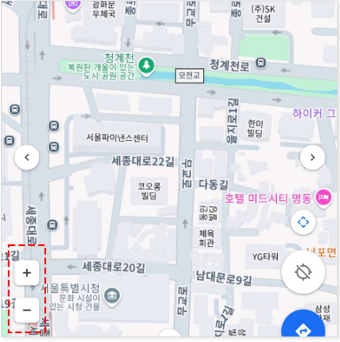
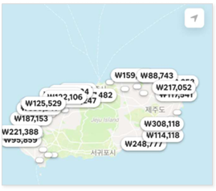
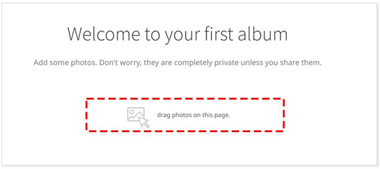

# 접근성 콘텐츠 제작 기법
> 접근성 콘텐츠 제작 기법은 모든 사용자, 특히 장애가 있는 사용자가 웹 콘텐츠에 접근하고 사용할 수 있도록 보장하는 방법입니다. 이 기법은 웹 접근성 지침(WCAG: Web Content Accessibility Guidelines) 표준을 따르는 것이 중요합니다. 각각의 영역에 대해 접근성 작업 시 도움이 될 수 있도록 작업되었습니다. 접근성은 법적 요구사항일 뿐만 아니라 사용자를 위한 기본적인 배려이기도 합니다.  

## 웹 접근성 콘텐츠 제작 기법   
> 사용자가 장애를 가지고 있거나 특정 기능적 제한을 겪는 경우에도 원활하게 웹을 이용할 수 있도록 하는 방법을 의미합니다. 이러한 접근성을 고려한 콘텐츠 제작은 다양한 사용자들의 요구를 충족시키며, 웹의 사용성을 크게 향상시킵니다.    


**키워드**   
#웹 접근성, #웹 접근성 콘텐츠 제작 기법, #한국형 웹 콘텐츠 접근성 지침 2.2, #WCAG2.2, #KWCAG2.2, #보조기술과의호환성, #접근성 테스트 도구 활용 점검방법, #스크린 리더, #Jaws, #NVDA, #센스리더, #Sense Reader, #지체 장애 사용자, #시각장애인, #고령자


### 단일 포인터 입력 지원 
**관련 지침 : 다중 포인터 또는 경로기반 동작을 통한 입력은 단일 포인터 입력으로도 조작할 수 있어야 한다.**   
터치하여 사용할 수 있는 기기에서 두 개 이상의 손가락이 필요하거나 경로 기반 제스처를 따라야 하는 경우, 사용자가 한 손가락과 최소한의 동작으로도 원활하게 웹 콘텐츠와 상호작용할 수 있도록 하기 위함이다.     

[2.5.1 Pointer Gestures (Level A)](https://www.w3.org/TR/WCAG22/#pointer-gestures){: target="_blank"}    
[WAI - Understanding Pointer Gestures](https://www.w3.org/WAI/WCAG22/Understanding/pointer-gestures.html){: target="_blank"}      
[MDN - Touch events](https://developer.mozilla.org/en-US/docs/Web/API/Touch_events){: target="_blank"}    

두 개 이상의 손가락을 동시에 사용해야 하는 다중 포인터(예: 핀치 줌, 두 손가락 탭 등) 또는 쓸어 넘기기 등의 경로기반 동작(예: 스와이프, 끌기와 놓기, 그리기 등)을 통한 입력으로 작동하는 모든 기능은 단일 포인터 입력으로도 조작할 수 있어야 한다. 다만, 다음과 같은 경우에는 예외로 간주한다.     

- 필수적인 경우: 피아노 앱의 건반 동시누르기와 같은 다중 포인터나 서명과 같은 경로기반 동작을 통한 입력이 반드시 실행되어야 하는 경우    
- 운영체제나 사용자 에이전트(예: 브라우저), 보조기기 등이 지원하는 동작(예: 운영체제가 제공하는 손가락 두 개 끌어서 스크롤하기)을 통한 입력    


**기대효과**   

- 한 손가락 또는 스틱 포인팅 장치를 사용하거나 다중 포인터 동작을 통한 입력이 불가능하거나 어려운 사용자도 해당 장치나 동작을 통한 입력을 할 수 있다.    
- 손떨림, 시각장애 등으로 끌기 동작이나 복잡하거나 정교한 동작, 또는 그리기 동작을 통한 입력이 어려운 사용자도 해당 동작을 통한 입력을 적절하게 수행할 수 있다.    
- 복잡한 조작 과정이나 수단을 통한 입력을 이해하기 어려운 인지 또는 학습장애 사용자도 해당 조작 과정이나 수단을 통한 입력을 보다 쉽게 수행할 수 있다.   

**[용어]**    
**포인터 입력**     
마우스, 펜 또는 터치 접촉과 같이 화면에서 특정 좌표(또는 좌표 세트)를 대상으로 삼는 입력    

**단일 포인터(single pointer)**    
단일 탭과 클릭, 더블 탭과 클릭, 길게 누르기 등을 포함하여, 화면과 접촉하는 한 지점에서 작동하는 포인터 입력     

**다중 포인터(multipoint gesture)**     
핀치 줌, 멀티 터치 회전, 세 손가락 탭 등 두 개 이상의 포인터를 이용해서 입력해야 하는 입력 방식    

**경로기반 동작(path-based gesture)**    
직선 그리기, Z 자 그리기와 같이 사용자가 화면에서 특정한 경로나 모양을 그리는 동작    


#### 1. 필요성        
두 손가락으로 쓸어내리는 동작과 같은 다중 포인터는, 일부 장애가 있거나 한 손가락 밖에 사용할 수 없는 사용자는 이 동작을 수행할 수 없다.   
스와이프 제스처에 의해 기능이 수행되는 경우, 화면을 터치한 채 포인터를 이동시켜야 한다. 그러나 일부 사용자는 동일한 압력을 유지하면서 원하는 방향으로 이동시키기 어렵다.    
또한 스크린리더나 대체 입력 수단을 사용하는 사용자는 마우스나 터치스크린처럼 직관적인 포인팅이 어려워 정확한 끌어와 놓기나 제스처 수행에 제약이 있을 수 있다.    

- 손가락 두 개를 사용하는 **핀치 줌** 또는 두 손가락 드래그와 같은 기능은 일부 사용자가 수행하기 어려움    
- 지체장애 사용자, 손가락 하나만 사용할 수 있는 사용자 등은 경로 기반 조작이 불가능할 수 있음    
- 모든 기능은 반드시 **단일 입력 방식**으로도 작동해야 보편적 사용 가능성 보장    

#### 2. 대상       

| 사용자 유형         | 이유 |
|----------------------|------|
| 지체 장애 사용자       | 다중 입력 불가 또는 복잡한 제스처 수행 어려움  
| 시각장애인             | 스크린 리더 사용 시 제스처 수행 불가능  
| 고령자                 | 정밀한 손동작 조작이 어려움  

#### 3. 체크리스트       

- 핀치 확대/축소 또는 회전 등의 기능이 단일 입력으로도 제공되는가?   
- 다중 경로를 요구하는 기능에 대체 UI 또는 단일 입력 방식이 있는가?   
- 스와이프 등의 제스처가 버튼, 슬라이더 등으로 대체 가능한가?   

#### 4. 테스트 방법      

- 핀치 줌 또는 회전 기능을 단일 포인터로 수행 가능한지 확인    
- 다중 손가락 제스처 대신 버튼이나 UI 구성요소로 대체되어 있는지 확인    
- 스크린 리더 사용 또는 한 손가락 입력만으로 기능 사용 가능 여부 테스트     

#### 5. QA 지표       

- 단일 포인터 대체 기능 제공률   
- 제스처 기반 기능의 접근 가능한 UI 제공률   
- 다중 제스처 사용이 요구되는 기능 수   

#### 6. 개발방법     
다중 포인터나 경로 기반 동작은 단일 포인터 입력으로도 조작할 수 있는 대체 수단이 제공되어야 한다. 
구체적인 예로 다음과 같은 것들을 고려할 수 있다. 

- 버튼 제공: 두 손가락 핀치 줌 대체로 한 손가락으로 조작 가능한 “+”, ”-” 버튼으로, 회전 제스처 대체로는 회전 버튼으로 제공    
- 끌기와 놓기(drag & drop) 기능 대체: 파일이나 항목을 끌기와 놓기 대체로 “선택” 후 “이동” 버튼 제공    
- 경로 기반 동작의 단순화: 특정 모양을 그리는 대체로 해당 기능을 실행하는 버튼 제공    

이러한 대체 수단은 쉽게 발견할 수 있어야 하며, 원래의 제스처나 끌기(drag) 동작을 통해 실행되는 기능과 동등한 기능을 제공해야 한다.     
다만, 다음과 같은 경우에는 예외로 한다. 

- 필수적인 경우: 서명 같은 자유로운 그리기 기능, 피아노에서 동시에 건반 누르기처럼 경로 기반 제스처나 다중 포인터가 핵심 기능이고 이를 단순화 할 수 없는 경우     
- 표준화 된 제스처: 화면 가장자리에서 안쪽으로 스와이프하여 메뉴를 열거나 이전 페이지로 돌아가는 엣지 스와이프나 브라우저에서 기본으로 작동하는 핀치 줌 아웃 등의 브라우저나 운영체제 수준에서 제공되는 제스처     


#### HTML + JavaScript 예시 – 확대/축소 대체 버튼 제공
```html
<button onclick="zoomIn()">확대</button>
<button onclick="zoomOut()">축소</button>

<script>
function zoomIn() {
  document.body.style.zoom = (parseFloat(document.body.style.zoom) || 1) + 0.1;
}
function zoomOut() {
  document.body.style.zoom = (parseFloat(document.body.style.zoom) || 1) - 0.1;
}
</script>
```

#### Vue 예시 – 제스처 대신 버튼 UI 제공
```vue
<template>
  <div>
    <button @click="zoomIn">확대</button>
    <button @click="zoomOut">축소</button>
  </div>
</template>

<script setup>
import { ref } from 'vue';
const zoom = ref(1);

function zoomIn() {
  zoom.value += 0.1;
  document.body.style.zoom = zoom.value;
}

function zoomOut() {
  zoom.value -= 0.1;
  document.body.style.zoom = zoom.value;
}
</script>
```

#### React 예시 – 확대/축소 버튼 제공
```jsx
import React, { useState } from "react";

function ZoomButtons() {
  const [zoom, setZoom] = useState(1);

  const zoomIn = () => {
    const newZoom = zoom + 0.1;
    document.body.style.zoom = newZoom;
    setZoom(newZoom);
  };

  const zoomOut = () => {
    const newZoom = zoom - 0.1;
    document.body.style.zoom = newZoom;
    setZoom(newZoom);
  };

  return (
    <>
      <button onClick={zoomIn}>확대</button>
      <button onClick={zoomOut}>축소</button>
    </>
  );
}

export default ZoomButtons;
```

#### 7. 점검 기준     

- 다중 포인터 또는 제스처 기반 기능에 단일 입력 대안이 있는가?    
- 사용자가 단일 손가락/마우스 입력으로도 조작 가능하도록 되어 있는가?   

#### 8. 점검 방법     

- 핀치 줌이나 회전 제스처를 단일 클릭 또는 버튼으로 대체 가능한지 확인    
- UI 내 확대, 축소, 슬라이드 등 기능에 접근 가능한 대체 요소 존재 여부 확인    

#### 9. 준수 사례       

**다중 포인터 동작을 단일 포인터 동작으로 조작할 수 있는 버튼 제공**    
다중 포인터 동작으로 조작하는 기능을 단일 포인터 동작으로도 조작할 수 있도록 제공한다. 
다음은 지도 서비스로 두 손가락 핀치 줌 인/아웃 기능이 제공되는 사례이다. 한 손가락으로 조작 가능한 “+/-” 버튼을 제공함으로써, 다중 포인터 동작이 어렵거나 불가능한 사용자도 쉽게 지도를 확대하고 축소할 수 있다.    

<figure>

<figcaption>출처 : 웹 접근성을 고려한 콘텐츠 제작기법 개정판</figcaption>   
</figure>

**경로 기반 동작을 단일 포인터 동작으로 조작할 수 있도록 제공**    
경로 기반 동작으로 조작하는 기능을 단일 포인터 동작으로도 조작할 수 있도록 제공한다. 
다음은 스와이프 제스처로 이전/다음 콘텐츠를 볼 수 있는 기능이다.  스와이프 동작뿐만 아니라 한 손가락으로 조작 가능한 이전/다음 버튼으로도 제공함으로써, 스와이프 동작이 어려운 사용자도 쉽게 콘텐츠를 탐색할 수 있다.     

<figure>

<figcaption>출처 : 웹 접근성을 고려한 콘텐츠 제작기법 개정판</figcaption>   
</figure>

#### 10. 미준수 사례       

**다중 포인터 동작을 대체할 수 있는 단일 포인터 입력 미지원**    
다음은 숙소 서비스에서 핀치 줌 인/아웃 기능으로 확대 및 축소 할 수 있는 지도 기반 검색 기능 사례이다.   
핀치 줌 인/아웃은 동시에 두 손가락으로 조작해야 하기 때문에, 손가락을 사용할 수 없거나 원하는 대로 움직일 수 없는 사용자의 경우에는 이 조작이 매우 어려울 수 있다.    
음성 명령 사용자도 핀치 줌 조작을 명령할 수 없기 때문에 확대/축소 행위를 할 수 없다.    

<figure>

<figcaption>출처 : 웹 접근성을 고려한 콘텐츠 제작기법 개정판</figcaption>   
</figure>

**개선 방법** 
단일 포인터 입력만으로 확대/축소가 가능하도록 확대/축소 버튼을 제공한다. 버튼으로 제공된 컨트롤은 보조기기 등을 통해서도 조작이 가능하다.    

**끌기와 놓기를 대체할 수 있는 단일 포인터 입력 미지원**    
다음은 끌기와 놓기를 통한 이미지 업로드를 제공하는 웹 앨범 서비스 사례이다.    
끌기와 놓기 동작으로만 파일 첨부가 가능한 사용자 인터페이스의 경우, 마우스나 터치 스크린과 같은 포인팅 기기를 사용하기 어려운 사용자 또는 화면을 볼 수 없는 사용자는 파일을 첨부하기 매우 어렵다.    

<figure>

<figcaption>출처 : 웹 접근성을 고려한 콘텐츠 제작기법 개정판</figcaption>   
</figure>

**개선 방법** 
‘파일선택’ 버튼 등을 제공하여 끌어다 놓는 동작이 아닌 단순 버튼 클릭만으로도 파일을 선택하여 파일 첨부가 가능하도록 제공한다    


**경로 기반 동작을 대체할 수 있는 단일 포인터 입력 미지원**    
다음은 쇼핑몰에서 작은 화면에 여러 추천 상품을 노출하기 위해 스와이프 동작을 통해 이전/다음 콘텐츠를 보여주는 사례이다.    
좌에서 우 또는 우에서 좌로의 경로를 그려 이전/다음 콘텐츠를 표시하는 경우, 화면을 볼 수 없는 사용자 또는 손 떨림이 심한 사용자 등은 올바른 경로를 그리기 어렵기 때문에 기능을 이용하기 어려울 수 있다.      

<figure>

<figcaption>출처 : 웹 접근성을 고려한 콘텐츠 제작기법 개정판</figcaption>   
</figure>

**개선 방법** 
다음의 방법들을 고려해 볼 수 있다.    

- 단일 포인터 입력만으로 이전/다음 콘텐츠를 노출 할 수 있는 버튼을 제공한다.    
- 특정 순서의 콘텐츠를 바로 노출 할 수 있는 컨트롤(예를 들어, 페이지 입력 상자 또는 인디케이터 등)을 제공한다.    
- 전체 콘텐츠를 한 번에 펼쳐 볼 수 있는 버튼을 제공한다.    


#### 11. 관련 영상       
<iframe style="width:100%;min-height:315px;" src="https://www.youtube.com/embed/eV90b5w3qJk?si=dnrwLzHf9_mmR0yB" title="YouTube video player" frameborder="0" allow="accelerometer; autoplay; clipboard-write; encrypted-media; gyroscope; picture-in-picture; web-share" referrerpolicy="strict-origin-when-cross-origin" allowfullscreen></iframe>

[AOA11Y 웹 접근성 (단일 포인터 입력 지원)](https://www.youtube.com/embed/eV90b5w3qJk?si=dnrwLzHf9_mmR0yB){: target="_blank"}    
   
--- 
<strong style="font-size:20px;cursor:pointer;">접근성 테스트 도구 활용 점검방법</strong>
모바일 앱 접근성 과 내용 동일

 
#### 결론     
모바일 앱 접근성 과 내용 동일


### 참조    
- [Web Content Accessibility Guidelines (WCAG) 2.2](https://www.w3.org/TR/WCAG22/){: target="_blank"}    
- [WCAG 2.2 Understanding Docs](https://www.w3.org/WAI/WCAG22/Understanding/){: target="_blank"}    
- [WCAG (Quick Reference)](https://www.w3.org/WAI/WCAG22/quickref/?versions=2.2&showtechniques=111){: target="_blank"}    
- [웹 콘텐츠 접근성 지침(WCAG) 2.2 - 번역판](https://a11ykr.github.io/wcag22/){: target="_blank"}    
- [smashingmagazine - WCAG 2.2 Checklist with Filter and Links](https://codepen.io/smashingmag/pen/MWLgQzm){: target="_blank"}    
- [MDN 웹 컨텐츠 접근성 지침 이해하기](https://developer.mozilla.org/ko/docs/Web/Accessibility/Understanding_WCAG){: target="_blank"}    
- [보건복지부 블로그](https://blog.naver.com/prologue/PrologueList.naver?blogId=mohw2016){: target="_blank"}     
- [행정안전부 - 전자정부 웹사이트 UI UX 가이드라인](https://www.mois.go.kr/frt/bbs/type001/commonSelectBoardArticle.do?bbsId=BBSMSTR_000000000045&nttId=69451){: target="_blank"}     
- [널리 알리는 기술 소식 커뮤니티](https://nuli.navercorp.com/community/article){: target="_blank"}     
