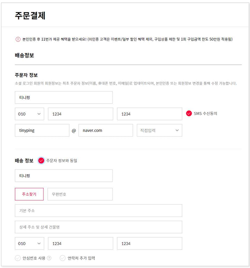
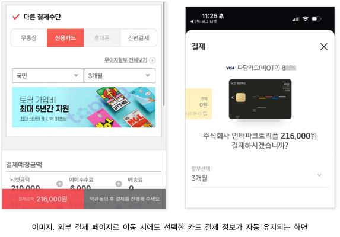
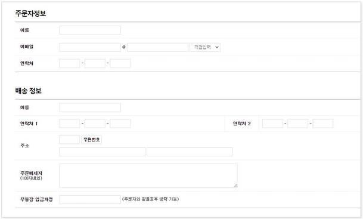

# 접근성 콘텐츠 제작 기법
> 접근성 콘텐츠 제작 기법은 모든 사용자, 특히 장애가 있는 사용자가 웹 콘텐츠에 접근하고 사용할 수 있도록 보장하는 방법입니다. 이 기법은 웹 접근성 지침(WCAG: Web Content Accessibility Guidelines) 표준을 따르는 것이 중요합니다. 각각의 영역에 대해 접근성 작업 시 도움이 될 수 있도록 작업되었습니다. 접근성은 법적 요구사항일 뿐만 아니라 사용자를 위한 기본적인 배려이기도 합니다.  

## 웹 접근성 콘텐츠 제작 기법   
> 사용자가 장애를 가지고 있거나 특정 기능적 제한을 겪는 경우에도 원활하게 웹을 이용할 수 있도록 하는 방법을 의미합니다. 이러한 접근성을 고려한 콘텐츠 제작은 다양한 사용자들의 요구를 충족시키며, 웹의 사용성을 크게 향상시킵니다.    


**키워드**   
#웹 접근성, #웹 접근성 콘텐츠 제작 기법, #한국형 웹 콘텐츠 접근성 지침 2.2, #WCAG2.2, #KWCAG2.2, #입력 도움, #반복 입력 정보, #보조기술과의호환성, #접근성 테스트 도구 활용 점검방법, #스크린 리더, #Jaws, #NVDA, #센스리더, #Sense Reader, #인지장애인, #고령자, #지체장애인, #저시력 사용자


### 반복 입력 정보 [신규 항목] 
**관련 지침 : 반복되는 입력 정보는 자동 입력 또는 선택 입력할 수 있어야 한다.**   
사용자가 동일한 정보를 반복해서 입력해야 하는 경우, 이전에 제공한 정보를 재입력할 필요 없이 자동 입력 또는 선택을 통해 사용할 수 있어야 하며, 이는 인지적 부담을 줄이고 접근성을 향상시키는 핵심 항목입니다.         
예를 들어, 온라인 구매에서 주문자와 수령자 주소가 동일한 경우, 이전 단계에서 입력한 주문자 주소를 수령자 주소에 재입력 없이 선택하여 채울 수 있다.     
다만, 패스워드와 같이 보안 목적 등으로 재입력이 필수적인 경우는 예외로 간주한다.    

[WCAG 2.2 - 3.3.8 반복 입력](https://www.w3.org/TR/WCAG22/#redundant-entry){: target="_blank"}    
[MDN - autocomplete 속성](https://developer.mozilla.org/ko/docs/Web/HTML/Attributes/autocomplete){: target="_blank"}    


**기대효과**   

- 기억 또는 인지 기능에 어려움을 겪는 사용자의 특정 정보에 대한 반복적인 입력으로 인한 스트레스와 실수 발생 가능성을 줄일 수 있다.    
- 움직임에 제약이 있는 사용자(예: 스위치 콘트롤 또는 음성 입력 사용자)의 텍스트 입력 부담을 줄여줄 수 있다.    

#### 1. 필요성        

여러 단계에 걸쳐 정보를 입력할 때, 동일한 내용을 반복해서 입력하도록 요구하면 모든 사용자에게 번거로울 뿐만 아니라, 인지적 부담이 큰 사용자는 중도에 입력을 중단하거나 실수할 가능성이 높다. 음성 명령, 한 손 입력 등 다양한 대체 입력 방식을 사용하는 경우에도 반복 입력은 시간과 노력을 크게 늘린다.    
반복 입력을 최소화하면 사용자의 인지 부담을 줄이고 입력 과정을 단순화하여 사용자 만족도를 높일 수 있다. 이를 위해 이미 입력한 정보를 재사용하거나 자동 완성 기능을 제공하며, 불필요한 반복 입력 요청을 제거하는 방식을 적용한다.   

- 반복 입력은 인지적 과부하와 피로도를 유발   
- 특히 인지장애인이나 고령 사용자에게 진입 장벽이 됨    
- 폼 자동완성, 이전 입력 활용은 사용성을 높임   


#### 2. 대상       

| 사용자 유형   | 필요 이유                                         |
|---------------|--------------------------------------------------|
| 인지장애인     | 복잡한 입력 절차는 부담이 됨                     |
| 고령자         | 기억 기반 입력 반복은 오류 유발 가능              |
| 지체장애인     | 반복된 타이핑은 신체적 피로를 유발                |
| 저시력 사용자 | 반복된 입력 시 포커스 이동이 어려울 수 있음        |

#### 3. 체크리스트       

- 같은 정보를 반복적으로 묻는 항목이 있는가?   
- 이전 단계에서 입력한 값을 재사용할 수 있는가?   
- 브라우저 자동완성 속성이 설정되어 있는가?   
- "이전 정보 사용" 또는 "같은 정보 사용" 선택지가 제공되는가?   


#### 4. 테스트 방법      

- 다단계 입력 폼에서 같은 정보를 2회 이상 입력해야 하는가?  
- 키보드로 전체 입력 없이 선택 입력 또는 자동 완성이 가능한가?  
- 스크린 리더로 자동입력 선택이 올바르게 전달되는가?   


#### 5. QA 지표       

- 중복 입력 항목 개수    
- 자동완성 및 선택입력 제공률    
- 사용자 테스트 중 반복입력 피드백 발생률   


#### 6. 개발방법     

- 입력된 정보 재사용: 사용자로부터 동일한 정보의 입력을 다시 요구하는 대신 이전 단계에서 입력한 정보를 활용한다.    
- 자동 및 선택 입력 기능 제공: 이전에 입력한 정보를 자동 완성하거나, 사용자가 선택해서 다시 입력할 수 있는 기능을 제공한다.    
- 반복 입력 요청 제거: 동일한 정보를 여러 번 입력하도록 요구하는 단계를 제거한다.   

브라우저의 자동 완성 기능은 반복 입력 문제를 완전히 해결하지 못한다. 이 기능은 과거 입력 데이터에 의존하기 때문에 정보가 부정확하거나 오래될 수 있으며, 웹사이트 또는 입력 중인 프로세스와 직접적인 연계가 없을 수 있다. 따라서 웹 사이트가 직접 정보를 제공하거나, 동일한 정보 요구를 방지하는 책임을 가져야 한다.    
단, 보안상 재입력이 필요한 비밀번호나 새로운 프로세스가 시작되어 이미 입력한 정보가 유효하지 않은 경우는 예외로 한다.    

**HTML 예시 - 자동 완성 및 반복 입력 제어**
```html
<form>
  <label for="shipping_name">배송 받는 사람</label>
  <input id="shipping_name" name="shipping_name" autocomplete="name" />

  <label><input type="checkbox" id="sameAsShipping" onclick="copyInfo()"> 주문자 정보와 동일</label>

  <label for="billing_name">주문자 이름</label>
  <input id="billing_name" name="billing_name" autocomplete="name" />
</form>

<script>
function copyInfo() {
  const shipping = document.getElementById("shipping_name");
  const billing = document.getElementById("billing_name");
  billing.value = shipping.value;
}
</script>
```

**Vue 예시**
```vue
<template>
  <form>
    <label>배송 이름
      <input v-model="shippingName" autocomplete="name" />
    </label>

    <label>
      <input type="checkbox" v-model="sameInfo" /> 주문자 정보 동일
    </label>

    <label>주문자 이름
      <input :value="sameInfo ? shippingName : billingName" @input="billingName = $event.target.value" />
    </label>
  </form>
</template>

<script setup>
import { ref } from 'vue';
const shippingName = ref('');
const billingName = ref('');
const sameInfo = ref(false);
</script>
```

**React 예시**
```jsx
import React, { useState } from 'react';

function Form() {
  const [shippingName, setShippingName] = useState('');
  const [billingName, setBillingName] = useState('');
  const [sameInfo, setSameInfo] = useState(false);

  return (
    <form>
      <label>
        배송 이름:
        <input value={shippingName} onChange={e => setShippingName(e.target.value)} autoComplete="name" />
      </label>

      <label>
        <input type="checkbox" checked={sameInfo} onChange={e => setSameInfo(e.target.checked)} />
        주문자 정보 동일
      </label>

      <label>
        주문자 이름:
        <input
          value={sameInfo ? shippingName : billingName}
          onChange={e => setBillingName(e.target.value)}
        />
      </label>
    </form>
  );
}
```

#### 7. 점검 기준     

- 반복 입력이 강제되지 않고, 대체 입력 수단이 있는가?   
- 선택형 UI(체크박스 등) 또는 자동완성 지원이 구현되었는가?   


#### 8. 점검 방법     

- 입력 단계마다 동일한 정보를 다시 입력해야 하는지 테스트    
- 동일 입력 여부 체크 UI 존재 여부 확인   
- 보조 기술로도 해당 기능 이용 가능 여부 확인   


#### 9. 준수 사례       

```html
<input autocomplete="email" />
<!-- 브라우저가 이전 입력 정보를 자동 제공 -->
```

**이전에 입력한 정보를 자동으로 채우는 기능 제공**
상품 주문 과정에서 주문자와 배송지가 동일한 경우 “주문자 정보와 동일” 체크 상자를 제공하여 이름, 이메일, 휴대폰 번호 등 이미 입력한 정보를 자동으로 배송 정보에 반영할 수 있게 제공한다.    

<figure>

<figcaption>출처 : 웹 접근성을 고려한 콘텐츠 제작기법 개정판</figcaption>   
</figure>

**이전에 입력한 선택 정보 유지**
결제 단계에서 선택한 결제 방식(카드사, 할부 정보 등)을 외부 결제 페이지로 넘어가더라도 동일한 정보가 자동으로 반영되도록 한다. 이로써 사용자는 이미 선택한 정보를 재입력할 필요가 없다.      

<figure>

<figcaption>출처 : 웹 접근성을 고려한 콘텐츠 제작기법 개정판</figcaption>   
</figure>

#### 10. 미준수 사례       

```html
<label for="email">이메일 주소</label>
<input id="email" name="email" type="text" />
<!-- 자동완성 미지원, 이전 입력 반복 강제 -->
```

**동일한 정보를 재사용할 수 없는 경우**
한 쇼핑몰 주문서 작성 과정에서, 주문자 정보와 받는 사람 정보가 동일함에도 이를 다시 입력해야 한다면, 불필요한 반복 입력으로 시간과 노력이 낭비된다. 특히 대체 입력 도구를 사용하는 사용자는 입력 실수나 중도 포기의 가능성이 커진다.    

**개선방법**    
**“주문자와 동일” 체크 상자를 제공해 한 번 입력한 정보는 재사용할 수 있도록 할 수 있도록 한다.**    

<figure>

<figcaption>출처 : 웹 접근성을 고려한 콘텐츠 제작기법 개정판</figcaption>   
</figure>

#### 11. 관련 영상       
<iframe style="width:100%;min-height:315px;" src="https://www.youtube.com/embed/2IjGwbMutjA?si=L1QVx-9OxCJICbbO" title="YouTube video player" frameborder="0" allow="accelerometer; autoplay; clipboard-write; encrypted-media; gyroscope; picture-in-picture; web-share" referrerpolicy="strict-origin-when-cross-origin" allowfullscreen></iframe>

[리베하얀 웹 접근성 (반복 입력 정보)](https://www.youtube.com/embed/2IjGwbMutjA?si=L1QVx-9OxCJICbbO){: target="_blank"}    
   
--- 
<strong style="font-size:20px;cursor:pointer;">접근성 테스트 도구 활용 점검방법</strong>
모바일 앱 접근성 과 내용 동일

 
#### 결론     
모바일 앱 접근성 과 내용 동일


### 참조    
- [Web Content Accessibility Guidelines (WCAG) 2.2](https://www.w3.org/TR/WCAG22/){: target="_blank"}    
- [WCAG 2.2 Understanding Docs](https://www.w3.org/WAI/WCAG22/Understanding/){: target="_blank"}    
- [WCAG (Quick Reference)](https://www.w3.org/WAI/WCAG22/quickref/?versions=2.2&showtechniques=111){: target="_blank"}    
- [웹 콘텐츠 접근성 지침(WCAG) 2.2 - 번역판](https://a11ykr.github.io/wcag22/){: target="_blank"}    
- [smashingmagazine - WCAG 2.2 Checklist with Filter and Links](https://codepen.io/smashingmag/pen/MWLgQzm){: target="_blank"}    
- [MDN 웹 컨텐츠 접근성 지침 이해하기](https://developer.mozilla.org/ko/docs/Web/Accessibility/Understanding_WCAG){: target="_blank"}    
- [보건복지부 블로그](https://blog.naver.com/prologue/PrologueList.naver?blogId=mohw2016){: target="_blank"}     
- [행정안전부 - 전자정부 웹사이트 UI UX 가이드라인](https://www.mois.go.kr/frt/bbs/type001/commonSelectBoardArticle.do?bbsId=BBSMSTR_000000000045&nttId=69451){: target="_blank"}     
- [널리 알리는 기술 소식 커뮤니티](https://nuli.navercorp.com/community/article){: target="_blank"}     
